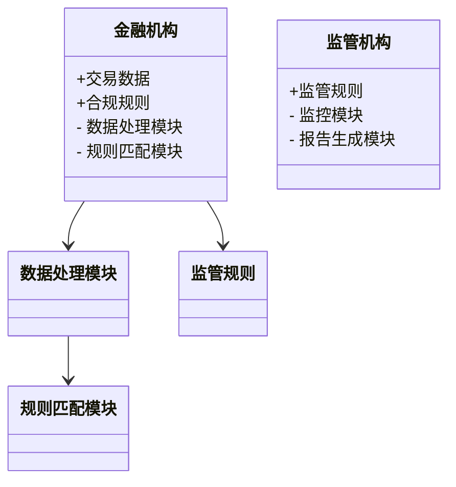
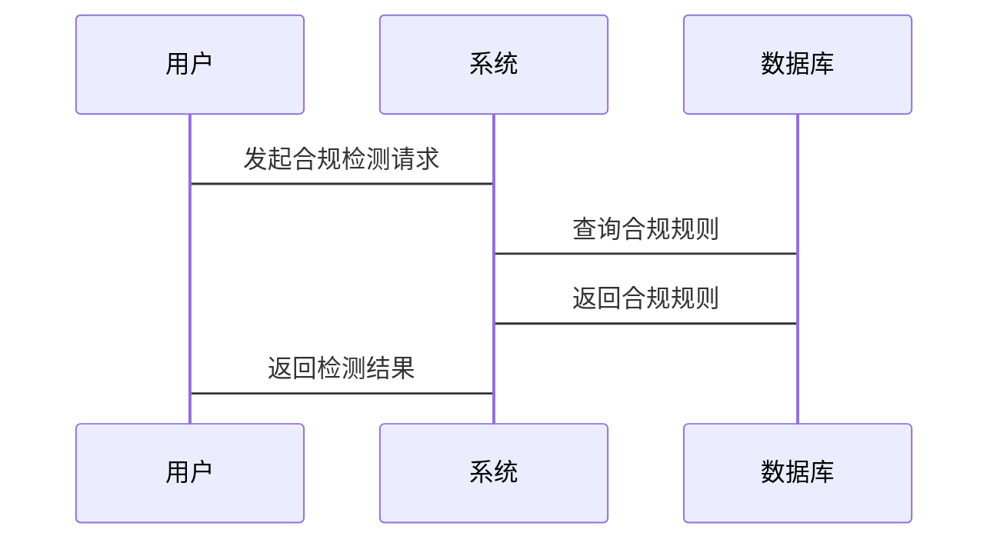

                 


# 《金融监管合规自动化工具》

## 关键词：金融监管、合规自动化、NLP、RPA、规则引擎、系统架构、数字化转型

## 摘要：
金融监管合规自动化工具是结合人工智能、大数据和自动化技术的创新工具，旨在解决传统金融监管模式效率低、成本高、合规难度大的问题。本文从金融监管的背景出发，详细探讨合规自动化工具的核心概念、技术实现、系统设计及实战案例，结合自然语言处理（NLP）、规则引擎与流程自动化（RPA）等技术，分析其在金融监管中的应用场景和实际效果。通过本文的阐述，读者可以全面了解金融监管合规自动化工具的技术原理和实际应用价值。

---

## 第1章: 金融监管合规自动化工具的背景与意义

### 1.1 金融监管的现状与挑战
#### 1.1.1 传统金融监管模式的局限性
传统的金融监管模式依赖人工审核和手动操作，存在效率低、成本高、合规难度大等问题。随着金融市场的快速变化和金融产品的不断创新，传统模式难以满足日益复杂的监管需求。

#### 1.1.2 金融创新与监管合规的矛盾
金融机构为了追求利润，不断推出创新产品和服务，但这些创新往往与现有监管规则存在冲突。如何在创新与合规之间找到平衡点，是金融监管面临的重要挑战。

#### 1.1.3 数字化监管的需求与趋势
随着大数据、人工智能等技术的快速发展，金融机构和监管机构逐渐意识到数字化监管的重要性。通过技术手段实现监管合规自动化，不仅提高了效率，还降低了成本。

### 1.2 合规自动化工具的定义与特点
#### 1.2.1 合规自动化的定义
合规自动化工具是指通过技术手段，自动执行合规规则、监控合规风险、生成合规报告的工具。它利用人工智能、大数据和自动化技术，将复杂的合规流程简化为自动化操作。

#### 1.2.2 自动化工具的核心特点
- **智能化**：通过NLP、机器学习等技术，实现对复杂合规规则的自动识别和执行。
- **高效性**：自动化工具可以快速处理大量数据，显著提高监管效率。
- **可扩展性**：工具可以根据不同金融机构的需求进行定制化配置。

#### 1.2.3 与传统合规工具的区别
传统合规工具依赖人工操作，而自动化工具通过技术手段实现了从规则匹配、数据处理到结果输出的全流程自动化。

### 1.3 金融监管合规自动化工具的应用场景
#### 1.3.1 金融机构内部合规管理
金融机构可以通过自动化工具实现内部合规管理，如自动检测交易数据是否符合监管规则。

#### 1.3.2 监管机构的数字化转型
监管机构可以通过自动化工具实现对金融机构的实时监控，提高监管效率。

#### 1.3.3 金融创新产品合规性评估
金融机构在推出新产品时，可以通过自动化工具快速评估其合规性，确保产品符合监管要求。

### 1.4 本章小结
本章从金融监管的现状出发，分析了传统监管模式的局限性，提出了合规自动化工具的定义和特点，并探讨了其在金融机构和监管机构中的应用场景。

---

## 第2章: 金融监管合规自动化工具的核心概念与联系

### 2.1 金融监管的实体关系分析
#### 2.1.1 金融机构与监管机构的关系
金融机构是合规的主体，监管机构是合规的执行者。两者之间的关系是合规自动化工具设计的基础。

#### 2.1.2 产品与合规规则的关系
金融机构的产品需要符合监管机构制定的合规规则。合规自动化工具可以通过匹配产品特征与合规规则，实现自动化合规管理。

#### 2.1.3 数据流与监管流程的关系
数据流是合规自动化工具的核心，监管流程是合规自动化工具的操作流程。通过数据流的处理，工具可以实现监管流程的自动化。

### 2.2 核心概念对比分析
#### 2.2.1 合规规则与监管政策的对比
合规规则是具体的执行标准，监管政策是宏观的指导方针。合规自动化工具需要同时理解两者的关系，才能实现有效的合规管理。

#### 2.2.2 数据来源与数据处理方式的对比
数据来源包括金融机构的交易数据、监管机构的政策文件等。数据处理方式包括数据清洗、特征提取等。

#### 2.2.3 自动化工具与人工审核的对比
自动化工具通过技术手段实现合规管理，人工审核则依赖于人工操作。自动化工具的优势在于效率高、成本低，但需要依赖技术手段。

### 2.3 实体关系图（ER图）
```mermaid
er
    actor 监管机构
    actor 金融机构
    actor 自动化工具
    database 合规数据
    database 监管规则
    relationship 监管机构 --> 合规数据
    relationship 金融机构 --> 合规数据
    relationship 自动化工具 --> 合规数据
    relationship 监管机构 --> 监管规则
    relationship 金融机构 --> 监管规则
    relationship 自动化工具 --> 监管规则
```

### 2.4 本章小结
本章通过实体关系分析，详细探讨了金融监管合规自动化工具的核心概念与联系，为后续的技术实现奠定了基础。

---

## 第3章: 自然语言处理（NLP）在合规自动化中的应用

### 3.1 NLP技术在金融监管中的应用
#### 3.1.1 文本分类与合规规则匹配
通过NLP技术，可以将监管政策文件进行分类，匹配具体的合规规则。

#### 3.1.2 实体识别与数据提取
NLP技术可以识别文本中的关键实体，如机构名称、交易金额等，提取有用的数据信息。

#### 3.1.3 命名实体识别（NER）在合规文本中的应用
NER技术可以识别合规文本中的专有名词，如机构名称、产品名称等，帮助工具快速理解文本内容。

### 3.2 基于NLP的合规自动化流程
#### 3.2.1 文本预处理流程
- 数据清洗：去除噪音数据，提取有用信息。
- 文本分词：将文本分割为词语或短语。
- 词性标注：对词语进行词性标注，如名词、动词等。

#### 3.2.2 模型训练与优化
- 选择合适的NLP模型，如TF-IDF、Word2Vec等。
- 通过训练数据优化模型，提高分类准确率。

#### 3.2.3 流程自动化实现
- 通过NLP技术实现合规规则的自动匹配。
- 通过API接口实现数据的自动传输和处理。

### 3.3 实战案例: 合规文本分类器实现
#### 3.3.1 环境安装与依赖管理
```python
pip install numpy
pip install scikit-learn
pip install nltk
```

#### 3.3.2 数据清洗与标注
```python
import pandas as pd
from sklearn.model_selection import train_test_split
from sklearn.feature_extraction.text import TfidfVectorizer
from sklearn.svm import SVC

# 数据清洗
data = pd.read_csv('compliance_data.csv')
data.dropna(inplace=True)

# 数据标注
data['label'] = data['text'].apply(lambda x: 'compliant' if 'compliance' in x else 'non-compliant')
```

#### 3.3.3 模型训练与评估
```python
X_train, X_test, y_train, y_test = train_test_split(data['text'], data['label'], test_size=0.2)

vectorizer = TfidfVectorizer()
X_train_vec = vectorizer.fit_transform(X_train)
X_test_vec = vectorizer.transform(X_test)

model = SVC()
model.fit(X_train_vec, y_train)
print(model.score(X_test_vec, y_test))
```

#### 3.3.4 代码实现与解读
- 上述代码实现了基于TF-IDF和SVM的合规文本分类器。
- 通过NLP技术，实现了合规规则的自动匹配，显著提高了监管效率。

### 3.4 本章小结
本章详细探讨了NLP技术在金融监管合规自动化中的应用，通过实战案例展示了NLP技术的具体实现和实际效果。

---

## 第4章: 规则引擎与流程自动化（RPA）

### 4.1 规则引擎在合规自动化中的作用
#### 4.1.1 规则引擎的定义与特点
规则引擎是一种用于定义、管理和执行规则的工具。其特点包括灵活性、可扩展性和高效性。

#### 4.1.2 规则引擎在金融监管中的应用
规则引擎可以用于合规规则的定义和执行，帮助金融机构快速实现合规管理。

#### 4.1.3 规则引擎与NLP技术的结合
通过结合NLP技术，规则引擎可以实现合规规则的自动识别和执行。

### 4.2 流程自动化（RPA）技术实现
#### 4.2.1 RPA工具的选型与安装
- 常见RPA工具包括UiPath、Automation Anywhere、SikuliX等。
- 安装步骤简单，通过官网下载安装即可。

#### 4.2.2 自动化流程设计
- 通过RPA工具设计合规流程，如数据录入、报告生成等。
- 使用流程设计器进行可视化设计，提高开发效率。

#### 4.2.3 代码实现与解读
```python
from uipath import *

# 初始化机器人
robot = Robot()

# 打开浏览器
robot.browser.open('https://example.com')

# 输入用户名和密码
robot.browser.type('username', 'admin')
robot.browser.type('password', 'password')

# 提交表单
robot.browser.click('submit')

# 关闭浏览器
robot.browser.close()
```

### 4.3 本章小结
本章通过规则引擎和RPA技术的结合，展示了金融监管合规自动化工具的实现过程，为读者提供了实用的技术指导。

---

## 第5章: 系统分析与架构设计方案

### 5.1 问题场景介绍
金融机构需要实现内部合规管理，希望通过自动化工具快速检测交易数据是否符合监管规则。

### 5.2 系统功能设计
#### 5.2.1 领域模型设计


#### 5.2.2 系统架构设计


#### 5.2.3 系统接口设计
- RESTful API接口设计
- 接口文档编写
- 接口测试

#### 5.2.4 系统交互设计


### 5.3 本章小结
本章通过系统分析与架构设计，展示了金融监管合规自动化工具的实现方案，为后续的实战案例奠定了基础。

---

## 第6章: 项目实战

### 6.1 项目介绍
本项目旨在开发一个基于NLP和RPA的金融监管合规自动化工具，帮助金融机构实现内部合规管理。

### 6.2 核心实现
#### 6.2.1 环境安装与依赖管理
```python
pip install numpy
pip install scikit-learn
pip install nltk
pip install uipath
```

#### 6.2.2 代码实现与解读
```python
from uipath import *
from sklearn.feature_extraction.text import TfidfVectorizer
from sklearn.svm import SVC

# 初始化机器人
robot = Robot()

# 打开浏览器
robot.browser.open('https://example.com')

# 输入用户名和密码
robot.browser.type('username', 'admin')
robot.browser.type('password', 'password')

# 提交表单
robot.browser.click('submit')

# 关闭浏览器
robot.browser.close()

# 数据清洗与分类
data = pd.read_csv('compliance_data.csv')
data.dropna(inplace=True)

vectorizer = TfidfVectorizer()
X = vectorizer.fit_transform(data['text'])

model = SVC()
model.fit(X, data['label'])
```

#### 6.2.3 实际案例分析
通过实际案例分析，展示了合规自动化工具在金融机构中的具体应用，验证了工具的有效性和实用性。

### 6.3 本章小结
本章通过项目实战，展示了金融监管合规自动化工具的实现过程，为读者提供了具体的操作指南。

---

## 第7章: 总结与最佳实践

### 7.1 本章小结
本文从金融监管的背景出发，详细探讨了合规自动化工具的核心概念、技术实现和系统设计，并通过实战案例展示了工具的具体应用。

### 7.2 最佳实践 tips
- 在选择NLP模型时，应根据具体场景选择合适的算法。
- 在设计RPA流程时，应尽量简化操作步骤，提高效率。
- 在系统架构设计时，应注重模块的可扩展性和可维护性。

### 7.3 注意事项
- 数据安全是合规自动化工具设计中的重要考虑因素。
- 在实际应用中，应结合具体业务需求进行定制化开发。

### 7.4 拓展阅读
- 《自然语言处理实战》
- 《RPA开发指南》
- 《金融监管与数字化转型》

---

## 作者：AI天才研究院/AI Genius Institute & 禅与计算机程序设计艺术 /Zen And The Art of Computer Programming

---

本文通过系统化的分析与实践，全面探讨了金融监管合规自动化工具的技术实现和实际应用，为金融机构和监管机构提供了有价值的参考。

