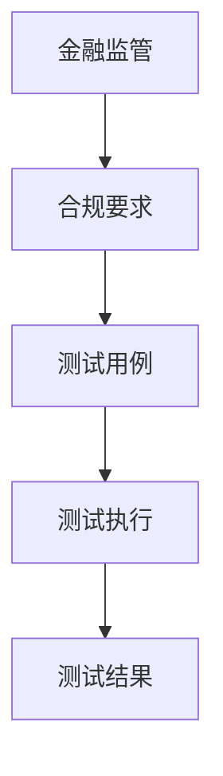
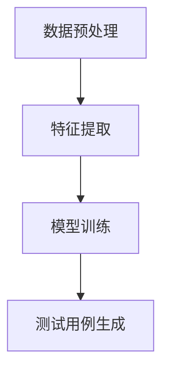
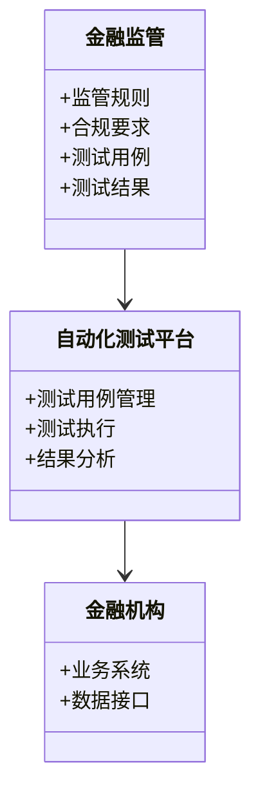
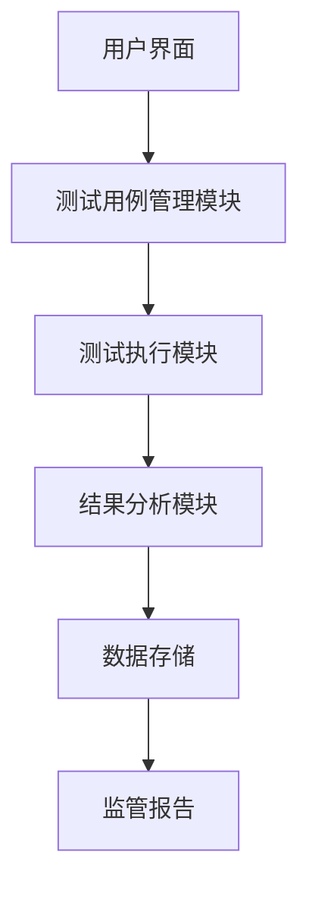

                 


# 《金融监管合规自动化测试平台》

## 关键词：金融监管，合规测试，自动化测试，机器学习，系统架构

## 摘要： 本文探讨了金融监管合规自动化测试平台的构建与应用。通过分析金融监管的核心概念与挑战，结合自动化测试技术与机器学习算法，提出了一个高效的合规测试解决方案。文章详细阐述了系统架构设计、算法原理及其实现，通过实际案例展示了平台的应用价值，并提供了最佳实践建议。

---

# 第一部分: 金融监管合规自动化测试平台概述

## 第1章: 金融监管合规自动化测试平台的背景与意义

### 1.1 金融监管的背景与挑战

#### 1.1.1 金融监管的定义与重要性
金融监管是指通过法律法规和制度，对金融机构的经营行为进行监督和管理，以维护金融市场秩序和稳定。金融监管的核心目标包括保护投资者利益、防范系统性风险、促进金融创新和维护公平竞争。随着金融市场的发展，金融监管的复杂性和重要性日益增加。

#### 1.1.2 传统金融监管的痛点与不足
传统的金融监管主要依赖人工审核和手动操作，存在以下痛点：
- **效率低下**：人工审核耗时长，难以应对海量数据和复杂的业务场景。
- **主观性**：人工审核容易受到主观因素影响，可能导致判断失误。
- **成本高昂**：需要大量专业人员，监管成本居高不下。
- **滞后性**：传统监管往往事后发现风险，难以实现实时监控。

#### 1.1.3 合规测试在金融监管中的关键作用
合规测试是金融监管的重要手段，用于验证金融机构的业务行为是否符合相关法律法规和监管要求。通过自动化技术，合规测试可以实现高效、准确和持续的监管，显著提升金融监管的效率和效果。

### 1.2 自动化测试技术的发展与应用

#### 1.2.1 自动化测试的基本概念
自动化测试是指通过工具和脚本自动执行测试用例、测试执行和结果分析的过程。相比传统手动测试，自动化测试具有高效、精准和可重复的优点，广泛应用于软件开发、系统集成和持续集成等领域。

#### 1.2.2 自动化测试技术的演进历程
自动化测试技术经历了从简单的脚本执行到智能化测试的演进过程：
- **第一阶段**：基于录制回放的自动化测试工具（如QTP）。
- **第二阶段**：基于关键字驱动的自动化测试框架（如关键字驱动框架）。
- **第三阶段**：基于人工智能的自动化测试技术，结合机器学习和自然语言处理实现智能化测试。

#### 1.2.3 自动化测试在金融领域的应用前景
在金融领域，自动化测试技术可以应用于以下场景：
- **交易系统测试**：验证交易逻辑的正确性和性能。
- **合规性测试**：自动检查业务行为是否符合监管要求。
- **风险评估**：通过自动化测试识别潜在风险点。

### 1.3 本章小结
本章从金融监管的背景和挑战出发，分析了传统监管的痛点，介绍了合规测试的重要作用，并探讨了自动化测试技术的发展与应用前景，为后续章节奠定了基础。

---

# 第二部分: 核心概念与技术原理

## 第2章: 金融监管合规的核心概念与体系

### 2.1 金融监管的法律框架与合规要求

#### 2.1.1 金融监管的法律框架
金融监管的法律框架包括国家层面的金融监管法律、行业标准和自律规范。例如，中国的《证券法》《商业银行法》等法律，以及国际金融监管的巴塞尔协议等。

#### 2.1.2 合规要求的分类与特点
合规要求可以分为以下几类：
- **法律合规**：符合国家法律法规的要求。
- **行业合规**：符合行业标准和规范。
- **内部合规**：符合金融机构内部的规章制度。

合规要求的特点包括：
- **动态性**：随着法律法规的更新而变化。
- **复杂性**：涉及多个领域和业务环节。
- **严格性**：必须严格遵守，否则可能面临法律处罚。

#### 2.1.3 金融监管与合规的边界与外延
金融监管与合规的边界在于，监管是外部强制性要求，而合规是金融机构内部的行为规范。两者的外延包括监管机构、金融机构、监管工具和方法等。

### 2.2 自动化测试平台的核心要素

#### 2.2.1 测试用例管理
测试用例管理包括测试用例的设计、维护和执行。自动化测试平台需要提供高效的测试用例管理功能，支持批量导入、导出和版本控制。

#### 2.2.2 测试执行与结果分析
测试执行是自动化测试的核心环节，平台需要支持多线程执行和分布式测试。测试结果分析包括错误识别、结果统计和报告生成。

#### 2.2.3 测试数据管理与安全
测试数据管理涉及数据的采集、存储和处理。自动化测试平台需要确保测试数据的安全性和隐私性，避免数据泄露和滥用。

### 2.3 本章小结
本章分析了金融监管的法律框架与合规要求，探讨了自动化测试平台的核心要素，为后续章节的算法设计和系统实现提供了理论基础。

---

## 第3章: 金融监管合规与自动化测试的关联性分析

### 3.1 核心概念的属性特征对比

| **属性**       | **金融监管**             | **自动化测试平台**         |
|------------------|--------------------------|-----------------------------|
| 目标             | 维护金融市场秩序           | 提高测试效率和准确性         |
| 方法             | 法律法规、监督检查         | 测试用例、自动化脚本         |
| 主体             | 监管机构、金融机构         | 开发人员、测试人员           |
| 工具             | 监管系统、合规手册         | 自动化测试工具、测试平台     |
| 效果             | 降低金融风险             | 提高软件质量和开发效率       |

### 3.2 ER实体关系图架构



### 3.3 本章小结
本章通过对比分析金融监管与自动化测试平台的核心概念，揭示了两者在目标、方法和工具上的关联性，并通过ER图展示了它们之间的关系。

---

# 第三部分: 算法原理与数学模型

## 第4章: 基于机器学习的自动化测试算法

### 4.1 算法原理概述

#### 4.1.1 机器学习在自动化测试中的应用
机器学习可以通过以下方式提升自动化测试的效果：
- **测试用例生成**：利用聚类算法识别测试场景的相似性，减少冗余测试用例。
- **缺陷检测**：通过分类算法识别潜在的缺陷模式。
- **性能预测**：利用回归算法预测系统性能瓶颈。

#### 4.1.2 常见的机器学习算法选择
在金融监管合规测试中，常用的机器学习算法包括：
- **决策树**：适用于分类问题，如测试用例的选择。
- **随机森林**：适用于特征较多的场景，如缺陷检测。
- **支持向量机（SVM）**：适用于分类问题，如合规性判断。

#### 4.1.3 算法流程图



### 4.2 数学模型与公式

#### 4.2.1 决策树模型
$$ Gini\ Index = \sum_{i=1}^{n} p_i(1 - p_i) $$

#### 4.2.2 随机森林模型
$$ Error\ Rate = \frac{Number\ of\ Misclassifications}{Total\ Number\ of\ Observations} $$

### 4.3 举例说明

#### 4.3.1 通过决策树算法选择测试用例
假设我们有100个测试用例，其中20个是关键业务流程测试。通过决策树算法，我们可以筛选出最重要的特征（如交易金额、时间戳等），生成最优的测试用例集。

#### 4.3.2 通过随机森林算法检测测试缺陷
随机森林算法可以对测试结果进行分类，识别出可能存在的缺陷。例如，如果某个测试用例的分类结果为“高风险”，则需要进一步审查。

### 4.4 本章小结
本章介绍了机器学习在自动化测试中的应用，详细讲解了决策树和随机森林算法的原理和公式，并通过实例展示了它们在测试用例生成和缺陷检测中的应用。

---

# 第四部分: 系统分析与架构设计

## 第5章: 金融监管合规自动化测试平台的系统分析

### 5.1 问题场景介绍

#### 5.1.1 金融监管中的常见问题
金融机构在日常经营中可能面临以下问题：
- **合规性不足**：业务行为不符合监管要求。
- **风险暴露**：未能及时识别和应对潜在风险。
- **效率低下**：合规检查耗时长，难以覆盖所有业务场景。

#### 5.1.2 合规测试中的典型挑战
在合规测试中，常见的挑战包括：
- **测试用例覆盖率低**：难以覆盖所有可能的业务场景。
- **测试数据不足**：缺乏足够的测试数据支持。
- **测试结果分析复杂**：难以从大量测试结果中提取有价值的信息。

#### 5.1.3 自动化测试平台的应用场景
自动化测试平台可以应用于以下场景：
- **实时监控**：实时检查业务行为的合规性。
- **批量测试**：快速验证大量业务场景的合规性。
- **风险预警**：通过自动化测试识别潜在风险。

### 5.2 系统功能设计

#### 5.2.1 领域模型设计



### 5.3 系统架构设计



### 5.4 本章小结
本章分析了金融监管合规测试中的问题场景，并通过领域模型和系统架构图展示了自动化测试平台的设计思路。

---

## 第6章: 系统实现与项目实战

### 6.1 环境搭建

#### 6.1.1 技术选型
- **开发语言**：Python
- **框架**：Selenium、unittest
- **机器学习库**：Scikit-learn
- **数据库**：MySQL

#### 6.1.2 安装依赖
```bash
pip install selenium
pip install scikit-learn
pip install pymysql
```

### 6.2 核心代码实现

#### 6.2.1 测试用例管理模块

```python
import unittest
from selenium import webdriver

class TestRegulatoryCompliance(unittest.TestCase):
    def setUp(self):
        self.driver = webdriver.Chrome()
        self.driver.get("http://example.com")

    def test_compliance_check(self):
        self.driver.find_element_by_id("login").send_keys("admin")
        self.driver.find_element_by_id("password").send_keys("password")
        self.driver.find_element_by_xpath("//button[@type='submit']").click()
        self.assertIn("Compliance Dashboard", self.driver.title)

    def tearDown(self):
        self.driver.quit()

if __name__ == "__main__":
    unittest.main()
```

#### 6.2.2 机器学习模型训练

```python
from sklearn.tree import DecisionTreeClassifier
import pandas as pd

# 加载数据
data = pd.read_csv("test_cases.csv")
X = data.drop('label', axis=1)
y = data['label']

# 训练模型
model = DecisionTreeClassifier()
model.fit(X, y)
```

### 6.3 案例分析与应用

#### 6.3.1 案例分析
假设我们有一个银行交易系统，需要验证其合规性。通过自动化测试平台，我们可以快速生成测试用例，执行交易流程，并分析结果。如果发现某个交易金额超过监管限制，平台会自动标记为缺陷。

#### 6.3.2 代码应用解读
上述代码实现了以下功能：
- **测试用例管理**：通过unittest框架管理测试用例。
- **测试执行**：使用Selenium驱动浏览器，执行测试脚本。
- **结果分析**：通过机器学习模型分析测试结果，识别潜在缺陷。

### 6.4 本章小结
本章通过实际案例展示了自动化测试平台的实现过程，包括环境搭建、核心代码实现和案例分析，为读者提供了可参考的实践指南。

---

## 第7章: 最佳实践与总结

### 7.1 最佳实践

#### 7.1.1 测试用例管理
- 定期更新测试用例，确保覆盖最新的监管要求。
- 使用版本控制工具管理测试用例。

#### 7.1.2 机器学习模型优化
- 定期重新训练模型，确保模型的准确性和稳定性。
- 使用交叉验证评估模型性能。

#### 7.1.3 安全与合规
- 确保测试数据的安全性，避免数据泄露。
- 定期审查测试结果，确保合规性。

### 7.2 小结
金融监管合规自动化测试平台的建设是一个复杂的系统工程，需要结合金融监管的法律要求和自动化测试的技术特点。通过机器学习算法的引入，可以显著提升测试效率和准确性，为金融机构的合规管理提供有力支持。

### 7.3 注意事项
- **数据隐私**：在处理测试数据时，必须遵守相关法律法规，保护数据隐私。
- **模型维护**：定期更新和优化机器学习模型，确保其适应新的监管要求。
- **系统稳定性**：确保自动化测试平台的稳定运行，避免因系统故障导致测试中断。

### 7.4 拓展阅读
- 《机器学习实战》
- 《软件自动化测试技术》
- 《金融监管与合规》

---

# 作者：AI天才研究院/AI Genius Institute & 禅与计算机程序设计艺术/Zen And The Art of Computer Programming

