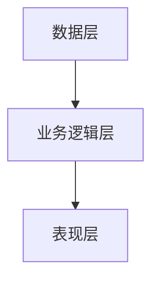
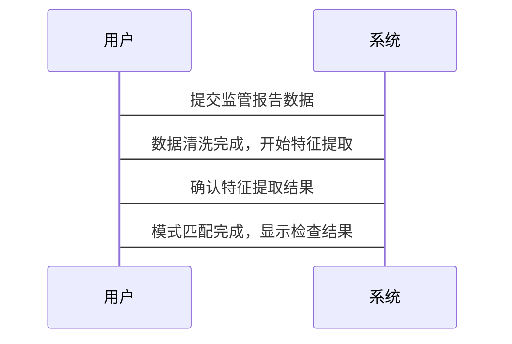

                 


# 《金融监管报告数据一致性检查工具》

> 关键词：金融监管，数据一致性，数据清洗，模式匹配，金融报告，数据检查工具

> 摘要：本文深入探讨了金融监管报告数据一致性检查工具的开发背景、核心概念、算法原理、系统设计与实现方案，并通过实际案例分析，详细解读了该工具在金融监管中的应用场景和优势。本文旨在为金融监管领域的技术人员提供一套完整的解决方案，帮助其高效、准确地完成监管数据一致性检查工作。

---

# 第一部分: 金融监管报告数据一致性检查工具背景介绍

## 第1章: 数据一致性检查的背景与问题

### 1.1 数据一致性问题的背景

#### 1.1.1 金融监管的重要性
金融监管是维护金融市场秩序、保护投资者利益的重要手段。监管机构需要对金融机构提交的各类报告进行严格审核，以确保报告的真实性和准确性。然而，金融机构的业务复杂性不断提高，报告数据来源多样，数据格式和内容差异较大，导致数据一致性检查变得复杂且容易出错。

#### 1.1.2 数据一致性问题的提出
在金融监管过程中，数据一致性是指不同来源、不同格式的报告数据在内容和格式上保持一致。例如，同一笔交易在不同报告中的描述应保持一致，否则可能导致监管错误或遗漏。数据一致性问题主要表现为数据格式不统一、数据项缺失、数据内容冲突等。

#### 1.1.3 金融监管中的数据不一致现象
- 数据来源多样化：同一报告可能来自不同的系统或部门，导致数据格式和内容不一致。
- 数据格式不统一：不同机构可能使用不同的数据编码方式，导致数据难以直接比较。
- 数据内容冲突：同一数据项在不同报告中的描述可能不同，例如“交易金额”和“交易金额（含税）”容易混淆。

### 1.2 问题描述与解决思路

#### 1.2.1 数据一致性问题的具体表现
- 数据项缺失：某些报告中缺少必要的数据项，导致无法进行有效比较。
- 数据格式不一致：同一数据项在不同报告中的格式不同，例如日期格式、金额单位等。
- 数据内容冲突：同一数据项在不同报告中的描述或数值不一致。

#### 1.2.2 数据一致性检查的必要性
数据一致性检查是金融监管的基础性工作，其目的是确保监管报告的准确性和可比性。只有通过数据一致性检查，才能确保监管决策的科学性和有效性。

#### 1.2.3 数据一致性检查的目标与范围
- **目标**：确保监管报告中数据项的格式、内容和数值的一致性。
- **范围**：涵盖所有金融机构提交的监管报告，包括银行、证券、保险等领域的报告。

### 1.3 数据一致性检查的边界与外延

#### 1.3.1 数据一致性检查的边界
- 数据范围：仅限于监管报告中明确规定的数据项。
- 数据格式：仅检查数据项的格式一致性，不涉及数据内容的语义分析。
- 数据源：仅限于金融机构提交的监管报告，不包括其他来源的数据。

#### 1.3.2 数据一致性检查的外延
- 数据内容的语义一致性：虽然不在边界范围内，但可以通过数据一致性检查工具进行扩展。
- 数据质量检查：数据一致性检查可以与数据完整性、准确性检查结合使用。

#### 1.3.3 数据一致性检查与其他数据处理任务的区别与联系

| 任务类型          | 数据一致性检查          | 数据清洗          | 数据分类          |
|--------------------|-------------------------|------------------|------------------|
| 目标              | 检查数据格式和内容一致性 | 清洗数据中的噪声 | 对数据进行分类    |
| 数据处理方式      | 基于规则的匹配          | 去除无效数据      | 基于算法的分类    |
| 数据依赖性        | 高                     | 高               | 中               |

---

## 第2章: 数据一致性检查的核心概念与联系

### 2.1 数据一致性检查的基本原理

#### 2.1.1 数据清洗的概念
数据清洗是指对数据进行预处理，去除或修正不符合要求的数据项。例如，去除空值、修正数据格式等。

#### 2.1.2 数据特征提取的方法
数据特征提取是指从数据项中提取关键特征，例如数据项名称、数据类型、数值范围等。

#### 2.1.3 数据模式匹配的机制
数据模式匹配是指根据预定义的规则，检查数据项是否符合特定的模式。例如，检查日期格式是否为YYYY-MM-DD。

### 2.2 数据一致性检查的核心概念对比

#### 2.2.1 数据清洗与数据转换的对比

| 对比维度         | 数据清洗          | 数据转换          |
|------------------|-------------------|-------------------|
| 目标             | 去除无效数据      | 转换数据格式      |
| 方法             | 删除或修正数据    | 使用函数转换数据  |
| 数据依赖性       | 高                | 中                |

#### 2.2.2 数据特征提取与数据分类的对比

| 对比维度         | 数据特征提取      | 数据分类          |
|------------------|------------------|-------------------|
| 目标             | 提取数据特征      | 对数据进行分类    |
| 数据处理方式     | 基于规则的提取    | 基于算法的分类    |
| 数据依赖性       | 高                | 中                |

#### 2.2.3 数据模式匹配与数据关联的对比

| 对比维度         | 数据模式匹配      | 数据关联          |
|------------------|------------------|-------------------|
| 目标             | 检查数据是否符合模式 | 发现数据之间的关联 |
| 数据处理方式     | 基于规则的匹配    | 基于算法的关联分析|
| 数据依赖性       | 高                | 中                |

### 2.3 数据一致性检查的ER实体关系图

```mermaid
erDiagram
    regReport : 监管报告
    dataItem : 数据项
    checkRule : 检查规则
    regReport
    o--- regReport.检查结果
    dataItem
    o--- dataItem.特征值
    checkRule
    o--- checkRule.匹配模式
```

---

# 第二部分: 数据一致性检查工具的算法原理

## 第3章: 数据一致性检查算法的实现原理

### 3.1 数据一致性检查的算法流程

```mermaid
graph TD
    A[开始] -> B[数据预处理]
    B -> C[特征提取]
    C -> D[模式匹配]
    D -> E[检查结果]
    E -> F[结束]
```

### 3.2 数据清洗算法的实现

```python
import pandas as pd

def clean_data(data_frame):
    # 删除空值
    data_frame = data_frame.dropna()
    # 修正数据格式
    data_frame['日期'] = pd.to_datetime(data_frame['日期'])
    return data_frame
```

### 3.3 数据特征提取算法的实现

```python
import re

def extract_features(data_item):
    # 提取数据项名称
    item_name = re.findall(r'\b\w+\b', data_item)[0]
    # 提取数据类型
    item_type = type(data_item).__name__
    return {'名称': item_name, '类型': item_type}
```

### 3.4 数据模式匹配算法的实现

```python
def match_pattern(item_feature, pattern_rule):
    if item_feature['类型'] == 'str':
        return re.match(pattern_rule['正则表达式'], item_feature['名称']) is not None
    else:
        return False
```

---

## 第4章: 数据一致性检查工具的系统设计与实现

### 4.1 系统功能设计

#### 4.1.1 数据预处理模块
- 功能：清洗数据，去除无效数据项。
- 实现：使用Python的Pandas库进行数据清洗。

#### 4.1.2 特征提取模块
- 功能：从数据项中提取关键特征，例如数据项名称、数据类型等。
- 实现：使用正则表达式和数据类型检查函数。

#### 4.1.3 模式匹配模块
- 功能：根据预定义的规则，检查数据项是否符合特定模式。
- 实现：使用正则表达式和模式匹配算法。

#### 4.1.4 检查结果报告模块
- 功能：生成检查结果报告，包括一致性检查结果、数据清洗记录等。
- 实现：使用报告生成工具，例如Python的ReportLab库。

### 4.2 系统架构设计

#### 4.2.1 系统分层架构



#### 4.2.2 系统接口设计

- 数据上传接口：`POST /api/upload`
- 检查结果查询接口：`GET /api/results`

#### 4.2.3 系统交互设计



---

## 第5章: 项目实战与案例分析

### 5.1 环境安装

```bash
pip install pandas numpy scikit-learn
```

### 5.2 核心代码实现

```python
import pandas as pd
import re

def clean_data(data_frame):
    data_frame = data_frame.dropna()
    data_frame['日期'] = pd.to_datetime(data_frame['日期'])
    return data_frame

def extract_features(data_item):
    item_name = re.findall(r'\b\w+\b', data_item)[0]
    item_type = type(data_item).__name__
    return {'名称': item_name, '类型': item_type}

def match_pattern(item_feature, pattern_rule):
    if item_feature['类型'] == 'str':
        return re.match(pattern_rule['正则表达式'], item_feature['名称']) is not None
    else:
        return False
```

### 5.3 代码解读与分析

- 数据清洗：删除空值，修正日期格式。
- 特征提取：提取数据项名称和数据类型。
- 模式匹配：根据正则表达式匹配数据项名称。

### 5.4 案例分析

#### 5.4.1 案例背景
某银行提交的监管报告中，同一笔交易在不同的报告中描述为“交易金额”和“交易金额（含税）”，导致数据不一致。

#### 5.4.2 数据清洗与特征提取
```python
clean_data(report_data)
extract_features("交易金额")
extract_features("交易金额（含税）")
```

#### 5.4.3 模式匹配
```python
pattern_rule = {'正则表达式': r'^交易金额'}
match_pattern({'名称': '交易金额', '类型': 'str'}, pattern_rule)
match_pattern({'名称': '交易金额（含税）', '类型': 'str'}, pattern_rule)
```

#### 5.4.4 检查结果
- “交易金额”匹配成功。
- “交易金额（含税）”不匹配。

### 5.5 项目小结

- **实现的关键点**：数据清洗、特征提取、模式匹配。
- **工具的优势**：提高数据一致性检查的效率和准确性，减少人工干预。

---

# 第三部分: 数据一致性检查工具的最佳实践

## 第6章: 最佳实践与小结

### 6.1 小结

- 数据一致性检查是金融监管的重要环节。
- 数据一致性检查工具通过数据清洗、特征提取和模式匹配，实现高效、准确的监管数据一致性检查。

### 6.2 注意事项

- 数据隐私保护：在处理监管数据时，需严格遵守数据隐私保护法规。
- 性能优化：对于大规模数据，需优化算法和系统架构，提高处理效率。

### 6.3 拓展阅读

- 数据挖掘与机器学习技术在金融监管中的应用。
- 自然语言处理（NLP）在监管报告分析中的应用。

---

# 作者：AI天才研究院/AI Genius Institute & 禅与计算机程序设计艺术 /Zen And The Art of Computer Programming

