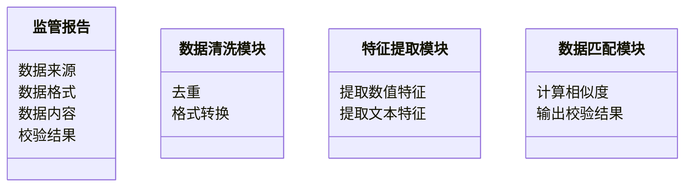
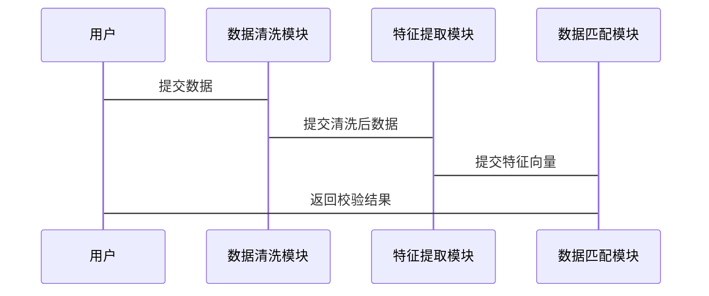

                 


# 《金融监管报告数据一致性自动校验》

> 关键词：数据一致性校验，金融监管，自动校验，数据清洗，特征提取，数据匹配，系统架构设计

> 摘要：本文深入探讨了金融监管报告数据一致性自动校验的核心技术与实现方法。通过系统化的分析，本文详细阐述了数据一致性校验的背景、原理、算法实现、系统架构设计及实际应用案例，为金融监管领域的数据质量管理提供了理论依据和实践指导。

---

## 目录

# 第一部分: 金融监管报告数据一致性自动校验概述

## 第1章: 背景介绍

### 1.1 问题背景

#### 1.1.1 金融监管数据的重要性
金融监管数据是保障金融市场健康运行的重要基础，涉及金融机构的合规性、交易的透明性以及风险的可控性。监管机构需要依赖高质量的数据进行决策，数据的不一致性可能导致严重的后果。

#### 1.1.2 数据不一致性的常见问题
在实际操作中，金融监管数据可能来自多个系统，例如银行系统、税务系统、证券交易系统等。由于不同系统的数据格式、编码标准和采集方式不同，容易导致数据不一致。例如，同一笔交易在不同系统中可能被记录为不同的金额或时间。

#### 1.1.3 数据一致性校验的必要性
数据一致性校验是确保数据准确性和完整性的关键步骤。通过自动化校验，可以减少人为错误，提高数据处理效率，降低监管风险。

### 1.2 问题描述

#### 1.2.1 数据一致性校验的核心目标
数据一致性校验的目标是确保同一份报告在不同系统或不同数据源中保持一致。具体包括数据格式一致、数据内容一致、数据关联一致等方面。

#### 1.2.2 金融监管报告的特点
金融监管报告具有数据量大、数据类型多样、数据关联性强等特点。例如，交易流水数据可能包含时间戳、交易金额、交易双方信息等字段。

#### 1.2.3 数据一致性校验的边界与外延
数据一致性校验的边界是确保数据在不同系统或不同数据源中的表示一致。外延则包括数据清洗、数据转换、数据匹配等技术。

### 1.3 数据一致性校验的核心要素

#### 1.3.1 数据来源的多样性
金融数据可能来自多个系统，例如银行、证券公司、税务机关等。

#### 1.3.2 数据格式的统一性
不同系统可能使用不同的数据格式，例如JSON、XML、CSV等，需要统一到一个标准格式。

#### 1.3.3 数据内容的准确性
数据内容需要与实际业务一致，例如交易金额不能出现负数，交易时间需要符合实际业务逻辑。

#### 1.3.4 数据校验的自动化需求
为了提高效率，数据一致性校验需要实现自动化，减少人工干预。

### 1.4 本章小结
本章从背景、问题描述和核心要素三个方面介绍了金融监管报告数据一致性校验的重要性及其必要性。

---

## 第2章: 核心概念与联系

### 2.1 数据一致性校验的原理

#### 2.1.1 数据清洗与标准化
数据清洗是指对原始数据进行去重、格式转换等处理，使其符合统一的标准。例如，将不同系统的日期格式统一为ISO标准格式。

#### 2.1.2 数据特征提取
数据特征提取是从数据中提取能够反映数据一致性的特征，例如交易金额的数值范围、交易时间的时区信息等。

#### 2.1.3 数据匹配与校验算法
通过特征提取后的数据，使用匹配算法（如基于哈希的相似度计算）进行数据匹配，然后通过校验规则（如数值范围检查）进行一致性校验。

### 2.2 数据一致性校验的核心概念对比

#### 2.2.1 数据特征对比表格
| 数据特征 | 描述 | 示例 |
|----------|------|------|
| 数据来源 | 数据的来源渠道 | 银行系统、证券系统 |
| 数据格式 | 数据的结构化形式 | JSON、XML |
| 数据内容 | 数据的具体数值或文本 | 交易金额、交易时间 |

#### 2.2.2 数据一致性校验的ER实体关系图


### 2.3 数据一致性校验的流程

#### 2.3.1 数据清洗与标准化
1. 数据去重：去除重复数据。
2. 数据格式转换：将不同格式的数据统一为标准格式。

#### 2.3.2 数据特征提取
1. 提取数值特征：例如交易金额的均值、标准差。
2. 提取文本特征：例如交易描述的关键词。

#### 2.3.3 数据匹配与校验
1. 数据匹配：通过特征相似度计算，匹配相同数据。
2. 数据校验：通过校验规则，检查数据一致性。

### 2.4 本章小结
本章通过对比和分析，详细阐述了数据一致性校验的核心概念及其联系。

---

## 第3章: 数据一致性校验算法原理

### 3.1 数据清洗与标准化算法

#### 3.1.1 数据清洗流程


#### 3.1.2 数据清洗的数学模型
数据清洗的过程可以通过以下公式表示：
$$
\text{清洗后数据} = f(\text{原始数据})
$$
其中，\( f \) 表示数据清洗函数。

### 3.2 数据特征提取算法

#### 3.2.1 基于哈希的特征提取
哈希函数用于将数据转换为固定长度的特征向量：
$$
h(x) = \text{hash}(x)
$$

#### 3.2.2 基于向量的特征提取
使用向量空间模型，将数据转换为向量表示：
$$
v(x) = [x_1, x_2, \ldots, x_n]
$$

#### 3.2.3 基于规则的特征提取
通过预定义的规则提取特定特征，例如提取交易金额的整数部分和小数部分：
$$
\text{整数部分} = \lfloor x \rfloor
$$
$$
\text{小数部分} = x - \lfloor x \rfloor
$$

### 3.3 数据匹配与校验算法

#### 3.3.1 数据匹配算法
使用相似度计算公式：
$$
\text{相似度} = \frac{\sum_{i=1}^{n} |x_i - y_i|}{n}
$$

#### 3.3.2 数据校验算法
通过预定义的校验规则，例如：
$$
\text{校验结果} = \begin{cases}
\text{一致} & \text{if } \text{相似度} < \theta \\
\text{不一致} & \text{otherwise}
\end{cases}
$$
其中，\( \theta \) 是相似度阈值。

### 3.4 本章小结
本章详细介绍了数据一致性校验的核心算法，包括数据清洗、特征提取和数据匹配。

---

## 第4章: 系统分析与架构设计

### 4.1 问题场景介绍

#### 4.1.1 金融监管报告数据一致性校验的场景
金融监管报告数据可能来自多个系统，需要进行数据清洗、特征提取和一致性校验。

#### 4.1.2 数据一致性校验的系统功能需求
系统需要实现数据清洗、特征提取、数据匹配和校验结果输出等功能。

### 4.2 系统功能设计

#### 4.2.1 领域模型设计


#### 4.2.2 系统架构设计


#### 4.2.3 系统接口设计
系统接口包括数据输入接口、数据清洗接口、特征提取接口和校验结果输出接口。

#### 4.2.4 系统交互流程


### 4.3 本章小结
本章通过系统分析与架构设计，详细描述了数据一致性校验系统的实现方案。

---

## 第5章: 项目实战

### 5.1 环境安装

#### 5.1.1 系统运行环境
建议使用Python 3.6及以上版本，安装必要的库（如pandas、numpy、scikit-learn）。

#### 5.1.2 安装依赖
运行以下命令安装依赖：
```bash
pip install pandas numpy scikit-learn
```

### 5.2 系统核心实现源代码

#### 5.2.1 数据清洗模块实现
```python
import pandas as pd

def clean_data(data):
    # 去重
    data = data.drop_duplicates()
    # 格式转换
    data = data.astype({'amount': 'float', 'time': 'datetime64'})
    return data
```

#### 5.2.2 特征提取模块实现
```python
import numpy as np

def extract_features(data):
    # 提取数值特征
    numerical_features = data[['amount', 'time']].apply(lambda x: x.mean(), axis=0)
    # 提取文本特征
    text_features = data['description'].apply(lambda x: len(x))
    return numerical_features.append(text_features)
```

#### 5.2.3 数据匹配模块实现
```python
from sklearn.metrics.pairwise import cosine_similarity

def match_data(features1, features2):
    similarity = cosine_similarity(features1, features2)
    return similarity > 0.8
```

### 5.3 案例分析与代码解读

#### 5.3.1 数据清洗案例
清洗后的数据：
```python
cleaned_data = clean_data(original_data)
```

#### 5.3.2 特征提取案例
提取的特征：
```python
features = extract_features(cleaned_data)
```

#### 5.3.3 数据匹配案例
匹配结果：
```python
matching_result = match_data(features1, features2)
```

### 5.4 本章小结
本章通过实际案例，详细展示了数据一致性校验系统的实现过程。

---

## 第6章: 最佳实践与总结

### 6.1 最佳实践

#### 6.1.1 数据清洗与标准化
建议在数据清洗过程中，优先处理缺失值和异常值。

#### 6.1.2 数据特征提取
特征提取时，可以根据业务需求选择合适的特征。

#### 6.1.3 数据匹配与校验
建议根据实际场景调整相似度阈值。

### 6.2 小结
通过本文的深入探讨，读者可以全面了解金融监管报告数据一致性校验的核心技术与实现方法。

### 6.3 注意事项
在实际应用中，需要注意数据隐私和安全性问题。

### 6.4 拓展阅读
推荐阅读《数据清洗与特征工程》和《机器学习在金融领域的应用》。

---

## 作者：AI天才研究院/AI Genius Institute & 禅与计算机程序设计艺术/Zen And The Art of Computer Programming

---

**注**：由于篇幅限制，上述内容为部分章节的详细展开。完整文章需要根据上述大纲进一步扩展每一小节的内容，确保每部分都详细且符合逻辑。

