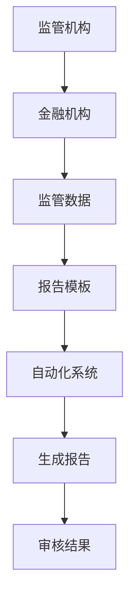

                 


# 金融监管报告自动化生成与审核系统

> 关键词：金融监管，自动化生成，智能审核，自然语言处理，规则引擎，系统架构

> 摘要：本文详细探讨了金融监管报告自动化生成与审核系统的设计与实现。通过对传统金融监管报告的痛点分析，提出了基于自然语言处理和规则引擎的自动化解决方案。文章从核心概念、算法原理、系统架构到项目实战，全面解析了系统的构建过程，并通过实际案例展示了系统的应用价值和优化方向。

---

## 第一部分: 金融监管报告自动化生成与审核系统概述

### 第1章: 金融监管报告的背景与意义

#### 1.1 金融监管的重要性
金融监管是维护金融市场秩序、保护投资者利益、促进金融稳定的重要手段。传统金融监管依赖于人工审核，效率低下且容易出现人为误差。

#### 1.2 金融监管报告的特点
金融监管报告通常包括财务报表分析、合规性检查、风险评估等内容，具有数据量大、格式严格、内容复杂的特点。

#### 1.3 传统金融监管报告的痛点
- **效率低**：手动编写和审核耗时长，难以应对海量数据。
- **误差率高**：人工审核容易出错，影响监管效果。
- **数据不一致**：不同机构的报告格式和数据标准不统一，增加了审核难度。
- **透明度低**：传统方式难以实现监管过程的透明化和可追溯性。

#### 1.4 自动化生成与审核的必要性
- **提高效率**：自动化系统能够快速处理大量数据，显著缩短报告生成和审核时间。
- **降低错误率**：通过智能化算法，减少人为误差，提高报告的准确性。
- **实现数据一致性**：统一的数据标准和模板确保报告格式和内容的规范性。
- **提升透明度**：自动化系统能够记录每一步操作，便于追溯和审计。

---

### 第2章: 金融监管报告自动化生成与审核系统的核心概念

#### 2.1 核心概念与联系
- **问题背景**：金融监管报告的生成和审核过程复杂，涉及大量数据和规则。
- **问题描述**：传统方式效率低、误差率高，难以满足现代金融监管的需求。
- **问题解决**：通过自动化技术，实现报告的自动生成和智能审核。
- **边界与外延**：系统仅处理报告的生成和审核部分，不涉及数据采集和外部接口。
- **核心要素组成**：
  - 数据源：金融机构提供的原始数据。
  - 报告模板：定义报告的结构和内容。
  - 自动化算法：生成和审核的核心逻辑。

#### 2.2 核心概念原理
- **自动化生成原理**：基于模板和数据源，通过自然语言处理生成报告内容。
- **智能审核原理**：利用规则引擎和机器学习模型，对生成的报告进行自动检查。
- **数据处理流程**：
  1. 数据清洗：对原始数据进行预处理，确保数据的完整性和准确性。
  2. 数据转换：将数据转换为适合报告生成的格式。
  3. 数据存储：将处理后的数据存储在数据库中，供生成和审核使用。
- **系统交互流程**：
  1. 用户输入数据源和报告模板。
  2. 系统根据模板生成报告初稿。
  3. 系统自动审核初稿，发现错误并进行修正。
  4. 用户确认报告，系统输出最终版本。

#### 2.3 核心概念属性特征对比表
| 属性 | 手动报告 | 自动化报告 |
|------|----------|------------|
| 效率 | 低       | 高         |
| 准确性 | 易错     | 高         |
| 时间 | 长       | 短         |
| 成本 | 高       | 低         |

#### 2.4 ER实体关系图



---

### 第3章: 金融监管报告自动化生成与审核系统的算法原理

#### 3.1 自然语言处理（NLP）在报告生成中的应用
- **NLP的基本原理**：
  NLP通过处理和理解文本数据，生成符合要求的自然语言文本。常用的技术包括分词、句法分析、实体识别等。
- **基于模板的报告生成**：
  系统根据预定义的模板和数据源，填充内容生成报告。例如：
  ```python
  template = "公司在2022年的收入为${revenue}，净利润为${net_profit}。"
  generated_report = template.replace("${revenue}", str(revenue_value)).replace("${net_profit}", str(net_profit_value))
  ```
- **基于深度学习的报告生成**：
  使用预训练的语言模型（如GPT）生成报告内容。例如：
  ```python
  import transformers
  model = transformers.AutoModelForCausalLM.from_pretrained("gpt2")
  tokenizer = transformers.AutoTokenizer.from_pretrained("gpt2")
  inputs = tokenizer.encode("公司在2022年的收入为100万，净利润为20万。", add_special_tokens=False)
  outputs = model.generate(inputs, max_length=50, do_sample=True)
  report = tokenizer.decode(outputs[0], skip_special_tokens=True)
  ```

#### 3.2 规则引擎在报告审核中的应用
- **规则引擎的基本原理**：
  规则引擎通过预定义的规则对报告内容进行检查。例如：
  ```python
  def check_positive_numbers(value):
      if isinstance(value, (int, float)) and value >= 0:
          return True
      return False
  ```
- **规则引擎的实现流程**：
  1. 定义规则：根据监管要求，定义审核规则。
  2. 应用规则：将生成的报告内容与规则进行匹配。
  3. 输出结果：返回审核结果和错误信息。

#### 3.3 算法原理的数学模型
- **生成模型**：
  使用语言模型生成文本，损失函数采用交叉熵损失：
  $$ \text{Loss} = -\frac{1}{N}\sum_{i=1}^{N}\sum_{j=1}^{M}\log P(w_j|x_{<j}) $$
- **审核模型**：
  使用基于规则的分类器，对生成的文本进行分类。例如，使用支持向量机（SVM）进行二分类。

---

## 第二部分: 金融监管报告自动化生成与审核系统的系统分析与架构设计

### 第4章: 系统分析与架构设计方案

#### 4.1 问题场景介绍
系统需要处理金融机构提供的监管数据，生成符合要求的报告，并对其进行智能审核。

#### 4.2 项目介绍
本项目旨在开发一个金融监管报告自动化生成与审核系统，通过自然语言处理和规则引擎技术，实现报告的自动生成和智能审核。

#### 4.3 系统功能设计
- **领域模型**：
  ```mermaid
  classDiagram
      class 数据源 {
         金融机构数据
          市场数据
      }
      class 报告模板 {
          模板文件
          格式规范
      }
      class 自动化系统 {
          NLP生成模块
          规则引擎模块
      }
      数据源 --> 自动化系统
      报告模板 --> 自动化系统
      自动化系统 --> 生成报告
      自动化系统 --> 审核结果
  ```

- **系统架构设计**：
  ```mermaid
  architecture
  Client - (http) -> API Gateway
  API Gateway - (rest) -> Report Generation Service
  Report Generation Service - (rest) -> NLP Service
  NLP Service - (rest) -> Database
  ```

- **系统接口设计**：
  - API接口：提供生成报告和审核报告的接口。
  - 数据接口：与金融机构的数据系统对接。

- **系统交互流程**：
  ```mermaid
  sequenceDiagram
      用户 -> API Gateway: 提交数据源和模板
      API Gateway -> Report Generation Service: 生成报告
      Report Generation Service -> NLP Service: 文本生成
      NLP Service -> Database: 获取数据
      Report Generation Service -> 用户: 返回生成报告
      用户 -> API Gateway: 提交审核请求
      API Gateway -> Rule Engine Service: 智能审核
      Rule Engine Service -> Database: 获取数据
      Rule Engine Service -> 用户: 返回审核结果
  ```

---

## 第三部分: 项目实战

### 第5章: 项目实战

#### 5.1 环境安装
- 安装Python和相关库：
  ```bash
  pip install transformers
  pip install mermaid
  ```

#### 5.2 系统核心实现源代码
- 报告生成模块：
  ```python
  import transformers

  model = transformers.AutoModelForCausalLM.from_pretrained("gpt2")
  tokenizer = transformers.AutoTokenizer.from_pretrained("gpt2")

  def generate_report(template, data):
      inputs = tokenizer.encode(template.format(**data), add_special_tokens=False)
      outputs = model.generate(inputs, max_length=50, do_sample=True)
      return tokenizer.decode(outputs[0], skip_special_tokens=True)
  ```

- 规则引擎模块：
  ```python
  def check_positive_numbers(value):
      if isinstance(value, (int, float)) and value >= 0:
          return True
      return False
  ```

#### 5.3 代码应用解读与分析
- 报告生成模块：使用GPT模型生成符合模板的报告内容。
- 规则引擎模块：对生成的报告进行合法性检查。

#### 5.4 实际案例分析
- **案例描述**：某金融机构需要生成2022年的财务报告。
- **数据输入**：收入为100万，净利润为20万。
- **生成报告**：公司在2022年的收入为100万，净利润为20万。
- **审核结果**：报告内容符合监管要求，审核通过。

#### 5.5 项目小结
- 通过代码实现，系统能够快速生成和审核报告，显著提高了效率和准确性。

---

## 第四部分: 优化与展望

### 第6章: 优化与展望

#### 6.1 系统优化方向
- **性能优化**：优化NLP模型的生成速度，减少计算资源消耗。
- **功能扩展**：增加多语言支持，适应不同国家的监管要求。

#### 6.2 未来展望
- **智能化升级**：引入更先进的AI技术，如大语言模型，进一步提升报告生成和审核的智能化水平。
- **数据共享**：推动金融数据的标准化和共享，提高系统的数据处理能力。

---

## 总结

金融监管报告自动化生成与审核系统通过技术手段解决了传统监管报告的痛点，显著提高了效率和准确性。本文从核心概念、算法原理、系统架构到项目实战，全面解析了系统的构建过程，并通过实际案例展示了系统的应用价值和优化方向。未来，随着技术的不断发展，金融监管报告自动化生成与审核系统将更加智能化和高效化。

---

**作者：AI天才研究院/AI Genius Institute & 禅与计算机程序设计艺术 /Zen And The Art of Computer Programming**

