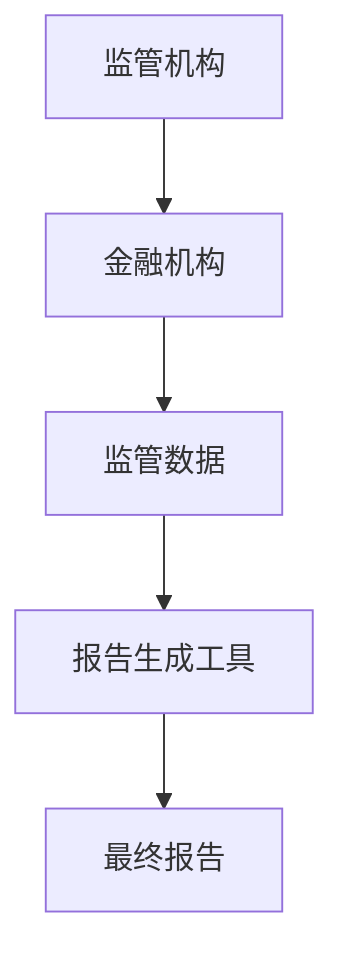
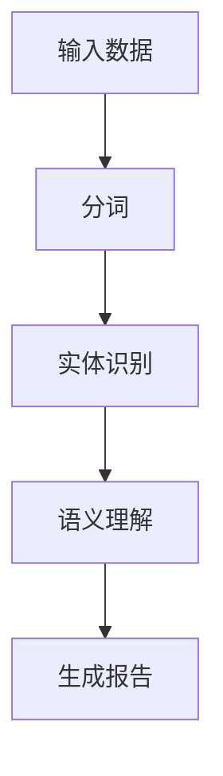
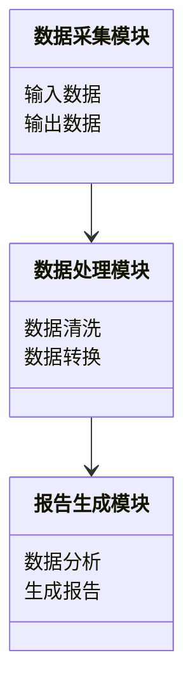
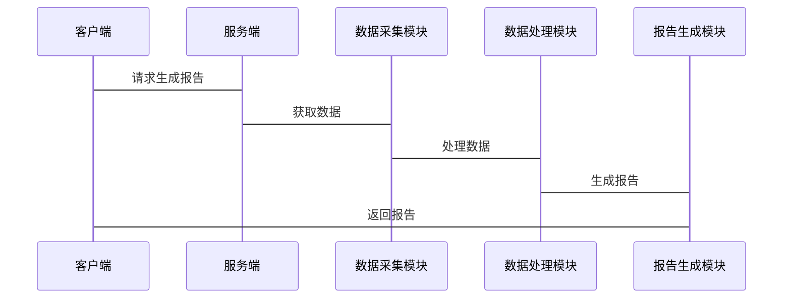

                 


```markdown
# 《金融监管报告自动化生成工具》

> 关键词：金融监管、自动化生成、自然语言处理、机器学习、系统架构、项目实战

> 摘要：  
本文深入探讨了金融监管报告自动化生成工具的设计与实现，从背景介绍、核心概念、算法原理到系统架构和项目实战，全面分析了该工具的技术细节和应用场景。通过自然语言处理和机器学习等技术，结合实际案例，展示了如何高效、准确地生成金融监管报告，同时总结了最佳实践和注意事项，为读者提供了宝贵的参考。

---

## 第一部分: 金融监管报告的背景与挑战

### 第1章: 金融监管报告的背景与挑战

#### 1.1 金融监管的现状与问题
- 1.1.1 传统金融监管的痛点  
  - 人工处理效率低，易出错  
  - 数据来源多样，整合难度大  
  - 报告生成周期长，难以及时反馈  
- 1.1.2 金融监管的重要性与复杂性  
  - 监管范围广，涉及多个金融领域  
  - 数据量大，信息复杂，难以处理  
  - 监管要求高，需符合多项法规  
- 1.1.3 技术驱动金融监管变革的必要性  
  - 技术进步为监管提供新思路  
  - 自动化工具可提升监管效率  

#### 1.2 金融监管报告的特点与需求
- 1.2.1 金融监管报告的核心要素  
  - 数据来源：交易数据、财务报表、合规记录等  
  - 报告结构：标题、正文、结论、附录等  
  - 生成流程：数据采集、分析、生成、输出  
- 1.2.2 报告生成的痛点与需求  
  - 痛点：人工编写耗时，易出错，一致性差  
  - 需求：自动化、智能化、高准确性  
- 1.2.3 自动化生成的必要性与优势  
  - 快速响应，提高效率  
  - 减少人为错误，确保合规性  
  - 支持大规模数据处理  

#### 1.3 自动化生成工具的定义与目标
- 1.3.1 自动化生成工具的定义  
  - 利用技术手段，自动处理数据并生成报告的工具  
- 1.3.2 工具的核心目标与功能  
  - 数据采集、分析、生成报告  
  - 支持多种格式输出，如PDF、Excel等  
  - 提供用户友好的交互界面  
- 1.3.3 工具的适用场景与边界  
  - 适用于金融机构、监管机构等  
  - 边界：不处理实时交易监控，仅生成报告  

---

## 第二部分: 核心概念与联系

### 第2章: 核心概念与联系

#### 2.1 金融监管报告的核心要素
- 2.1.1 数据来源与处理  
  - 数据来源：数据库、API接口、文件等  
  - 数据处理：清洗、转换、分析  
- 2.1.2 报告结构与内容  
  - 结构：标题、正文、结论等  
  - 内容：分析结果、合规建议等  
- 2.1.3 生成流程与输出格式  
  - 流程：数据采集 → 数据分析 → 报告生成 → 输出  
  - 输出格式：PDF、Word、Excel等  

#### 2.2 核心概念的属性特征对比
| 概念 | 属性 | 特征 |
|------|------|------|
| 数据来源 | 多样性 | 数据来源广泛，包括结构化和非结构化数据 |
| 报告结构 | 层次性 | 包括标题、正文、结论等，结构清晰 |
| 生成流程 | 系统性 | 流程化，步骤明确，可自动化 |

#### 2.3 实体关系图


---

## 第三部分: 算法原理与实现

### 第3章: 算法原理与实现

#### 3.1 自然语言处理技术
- 3.1.1 分词与实体识别  
  - 分词：将文本分割为词语或短语  
  - 实体识别：识别文本中的关键实体（如公司名称、日期等）  
- 3.1.2 语义理解与生成  
  - 语义理解：理解文本的含义和上下文关系  
  - 语义生成：根据理解生成符合要求的文本  
- 3.1.3 算法流程图  


#### 3.2 机器学习算法
- 3.2.1 分类与聚类  
  - 分类：将数据分为不同类别（如合规与不合规）  
  - 聚类：将相似的数据归为一类  
- 3.2.2 回归与预测  
  - 回归：预测连续变量（如风险评分）  
  - 预测：基于历史数据预测未来趋势  
- 3.2.3 算法实现代码  
```python
def classify(text):
    # 简单分类算法示例
    return 1 if text == 'positive' else 0
```

#### 3.3 数学模型与公式
- 3.3.1 条件概率公式  
$$P(A|B) = \frac{P(B|A)P(A)}{P(B)}$$  
- 3.3.2 最大似然估计  
$$\theta = \arg \max_{\theta} \sum_{i=1}^n \log P(x_i | \theta)$$  
- 3.3.3 线性回归模型  
$$y = \beta_0 + \beta_1 x + \epsilon$$  

---

## 第四部分: 系统分析与架构设计

### 第4章: 系统分析与架构设计

#### 4.1 问题场景介绍
- 4.1.1 系统目标  
  - 自动化生成金融监管报告  
  - 提供高准确性和效率  
- 4.1.2 问题描述  
  - 如何高效处理数据并生成报告  
  - 如何确保报告的准确性和合规性  

#### 4.2 项目介绍
- 4.2.1 项目目标  
  - 开发一个自动化生成金融监管报告的工具  
  - 提供用户友好的界面和高效的处理能力  
- 4.2.2 项目范围  
  - 支持多种数据源和报告格式  
  - 提供多种分析功能（如分类、预测等）  

#### 4.3 系统功能设计
- 4.3.1 领域模型  


#### 4.4 系统架构设计


#### 4.5 系统接口设计
- 4.5.1 接口描述  
  - 数据采集接口：接收数据并存入数据库  
  - 数据处理接口：处理数据并返回结果  
  - 报告生成接口：生成报告并返回给用户  
- 4.5.2 交互流程图  


---

## 第五部分: 项目实战

### 第5章: 项目实战

#### 5.1 环境安装
- 安装Python、Jupyter Notebook、Scikit-learn、NLTK等工具  
- 安装数据库（如MySQL）和相关驱动  

#### 5.2 核心代码实现
- 5.2.1 数据采集模块  
```python
import requests

def fetch_data(api_url):
    response = requests.get(api_url)
    return response.json()
```

- 5.2.2 数据处理模块  
```python
import pandas as pd

def process_data(data):
    df = pd.DataFrame(data)
    df['processed'] = df['raw'].apply(clean_text)
    return df
```

- 5.2.3 报告生成模块  
```python
def generate_report(data):
    analysis = analyze_data(data)
    report = build_report(analysis)
    return report
```

#### 5.3 案例分析与实际应用
- 案例分析：某金融机构的合规报告生成  
- 实际应用：如何利用工具快速生成报告并进行合规检查  

#### 5.4 项目小结
- 项目实现的关键点  
  - 数据处理的准确性  
  - 报告生成的效率  
  - 系统的稳定性和扩展性  

---

## 第六部分: 最佳实践

### 第6章: 最佳实践

#### 6.1 小结
- 工具的核心价值在于提高效率和准确性  
- 技术实现的关键在于数据处理和算法优化  

#### 6.2 注意事项
- 数据安全：确保数据处理过程中的安全性  
- 系统稳定性：保证工具的稳定运行  
- 用户体验：提供友好的交互界面  

#### 6.3 拓展阅读
- 推荐书籍和资源  
  - 《Python机器学习实战》  
  - 《自然语言处理入门》  

---

## 作者

作者：AI天才研究院/AI Genius Institute & 禅与计算机程序设计艺术 /Zen And The Art of Computer Programming
```

