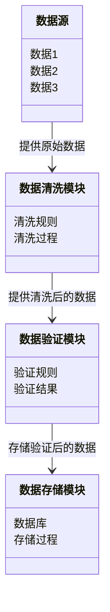
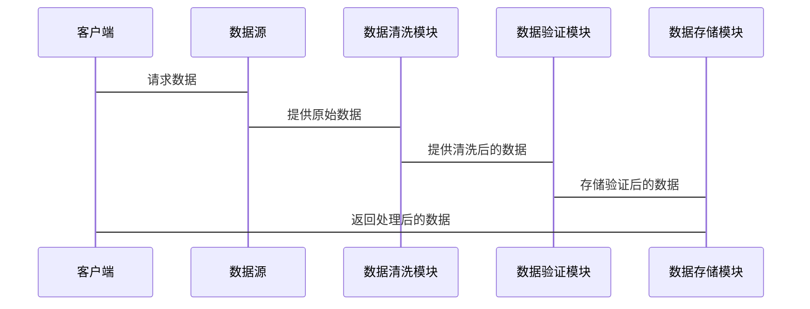

                 


# 金融监管科技数据质量控制

## 关键词：
金融监管科技，数据质量控制，数据质量管理，数据清洗，数据完整性，数据准确性

## 摘要：
本文详细探讨了金融监管科技中的数据质量控制问题，从定义、重要性、核心要素到具体实现方法，全面分析了数据质量控制在金融监管中的关键作用。通过实际案例和系统设计，展示了如何通过技术手段提升数据质量，确保金融监管的准确性和有效性。

---

# 第一部分: 金融监管科技数据质量控制背景与概述

## 第1章: 金融监管科技与数据质量控制概述

### 1.1 金融监管科技的定义与特点

#### 1.1.1 金融监管科技的定义
金融监管科技（FinTech）是指利用新兴技术（如人工智能、大数据、区块链等）来优化和创新金融服务和监管方式。其核心在于通过技术手段提高金融系统的效率、透明度和安全性。

#### 1.1.2 金融监管科技的核心特点
- **技术创新性**：利用新技术如AI和大数据进行金融监管。
- **实时性**：能够实时监控和分析金融数据。
- **智能化**：通过机器学习等技术实现自动化监管。
- **数据驱动**：依赖高质量的数据进行决策和分析。

#### 1.1.3 金融监管科技与传统金融监管的区别
- **技术手段**：传统监管依赖人工审核，而科技监管依赖自动化技术。
- **效率**：科技监管提高了数据处理和分析的效率。
- **准确性**：科技监管通过算法提高结果的准确性。

### 1.2 数据质量控制的定义与重要性

#### 1.2.1 数据质量的定义
数据质量是指数据的准确性、完整性、一致性和及时性。高质量的数据是金融监管决策的基础。

#### 1.2.2 数据质量控制的重要性
- **决策依据**：高质量数据确保监管决策的准确性。
- **风险控制**：及时发现和处理数据问题，降低金融风险。
- **合规性**：确保数据符合监管要求，避免法律风险。

#### 1.2.3 数据质量问题的背景与现状
- **数据来源多样**：金融机构数据来自不同系统，可能产生不一致。
- **数据清洗成本高**：处理脏数据需要大量时间和资源。
- **监管要求严格**：金融数据必须符合严格的合规标准。

### 1.3 金融监管科技中数据质量控制的必要性

#### 1.3.1 金融监管中数据质量问题的背景
金融监管需要处理大量数据，包括交易数据、客户信息等。这些数据可能来自不同系统，存在格式不统一、重复或缺失等问题。

#### 1.3.2 数据质量问题对金融监管的影响
- **决策失误**：数据不准确可能导致错误的监管决策。
- **风险增加**：数据不完整可能无法及时发现金融风险。
- **合规风险**：数据不规范可能导致违反监管规定。

#### 1.3.3 数据质量控制在金融监管科技中的作用
- **提高监管效率**：通过自动化技术快速处理数据。
- **降低风险**：及时发现和处理数据问题，确保监管的有效性。
- **提升合规性**：确保数据符合监管要求，避免法律风险。

## 第2章: 金融监管科技数据质量控制的边界与外延

### 2.1 数据质量控制的边界

#### 2.1.1 数据范围的界定
数据质量控制仅关注特定范围内的数据，如交易数据、客户信息等。其边界由监管需求和业务需求决定。

#### 2.1.2 数据质量控制的适用场景
- **实时监控**：需要实时处理和分析数据。
- **批量处理**：处理历史数据时，需确保数据的完整性和一致性。
- **合规检查**：确保数据符合监管要求。

#### 2.1.3 数据质量控制的限制与挑战
- **技术限制**：现有技术难以处理所有类型的数据问题。
- **数据复杂性**：金融数据涉及多个领域，处理复杂。
- **成本问题**：数据清洗和处理需要大量资源。

### 2.2 数据质量控制的外延

#### 2.2.1 数据质量控制的延伸领域
- **数据安全**：数据质量控制与数据安全密切相关，需确保数据在处理过程中的安全性。
- **数据隐私**：数据质量控制需遵守数据隐私保护法规，如GDPR。

#### 2.2.2 数据质量控制与其他技术的关系
- **人工智能**：AI技术可以辅助数据清洗和分析。
- **大数据技术**：大数据平台为数据质量控制提供技术支持。
- **区块链**：区块链技术可以提高数据的透明度和不可篡改性。

#### 2.2.3 数据质量控制的未来发展
- **智能化**：通过AI技术实现自动化数据质量控制。
- **实时化**：进一步提升数据处理的实时性，支持实时监管。
- **集成化**：数据质量控制将与更多技术集成，形成更完善的监管体系。

## 第3章: 数据质量控制的核心要素与概念结构

### 3.1 数据质量的核心要素

#### 3.1.1 数据完整性
数据完整性指数据的完整性和一致性，确保数据无缺失和重复。

#### 3.1.2 数据准确性
数据准确性指数据的真实性和正确性，确保数据反映实际情况。

#### 3.1.3 数据一致性
数据一致性指数据在不同系统中的格式和内容一致。

#### 3.1.4 数据及时性
数据及时性指数据的更新和处理及时，确保监管的实时性。

#### 3.1.5 数据安全性
数据安全性指数据在处理过程中的安全性，防止数据泄露和篡改。

### 3.2 数据质量控制的概念结构

#### 3.2.1 数据质量控制的流程
数据质量控制通常包括数据收集、清洗、转换、验证和存储等步骤。

#### 3.2.2 数据质量控制的参与者
- **数据提供者**：提供原始数据的机构。
- **数据处理者**：负责数据清洗和转换的人员或系统。
- **监管机构**：负责监督和评估数据质量的机构。

#### 3.2.3 数据质量控制的工具与技术
- **数据清洗工具**：如Python的pandas库。
- **数据验证工具**：如SQL查询工具。
- **数据集成工具**：如ETL工具。

---

# 第四部分: 数据质量控制的算法原理

## 第4章: 数据质量控制的核心算法实现

### 4.1 数据清洗算法原理

#### 4.1.1 数据清洗流程
数据清洗通常包括以下步骤：
1. **识别数据问题**：发现数据中的错误和异常。
2. **数据转换**：将数据转换为统一格式。
3. **数据填充**：处理缺失值。
4. **数据删除**：删除重复或无效数据。
5. **数据验证**：确保数据符合质量要求。

#### 4.1.2 数据清洗的Python实现

##### 使用pandas库进行数据清洗的代码示例

```python
import pandas as pd

# 创建示例数据
data = {
    '交易日期': ['2023-01-01', '2023-01-02', '2023-01-03', '2023-01-04', '2023-01-05'],
    '交易金额': [1000, None, 2000, 1500, 3000],
    '客户ID': ['C001', 'C002', 'C003', 'C004', 'C002']
}

df = pd.DataFrame(data)

# 删除重复的客户ID
df.drop_duplicates(subset=['客户ID'], inplace=True)

# 填充缺失的交易金额
df['交易金额'].fillna(df['交易金额'].mean(), inplace=True)

# 删除无效数据
df.dropna(inplace=True)

print(df)
```

#### 4.1.3 数据清洗的数学模型与公式
数据清洗过程中，常用的数据处理方法包括：
- **均值填充**：使用平均值填充缺失值。
  $$ \text{新值} = \frac{\sum x_i}{n} $$
- **中位数填充**：使用中位数填充缺失值。
- **模式填充**：使用出现频率最高的值填充缺失值。

### 4.2 特征工程算法原理

#### 4.2.1 特征工程的基本概念
特征工程是指通过对原始数据进行处理，提取有用的特征，以提高机器学习模型的性能。

#### 4.2.2 特征工程的步骤
1. **特征选择**：选择对目标变量有重要影响的特征。
2. **特征变换**：对特征进行转换，如标准化、归一化等。
3. **特征创建**：根据现有特征创建新的特征。

#### 4.2.3 特征工程的Python实现

##### 使用scikit-learn进行特征工程的代码示例

```python
from sklearn.preprocessing import StandardScaler
from sklearn.decomposition import PCA

# 创建示例数据
data = {
    '特征1': [1, 2, 3, 4, 5],
    '特征2': [5, 4, 3, 2, 1],
    '特征3': [10, 20, 30, 40, 50]
}

df = pd.DataFrame(data)

# 标准化处理
scaler = StandardScaler()
df_scaled = scaler.fit_transform(df)

# 主成分分析（PCA）
pca = PCA(n_components=2)
principal_components = pca.fit_transform(df_scaled)

print(principal_components)
```

#### 4.2.4 特征工程的数学模型与公式
- **标准化**：
  $$ z = \frac{x - \mu}{\sigma} $$
  其中，$$\mu$$ 是均值，$$\sigma$$ 是标准差。
- **归一化**：
  $$ x' = \frac{x - \min(x)}{\max(x) - \min(x)} $$

---

# 第五部分: 系统分析与架构设计

## 第5章: 系统分析与架构设计方案

### 5.1 问题场景介绍

#### 5.1.1 系统目标
设计一个金融监管科技数据质量控制系统，能够实时监控和分析金融数据，确保数据的准确性、完整性和一致性。

#### 5.1.2 问题分析
- **数据来源多样**：数据来自不同的金融机构和系统，格式和标准不统一。
- **数据量大**：金融数据通常非常庞大，需要高效的处理能力。
- **监管要求严格**：数据必须符合严格的监管要求，确保合规性。

### 5.2 项目介绍

#### 5.2.1 项目目标
开发一个金融监管科技数据质量控制系统，实现数据的自动清洗、转换和验证，确保数据符合监管要求。

#### 5.2.2 项目范围
- 数据收集：从多个金融机构收集交易数据。
- 数据清洗：处理脏数据，确保数据的准确性和一致性。
- 数据验证：验证数据是否符合监管要求。
- 数据存储：将处理后的数据存储到数据库中，供后续分析使用。

### 5.3 系统功能设计

#### 5.3.1 领域模型设计

##### 领域模型类图（Mermaid）



#### 5.3.2 系统架构设计

##### 系统架构图（Mermaid）

```mermaid
server
    数据源
    数据清洗模块
    数据验证模块
    数据存储模块
```

### 5.4 系统架构设计

#### 5.4.1 系统架构

##### 系统架构图（Mermaid）

```mermaid
server
    数据源
    数据清洗模块
    数据验证模块
    数据存储模块
```

#### 5.4.2 接口设计

##### 接口设计（Mermaid）



---

# 第六部分: 项目实战

## 第6章: 项目实战与总结

### 6.1 项目环境安装

#### 6.1.1 安装Python
```bash
python --version
pip install --upgrade pip
```

#### 6.1.2 安装所需库
```bash
pip install pandas numpy scikit-learn
```

### 6.2 核心代码实现

#### 6.2.1 数据清洗代码

```python
import pandas as pd

# 创建示例数据
data = {
    '交易日期': ['2023-01-01', '2023-01-02', '2023-01-03', '2023-01-04', '2023-01-05'],
    '交易金额': [1000, None, 2000, 1500, 3000],
    '客户ID': ['C001', 'C002', 'C003', 'C004', 'C002']
}

df = pd.DataFrame(data)

# 删除重复的客户ID
df.drop_duplicates(subset=['客户ID'], inplace=True)

# 填充缺失的交易金额
df['交易金额'].fillna(df['交易金额'].mean(), inplace=True)

# 删除无效数据
df.dropna(inplace=True)

print(df)
```

#### 6.2.2 数据验证代码

```python
import pandas as pd
from sklearn.preprocessing import StandardScaler

# 创建示例数据
data = {
    '特征1': [1, 2, 3, 4, 5],
    '特征2': [5, 4, 3, 2, 1],
    '特征3': [10, 20, 30, 40, 50]
}

df = pd.DataFrame(data)

# 标准化处理
scaler = StandardScaler()
df_scaled = scaler.fit_transform(df)

print(df_scaled)
```

### 6.3 项目小结

#### 6.3.1 项目成果
通过本项目，我们实现了一个金融监管科技数据质量控制系统，能够自动清洗和验证数据，确保数据的准确性和一致性。

#### 6.3.2 项目经验
- **数据清洗的重要性**：数据清洗是数据质量控制的关键步骤，直接影响数据的准确性和一致性。
- **技术选型**：选择合适的工具和技术（如Python的pandas库）能够显著提高数据处理效率。

#### 6.3.3 项目不足
- **性能问题**：对于非常大的数据集，数据清洗和处理可能需要更高效的算法和技术。
- **模型优化**：需要进一步优化数据清洗和验证的算法，提高系统的处理能力。

---

# 第七部分: 最佳实践与总结

## 第7章: 最佳实践与总结

### 7.1 最佳实践

#### 7.1.1 数据清洗的最佳实践
- **制定清洗规则**：明确数据清洗的标准和流程。
- **分阶段处理**：将数据清洗过程分为多个阶段，逐步处理数据问题。
- **自动化处理**：尽可能自动化数据清洗过程，减少人工干预。

#### 7.1.2 数据验证的最佳实践
- **制定验证规则**：明确数据验证的标准和流程。
- **使用工具辅助**：利用数据验证工具提高验证效率。
- **持续监控**：定期监控数据质量，及时发现和处理数据问题。

### 7.2 小结

通过本文的详细讲解，我们了解了金融监管科技数据质量控制的重要性、核心要素和实现方法。数据质量控制是金融监管科技的关键环节，能够确保监管决策的准确性和有效性。

### 7.3 注意事项

- **数据安全**：在数据清洗和处理过程中，必须确保数据的安全性，防止数据泄露和篡改。
- **合规性**：数据质量控制必须符合相关法律法规和监管要求。
- **持续优化**：数据质量控制是一个持续的过程，需要不断优化和改进。

### 7.4 拓展阅读

- **《Data Cleaning and Data Validation》**：深入讲解数据清洗和验证的方法和技巧。
- **《Financial Technology and Data Science》**：探讨金融科技与数据科学的结合应用。
- **《Python for Data Analysis》**：学习使用Python进行数据清洗和分析的实用技巧。

---

# 结语

金融监管科技数据质量控制是一个复杂而重要的任务，需要结合技术手段和管理策略，确保数据的准确性和一致性。通过本文的讲解，我们希望读者能够更好地理解和应用数据质量控制的方法和技巧，提升金融监管的效率和准确性。

---

# 作者

作者：AI天才研究院/AI Genius Institute & 禅与计算机程序设计艺术/Zen And The Art of Computer Programming

