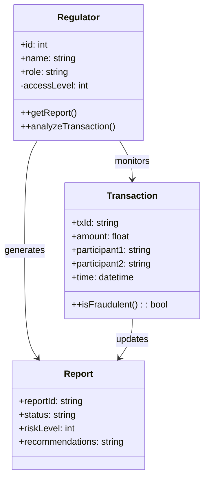
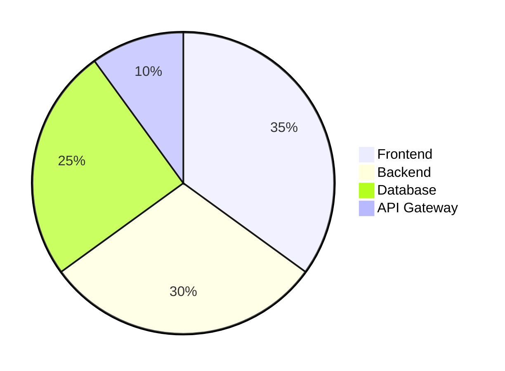
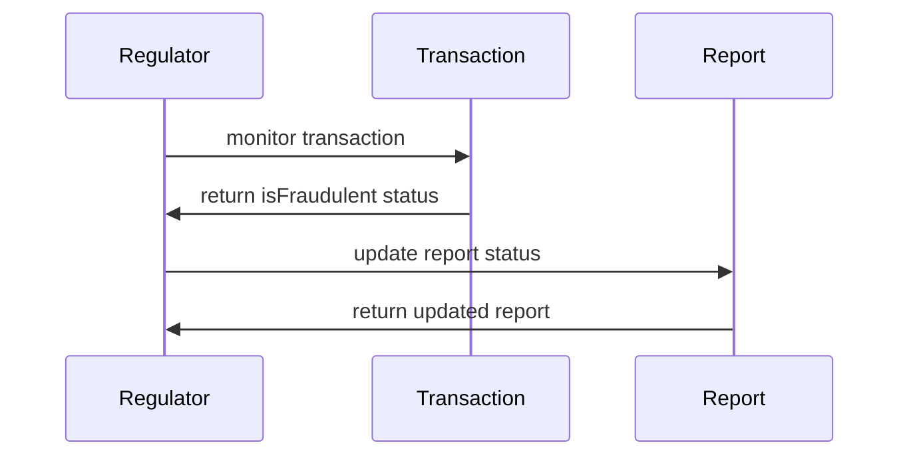

                 

<think>
好的，我现在需要撰写一篇关于《金融监管科技解决方案》的技术博客文章。首先，我会按照用户提供的目录大纲来组织内容，确保每个部分都详细且符合要求。我会逐步分析每个章节的内容，确保逻辑清晰，技术细节到位。

### 第一部分: 金融监管科技概述

#### 第1章: 金融监管科技的背景与意义

##### 1.1 什么是金融监管科技

**1.1.1 金融监管的基本概念**

金融监管是指通过法律法规和制度，对金融机构的经营行为进行监督和管理，以维护金融市场的稳定和投资者的利益。传统的金融监管通常依赖于人工审查和线下流程，效率较低且容易出错。

**1.1.2 监管科技（RegTech）的定义与特点**

监管科技（RegTech）是利用技术创新来提升金融监管效率和效果的新兴领域。其特点包括自动化、智能化、实时监控和数据驱动决策。

**1.1.3 监管科技与金融科技（FinTech）的区别与联系**

FinTech主要关注金融产品和服务的创新，而RegTech则专注于监管过程的优化。两者相辅相成，共同推动金融行业的数字化转型。

##### 1.2 金融监管科技的发展背景

**1.2.1 传统金融监管的痛点与挑战**

传统监管方式存在效率低下、成本高昂、信息不对称等问题，难以应对日益复杂的金融环境。

**1.2.2 数字化转型对金融监管的影响**

随着云计算、大数据和人工智能等技术的发展，金融监管逐渐从线下转向线上，提高了监管的实时性和准确性。

**1.2.3 监管科技在金融行业的应用前景**

RegTech的应用前景广阔，尤其是在风险控制、合规管理和实时监控方面具有巨大潜力。

##### 1.3 监管科技的核心价值

**1.3.1 提高监管效率**

通过自动化和智能化技术，RegTech显著提高了监管效率，减少了人为错误。

**1.3.2 降低合规成本**

企业通过RegTech工具可以更轻松地遵守法规，降低合规成本。

**1.3.3 促进金融创新与风险管理**

RegTech不仅帮助金融机构合规，还促进了金融产品的创新，并加强了风险管控能力。

#### 第2章: 监管科技的关键技术与应用场景

##### 2.1 监管科技的核心技术

**2.1.1 区块链技术在监管中的应用**

区块链技术通过去中心化和不可篡改的特性，提高了金融数据的安全性和透明度。

**2.1.2 人工智能在风险监控中的应用**

人工智能能够实时分析大量数据，识别潜在风险，提高监管的及时性和准确性。

**2.1.3 大数据技术在监管分析中的应用**

大数据技术帮助监管机构从海量数据中提取有价值的信息，支持决策。

**2.1.4 云计算在监管数据处理中的应用**

云计算提供了弹性扩展的存储和计算能力，支持监管数据的实时处理和分析。

##### 2.2 监管科技的主要应用场景

**2.2.1 反洗钱（AML）与反恐怖融资（CTF）**

通过AI和大数据分析，RegTech能够有效识别和阻止洗钱和恐怖融资行为。

**2.2.2 金融风险管理与合规**

RegTech工具帮助机构实时监控和评估风险，确保合规。

**2.2.3 证券市场监管与交易监控**

利用区块链和AI技术，RegTech可以实时监控证券交易，确保市场的公平性和透明性。

**2.2.4 数字货币与区块链监管**

RegTech帮助监管机构追踪和管理数字货币交易，防止非法活动。

### 第二部分: 监管科技的核心技术与算法原理

#### 第3章: 区块链技术在监管中的应用

##### 3.1 区块链技术概述

**3.1.1 区块链的基本概念与工作原理**

区块链是一种分布式账本技术，通过共识机制和加密算法保证数据的安全和一致性。

**3.1.2 区块链的共识机制（PoW, PoS, BFT等）**

不同的共识机制有不同的优缺点，适用于不同的应用场景。

**3.1.3 区块链的去中心化特性**

去中心化使得数据不易被篡改，提高了系统的安全性。

##### 3.2 区块链在金融监管中的应用场景

**3.2.1 供应链金融监管**

区块链技术可以追踪供应链中的资金流动，确保透明和可追溯。

**3.2.2 数字资产监管**

通过区块链技术，监管机构可以实时监控数字资产的交易活动，防止洗钱等违法行为。

**3.2.3 交易透明化与可追溯性**

区块链确保每笔交易的可追溯性，便于监管机构进行事后审查。

##### 3.3 区块链监管的算法原理

**3.3.1 区块链共识算法的数学模型**

共识算法如PoW（工作量证明）涉及复杂的数学计算，确保网络的安全性。

**3.3.2 智能合约的执行流程**

智能合约通过预定义的规则自动执行交易，减少人为干预。

**3.3.3 区块链网络的去中心化架构**

去中心化的架构使得数据分布存储，提高了系统的容错性和抗攻击性。

#### 第4章: 人工智能在监管中的应用

##### 4.1 人工智能技术概述

**4.1.1 机器学习的基本原理**

机器学习通过训练数据，让模型具备识别和预测的能力。

**4.1.2 深度学习的核心**

深度学习通过多层神经网络，能够处理复杂的数据模式。

##### 4.2 人工智能在风险监控中的应用

**4.2.1 风险识别与预警**

通过分析历史数据和实时数据，AI系统能够识别潜在风险并发出预警。

**4.2.2 自动化合规检查**

AI算法可以自动检查企业的财务报表，确保其符合法规要求。

**4.2.3 交易行为分析**

AI能够分析交易行为，识别异常交易模式，防止欺诈和洗钱。

##### 4.3 人工智能监管的算法原理

**4.3.1 机器学习模型的训练过程**

从数据收集、预处理到模型训练，每个步骤都需要精心设计。

**4.3.2 深度学习的网络结构**

复杂的网络结构使得深度学习能够捕捉到数据中的细微特征。

**4.3.3 自然语言处理在文本分析中的应用**

NLP技术能够从文本中提取有用信息，辅助监管决策。

### 系统分析与架构设计方案

#### 问题场景介绍

为了实现高效的金融监管，我们设计了一个基于区块链和AI的监管平台，用于实时监控交易活动，识别风险，并生成合规报告。

#### 系统功能设计

**领域模型（使用Mermaid类图）**



#### 系统架构设计

**架构图（使用Mermaid）**



#### 系统接口设计

**API接口**

- `/api/v1/transaction/monitor`: 监控交易接口
- `/api/v1/report/generate`: 生成监管报告接口

#### 系统交互设计

**交互流程（使用Mermaid序列图）**



### 项目实战

#### 环境安装

安装Python、Jupyter Notebook、TensorFlow和区块链框架（如Ethereum）。

#### 核心代码实现

```python
import tensorflow as tf
from tensorflow.keras import layers
import pandas as pd
import numpy as np

# 加载数据
data = pd.read_csv('transactions.csv')

# 数据预处理
X = data.drop('is_fraud', axis=1).values
y = data['is_fraud'].values

# 构建模型
model = tf.keras.Sequential([
    layers.Dense(64, activation='relu'),
    layers.Dense(1, activation='sigmoid')
])

# 编译模型
model.compile(optimizer='adam', loss='binary_crossentropy', metrics=['accuracy'])

# 训练模型
model.fit(X, y, epochs=10, batch_size=32)

# 预测
new_transaction = pd.DataFrame({'amount': [1000.0], 'participant1': ['A'], 'participant2': ['B']})
new_transaction = new_transaction.values
prediction = model.predict(new_transaction)
print(prediction)
```

### 总结

通过本文的详细讲解，我们了解了监管科技的核心技术与应用场景，以及如何利用区块链和人工智能技术来提升金融监管的效率和准确性。未来，随着技术的不断进步，监管科技将在金融行业中发挥更大的作用。

---

作者：AI天才研究院 & 禅与计算机程序设计艺术

