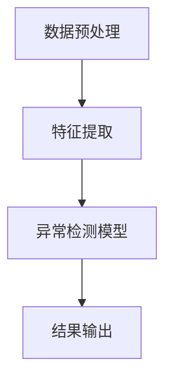
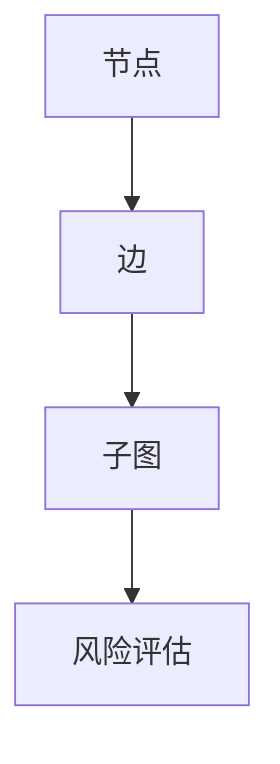
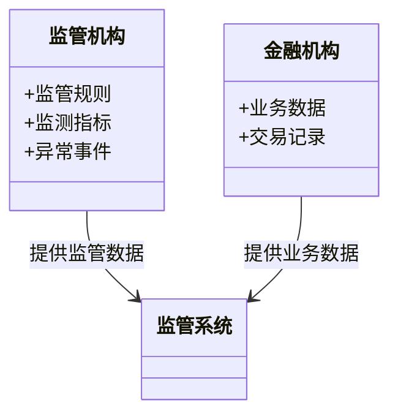
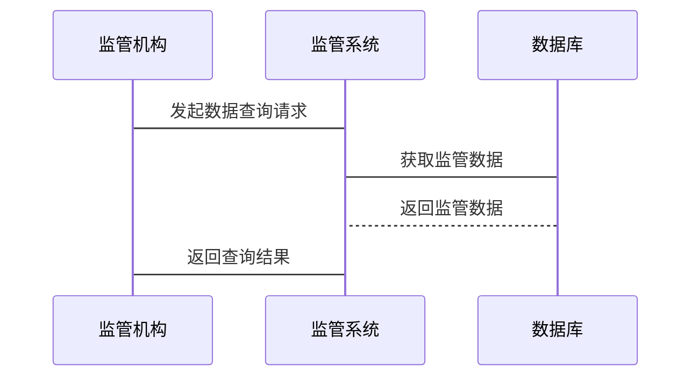

                 


# 金融监管科技解决方案设计

> 关键词：金融监管科技，监管科技，金融科技，数据驱动，智能监管，风险控制

> 摘要：本文旨在探讨金融监管科技的解决方案设计，从背景、核心概念到算法原理、系统架构，再到项目实战，全面解析如何利用技术创新实现高效、智能的金融监管。通过详细的技术分析和实际案例，为金融机构和监管机构提供可落地的解决方案。

---

## 第1章: 金融监管科技的背景与问题背景

### 1.1 金融监管科技的背景

#### 1.1.1 传统金融监管的局限性
传统金融监管依赖人工审核和静态规则，存在效率低、覆盖面有限、难以应对新型金融产品和模式等问题。

#### 1.1.2 金融科技的发展与挑战
随着区块链、人工智能、大数据等技术的快速发展，金融机构在产品创新和服务效率上大幅提升，但同时也带来了新的合规和风险管理挑战。

#### 1.1.3 监管科技的兴起与意义
监管科技（RegTech）作为新兴领域，利用技术创新提升监管效率、降低成本、增强合规能力，成为金融行业的重要发展方向。

### 1.2 问题背景与问题描述

#### 1.2.1 金融机构面临的合规挑战
金融机构需要应对日益复杂的监管要求，包括反洗钱（AML）、反欺诈、数据隐私保护等，合规成本不断上升。

#### 1.2.2 监管机构的效率瓶颈
传统监管方式效率低下，难以覆盖所有金融机构和业务场景，监管资源有限，容易出现监管盲区。

#### 1.2.3 金融创新与风险平衡的矛盾
金融创新加速，但风险管理能力未能同步提升，导致系统性风险增加。

### 1.3 问题解决与边界外延

#### 1.3.1 监管科技的核心目标
通过技术创新，实现监管自动化、智能化，提升监管效率和准确性。

#### 1.3.2 解决方案的边界与范围
聚焦于监管合规、风险监控、数据共享等领域，边界清晰，避免过度扩展。

#### 1.3.3 监管科技与金融科技的协同关系
监管科技为金融科技创新提供合规支持，金融科技为监管科技提供技术手段，两者相辅相成。

### 1.4 核心概念与组成要素

#### 1.4.1 监管科技的定义与属性
监管科技是利用新技术提升监管效率和效果的工具和方法，具有数据驱动、智能化、实时性等属性。

#### 1.4.2 核心要素的组成与功能
- **数据源**：提供监管所需的数据，包括交易数据、客户信息、业务日志等。
- **智能算法**：用于数据处理、模式识别、异常检测等。
- **监管系统**：整合数据源和智能算法，提供监管工具和可视化界面。

#### 1.4.3 概念结构与系统架构
监管科技解决方案由数据层、算法层、系统层组成，形成完整的监管生态系统。

---

## 第2章: 核心概念与联系

### 2.1 核心概念原理

#### 2.1.1 监管科技的三要素模型
- 数据源：监管的基础，包括结构化和非结构化数据。
- 智能算法：核心引擎，负责数据处理和分析。
- 监管系统：用户界面和工具，实现监管目标。

#### 2.1.2 数据驱动的监管模式
通过实时数据分析，识别风险点，实现动态监管。

#### 2.1.3 智能化监管工具的原理
利用机器学习、自然语言处理等技术，自动识别异常行为和风险。

### 2.2 核心概念属性对比

| 概念       | 实时性 | 完整性 | 标准性 |
|------------|--------|--------|--------|
| 数据源     | 高     | 高     | 中     |
| 智能算法   | 高     | 中     | 高     |
| 监管系统   | 高     | 高     | 高     |

### 2.3 ER实体关系图

```mermaid
erd
    监管机构 --|{many}--> 监管规则
    金融机构 --|{many}--> 业务数据
    监管系统 --|{many}--> 监测指标
    监管数据 --|{many}--> 异常事件
```

---

## 第3章: 监管科技的核心算法与数学模型

### 3.1 算法原理

#### 3.1.1 异常检测算法



#### 3.1.2 基于图的网络分析



### 3.2 数学模型与公式

#### 3.2.1 异常检测模型

$$ P(x|y) = \prod_{i=1}^{n} P(x_i|y) $$

#### 3.2.2 网络分析模型

$$ C = \sum_{i=1}^{n} w_i \cdot x_i $$

### 3.3 算法实现

#### 3.3.1 Python代码示例

```python
def detect_anomaly(data):
    # 数据预处理
    processed_data = preprocess(data)
    # 特征提取
    features = extract_features(processed_data)
    # 异常检测
    model = train_model(features)
    return model.predict(features)
```

---

## 第4章: 系统分析与架构设计

### 4.1 问题场景介绍

金融机构和监管机构面临数据分散、监管效率低、合规成本高等问题，需要通过技术手段实现高效监管。

### 4.2 系统功能设计

#### 4.2.1 领域模型



#### 4.2.2 系统架构设计


### 4.3 接口设计与交互

#### 4.3.1 系统接口设计

- API接口：提供数据查询、异常检测、风险评估等功能。

#### 4.3.2 交互设计



---

## 第5章: 项目实战

### 5.1 环境安装

安装Python、Jupyter Notebook、TensorFlow、Pandas等工具。

### 5.2 系统核心实现

```python
import pandas as pd
from sklearn.ensemble import IsolationForest

def main():
    # 加载数据
    data = pd.read_csv('transactions.csv')
    # 数据预处理
    processed_data = data.dropna()
    # 特征提取
    features = processed_data[['amount', 'time']]
    # 训练模型
    model = IsolationForest(random_state=42).fit(features)
    # 预测异常
    anomalies = model.predict(features)
    # 输出结果
    print('异常交易检测结果:', anomalies)

if __name__ == "__main__":
    main()
```

### 5.3 代码解读与分析

- 数据预处理：删除缺失值。
- 特征提取：选取金额和时间作为特征。
- 模型训练：使用孤立森林算法检测异常。

### 5.4 实际案例分析

分析银行交易数据，识别异常交易行为，降低欺诈风险。

### 5.5 项目小结

通过实际案例，验证监管科技解决方案的有效性，为后续优化提供数据支持。

---

## 第6章: 最佳实践与小结

### 6.1 最佳实践 tips

- 数据质量：确保数据的完整性和准确性。
- 技术选型：根据需求选择合适的算法和工具。
- 安全性：保护数据隐私，确保系统安全。

### 6.2 小结

金融监管科技通过技术创新，显著提升了监管效率和准确性，为金融机构和监管机构提供了强有力的支持。

### 6.3 注意事项

- 确保系统可扩展性，方便后续功能添加。
- 定期更新模型，适应新的监管要求和风险变化。

### 6.4 拓展阅读

- 《FinTech与RegTech的协同发展》
- 《基于图神经网络的金融风险防控》

---

作者：AI天才研究院/AI Genius Institute & 禅与计算机程序设计艺术 /Zen And The Art of Computer Programming

