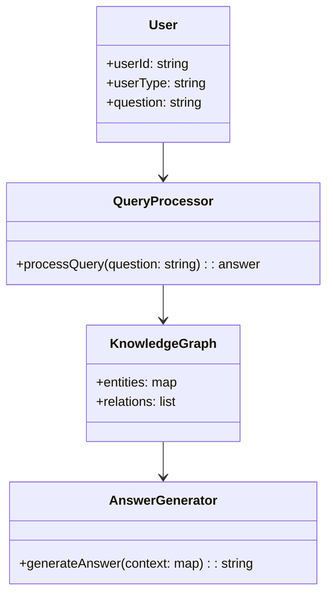
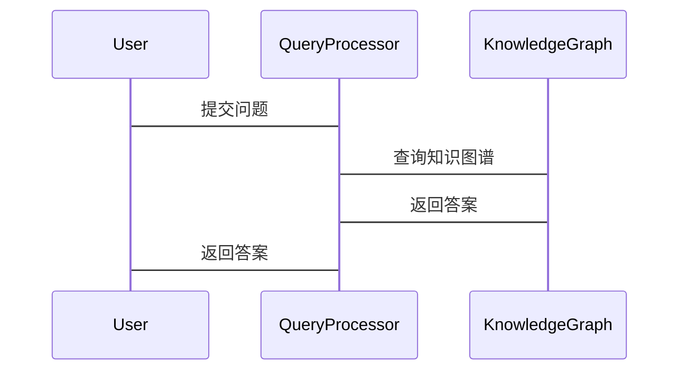

                 


# 《金融知识图谱在智能问答中的应用》

## 关键词：金融知识图谱，智能问答，自然语言处理，图数据库，实体识别

## 摘要：  
金融知识图谱通过构建金融领域的结构化知识网络，为智能问答系统提供了强大的语义理解和推理能力。本文详细探讨了金融知识图谱的构建方法、智能问答的核心算法，以及两者在金融领域的深度结合。文章结合实际案例，分析了系统架构设计、算法实现和项目实战，为读者提供了一套完整的解决方案。

---

# 第一部分：金融知识图谱与智能问答的背景与基础

## 第1章：金融知识图谱与智能问答概述

### 1.1 金融知识图谱的定义与特点

#### 1.1.1 知识图谱的基本概念  
知识图谱是一种以图结构形式表示知识的语义网络，由节点（实体）和边（关系）组成。例如，节点可以表示“公司A”，边可以表示“公司A属于行业B”。

#### 1.1.2 金融知识图谱的独特性  
金融知识图谱专注于金融领域的实体和关系，例如：
- 实体：公司、股票、基金、市场。
- 关系：公司A发行了股票B，基金C投资于股票D。

#### 1.1.3 金融知识图谱的构建方法  
构建方法包括数据收集、实体识别、关系抽取和知识融合。

---

### 1.2 智能问答系统的基本原理

#### 1.2.1 智能问答的定义  
智能问答系统是一种能够理解用户问题并生成准确答案的自动化系统，例如“哪些公司属于科技行业？”

#### 1.2.2 基于知识图谱的问答模式  
基于知识图谱的问答通过图结构进行语义理解，例如通过图遍历算法找到答案。

#### 1.2.3 智能问答系统的应用场景  
金融领域的常见场景包括：投资建议、市场分析、公司信息查询。

---

### 1.3 金融知识图谱与智能问答的结合

#### 1.3.1 金融领域的问答挑战  
金融领域数据复杂，涉及多种实体和关系，需要语义理解能力。

#### 1.3.2 知识图谱在金融问答中的优势  
知识图谱能够提供语义理解和上下文推理能力。

#### 1.3.3 金融知识图谱在智能问答中的核心作用  
通过知识图谱，智能问答系统能够准确理解用户意图并提供相关答案。

---

## 第2章：金融知识图谱的构建与管理

### 2.1 金融知识图谱的构建流程

#### 2.1.1 数据收集与清洗  
从多种来源（如新闻、财报）收集数据，并进行清洗和预处理。

#### 2.1.2 实体识别与抽取  
使用NLP技术识别文本中的实体，例如公司名称。

#### 2.1.3 关系抽取与构建  
识别实体之间的关系，例如“公司A投资了项目B”。

#### 2.1.4 知识融合与优化  
整合多来源数据，消除冗余和矛盾。

---

### 2.2 金融知识图谱的存储与管理

#### 2.2.1 图数据库的选择与使用  
常用图数据库包括Neo4j和Neo4j。

#### 2.2.2 知识图谱的存储结构  
存储结构包括节点和边的属性。

#### 2.2.3 知识图谱的更新与维护  
定期更新数据以保持图谱的准确性。

---

### 2.3 金融知识图谱的可视化

#### 2.3.1 知识图谱的可视化工具  
常用工具包括Gephi和Cytoscape。

#### 2.3.2 知识图谱的可视化方法  
通过图表展示实体和关系。

#### 2.3.3 可视化在金融分析中的应用  
帮助用户理解复杂的金融关系。

---

## 第3章：基于知识图谱的问答算法

### 3.1 基于向量的问答模型

#### 3.1.1 向量空间模型的基本原理  
向量空间模型通过将文本表示为向量，计算相似度。

#### 3.1.2 金融知识图谱中的向量表示  
使用Word2Vec对金融实体进行向量表示。

#### 3.1.3 基于向量的相似度计算  
通过余弦相似度计算向量之间的相似性。

---

### 3.2 基于图结构的问答算法

#### 3.2.1 图遍历算法在问答中的应用  
使用DFS或BFS遍历知识图谱。

#### 3.2.2 基于路径的问答策略  
通过路径长度和权重选择最优答案。

#### 3.2.3 图结构中的最短路径算法  
使用Dijkstra算法找到最短路径。

---

### 3.3 知识图谱与问答的结合算法

#### 3.3.1 基于知识图谱的实体链接  
将用户问题中的实体与知识图谱中的节点对齐。

#### 3.3.2 基于知识图谱的上下文理解  
通过图结构理解上下文关系。

#### 3.3.3 基于知识图谱的答案生成  
通过图遍历生成准确答案。

---

## 第4章：系统分析与架构设计

### 4.1 问题场景介绍

#### 4.1.1 金融智能问答的典型场景  
例如：查询公司信息、分析市场趋势。

#### 4.1.2 知识图谱在金融问答中的应用需求  
支持复杂语义理解和多轮对话。

---

### 4.2 项目介绍

#### 4.2.1 项目目标  
构建一个基于知识图谱的智能问答系统。

#### 4.2.2 项目范围  
涵盖数据收集、图谱构建、算法实现和系统集成。

#### 4.2.3 项目关键成功因素  
数据质量、算法优化和系统稳定性。

---

### 4.3 系统功能设计

#### 4.3.1 领域模型设计（Mermaid类图）



---

### 4.4 系统架构设计（Mermaid架构图）


---

### 4.5 系统接口设计

#### 4.5.1 接口描述  
用户输入问题，系统返回答案。

#### 4.5.2 接口实现  
通过RESTful API实现交互。

---

### 4.6 系统交互（Mermaid序列图）



---

## 第5章：项目实战

### 5.1 环境安装

#### 5.1.1 安装Python环境  
使用Anaconda或virtualenv创建虚拟环境。

#### 5.1.2 安装相关库  
安装Neo4j驱动和NLP库（如spaCy）。

---

### 5.2 系统核心实现源代码

#### 5.2.1 数据处理代码

```python
import neo4j
from neo4j.exceptions importNeo4jException

def load_data(neo4j_uri, neo4j_user, neo4j_password):
    driver = neo4j.Driver(neo4j_uri, auth=(neo4j_user, neo4j_password))
    session = driver.session()
    # 加载数据到知识图谱
    return session
```

---

#### 5.2.2 问答系统代码

```python
def answer_question(question):
    # 连接知识图谱
    session = load_data(...)
    # 执行查询
    result = session.read_transaction(..., question)
    return result
```

---

### 5.3 案例分析与详细讲解

#### 5.3.1 案例分析  
例如：用户询问“哪些科技公司最近发布了新产品？”

#### 5.3.2 详细讲解  
系统通过知识图谱找到相关实体，并生成答案。

---

## 第6章：最佳实践、小结与注意事项

### 6.1 最佳实践

#### 6.1.1 数据质量管理  
确保数据准确性和完整性。

#### 6.1.2 算法优化  
不断优化问答算法以提高准确率。

#### 6.1.3 系统维护  
定期更新知识图谱和优化系统性能。

---

### 6.2 小结

本文详细探讨了金融知识图谱和智能问答的核心概念、算法原理和系统架构设计，结合实际案例分析了项目实战。

---

### 6.3 注意事项

- 数据隐私问题需要高度重视。
- 系统性能优化需要持续关注。
- 知识图谱的构建和维护需要专业团队支持。

---

## 第7章：拓展阅读

### 7.1 深入学习资源

- 推荐书籍：《知识图谱：概念、方法与应用》。
- 推荐博客：[知识图谱与智能问答](https://example.com)

---

## 作者：AI天才研究院/AI Genius Institute & 禅与计算机程序设计艺术 /Zen And The Art of Computer Programming

---

### 结语

通过本文的学习，读者可以深入了解金融知识图谱在智能问答中的应用，并掌握相关技术的实现方法。

