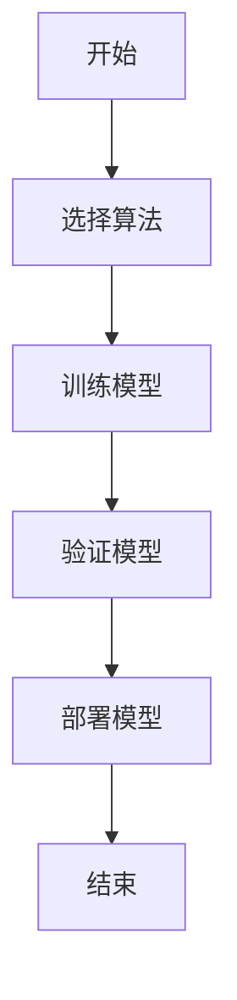
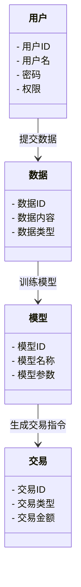
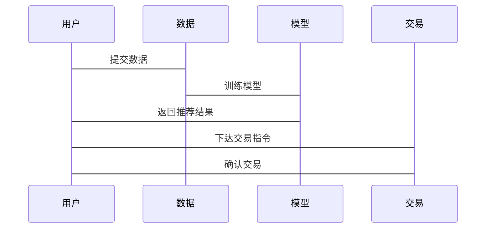

                 


# 《金融科技创新孵化平台》

## 关键词：金融科技创新、孵化平台、人工智能、区块链、系统架构、项目实战

## 摘要：  
《金融科技创新孵化平台》系统地探讨了金融科技创新的背景、核心概念、算法原理、系统架构及其实战应用。通过详细分析人工智能、大数据、区块链等关键技术在金融领域的应用，结合实际案例，为读者提供从理论到实践的全面指导。文章还总结了金融科技创新平台的最佳实践和未来发展方向。

---

# 第一部分: 金融科技创新孵化平台概述

## 第1章: 金融科技创新孵化平台的背景与意义

### 1.1 金融科技创新的背景

#### 1.1.1 金融科技的发展历程
金融科技（Fintech）作为金融与科技的结合体，经历了从传统金融到数字化转型的演变。随着互联网、大数据、人工智能等技术的快速发展，金融科技在全球范围内掀起新一轮的创新浪潮。从早期的电子支付到如今的区块链、智能投顾，金融科技正在重塑金融行业的商业模式和业务流程。

#### 1.1.2 金融科技创新的必要性
传统金融行业面临效率低下、成本高昂、客户体验差等问题。通过科技创新，金融机构可以实现业务流程的优化、服务模式的创新以及风险管理能力的提升。金融科技创新不仅能够提高效率，还能为用户提供更优质的服务。

#### 1.1.3 孵化平台在金融创新中的作用
金融科技创新孵化平台是连接技术创新与金融应用的桥梁。它为金融机构、科技企业和创业者提供了一个协作的平台，加速了金融创新的落地和推广。通过孵化平台，金融机构可以快速试错，科技企业可以更好地理解金融需求，从而推动整个行业的进步。

### 1.2 金融科技创新孵化平台的定义与特点

#### 1.2.1 平台的定义
金融科技创新孵化平台是一个整合了技术、数据、场景和资本的综合性平台。它通过提供技术支持、数据服务、业务场景和资金支持，帮助金融机构和科技企业实现创新。

#### 1.2.2 平台的核心特点
- **开放性**：平台面向多方参与者，包括金融机构、科技公司、创业者等，提供开放的协作环境。
- **数据驱动**：平台整合了多源数据，为创新提供数据支持。
- **场景化**：平台聚焦于具体的金融场景，确保技术创新能够落地。
- **高效性**：通过自动化工具和流程，提高创新效率。

#### 1.2.3 平台与传统金融机构的区别
传统的金融机构往往受限于内部资源和流程，创新速度较慢。而孵化平台通过引入外部资源和技术，能够快速实现创新，降低试错成本。

### 1.3 金融科技创新的现状与趋势

#### 1.3.1 当前金融科技的发展现状
当前，金融科技已经渗透到支付、借贷、投资、保险等多个领域。区块链、人工智能、大数据等技术正在改变金融行业的运作方式。

#### 1.3.2 未来金融科技的发展趋势
未来，金融科技将更加注重智能化、数字化和生态化。金融机构将通过开放平台和生态系统，实现与科技公司的深度合作。

#### 1.3.3 孵化平台在行业中的定位
孵化平台将成为金融科技生态中的重要枢纽，连接技术创新与实际应用，推动金融行业的数字化转型。

---

## 第2章: 金融科技创新的核心概念与联系

### 2.1 金融科技创新的关键技术

#### 2.1.1 人工智能技术
人工智能（AI）在金融领域的应用广泛，包括智能投顾、风险评估、欺诈检测等。通过机器学习算法，金融机构可以更精准地预测市场趋势和客户行为。

#### 2.1.2 大数据技术
大数据技术帮助金融机构从海量数据中提取有价值的信息，优化决策和风险管理。通过数据挖掘和分析，金融机构能够更好地理解客户需求，提供个性化服务。

#### 2.1.3 区块链技术
区块链技术通过去中心化和不可篡改的特点，解决了金融交易中的信任问题。它在支付清算、供应链金融等领域具有广泛应用潜力。

#### 2.1.4 云计算技术
云计算为金融机构提供了弹性计算资源和高效的数据存储解决方案。通过云平台，金融机构可以快速搭建系统，实现业务的弹性扩展。

### 2.2 核心概念的对比分析

#### 2.2.1 技术特点对比表格

| 技术      | 特点                        |
|-----------|-----------------------------|
| 人工智能  | 数据驱动、精准预测          |
| 大数据    | 处理海量数据、提取价值      |
| 区块链    | 去中心化、不可篡改          |
| 云计算     | 弹性扩展、高效计算          |

#### 2.2.2 技术之间的关系
人工智能依赖大数据进行训练，而大数据需要通过云计算进行存储和处理。区块链则为数据的安全性和信任性提供保障。四者相辅相成，共同推动金融创新。

#### 2.2.3 技术在金融中的应用场景
- **人工智能**：智能投顾、信用评估
- **大数据**：精准营销、风险控制
- **区块链**：支付清算、供应链金融
- **云计算**：弹性计算、数据存储

### 2.3 ER实体关系图

```mermaid
erdiagram
actor 用户;
actor 金融机构;
actor 科技企业;
actor 创业者;
actor 监管机构;

用户 --> 金融机构: 提交创新需求
金融机构 --> 科技企业: 委托开发
科技企业 --> 创业者: 提供技术支持
创业者 --> 监管机构: 提交合规申请
```

---

## 第3章: 金融科技创新的算法原理

### 3.1 机器学习算法

#### 3.1.1 机器学习的基本原理
机器学习是一种通过数据训练模型的技术。模型通过学习数据中的模式，实现对新数据的预测和分类。

#### 3.1.2 常见机器学习算法
- **监督学习**：用于分类和回归问题
- **无监督学习**：用于聚类和降维
- **强化学习**：用于策略优化

#### 3.1.3 机器学习在金融中的应用
- **智能投顾**：根据客户风险偏好推荐投资组合
- **欺诈检测**：通过异常检测识别 fraudulent transactions

### 3.2 区块链共识算法

#### 3.2.1 区块链的基本原理
区块链通过分布式账本和共识机制，实现数据的安全性和一致性。

#### 3.2.2 共识算法的种类
- **工作量证明（PoW）**：比特币采用的共识机制
- **权益证明（PoS）**：以太坊采用的共识机制
- **实用拜占庭容错（PBFT）**：适用于企业级区块链

#### 3.2.3 共识算法的优缺点
- **优点**：去中心化、安全性高
- **缺点**：计算成本高、效率较低

### 3.3 算法流程图



---

## 第4章: 金融科技创新的系统分析与架构设计

### 4.1 问题场景介绍

#### 4.1.1 项目介绍
我们以一个智能投顾平台为例，展示如何通过技术手段实现金融创新。

#### 4.1.2 系统功能设计
- **用户管理**：注册、登录、权限管理
- **数据处理**：数据采集、清洗、建模
- **智能推荐**：根据用户风险偏好推荐投资组合
- **交易执行**：用户下单、交易确认、订单记录

#### 4.1.3 系统架构设计


#### 4.1.4 系统接口设计
- **用户接口**：RESTful API
- **数据接口**：数据库连接
- **交易接口**：API网关

#### 4.1.5 系统交互流程


---

## 第5章: 金融科技创新的项目实战

### 5.1 环境安装

#### 5.1.1 系统需求
- 操作系统：Linux/Windows/MacOS
- Python版本：3.6+
- 其他依赖：numpy、pandas、scikit-learn

#### 5.1.2 安装步骤
```bash
pip install numpy pandas scikit-learn
```

### 5.2 核心实现

#### 5.2.1 数据处理
```python
import pandas as pd
data = pd.read_csv('data.csv')
data.head()
```

#### 5.2.2 模型训练
```python
from sklearn.model_selection import train_test_split
from sklearn.ensemble import RandomForestClassifier
X = data.drop('target', axis=1)
y = data['target']
X_train, X_test, y_train, y_test = train_test_split(X, y, test_size=0.2)
model = RandomForestClassifier().fit(X_train, y_train)
```

#### 5.2.3 结果展示
```python
print(model.score(X_test, y_test))
```

### 5.3 案例分析

#### 5.3.1 数据分析结果
通过模型训练，我们发现用户的交易行为与市场波动高度相关。

#### 5.3.2 模型优化
通过调整模型参数，我们可以进一步提高模型的准确率。

### 5.4 项目小结
本次实战通过机器学习算法，展示了如何通过技术手段实现智能投顾。通过数据处理、模型训练和结果分析，我们验证了技术的有效性。

---

## 第6章: 总结与展望

### 6.1 总结
金融科技创新孵化平台通过整合技术、数据和场景，为金融机构和科技企业提供了协作的平台。通过人工智能、大数据、区块链等技术的应用，金融行业正在经历一场深刻的变革。

### 6.2 未来展望
未来，金融科技创新将更加注重智能化和生态化。金融机构将通过开放平台和生态系统，实现与科技公司的深度合作。同时，监管科技（RegTech）也将成为未来的重要方向，帮助金融机构实现合规和风险管理。

---

# 作者：AI天才研究院/AI Genius Institute & 禅与计算机程序设计艺术 /Zen And The Art of Computer Programming

