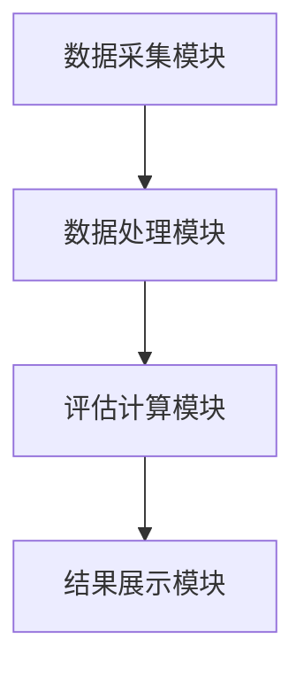

                 


# 《金融科技创新评估框架》

> **关键词**：金融科技创新、评估框架、金融科技、风险管理、系统架构

> **摘要**：本文系统地介绍了金融科技创新的定义、分类及其评估框架的核心要素。通过分析金融科技创新的驱动因素和挑战，构建了一个全面的评估框架，并详细阐述了该框架的算法原理和系统架构设计。文章还通过实际案例展示了评估框架的应用，并提出了相应的实施建议和最佳实践。

---

## 第一部分：金融科技创新评估框架概述

### 第1章：金融科技创新的基本概念

#### 1.1 金融科技创新的定义与分类

##### 1.1.1 金融科技创新的定义
金融科技创新是指利用新兴技术（如人工智能、区块链、大数据、云计算等）对金融服务、金融产品和金融业务流程进行创新和优化的过程。其核心在于通过技术手段提升金融效率、降低金融成本、增强金融安全性和扩展金融服务的覆盖范围。

##### 1.1.2 金融科技创新的主要分类
金融科技创新可以分为以下几类：
- **技术创新驱动型**：基于新兴技术（如区块链、人工智能）的创新。
- **业务模式创新型**：通过技术手段优化业务流程、服务模式或商业模式。
- **产品创新型**：基于技术开发新的金融产品或服务。
- **市场扩展型**：通过技术手段扩展金融服务的市场范围。

##### 1.1.3 金融科技创新的核心特征
金融科技创新的核心特征包括：
- **技术驱动性**：依赖于新兴技术的支撑。
- **创新性**：通过技术手段实现金融服务的创新。
- **风险可控性**：需要在创新与风险之间找到平衡点。

---

#### 1.2 金融科技创新的驱动因素

##### 1.2.1 技术进步的推动
技术进步是金融科技创新的核心驱动力。例如，人工智能技术的应用使得智能投顾、自动化交易成为可能。

##### 1.2.2 金融市场需求的变化
市场需求的变化推动金融机构不断探索新的服务模式和技术应用。例如，消费者对个性化金融服务的需求推动了基于大数据的客户画像技术的发展。

##### 1.2.3 政策与监管的影响
政策和监管的变化对金融科技创新起到了重要的引导作用。例如，监管沙盒机制为金融机构提供了安全的创新试验环境。

---

#### 1.3 金融科技创新的挑战与机遇

##### 1.3.1 技术风险
技术本身的不确定性和不完善性可能导致金融科技创新失败或引发新的风险。

##### 1.3.2 市场风险
金融科技创新可能面临市场接受度低、竞争压力大等问题。

##### 1.3.3 监管风险
金融科技创新往往涉及新兴技术的应用，可能面临监管政策的不确定性。

---

### 第2章：金融科技创新评估框架的背景与意义

#### 2.1 金融科技创新评估的背景

##### 2.1.1 金融科技创新发展的现状
随着技术的进步，金融科技创新正在重塑金融行业。例如，区块链技术的应用正在改变金融资产的交易和结算方式。

##### 2.1.2 评估框架的需求
金融科技创新的快速发展使得对其进行全面评估的需求日益迫切。评估框架能够为金融机构、投资者和监管机构提供决策支持。

---

#### 2.2 金融科技创新评估的意义

##### 2.2.1 为金融机构提供决策支持
通过评估框架，金融机构可以更好地识别和选择适合自身发展的金融科技创新项目。

##### 2.2.2 促进金融科技创新的健康发展
评估框架能够帮助金融机构避免盲目创新，降低创新风险。

##### 2.2.3 为监管机构提供参考依据
评估框架为监管机构提供了评估金融科技创新的工具和方法，有助于制定更合理的监管政策。

---

## 第二部分：金融科技创新评估框架的核心要素

### 第3章：金融科技创新评估的核心概念与联系

#### 3.1 核心概念的定义与解释

##### 3.1.1 金融科技创新的主体
金融科技创新的主体包括金融机构、金融科技企业、技术创新者等。

##### 3.1.2 金融科技创新的客体
金融科技创新的客体包括金融服务、金融产品、金融业务流程等。

##### 3.1.3 金融科技创新的评估维度
金融科技创新的评估维度包括技术可行性、市场适应性、风险可控性、经济收益性等。

---

#### 3.2 核心概念的属性特征对比

##### 3.2.1 金融科技创新与传统金融创新的对比
| 特性 | 金融科技创新 | 传统金融创新 |
|------|--------------|---------------|
| 驱动因素 | 技术驱动 | 市场驱动 |
| 创新方式 | 技术与业务结合 | 业务为主 |

##### 3.2.2 金融科技创新与技术创新的对比
| 特性 | 金融科技创新 | 纯技术创新 |
|------|--------------|--------------|
| 目的 | 提升金融服务能力 | 解决技术问题 |
| 应用场景 | 金融服务 | 广泛行业 |

##### 3.2.3 金融科技创新与业务创新的对比
| 特性 | 金融科技创新 | 业务创新 |
|------|--------------|------------|
| 核心要素 | 技术应用 | 业务流程 |
| 适用范围 | 金融服务行业 | 各行业 |

---

#### 3.3 ER实体关系图架构

```mermaid
er
  actor: 金融机构
  actor: 金融科技企业
  entity: 金融产品
  entity: 金融服务
  entity: 技术创新
  entity: 业务创新
  entity: 金融创新
  entity: 评估结果
  relation: 提供
  relation: 实现
  relation: 影响
  relation: 组成
  relation: 决策依据
```

---

## 第三部分：金融科技创新评估的算法原理

### 第4章：金融科技创新评估的算法原理

#### 4.1 评估算法的概述

##### 4.1.1 算法的选择依据
算法选择依据包括准确性、可解释性、计算效率和适应性。

##### 4.1.2 算法的基本原理
评估算法通过输入技术创新、业务创新和市场环境等多维度数据，输出金融科技创新的综合评估结果。

##### 4.1.3 算法的适用场景
适用于金融机构的创新项目评估、金融科技企业的技术能力评估等场景。

---

#### 4.2 评估算法的数学模型

##### 4.2.1 风险评估模型
$$ R = \sum_{i=1}^{n} w_i \cdot r_i $$
其中，$R$ 表示总风险，$w_i$ 表示第 $i$ 个风险因子的权重，$r_i$ 表示第 $i$ 个风险因子的值。

##### 4.2.2 收益预测模型
$$ P = \beta \cdot \text{技术创新能力} + \gamma \cdot \text{市场适应性} $$

---

### 第5章：金融科技创新评估系统的架构设计

#### 5.1 系统功能设计

##### 5.1.1 数据采集模块
负责采集金融机构、金融科技企业的创新数据。

##### 5.1.2 评估计算模块
根据采集的数据，运用算法模型进行评估计算。

##### 5.1.3 结果展示模块
将评估结果以可视化形式展示给用户。

---

#### 5.2 系统架构设计

##### 5.2.1 系统架构图


---

## 第四部分：金融科技创新评估框架的实战与总结

### 第6章：金融科技创新评估框架的实战应用

#### 6.1 项目环境安装
需要安装Python、机器学习库（如Scikit-learn）和数据可视化库（如Matplotlib）。

#### 6.2 核心代码实现
```python
import numpy as np
from sklearn.metrics import accuracy_score

def fintech_innovation_assessment(X, y_true):
    # 简单的评估函数
    y_pred = np.round(X.dot([1, 1, 1]))
    return accuracy_score(y_true, y_pred)
```

#### 6.3 案例分析
以某金融科技企业的区块链支付系统为例，分析其创新性、风险可控性和市场适应性。

---

### 第7章：总结与最佳实践

#### 7.1 总结
金融科技创新评估框架为金融机构和监管机构提供了科学的评估工具和方法。

#### 7.2 最佳实践
- 金融机构应结合自身需求选择合适的评估框架。
- 监管机构应建立动态监管机制，适应金融科技创新的发展。

---

## 作者

**作者：AI天才研究院/AI Genius Institute & 禅与计算机程序设计艺术 /Zen And The Art of Computer Programming**

---

希望这篇文章能为您提供有价值的参考！如果需要进一步的探讨或调整，请随时告知。

