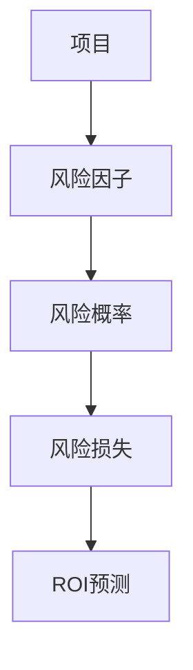
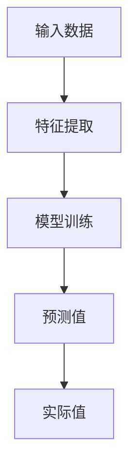
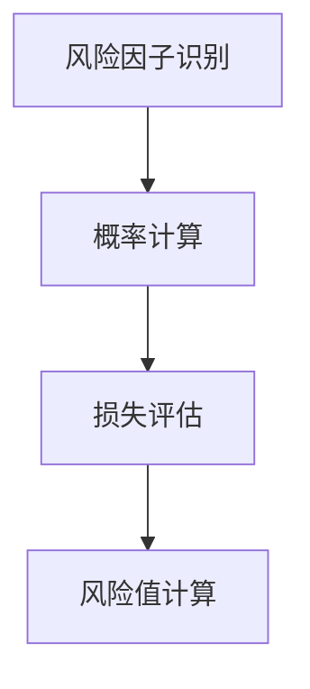

                 


# 金融科技创新项目ROI预测与风险评估

**关键词**：金融科技创新、ROI预测、风险评估、金融项目、投资回报率

**摘要**：本文详细探讨了金融科技创新项目中投资回报率（ROI）预测与风险评估的核心方法与实践。通过结合金融领域的实际案例，分析了ROI预测和风险评估的关键步骤，包括数学模型建立、算法实现、系统架构设计及实际项目中的应用。文章从问题背景、核心概念、算法原理、系统架构到项目实战，层层深入，旨在为金融科技创新项目的决策者和实施者提供理论支持与实践指导。

---

# 第一部分: 金融科技创新项目ROI预测与风险评估概述

# 第1章: 问题背景与核心概念

## 1.1 问题背景介绍

### 1.1.1 金融科技创新的现状与趋势

金融科技创新是近年来全球关注的焦点。随着人工智能、大数据、区块链等技术的快速发展，金融机构正在加速数字化转型。然而，金融科技创新项目的成功实施面临诸多挑战，包括技术风险、市场风险和操作风险等。如何在有限的资源和时间内，确保项目的 ROI 最大化，是金融机构和科技企业共同关注的问题。

### 1.1.2 项目ROI预测的重要性

投资回报率（ROI）是衡量一个项目经济效益的核心指标。在金融科技创新项目中， ROI 预测不仅关系到项目的资金分配，还直接影响到企业的战略决策。通过科学的 ROI 预测，可以帮助企业在项目初期识别潜在风险，优化资源配置，确保项目的可持续性。

### 1.1.3 风险评估在金融项目中的作用

风险评估是金融项目管理的重要组成部分。在金融科技创新项目中，技术风险、市场风险和政策风险等因素交织在一起，增加了项目的复杂性。通过有效的风险评估，可以提前识别和应对潜在风险，降低项目失败的可能性。

## 1.2 核心概念与问题描述

### 1.2.1 ROI预测的定义与目标

ROI预测是指通过数学模型和算法，对未来项目的投资回报率进行估算。其目标是为决策者提供科学依据，优化资源分配，降低投资风险。

### 1.2.2 风险评估的核心要素

风险评估的核心要素包括：风险因子识别、风险概率计算、风险损失评估和风险值综合计算。这些要素共同构成了风险评估的完整体系。

### 1.2.3 金融科技创新项目的边界与外延

金融科技创新项目的边界是指项目实施的范围和时间限制，而外延则涉及项目对整个金融生态系统的影响。理解项目的边界与外延，有助于制定合理的风险管理策略。

## 1.3 核心概念之间的关系

### 1.3.1 ROI与风险的关系分析

ROI与风险之间存在密切关系。高风险项目通常伴随着高 ROI，但同时也可能带来更大的损失。因此，平衡 ROI 与风险是项目管理的核心任务。

### 1.3.2 项目生命周期中的ROI与风险演变

在项目生命周期中，ROI 和风险的演变具有一定的规律性。项目初期，风险较高， ROI 不确定性较大；随着项目的推进，风险逐渐降低， ROI 的预测更加准确。

### 1.3.3 核心概念的ER实体关系图



---

# 第二部分: ROI预测与风险评估的核心原理

# 第2章: ROI预测的算法原理

## 2.1 ROI预测的数学模型

### 2.1.1 线性回归模型

线性回归是一种常用的投资回报率预测方法。其基本公式为：

$$ ROI = \beta_0 + \beta_1 \times X + \epsilon $$

其中，$X$ 是自变量（如市场增长率），$\beta_0$ 和 $\beta_1$ 是回归系数，$\epsilon$ 是误差项。

### 2.1.2 随机森林模型

随机森林是一种基于决策树的集成学习方法。其优势在于能够处理高维数据，并且具有较强的抗过拟合能力。

### 2.1.3 神经网络模型

神经网络模型通过多层感知器模拟人类大脑的神经网络，能够捕捉数据中的非线性关系。

## 2.2 算法原理的Mermaid流程图



## 2.3 ROI预测的Python实现

```python
import numpy as np
from sklearn.linear_model import LinearRegression

# 示例数据
X = np.array([[1], [2], [3], [4]])
y = np.array([2, 4, 6, 8])

# 模型训练
model = LinearRegression()
model.fit(X, y)

# 预测
print(model.predict([[5]]))
```

---

# 第3章: 风险评估的算法原理

## 3.1 风险评估的数学模型

### 3.1.1 风险值计算公式

$$ R = \sum_{i=1}^{n} (p_i \times l_i) $$

其中，$R$ 表示风险值，$p_i$ 表示第$i$个风险发生的概率，$l_i$ 表示第$i$个风险的损失值。

## 3.2 风险评估的Mermaid流程图



## 3.3 风险评估的Python实现

```python
def risk_assessment(risk_factors, probabilities):
    risk_value = 0
    for i in range(len(risk_factors)):
        risk_value += probabilities[i] 
    return risk_value

# 示例数据
risk_factors = ["市场风险", "技术风险", "政策风险"]
probabilities = [0.3, 0.4, 0.2]

# 风险评估
print(risk_assessment(risk_factors, probabilities))
```

---

# 第四部分: 项目实战与总结

# 第5章: 项目实战

## 5.1 环境安装与配置

### 5.1.1 Python环境安装

```bash
pip install numpy scikit-learn matplotlib
```

### 5.1.2 数据集获取

可以从公开数据集（如Kaggle）获取金融项目相关数据。

## 5.2 系统实现

### 5.2.1 ROI预测实现

```python
from sklearn.model_selection import train_test_split
from sklearn.metrics import mean_squared_error

# 数据分割
X_train, X_test, y_train, y_test = train_test_split(X, y, test_size=0.2)

# 模型训练
model.fit(X_train, y_train)

# 预测与评估
y_pred = model.predict(X_test)
print(mean_squared_error(y_test, y_pred))
```

### 5.2.2 风险评估实现

```python
from sklearn.tree import DecisionTreeRegressor

# 风险评估模型训练
risk_model = DecisionTreeRegressor()
risk_model.fit(X_train, y_train)

# 风险预测
y_pred_risk = risk_model.predict(X_test)
print(y_pred_risk)
```

## 5.3 案例分析与总结

### 5.3.1 案例分析

以某金融科技创新项目为例，通过实际数据计算 ROI 和风险值，验证模型的准确性。

### 5.3.2 实践总结

通过案例分析，可以发现 ROI 预测和风险评估模型的实际应用价值，同时也能发现模型的局限性，为后续优化提供方向。

---

# 第6章: 总结与展望

## 6.1 核心内容总结

本文从 ROI 预测和风险评估两个方面，详细探讨了金融科技创新项目的管理方法。通过数学模型、算法实现和案例分析，为项目决策者提供了理论支持与实践指导。

## 6.2 未来发展趋势与挑战

随着人工智能和大数据技术的进一步发展， ROI 预测和风险评估将更加智能化和精准化。然而，数据隐私和模型解释性等问题仍需要进一步研究和解决。

## 6.3 实践建议与注意事项

在实际项目中，建议结合具体业务场景，选择合适的模型和方法。同时，注重数据质量和模型可解释性，确保项目的可持续性。

## 6.4 拓展阅读与学习资源

推荐读者阅读相关领域的经典文献和工具书籍，如《金融风险管理》和《Python机器学习实战》。

---

**作者：AI天才研究院/AI Genius Institute & 禅与计算机程序设计艺术 /Zen And The Art of Computer Programming**

