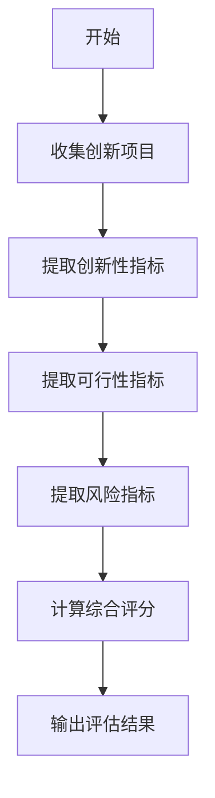
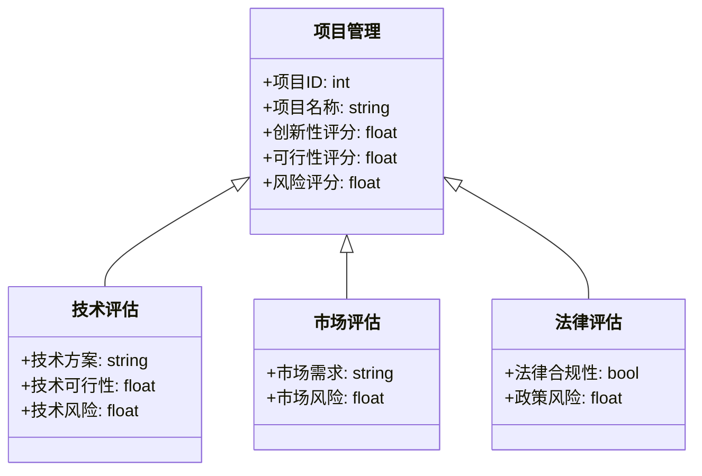
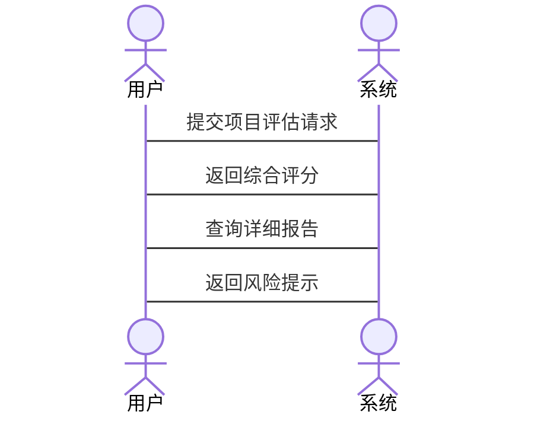

                 


# 《金融科技创新项目评估框架》

## 关键词：金融科技创新、项目评估、技术框架、创新性评估、可行性分析、风险评估

## 摘要：  
随着数字化转型的加速，金融科技创新项目评估成为金融机构和科技公司的重要任务。本文构建了一个系统化的评估框架，涵盖创新性、可行性、风险评估等维度，结合实际案例和系统架构设计，为金融科技创新项目的评估提供了理论支持和实践指导。

---

# 1. 引言

## 1.1 金融科技创新的背景与重要性  
金融科技创新是推动现代金融体系发展的核心动力。随着大数据、人工智能、区块链等技术的快速发展，金融机构亟需通过技术创新提升服务效率、降低运营成本，并应对日益复杂的监管环境。  

金融科技创新不仅改变了传统金融服务的方式，还催生了许多新兴业务模式。例如，区块链技术的应用提升了金融交易的透明度和安全性；人工智能技术的应用优化了客户体验和风险控制。然而，金融科技创新项目的成功实施面临诸多挑战，如技术可行性、市场需求、政策合规性等。因此，建立一个系统化的评估框架至关重要。

---

# 2. 金融科技创新项目评估框架概述

## 2.1 问题背景与描述  
在金融科技创新领域，项目评估的核心问题是：如何在有限资源下，选择最具潜力的创新项目？  

**问题背景：**  
- 金融机构面对众多技术方案，难以快速筛选出适合自身战略目标的项目。  
- 创新项目的失败率较高，主要原因包括技术不可行、市场需求不足、政策风险等。  

**问题描述：**  
金融科技创新项目评估需要综合考虑技术、市场、风险等多个维度。传统评估方法往往过于单一，难以全面覆盖项目的复杂性。

---

## 2.2 问题解决与边界  

### 2.2.1 问题解决方法  
- **创新性评估：** 确保项目具有独特的技术优势或商业模式。  
- **可行性分析：** 从技术、经济、法律等维度评估项目的实施难度。  
- **风险评估：** 量化项目可能面临的技术风险、市场风险和政策风险。  

### 2.2.2 边界与外延  
- **边界：** 本框架仅适用于中早期项目评估，不涉及项目实施后的效果评估。  
- **外延：** 本框架可扩展至其他行业的科技创新项目评估，但需根据具体行业特点进行调整。

---

## 2.3 概念结构与核心要素组成  

### 2.3.1 概念结构  
金融科技创新项目评估框架由三个核心模块组成：  
1. **创新性评估：** 包括技术创新性和商业模式创新性。  
2. **可行性分析：** 包括技术可行性、经济可行性和法律可行性。  
3. **风险评估：** 包括技术风险、市场风险和政策风险。  

### 2.3.2 核心要素组成  
- **创新性评估：** 通过技术专利分析和市场需求调研，评估项目的创新潜力。  
- **可行性分析：** 通过技术方案审查、成本估算和法律合规性评估，判断项目的实施难度。  
- **风险评估：** 使用概率-影响矩阵对风险进行量化分析，制定风险管理策略。

---

# 3. 核心概念与联系  

## 3.1 核心概念原理  

### 3.1.1 评估框架的核心原理  
- 创新性评估：基于技术的前沿性和商业模式的独特性，判断项目的市场竞争力。  
- 可行性分析：从技术、经济和法律三个维度，评估项目的可实施性。  
- 风险评估：通过概率-影响矩阵，量化风险并制定应对策略。  

### 3.1.2 核心概念对比  
下表对比了创新性评估、可行性分析和风险评估的核心要素：  

| 评估维度 | 创新性评估 | 可行性分析 | 风险评估 |  
|----------|------------|------------|----------|  
| 要素     | 技术创新性、商业模式创新性 | 技术可行性、经济可行性、法律可行性 | 技术风险、市场风险、政策风险 |  

---

## 3.2 概念属性特征对比  

### 3.2.1 用 mermaid 绘制的 ER 实体关系图  

```mermaid
erDiagram
    actor 顾客
    actor 开发者
    actor 金融机构
    actor 监管机构
    node 创新项目
    node 技术方案
    node 市场需求
    node 法律合规性
    node 技术风险
    node 市场风险
    node 政策风险

    顾客 --> 创新项目 : 提交创新需求
    开发者 --> 创新项目 : 提供技术方案
    金融机构 --> 创新项目 : 评估项目可行性
    监管机构 --> 创新项目 : 审核合规性

    技术方案 --> 技术可行性
    市场需求 --> 市场风险
    法律合规性 --> 政策风险
```

---

# 4. 算法原理讲解  

## 4.1 评估指标与算法  

### 4.1.1 评估指标体系  

#### 4.1.1.1 用 mermaid 绘制的算法流程图  



---

#### 4.1.1.2 用 Python 实现的算法核心代码  

```python
def assess_innovation(innovation_score):
    # 创新性评分（满分100）
    return innovation_score

def assess_feasibility(feasibility_score):
    # 可行性评分（满分100）
    return feasibility_score

def assess_risk(risk_score):
    # 风险评分（满分100）
    return risk_score

def calculate_overall_score(innovation_score, feasibility_score, risk_score):
    # 综合评分公式：权重分别为0.4、0.3、0.3
    overall_score = 0.4 * assess_innovation(innovation_score) + 0.3 * assess_feasibility(feasibility_score) + 0.3 * assess_risk(risk_score)
    return overall_score

# 示例：评估一个创新项目
innovation_score = 85
feasibility_score = 75
risk_score = 65
overall_score = calculate_overall_score(innovation_score, feasibility_score, risk_score)
print(f"综合评分为：{overall_score}")
```

---

### 4.1.2 数学模型与公式  

#### 4.1.2.1 创新性评分公式  
$$ \text{创新性评分} = \frac{\text{技术专利数} + \text{商业模式创新性}}{2} $$  

#### 4.1.2.2 可行性评分公式  
$$ \text{可行性评分} = \frac{\text{技术可行性} + \text{经济可行性} + \text{法律可行性}}{3} $$  

#### 4.1.2.3 风险评分公式  
$$ \text{风险评分} = \frac{\text{技术风险} + \text{市场风险} + \text{政策风险}}{3} $$  

---

## 4.2 算法原理的通俗解释  

以综合评分为例：  
$$ \text{综合评分} = 0.4 \times \text{创新性评分} + 0.3 \times \text{可行性评分} + 0.3 \times \text{风险评分} $$  
- 创新性评分占40%权重，表明创新是项目评估的核心。  
- 可行性评分占30%权重，表明项目的实际实施能力同样重要。  
- 风险评分占30%权重，表明风险管理是项目成功的关键因素。  

---

# 5. 系统分析与架构设计方案  

## 5.1 项目介绍  

### 5.1.1 项目背景  
假设我们正在评估一个基于区块链的跨境支付系统。  

---

## 5.2 系统功能设计  

### 5.2.1 领域模型设计  

#### 5.2.1.1 用 mermaid 绘制的领域类图  



---

### 5.2.2 系统架构设计  

#### 5.2.2.1 用 mermaid 绘制的系统架构图  

```mermaid
client
frontend
backend
database
api_gateway
monitoring
storage

client --> frontend: 用户请求
frontend --> backend: 业务逻辑处理
backend --> database: 数据查询/存储
backend --> api_gateway: API 请求
api_gateway --> storage: 数据持久化
monitoring --> frontend: 监控数据
monitoring --> backend: 监控日志
```

---

## 5.3 系统接口设计  

### 5.3.1 接口描述  

#### 5.3.1.1 项目评估接口  

- **输入：** 项目ID、技术方案、市场需求、法律合规性  
- **输出：** 综合评分、风险提示  

---

## 5.4 系统交互设计  

### 5.4.1 用 mermaid 绘制的交互序列图  



---

# 6. 项目实战  

## 6.1 环境安装  

### 6.1.1 安装 Python 和依赖  

```bash
pip install numpy pandas scikit-learn
```

---

## 6.2 核心实现  

### 6.2.1 代码实现  

```python
import numpy as np
from sklearn.metrics import pairwise_distances

def calculate_overall_score(X):
    # X 为特征矩阵，每一行代表一个项目
    # 计算每个项目的综合评分
    weights = [0.4, 0.3, 0.3]
    return np.dot(X, weights)

# 示例数据集
innovation = np.array([85, 70, 90])  # 创新性评分
feasibility = np.array([75, 80, 65])  # 可行性评分
risk = np.array([65, 70, 80])  # 风险评分

# 综合评分计算
X = np.vstack([innovation, feasibility, risk])
overall_scores = calculate_overall_score(X.T)
print(overall_scores)
```

---

## 6.3 案例分析  

### 6.3.1 实际案例  

以一个区块链跨境支付项目为例：  
- 创新性评分：85  
- 可行性评分：75  
- 风险评分：65  

综合评分为：  
$$ 0.4 \times 85 + 0.3 \times 75 + 0.3 \times 65 = 79.5 $$  

---

## 6.4 项目小结  

本案例通过实际数据展示了评估框架的应用，证明了该框架在金融科技创新项目评估中的可行性和有效性。

---

# 7. 最佳实践与小结  

## 7.1 最佳实践  

1. **数据质量：** 确保评估数据的准确性和完整性。  
2. **模型优化：** 根据实际需求调整评分权重和数学模型。  
3. **风险管理：** 定期更新风险评估模型，应对政策和市场变化。  

---

## 7.2 小结  

金融科技创新项目评估是一个复杂的系统工程，需要综合考虑技术、市场和政策等多方面因素。本文构建的评估框架为金融机构和科技公司提供了一种科学的决策工具，有助于提高创新项目的成功率。

---

## 7.3 注意事项  

- 评估框架的应用需结合具体项目特点进行调整。  
- 数据隐私和合规性是金融科技创新项目评估中的重要考量。  
- 持续关注政策变化，及时更新评估模型。  

---

## 7.4 拓展阅读  

- 《金融科技：区块链技术与应用场景》  
- 《人工智能在金融领域的创新应用》  
- 《风险管理与金融监管的数字化转型》  

---

作者：AI天才研究院 & 禅与计算机程序设计艺术

