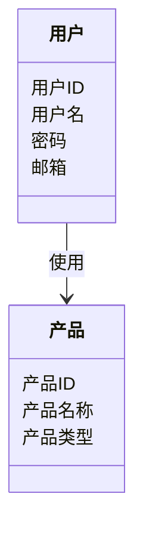
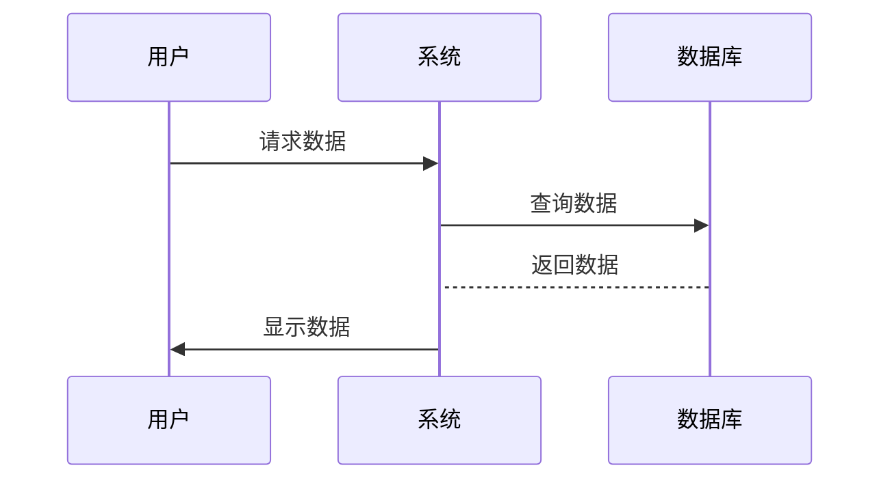

                 


# 金融科技用户体验优化平台

> 关键词：金融科技，用户体验优化，数据分析，人工智能，系统架构，用户体验设计

> 摘要：  
金融科技的快速发展推动了对用户体验优化的需求。本文从金融科技的背景出发，详细探讨用户体验优化的核心要素，结合数据驱动和技术驱动的方法，分析人工智能与机器学习在用户体验优化中的应用。通过系统架构设计和实际项目案例，总结用户体验优化平台的设计与实现，并展望未来发展方向。

---

# 第1章 金融科技与用户体验优化平台概述

## 1.1 金融科技的发展背景

### 1.1.1 金融科技的定义与内涵  
金融科技（Financial Technology，简称FinTech）是指通过技术手段创新金融产品、优化金融服务、提升金融效率的新兴领域。它涵盖支付、借贷、投资、保险等多个金融场景，以技术驱动为核心，旨在为用户带来更高效、便捷、个性化的金融服务体验。

### 1.1.2 金融科技的核心技术驱动  
金融科技的核心技术包括大数据、人工智能、区块链、云计算和物联网等。这些技术通过数据处理、智能分析、去中心化和高效计算等方式，为金融业务提供了全新的解决方案。

### 1.1.3 用户体验在金融科技中的重要性  
用户体验是金融科技成功的关键。随着市场竞争的加剧，用户对金融服务的需求逐渐从功能性转向体验性。优化用户体验不仅能够提升用户满意度，还能增强用户粘性，为金融机构带来长期收益。

---

## 1.2 用户体验优化平台的目标与意义

### 1.2.1 用户体验优化的核心目标  
用户体验优化的核心目标是通过技术手段提升用户在使用金融产品或服务时的满意度和便利性。这包括简化操作流程、降低用户认知负担、提高信息透明度等方面。

### 1.2.2 平台在金融科技中的价值  
用户体验优化平台能够帮助金融机构快速响应用户需求，提供个性化服务，降低运营成本，同时提高用户留存率和转化率。它是金融科技领域中连接技术和用户需求的桥梁。

### 1.2.3 用户体验优化的行业趋势  
随着数字化转型的推进，用户体验优化已经成为金融机构的核心竞争力之一。通过数据驱动和人工智能技术，用户体验优化平台能够实时感知用户需求，提供精准服务，成为行业发展的必然趋势。

---

## 1.3 本章小结  
本章从金融科技的背景出发，分析了用户体验优化平台的重要性，并指出了其在行业中的发展趋势。通过理解用户体验优化的核心目标和价值，为后续的技术实现奠定了基础。

---

# 第2章 金融科技用户体验优化的核心要素

## 2.1 用户需求与行为分析

### 2.1.1 用户需求层次分析  
根据马斯洛需求理论，用户在使用金融产品时，需求从基本的功能需求逐步上升到个性化和情感需求。例如，用户首先需要完成基本的支付功能，随后可能希望获得个性化的投资建议。

### 2.1.2 用户行为模型构建  
用户行为模型通过分析用户的操作路径、点击习惯和决策逻辑，帮助我们理解用户在使用金融产品时的行为特征。例如，用户在使用移动银行App时，可能会先查看账户余额，再进行转账操作。

### 2.1.3 用户体验的核心指标  
用户体验的核心指标包括用户满意度、任务完成率、操作时长、用户留存率等。这些指标能够量化用户体验的优劣，为优化提供数据支持。

---

## 2.2 金融科技产品与用户体验的关系

### 2.2.1 产品功能与用户体验的关联  
金融科技产品的功能设计直接影响用户体验。例如，复杂的操作流程会降低用户体验，而简洁的设计则能提高用户满意度。

### 2.2.2 用户体验对产品价值的影响  
良好的用户体验能够增强用户对产品的依赖性和忠诚度，从而为金融机构创造更大的价值。

### 2.2.3 金融科技产品的独特性分析  
金融科技产品具有强安全性和合规性的特点，这要求用户体验优化必须在确保安全的前提下进行创新设计。

---

## 2.3 用户体验优化的关键技术与方法

### 2.3.1 数据驱动的优化方法  
通过收集和分析用户行为数据，识别用户需求和痛点，从而制定针对性的优化策略。

### 2.3.2 人工智能在用户体验优化中的应用  
人工智能技术（如自然语言处理和机器学习）能够帮助金融机构自动化分析用户反馈，提供个性化服务。

### 2.3.3 用户反馈与迭代优化  
通过用户反馈实时调整产品设计，形成持续优化的闭环。

---

## 2.4 本章小结  
本章从用户需求和行为分析入手，探讨了金融科技产品与用户体验的关系，并总结了用户体验优化的关键技术与方法。这些内容为后续的技术实现提供了理论基础。

---

# 第3章 数据驱动的用户体验优化

## 3.1 数据采集与处理

### 3.1.1 用户行为数据的采集方法  
用户行为数据包括点击、滑动、输入等操作。常用的采集方法有日志记录、埋点技术和A/B测试。

### 3.1.2 数据清洗与预处理  
数据清洗包括去除噪声数据、填补缺失值和异常值处理。预处理步骤包括数据格式转换和特征提取。

### 3.1.3 数据存储与管理  
数据可以存储在数据库或数据仓库中，采用分布式存储和高效查询技术，确保数据的可用性和稳定性。

---

## 3.2 数据分析与挖掘

### 3.2.1 用户画像构建  
通过分析用户的年龄、性别、收入水平等特征，构建用户画像，为个性化服务提供依据。

### 3.2.2 用户行为路径分析  
通过路径分析，识别用户在使用产品时的瓶颈和痛点，优化操作流程。

### 3.2.3 数据可视化与洞察提取  
使用可视化工具（如Tableau）将数据分析结果以图表形式呈现，帮助快速识别关键问题。

---

## 3.3 数据驱动的优化策略

### 3.3.1 基于数据的用户分群  
通过聚类分析将用户分为不同群体，制定差异化服务策略。

### 3.3.2 数据驱动的个性化推荐  
基于协同过滤算法，为用户提供个性化的金融产品推荐。

### 3.3.3 数据反馈的实时优化  
通过实时数据分析，动态调整产品界面和功能布局，提升用户体验。

---

## 3.4 本章小结  
本章通过数据采集、处理和分析，展示了数据驱动在用户体验优化中的重要作用。通过用户画像、行为路径分析和个性化推荐等方法，为后续的技术实现提供了数据支持。

---

# 第4章 人工智能与机器学习在用户体验优化中的应用

## 4.1 人工智能技术概述

### 4.1.1 人工智能的核心技术  
人工智能包括机器学习、自然语言处理、计算机视觉和知识图谱等技术，这些技术为用户体验优化提供了强大的工具。

### 4.1.2 机器学习算法在用户体验优化中的应用  
机器学习算法可以用于用户情感分析、意图识别和个性化推荐等任务。

---

## 4.2 机器学习算法原理与实现

### 4.2.1 协同过滤推荐算法  
协同过滤是一种基于用户相似性推荐的算法，分为基于用户的协同过滤和基于物品的协同过滤。

#### 4.2.1.1 算法流程  
1. 收集用户行为数据。  
2. 计算用户相似度或物品相似度。  
3. 生成推荐列表。  

#### 4.2.1.2 实现代码  
```python
def collaborative_filtering(user_id, user_similarity_matrix):
    recommended_items = []
    for item in range(len(user_similarity_matrix[user_id])):
        if user_similarity_matrix[user_id][item] > threshold:
            recommended_items.append(item)
    return recommended_items
```

### 4.2.2 情感分析算法  
情感分析算法用于识别用户对金融产品的评价是正面、负面还是中性。

#### 4.2.2.1 算法流程  
1. 数据预处理。  
2. 模型训练。  
3. 情感预测。

---

## 4.3 人工智能在用户体验优化中的实际应用

### 4.3.1 智能客服  
通过自然语言处理技术，智能客服能够理解用户意图，提供精准的服务。

### 4.3.2 个性化推荐  
基于机器学习算法，为用户提供个性化的金融产品推荐。

### 4.3.3 风险评估  
通过机器学习模型，评估用户信用风险，优化金融服务流程。

---

## 4.4 本章小结  
本章通过介绍人工智能和机器学习的核心技术，展示了它们在用户体验优化中的广泛应用。从协同过滤推荐算法到情感分析，人工智能技术为用户体验优化提供了强大的技术支持。

---

# 第5章 系统架构设计与实现

## 5.1 问题场景介绍  
本章以一个典型的金融科技用户体验优化平台为例，介绍系统架构设计的过程。

## 5.2 系统功能设计

### 5.2.1 领域模型设计  
领域模型包括用户、产品、服务和反馈等核心实体。



### 5.2.2 系统架构设计  
系统架构采用分层设计，包括数据层、业务逻辑层和表现层。


---

## 5.3 系统接口设计  
系统接口包括用户登录、数据采集和个性化推荐等接口。

---

## 5.4 系统交互设计



---

## 5.5 本章小结  
本章通过系统架构设计和实现，展示了如何将用户体验优化的技术理念转化为实际的系统功能。

---

# 第6章 项目实战：用户体验优化平台的设计与实现

## 6.1 项目背景  
本项目旨在设计和实现一个基于数据驱动和人工智能的用户体验优化平台，帮助金融机构提升用户满意度和留存率。

---

## 6.2 项目核心功能实现

### 6.2.1 数据采集模块  
实现用户行为数据的采集和存储功能。

### 6.2.2 数据分析模块  
基于机器学习算法，实现用户画像和行为分析功能。

### 6.2.3 个性化推荐模块  
为用户提供个性化的金融产品推荐。

---

## 6.3 项目小结  
本章通过实际项目的实施，展示了用户体验优化平台的设计与实现过程，验证了技术方案的可行性和有效性。

---

# 第7章 案例分析与未来展望

## 7.1 案例分析  
通过实际案例分析，总结用户体验优化平台的成功经验。

### 7.1.1 案例背景  
介绍案例的背景和目标。

### 7.1.2 实施过程  
描述项目的实施过程和关键节点。

### 7.1.3 实施效果  
评估项目的实施效果和用户反馈。

---

## 7.2 未来展望  
随着人工智能和大数据技术的不断发展，用户体验优化平台将更加智能化和个性化。未来，我们可以期待更多创新的技术和方法，为用户体验优化提供新的可能性。

---

## 7.3 本章小结  
本章通过案例分析，总结了用户体验优化平台的成功经验，并展望了未来的发展方向。

---

# 附录

## 附录A 工具推荐  
推荐一些常用的工具和平台，例如数据分析工具、机器学习框架和开发环境。

---

## 附录B 数据集  
列出项目中使用的数据集及其来源。

---

## 附录C 参考文献  
提供文章中引用的相关文献和资料。

---

# 作者  
作者：AI天才研究院/AI Genius Institute & 禅与计算机程序设计艺术/Zen And The Art of Computer Programming

