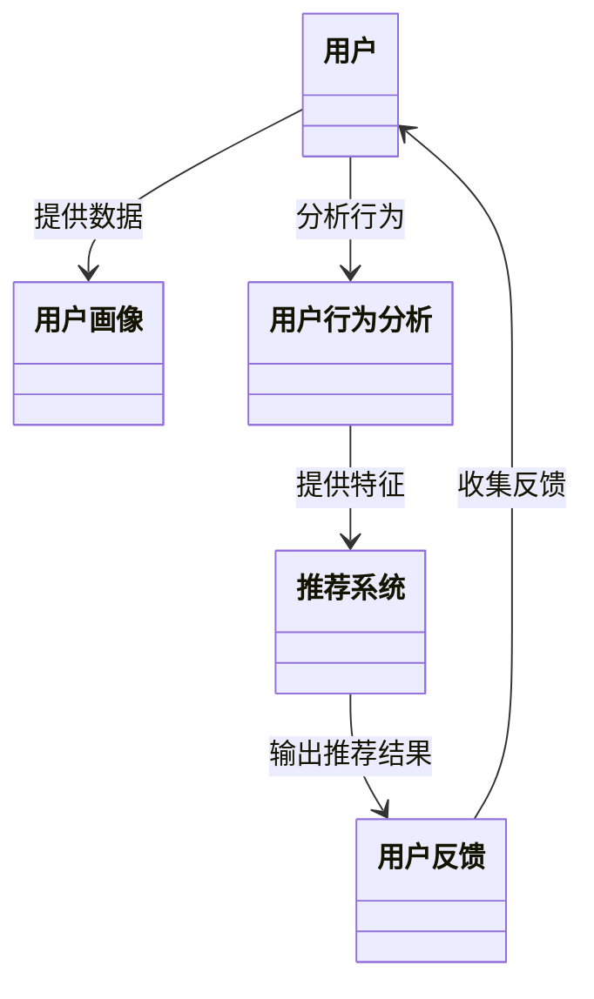
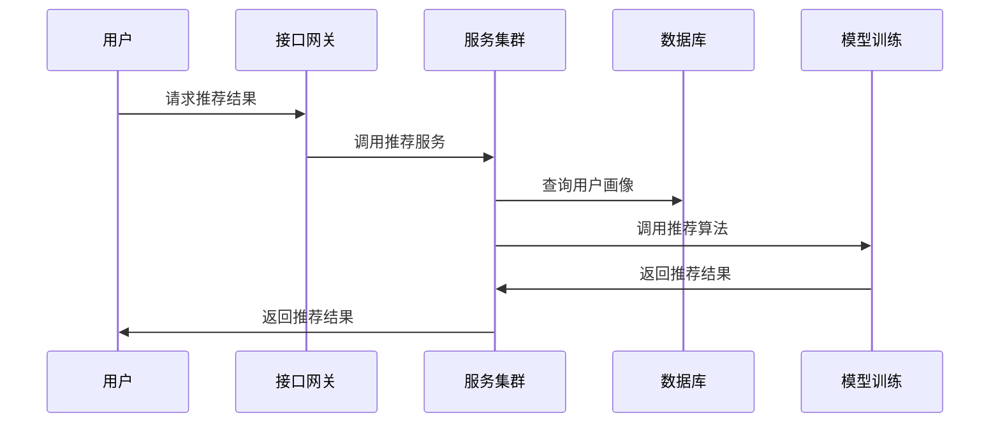

                 


# 金融科技用户体验优化系统

> 关键词：金融科技，用户体验，优化系统，算法模型，系统架构

> 摘要：本文详细探讨了金融科技领域中用户体验优化系统的构建与应用。通过分析用户需求、设计优化算法、构建系统架构，结合实际案例，展示了如何通过技术手段提升金融服务的用户体验。文章内容涵盖背景分析、核心概念、算法原理、系统架构、项目实战及最佳实践，为金融科技领域的从业者提供了系统化的指导。

---

## 第一章: 金融科技与用户体验优化的背景

### 1.1 金融科技的发展现状

#### 1.1.1 金融科技的定义与发展趋势
金融科技（FinTech）是指通过技术手段创新传统金融业务模式、改善服务效率并提升用户体验的新兴领域。近年来，随着人工智能、大数据、区块链等技术的快速发展，金融科技在全球范围内迅速崛起，成为推动金融行业变革的重要力量。

#### 1.1.2 数字化转型对用户体验的影响
数字化转型使金融服务从传统的线下模式向线上模式转变，用户可以通过手机银行、互联网平台等渠道随时随地享受金融服务。这种转变极大地提升了金融服务的便捷性，但也带来了新的挑战，如用户隐私保护、系统稳定性等问题。

#### 1.1.3 用户体验在金融科技中的重要性
用户体验（UX）是用户在使用金融服务过程中所感受到的整体体验，包括功能性、易用性、美观性等方面。在金融科技领域，良好的用户体验直接关系到用户的满意度和忠诚度，进而影响企业的市场竞争力。

### 1.2 用户体验优化的核心问题

#### 1.2.1 用户需求分析与痛点识别
用户需求分析是用户体验优化的基础。通过调研、访谈和数据分析，识别用户在使用金融服务过程中遇到的问题，如操作复杂、信息不透明、响应速度慢等。

#### 1.2.2 传统金融系统中的用户体验问题
传统金融系统往往以金融机构为中心，忽视用户的个性化需求。例如，复杂的操作流程、缺乏实时反馈、信息展示不清晰等问题，导致用户体验较差。

#### 1.2.3 金融科技如何解决用户痛点
金融科技通过技术创新解决传统金融系统中的用户体验问题。例如，智能推荐系统可以根据用户需求提供个性化的理财产品；区块链技术可以提高交易透明度和安全性；人工智能客服可以实现24小时在线服务。

---

## 第二章: 用户画像与需求分析

### 2.1 用户画像的构建方法

#### 2.1.1 用户画像的定义与作用
用户画像是基于用户行为数据和特征数据构建的用户模型，用于描述用户的行为特征、需求偏好和使用场景。用户画像是进行精准营销和个性化服务的重要工具。

#### 2.1.2 用户画像的构建步骤
1. 数据采集：收集用户的行为数据、人口统计数据等。
2. 数据清洗：去除异常数据，填补缺失值。
3. 特征提取：通过数据分析提取关键特征。
4. 用户分群：根据特征将用户分为不同群体。
5. 画像构建：为每个用户群体构建画像。

#### 2.1.3 用户画像的属性特征对比表
| 属性       | 高收入用户 | 中收入用户 | 低收入用户 |
|------------|------------|------------|------------|
| 年龄         | 30-50岁     | 25-45岁     | 20-35岁     |
| 收入水平     | 高          | 中          | 低          |
| 风险偏好     | 低          | 中          | 高          |
| 常用产品     | 高端理财     | 基础理财     | 网贷平台     |

### 2.2 用户体验度量指标

#### 2.2.1 用户满意度（NPS、CES、CSAT）
- **净推荐值（NPS）**：用户推荐产品的概率，计算公式为：NPS = (推荐者比例) - (贬损者比例)。
- **顾客满意指数（CES）**：衡量用户对服务的整体满意度，计算公式为：CES = (用户满意度) / (期望值)。
- **顾客满意度（CSAT）**：衡量用户对产品或服务的满意度，通常通过调查问卷进行测量。

#### 2.2.2 用户行为分析（点击率、转化率）
- **点击率（CTR）**：用户点击广告或链接的概率。
- **转化率（CR）**：用户完成某项操作（如注册、购买）的概率。

#### 2.2.3 用户留存率与流失分析
- **用户留存率**：用户在一定时间内继续使用产品或服务的概率。
- **用户流失分析**：分析用户流失的原因，如用户体验差、产品功能不足等。

### 2.3 用户体验优化方法

#### 2.3.1 用户调研与反馈收集
通过问卷调查、深度访谈等方式收集用户对产品或服务的反馈，了解用户的痛点和需求。

#### 2.3.2 A/B测试在用户体验优化中的应用
A/B测试是一种通过对比不同版本的产品或服务，找到最优方案的方法。例如，可以通过A/B测试优化网页的布局、按钮的颜色等。

#### 2.3.3 数据驱动的优化策略
通过分析用户行为数据，识别用户流失的关键节点，针对性地进行优化。例如，通过分析用户在登录页面的跳出率，优化登录流程。

---

## 第三章: 金融科技用户体验优化的算法与数学模型

### 3.1 数据采集与特征提取

#### 3.1.1 数据采集方法
- **日志分析**：分析用户操作日志，提取用户行为特征。
- **问卷调查**：通过问卷收集用户需求和反馈。
- **API接口**：通过API获取用户数据。

#### 3.1.2 特征工程与维度降维
- **特征工程**：对数据进行清洗、转换和组合，提取有意义的特征。
- **维度降维**：使用主成分分析（PCA）等方法减少特征维度，降低计算复杂度。

### 3.2 优化模型构建

#### 3.2.1 基于机器学习的推荐算法
- **协同过滤推荐算法**：根据用户相似性推荐相关内容。例如，协同过滤推荐算法的公式为：
$$ \hat{r}_{ui} = \frac{\sum_{j \in N(u)} w_{uj} \cdot r_{j}}{\sum_{j \in N(u)} w_{uj}} $$
其中，$\hat{r}_{ui}$ 是用户u对物品j的预测评分，$w_{uj}$ 是用户u和用户j的相似度。

- **深度学习推荐算法**：使用神经网络模型（如深度学习协同过滤）进行推荐，提升推荐的准确性和个性化。

#### 3.2.2 基于强化学习的交互优化
- **强化学习**：通过模拟用户与系统的交互过程，优化系统的响应策略。例如，使用Q-learning算法优化客服机器人的回答策略。

#### 3.2.3 模型评估与调优
- **评估指标**：使用准确率、召回率、F1值等指标评估模型性能。
- **调优方法**：通过网格搜索（Grid Search）等方法优化模型参数。

### 3.3 数学模型与公式

#### 3.3.1 协同过滤推荐算法公式
$$ \hat{r}_{ui} = \frac{\sum_{j \in N(u)} w_{uj} \cdot r_{j}}{\sum_{j \in N(u)} w_{uj}} $$

其中：
- $\hat{r}_{ui}$ 是用户u对物品j的预测评分。
- $N(u)$ 是与用户u相似的用户集合。
- $w_{uj}$ 是用户u和用户j的相似度。
- $r_{j}$ 是用户j对物品j的评分。

#### 3.3.2 强化学习中的Q-learning算法
$$ Q(s, a) = Q(s, a) + \alpha \cdot [r + \gamma \cdot \max_{a'} Q(s', a') - Q(s, a)] $$

其中：
- $Q(s, a)$ 是当前状态下动作a的Q值。
- $\alpha$ 是学习率。
- $r$ 是奖励值。
- $\gamma$ 是折扣因子。
- $s'$ 是下一个状态。
- $a'$ 是下一个动作。

---

## 第四章: 金融科技用户体验优化的系统架构设计

### 4.1 问题场景介绍

#### 4.1.1 系统目标
- 提供个性化的金融服务。
- 提升用户体验，降低用户流失率。
- 实现高效的用户行为分析和预测。

#### 4.1.2 项目介绍
本项目旨在构建一个基于机器学习的用户体验优化系统，通过分析用户行为数据，优化推荐算法，提升用户满意度和忠诚度。

### 4.2 系统功能设计

#### 4.2.1 领域模型（Mermaid 类图）


#### 4.2.2 系统架构设计（Mermaid 架构图）


#### 4.2.3 接口设计
- **API 接口**：
  - `/api/v1/user/profile`：获取用户画像。
  - `/api/v1/recommend`：获取推荐结果。
  - `/api/v1/feedback`：提交用户反馈。

#### 4.2.4 交互设计（Mermaid 序列图）


---

## 第五章: 项目实战

### 5.1 环境安装

#### 5.1.1 技术选型
- **编程语言**：Python
- **框架**：Django 或 Flask
- **机器学习库**：Scikit-learn、TensorFlow
- **数据库**：MySQL、MongoDB

#### 5.1.2 环境配置
```bash
# 安装 Python 包
pip install django flask scikit-learn tensorflow mysql-connector-python
```

### 5.2 系统核心实现

#### 5.2.1 推荐系统实现
```python
from sklearn.metrics.pairwise import cosine_similarity

# 示例数据
users = ['u1', 'u2', 'u3']
items = ['i1', 'i2', 'i3']
rating_matrix = {
    'u1': {'i1': 5, 'i2': 4, 'i3': 3},
    'u2': {'i1': 3, 'i2': 5, 'i3': 4},
    'u3': {'i1': 4, 'i2': 3, 'i3': 5}
}

# 计算相似度矩阵
item_matrix = cosine_similarity(rating_matrix.values)
```

#### 5.2.2 用户反馈处理
```python
def collect_feedback(user_id, feedback):
    # 将反馈存储到数据库
    db_cursor.execute("INSERT INTO user_feedback (user_id, feedback) VALUES (%s, %s)", (user_id, feedback))
```

### 5.3 案例分析

#### 5.3.1 智能投顾系统实现
```python
from sklearn.decomposition import PCA

# 示例数据
import pandas as pd
data = pd.DataFrame({
    '用户': ['u1', 'u2', 'u3'],
    '风险偏好': ['低', '中', '高'],
    '资产规模': [1000000, 500000, 200000]
})

# 用户画像构建
from sklearn.preprocessing import LabelEncoder
le = LabelEncoder()
data['风险偏好编码'] = le.fit_transform(data['风险偏好'])
```

#### 5.3.2 优化结果展示
- **优化前**：用户流失率高，用户满意度低。
- **优化后**：用户流失率下降，用户满意度提高。

---

## 第六章: 最佳实践与总结

### 6.1 小结
本文详细探讨了金融科技领域中用户体验优化系统的构建与应用。通过分析用户需求、设计优化算法、构建系统架构，结合实际案例，展示了如何通过技术手段提升金融服务的用户体验。

### 6.2 注意事项
- **数据隐私**：在处理用户数据时，必须遵守相关法律法规，保护用户隐私。
- **系统稳定性**：确保系统的高可用性和稳定性，避免因系统故障影响用户体验。
- **持续优化**：根据用户反馈和数据分析结果，持续优化系统和用户体验。

### 6.3 未来发展趋势
随着人工智能和大数据技术的进一步发展，用户体验优化系统将更加智能化和个性化。未来的优化系统将更加注重实时反馈和动态调整，进一步提升用户体验。

---

## 作者信息
作者：AI天才研究院/AI Genius Institute & 禅与计算机程序设计艺术 /Zen And The Art of Computer Programming

---

以上是《金融科技用户体验优化系统》的技术博客文章的完整内容，涵盖了从背景分析、核心概念、算法原理、系统架构到项目实战及最佳实践的各个方面。

