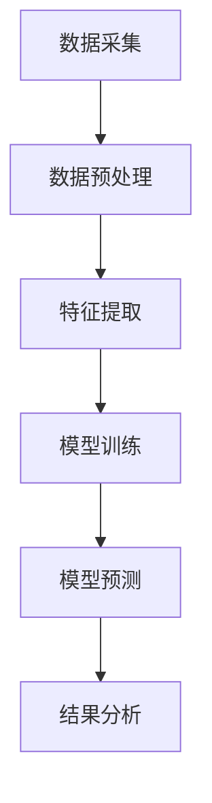
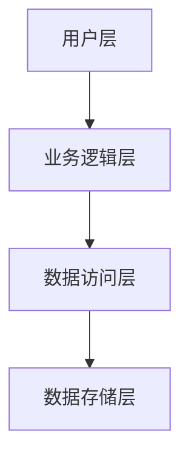
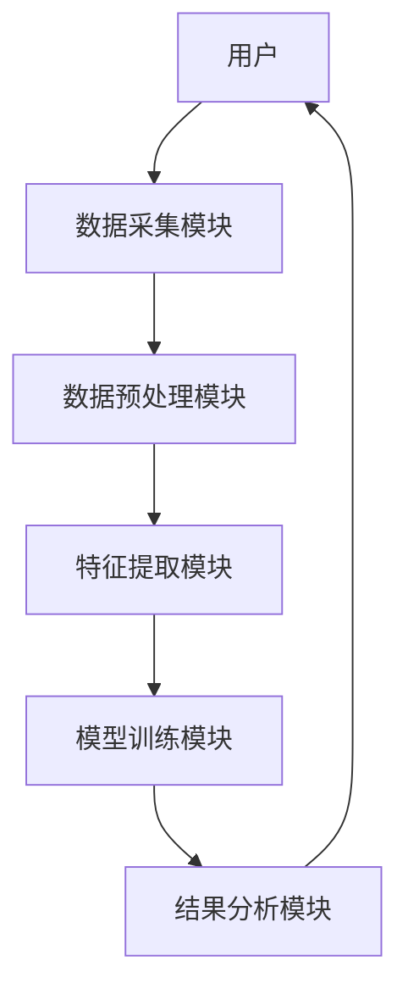

                 


# 金融科技用户行为分析与预测

## 关键词：
金融科技，用户行为分析，用户行为预测，机器学习，数据挖掘，系统架构设计

## 摘要：
本文系统地探讨了金融科技用户行为分析与预测的核心概念、算法原理、系统架构设计以及实际应用。通过对金融科技背景的介绍，分析了用户行为分析的重要性及其预测的意义。详细讲解了用户行为预测的算法原理，并结合实际案例，展示了如何利用机器学习算法进行用户行为预测。最后，本文总结了最佳实践和未来的发展方向。

---

# 第1章: 金融科技与用户行为分析概述

## 1.1 金融科技的发展现状
### 1.1.1 金融科技的定义与特点
金融科技（FinTech）是指通过技术手段创新传统金融业务模式、改善金融服务效率的新兴领域。其特点包括数字化、智能化、便捷化和个性化。

### 1.1.2 金融科技的主要应用领域
金融科技在支付、借贷、投资、保险等领域得到了广泛应用。例如，支付宝和微信支付改变了人们的支付方式；智能投顾平台（如基金定投）帮助用户进行理财。

### 1.1.3 金融科技对用户行为的影响
金融科技使得金融服务更加便捷，用户行为更加依赖于移动设备和在线平台，数据量急剧增加。

## 1.2 用户行为分析的定义与重要性
### 1.2.1 用户行为分析的基本概念
用户行为分析是指通过收集和分析用户在使用金融服务过程中的行为数据，了解用户的偏好、需求和行为模式。

### 1.2.2 金融科技中用户行为分析的重要性
- **精准营销**：通过分析用户行为，金融机构可以制定精准的营销策略。
- **风险控制**：预测用户的违约风险，帮助金融机构进行风险管理。
- **产品优化**：通过分析用户行为，优化金融产品的设计和服务流程。

### 1.2.3 用户行为分析的目标与意义
- **目标**：深入了解用户需求，预测用户行为，提供个性化服务。
- **意义**：提升用户体验，增强用户黏性，提高金融机构的竞争力。

---

## 1.3 用户行为预测的核心问题
### 1.3.1 用户行为预测的基本概念
用户行为预测是利用历史数据和机器学习算法，预测用户未来的行为模式。

### 1.3.2 金融科技中用户行为预测的应用场景
- **用户流失预测**：预测用户是否会停止使用某项金融服务。
- **信用评分预测**：预测用户是否会出现违约行为。
- **投资行为预测**：预测用户的投资偏好和行为。

### 1.3.3 用户行为预测的挑战与机遇
- **挑战**：数据质量、模型复杂性、实时性要求。
- **机遇**：技术进步（如深度学习）为用户行为预测提供了新的可能性。

---

## 1.4 本章小结
本章介绍了金融科技的发展现状，阐述了用户行为分析和预测的重要性和应用场景。为后续章节奠定了理论基础。

---

# 第2章: 金融科技用户行为分析的核心概念

## 2.1 用户行为分析的理论基础
### 2.1.1 数据挖掘与机器学习的基本概念
数据挖掘是从数据中提取有用信息的过程；机器学习是通过数据训练模型，使其能够进行预测或分类。

### 2.1.2 用户行为分析的数学模型
用户行为分析通常涉及回归、分类、聚类等数学模型。例如，线性回归用于预测用户的消费金额。

### 2.1.3 数据预处理与特征提取
- **数据预处理**：清洗数据、处理缺失值、标准化数据。
- **特征提取**：从原始数据中提取有用的特征，例如用户的历史交易记录、浏览行为等。

## 2.2 用户行为预测的算法原理
### 2.2.1 线性回归模型
线性回归用于预测连续型变量，例如用户可能消费的金额。

公式：
$$ y = \beta_0 + \beta_1x + \epsilon $$

### 2.2.2 支持向量机（SVM）模型
SVM用于分类问题，例如预测用户是否会在未来三个月内流失。

### 2.2.3 随机森林与梯度提升树模型
随机森林和梯度提升树（如XGBoost）是常用的分类和回归算法，适合处理高维数据。

### 2.2.4 神经网络与深度学习模型
神经网络（如LSTM）适合处理时间序列数据，例如用户的交易时间序列。

公式：
$$ y = \sigma(wx + b) $$

其中，$\sigma$ 是激活函数，$w$ 是权重，$b$ 是偏置。

## 2.3 用户行为预测的数学模型
### 2.3.1 线性回归模型的数学公式
$$ y = \beta_0 + \beta_1x + \epsilon $$

### 2.3.2 随机森林模型的数学公式
随机森林模型通过投票机制进行分类或回归，公式较为复杂，但核心思想是基于决策树的集成方法。

### 2.3.3 神经网络模型的数学公式
$$ y = \sigma(wx + b) $$

## 2.4 用户行为预测的流程图


## 2.5 本章小结
本章详细讲解了用户行为分析的理论基础和算法原理，为后续章节的系统设计和实际应用奠定了基础。

---

# 第3章: 金融科技用户行为分析的系统架构

## 3.1 用户行为分析系统的功能模块
### 3.1.1 数据采集模块
负责收集用户的交易数据、浏览记录、点击数据等。

### 3.1.2 数据预处理模块
对数据进行清洗、去重、标准化等处理。

### 3.1.3 特征提取模块
从原始数据中提取有用的特征，例如用户的行为频率、时间间隔等。

### 3.1.4 模型训练模块
利用机器学习算法训练模型，例如随机森林、神经网络等。

### 3.1.5 结果分析模块
对模型预测结果进行分析，评估模型的准确率、召回率等指标。

## 3.2 用户行为分析系统的架构设计
### 3.2.1 分层架构设计


### 3.2.2 微服务架构设计
采用微服务架构，每个功能模块独立开发和部署，便于扩展和维护。

## 3.3 用户行为分析系统的接口设计
### 3.3.1 数据接口
定义数据输入和输出的格式，例如API接口。

### 3.3.2 模型接口
定义模型训练和预测的接口，例如通过REST API调用模型。

### 3.3.3 结果接口
定义结果输出的格式，例如JSON格式。

## 3.4 用户行为分析系统的交互流


## 3.5 本章小结
本章介绍了用户行为分析系统的功能模块、架构设计和接口设计，展示了系统的整体结构。

---

# 第4章: 金融科技用户行为分析的项目实战

## 4.1 项目背景与目标
### 4.1.1 项目背景
以某银行为例，分析用户流失预测问题。

### 4.1.2 项目目标
预测用户是否会在未来三个月内流失。

## 4.2 项目实施步骤
### 4.2.1 数据采集
从银行系统中获取用户的交易记录、登录记录等数据。

### 4.2.2 数据预处理
清洗数据，处理缺失值，标准化数据。

### 4.2.3 特征工程
提取用户的行为特征，例如交易频率、最近一次登录时间等。

### 4.2.4 模型训练
选择合适的算法（如随机森林）进行模型训练。

### 4.2.5 模型评估
评估模型的准确率、召回率等指标，优化模型参数。

### 4.2.6 模型部署
将模型部署到生产环境，实时预测用户行为。

## 4.3 代码实现
```python
import pandas as pd
from sklearn.ensemble import RandomForestClassifier
from sklearn.metrics import accuracy_score

# 数据加载
data = pd.read_csv('user_behavior.csv')

# 特征提取
X = data[['交易频率', '登录时间间隔', '账户余额']]
y = data['是否流失']

# 模型训练
model = RandomForestClassifier()
model.fit(X, y)

# 模型预测
y_pred = model.predict(X)

# 模型评估
print('准确率:', accuracy_score(y, y_pred))
```

## 4.4 项目小结
通过实际案例展示了用户行为分析的全过程，从数据采集到模型部署，帮助读者理解理论知识的实际应用。

---

# 第5章: 金融科技用户行为分析的最佳实践

## 5.1 数据质量管理
### 5.1.1 数据清洗
处理缺失值、重复值、异常值。

### 5.1.2 数据标准化
将数据转换为统一格式，例如归一化处理。

## 5.2 模型优化
### 5.2.1 参数调优
通过网格搜索等方法优化模型参数。

### 5.2.2 模型融合
将多个模型的结果进行融合，提高预测准确率。

## 5.3 系统部署与维护
### 5.3.1 模型部署
将模型部署到生产环境，实时处理用户行为数据。

### 5.3.2 系统维护
定期更新模型，监控系统性能，处理异常情况。

## 5.4 本章小结
本章总结了金融科技用户行为分析的最佳实践，帮助读者在实际项目中提高模型的准确率和系统的稳定性。

---

# 第6章: 金融科技用户行为分析的未来展望

## 6.1 技术发展趋势
### 6.1.1 深度学习的应用
随着深度学习技术的进步，用户行为分析将更加精准。

### 6.1.2 大数据技术的融合
大数据技术将进一步提升用户行为分析的效率和准确性。

## 6.2 应用场景拓展
### 6.2.1 个性化金融服务
通过用户行为分析，提供个性化的金融产品和服务。

### 6.2.2 智能风控
利用用户行为预测，提升风险控制能力。

## 6.3 本章小结
本章展望了金融科技用户行为分析的未来发展方向，帮助读者了解行业趋势。

---

# 结语

金融科技用户行为分析与预测是一项复杂的系统工程，需要结合理论知识和实际应用。通过本文的系统讲解，读者可以全面掌握用户行为分析的核心概念、算法原理和系统设计方法。未来，随着技术的进步，用户行为分析将更加智能化和个性化，为金融科技的发展注入新的活力。

---

# 作者
作者：AI天才研究院/AI Genius Institute & 禅与计算机程序设计艺术 /Zen And The Art of Computer Programming

