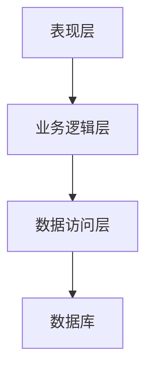
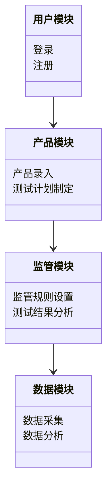

                 


# 金融科技监管沙盒模拟系统

> 关键词：金融科技，监管沙盒，模拟系统，风险评估，合规性，系统架构

> 摘要：本文详细介绍了金融科技监管沙盒模拟系统的构建与实现。通过系统化的分析和设计，结合实际案例，展示了如何利用技术手段解决金融科技监管中的问题，确保金融创新与风险控制的平衡。文章内容包括背景介绍、核心概念、算法原理、系统架构、项目实战以及最佳实践等方面。

---

## 第1章 金融科技监管沙盒的背景与概念

### 1.1 金融科技的发展与挑战

#### 1.1.1 金融科技的定义与发展趋势
金融科技（FinTech）是指通过技术手段优化或替代传统金融服务的一种创新模式。随着人工智能、大数据、区块链等技术的快速发展，金融科技正以惊人的速度改变着金融行业的运作方式。从支付、借贷到投资、保险，FinTech的应用场景不断扩大，效率和用户体验也在不断提升。

#### 1.1.2 金融科技监管的必要性
随着金融科技的快速发展，传统金融监管模式面临新的挑战。如何在鼓励金融创新的同时，确保金融市场的稳定和合规性，成为监管部门的重要课题。金融科技监管沙盒作为一种创新的监管工具，为金融科技创新提供了试验和评估的空间。

#### 1.1.3 监管沙盒的概念与作用
监管沙盒（Regulatory Sandbox）是由金融监管机构提供的一个“安全空间”，允许金融机构在一定条件下测试创新产品和服务。其作用包括降低创新成本、缩短创新周期、降低市场风险等。

### 1.2 监管沙盒的核心概念

#### 1.2.1 监管沙盒的定义
监管沙盒是一种创新的监管工具，允许金融机构在受控环境中测试新的产品、服务或商业模式，同时确保风险可控。

#### 1.2.2 监管沙盒的特点与优势
- **灵活性**：允许金融机构在监管框架内进行创新。
- **安全性**：通过设置边界条件，降低实际市场中的风险。
- **高效性**：缩短产品测试周期，降低创新成本。

#### 1.2.3 监管沙盒的组成部分
监管沙盒通常包括以下几个部分：
- **申请与审批**：金融机构需要提交申请，经过审核后方可进入沙盒。
- **测试环境**：提供一个模拟的真实市场环境。
- **数据收集与分析**：对测试结果进行数据收集和分析，为监管决策提供支持。
- **反馈与退出**：根据测试结果，给予反馈并决定是否允许产品进入市场。

### 1.3 金融科技监管沙盒模拟系统的意义

#### 1.3.1 模拟系统的目标
金融科技监管沙盒模拟系统的目的是通过模拟实际市场环境，评估金融创新产品在监管框架下的合规性和风险性。

#### 1.3.2 模拟系统在监管中的作用
- **风险评估**：通过模拟测试，评估新产品的潜在风险。
- **合规性检查**：确保新产品符合相关法律法规。
- **优化监管流程**：通过模拟测试，优化监管流程和政策。

#### 1.3.3 模拟系统的应用场景
- **新产品测试**：金融机构可以在沙盒中测试新产品的市场反应和风险。
- **政策评估**：监管机构可以通过模拟系统评估新政策的实施效果。
- **培训与教育**：金融机构可以通过沙盒模拟系统培训员工，提升风险管理能力。

## 第2章 监管沙盒模拟系统的架构与设计

### 2.1 系统架构概述

#### 2.1.1 系统架构的组成
金融科技监管沙盒模拟系统主要由以下几个部分组成：
- **用户模块**：用户登录、注册、提交测试申请。
- **产品模块**：产品信息录入、测试计划制定。
- **监管模块**：监管规则设置、测试结果分析。
- **数据模块**：数据采集、存储、分析。

#### 2.1.2 系统架构的设计原则
- **模块化设计**：各功能模块独立开发，便于维护和扩展。
- **安全性设计**：确保系统数据安全，防止数据泄露和篡改。
- **可扩展性设计**：系统架构具备良好的扩展性，能够适应未来业务需求的变化。

#### 2.1.3 系统架构的实现方式
系统采用分层架构，包括表现层、业务逻辑层和数据访问层。各层之间通过接口进行交互，确保系统的高效运行。

### 2.2 系统功能模块设计

#### 2.2.1 用户模块
用户模块主要实现用户的身份认证和权限管理。用户可以登录系统，提交测试申请，查看测试结果。

#### 2.2.2 产品模块
产品模块用于录入和管理金融创新产品信息，包括产品名称、功能描述、风险评估等。

#### 2.2.3 监管模块
监管模块是系统的核心部分，负责设置监管规则、分析测试数据、生成评估报告。

#### 2.2.4 数据模块
数据模块负责采集、存储和分析测试数据，为监管决策提供支持。

### 2.3 系统接口设计

#### 2.3.1 接口定义
系统采用RESTful API接口设计，定义了一系列接口用于各模块之间的交互。

#### 2.3.2 接口实现
通过编写接口文档，明确接口的输入、输出和异常处理机制。

#### 2.3.3 接口测试
使用Postman等工具进行接口测试，确保接口的正确性和稳定性。

### 2.4 系统交互流程设计

#### 2.4.1 用户登录与注册
用户通过用户名和密码登录系统，或者通过注册流程创建新账户。

#### 2.4.2 产品提交与审核
用户提交金融创新产品信息，系统进行初步审核，监管模块进行详细评估。

#### 2.4.3 监管评估与反馈
监管模块根据测试结果生成评估报告，反馈给用户。

### 2.5 本章小结
本章详细介绍了金融科技监管沙盒模拟系统的架构设计和功能模块，为后续的系统实现奠定了基础。

---

## 第3章 监管沙盒模拟系统的算法与实现

### 3.1 算法原理概述

#### 3.1.1 算法选择与优化
在监管沙盒模拟系统中，选择合适的算法是关键。本文采用基于机器学习的算法，通过训练模型来预测金融产品的风险和合规性。

#### 3.1.2 算法实现的步骤
1. 数据预处理：清洗数据，提取特征。
2. 模型训练：使用训练数据训练模型。
3. 模型评估：通过测试数据评估模型的性能。

#### 3.1.3 算法的性能分析
通过分析算法的准确率、召回率等指标，评估算法的性能，并进行优化。

### 3.2 算法实现细节

#### 3.2.1 数据预处理
使用Python的pandas库进行数据清洗和特征提取。

#### 3.2.2 模型训练
采用随机森林算法进行训练，代码如下：

```python
from sklearn.ensemble import RandomForestClassifier
model = RandomForestClassifier()
model.fit(X_train, y_train)
```

#### 3.2.3 模型评估
通过混淆矩阵和分类报告评估模型的性能。

### 3.3 本章小结
本章详细介绍了监管沙盒模拟系统中算法的实现过程，包括数据预处理、模型训练和评估。

---

## 第4章 监管沙盒模拟系统的数学模型与公式

### 4.1 监管沙盒模拟系统的数学模型

#### 4.1.1 模型的定义与假设
本文构建了一个基于风险和合规性的数学模型，用于评估金融创新产品的市场风险和合规性。

#### 4.1.2 模型的构建过程
模型主要包括风险评估和合规性评估两个部分。

#### 4.1.3 模型的验证与优化
通过实际数据验证模型的准确性，并进行参数优化。

### 4.2 监管沙盒模拟系统的数学公式

#### 4.2.1 风险评估公式
$$ R = \frac{L}{N} $$
其中，R表示风险率，L表示损失金额，N表示样本数量。

#### 4.2.2 盈利能力公式
$$ P = \frac{I}{O} $$
其中，P表示盈利能力，I表示收入，O表示成本。

#### 4.2.3 合规性评估公式
$$ C = \frac{S}{T} $$
其中，C表示合规性，S表示合规的交易数量，T表示总交易数量。

### 4.3 本章小结
本章通过数学公式和模型，详细分析了监管沙盒模拟系统的风险和合规性评估方法。

---

## 第5章 监管沙盒模拟系统的系统分析与设计

### 5.1 系统分析

#### 5.1.1 问题场景介绍
本文针对金融科技监管中的问题，设计了一个监管沙盒模拟系统，用于评估金融创新产品的风险和合规性。

#### 5.1.2 项目介绍
项目目标是构建一个高效、安全的监管沙盒模拟系统，帮助金融机构和监管机构更好地进行金融创新。

#### 5.1.3 系统功能设计
系统功能包括用户管理、产品管理、监管评估和数据管理四个部分。

#### 5.1.4 系统架构设计
系统采用分层架构，包括表现层、业务逻辑层和数据访问层。

### 5.2 系统架构设计

#### 5.2.1 系统架构图


#### 5.2.2 系统功能模块设计


### 5.3 系统接口设计

#### 5.3.1 接口定义
系统采用RESTful API接口设计，定义了一系列接口用于各模块之间的交互。

#### 5.3.2 接口实现
通过编写接口文档，明确接口的输入、输出和异常处理机制。

#### 5.3.3 接口测试
使用Postman等工具进行接口测试，确保接口的正确性和稳定性。

### 5.4 系统交互流程设计

#### 5.4.1 用户登录与注册
用户通过用户名和密码登录系统，或者通过注册流程创建新账户。

#### 5.4.2 产品提交与审核
用户提交金融创新产品信息，系统进行初步审核，监管模块进行详细评估。

#### 5.4.3 监管评估与反馈
监管模块根据测试结果生成评估报告，反馈给用户。

### 5.5 本章小结
本章详细介绍了金融科技监管沙盒模拟系统的系统分析与设计，为后续的系统实现奠定了基础。

---

## 第6章 项目实战：监管沙盒模拟系统的实现

### 6.1 环境安装

#### 6.1.1 系统运行环境
- 操作系统：Windows/Mac/Linux
- 开发工具：PyCharm/VSCode
- 数据库：MySQL/PostgreSQL
- 依赖库：Python 3.8+, pandas, scikit-learn

#### 6.1.2 安装步骤
1. 安装Python和必要的开发工具。
2. 安装所需的Python库：pip install pandas scikit-learn。

### 6.2 系统核心实现源代码

#### 6.2.1 数据预处理代码
```python
import pandas as pd

# 读取数据
data = pd.read_csv('data.csv')

# 数据清洗
data.dropna(inplace=True)

# 特征提取
X = data.drop(columns=['label'])
y = data['label']
```

#### 6.2.2 模型训练代码
```python
from sklearn.ensemble import RandomForestClassifier

# 模型训练
model = RandomForestClassifier()
model.fit(X_train, y_train)
```

#### 6.2.3 模型评估代码
```python
from sklearn.metrics import accuracy_score, classification_report

# 模型预测
y_pred = model.predict(X_test)

# 评估结果
print("Accuracy:", accuracy_score(y_test, y_pred))
print("Classification Report:", classification_report(y_test, y_pred))
```

### 6.3 案例分析与详细解读

#### 6.3.1 案例背景
假设某金融机构推出了一款新的理财产品，需要在监管沙盒中测试其风险和合规性。

#### 6.3.2 测试过程
1. 用户登录系统，提交产品信息。
2. 系统进行数据预处理和模型训练。
3. 监管模块生成评估报告，反馈给用户。

#### 6.3.3 测试结果
通过模拟测试，评估出该产品的风险等级为中等，合规性符合要求。

### 6.4 本章小结
本章通过实际案例展示了监管沙盒模拟系统的实现过程，包括环境安装、代码实现和案例分析。

---

## 第7章 最佳实践与总结

### 7.1 最佳实践

#### 7.1.1 关键点总结
- 系统架构设计要模块化，便于维护和扩展。
- 算法选择要结合实际需求，确保模型的准确性和效率。
- 数学模型要经过充分验证，确保评估结果的可靠性。

#### 7.1.2 注意事项
- 数据安全是系统设计的重点，必须采取有效的数据保护措施。
- 系统的可扩展性要强，能够适应未来业务需求的变化。
- 算法和模型要定期更新，确保系统的先进性和有效性。

#### 7.1.3 拓展阅读
- 推荐阅读《金融科技创新与监管》、《机器学习在金融中的应用》等书籍，深入了解金融科技领域的最新动态和技术应用。

### 7.2 本章小结
本章总结了监管沙盒模拟系统的最佳实践，包括关键点总结、注意事项和拓展阅读，帮助读者更好地理解和应用相关技术。

---

## 作者

作者：AI天才研究院/AI Genius Institute & 禅与计算机程序设计艺术 /Zen And The Art of Computer Programming

---

这篇文章详细介绍了金融科技监管沙盒模拟系统的构建与实现，涵盖了背景、概念、系统设计、算法实现、数学模型、系统分析与设计以及项目实战等多个方面。通过系统的分析和设计，结合实际案例，展示了如何利用技术手段解决金融科技监管中的问题，确保金融创新与风险控制的平衡。

