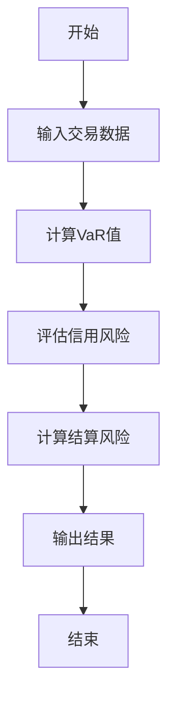
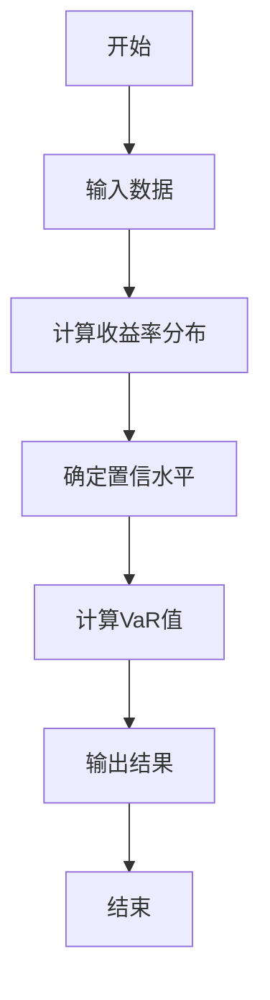
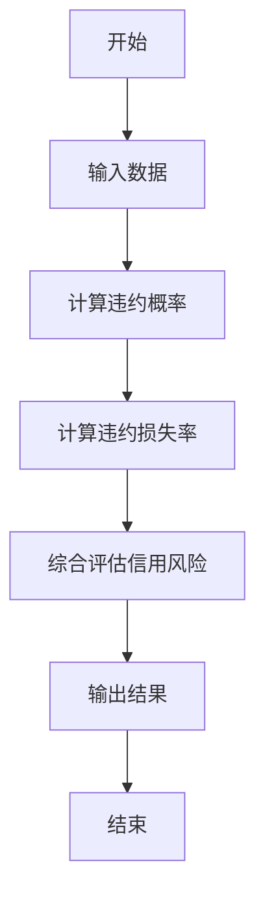
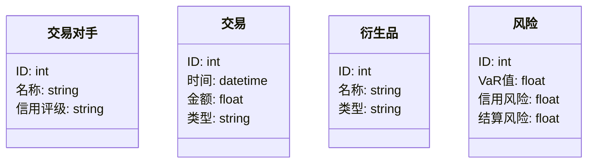
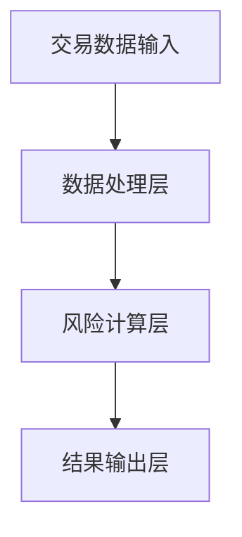

                 


# 金融衍生品交易对手风险量化模型

**关键词：** 交易对手风险、金融衍生品、风险量化、VaR模型、Credit Risk+模型

**摘要：**  
金融衍生品交易对手风险量化模型是金融风险管理中的重要工具，用于评估和量化交易对手在衍生品交易中的信用风险和结算风险。本文从背景介绍、核心概念、算法原理、数学模型、系统架构、项目实战等多方面展开分析，深入探讨如何构建和应用交易对手风险量化模型。通过实际案例分析和代码实现，帮助读者理解模型的应用和优化方法。

---

# 第1章: 交易对手风险与金融衍生品概述

## 1.1 交易对手风险的定义与背景

### 1.1.1 交易对手风险的定义  
交易对手风险是指在金融衍生品交易中，交易对手方因信用问题或市场波动导致无法履行合同义务而带来的损失风险。这种风险不仅涉及信用风险，还包括市场风险和结算风险。

### 1.1.2 交易对手风险的背景与重要性  
随着金融市场的快速发展，衍生品交易日益复杂化和全球化。交易对手风险已成为金融机构面临的主要风险之一。特别是在金融危机中，交易对手的违约风险暴露了其在风险管理中的不足。

### 1.1.3 金融衍生品的基本概念  
金融衍生品是指从原生资产派生出来的金融工具，如期货、期权、掉期等。这些工具的价值依赖于基础资产的价格波动。

---

## 1.2 交易对手风险的影响因素

### 1.2.1 市场风险  
市场风险是由于市场价格波动导致的衍生品价值变化，进而影响交易对手的信用风险。

### 1.2.2 信用风险  
信用风险是指交易对手因信用问题无法履行合约义务的风险。

### 1.2.3 结算风险  
结算风险是指在交易过程中，因一方违约导致无法按约定价格和时间完成交割的风险。

---

## 1.3 交易对手风险的量化方法

### 1.3.1 风险量化的基本原理  
通过数学模型和统计方法，量化交易对手风险的核心在于衡量其违约概率、损失程度和相关性。

### 1.3.2 量化模型的选择与应用  
选择合适的量化模型需要考虑数据的可得性、模型的复杂性和计算效率。

### 1.3.3 模型的优缺点分析  
不同模型有不同的优缺点，例如VaR模型简单易懂，但无法捕捉尾部风险；Credit Risk+模型更为复杂，但更准确。

---

## 1.4 交易对手风险的模型类型

### 1.4.1 VaR模型  
VaR（Value at Risk）是一种常用的金融风险度量方法，用于估计在一定置信水平下的潜在损失。

### 1.4.2 Credit Risk+模型  
Credit Risk+模型通过泊松过程模拟违约风险，适用于评估交易对手的信用风险。

### 1.4.3 其他相关模型  
还包括信用违约互换（CDS）模型和信用评级迁移模型。

---

## 1.5 本章小结  
本章介绍了交易对手风险的基本概念、影响因素和量化方法，为后续模型构建奠定了基础。

---

# 第2章: 核心概念与模型架构

## 2.1 核心概念解析

### 2.1.1 交易对手信用风险  
交易对手信用风险是指交易对手因信用问题导致的衍生品交易损失。

### 2.1.2 信用风险  
信用风险是交易对手无法履行合约义务的风险。

### 2.1.3 结算风险  
结算风险是指在交易过程中因一方违约导致无法完成交割的风险。

---

## 2.2 核心概念对比表

| 概念         | 定义                                                                 | 特点                     |
|--------------|----------------------------------------------------------------------|--------------------------|
| 交易对手信用风险 | 交易对手因信用问题导致的损失风险                                       | 与信用评级密切相关       |
| 信用风险     | 交易对手无法履行合约义务的风险                                         | 包括交易对手信用风险     |
| 结算风险     | 交易过程中因一方违约导致无法完成交割的风险                             | 与交易结算机制相关       |

---

## 2.3 模型架构图

### 2.3.1 ER实体关系图  
```mermaid
erd
    Entity: 交易对手
    Entity: 交易
    Entity: 衍生品
    Entity: 风险
    Entity: 结算
    Entity: 市场
```

### 2.3.2 模型流程图  


---

## 2.4 本章小结  
本章通过对比和图表分析，详细解释了交易对手风险的核心概念及其相互关系。

---

# 第3章: 交易对手风险量化算法原理

## 3.1 VaR模型原理

### 3.1.1 VaR的定义与计算方法  
VaR是衡量市场风险的一种方法，计算在给定置信水平下的潜在损失。例如，95%置信水平下，VaR表示在95%的情况下，损失不会超过该值。

### 3.1.2 VaR的优缺点分析  
优点：简单易懂，计算效率高；缺点：无法捕捉尾部风险，对数据分布假设敏感。

### 3.1.3 VaR的实现步骤  
1. 收集历史市场数据；2. 计算资产收益率分布；3. 确定置信水平；4. 计算VaR值。

---

## 3.2 Credit Risk+模型原理

### 3.2.1 Credit Risk+模型的定义  
Credit Risk+模型通过泊松过程模拟违约风险，适用于评估交易对手的信用风险。

### 3.2.2 Credit Risk+模型的实现步骤  
1. 确定交易对手的信用评级；2. 计算违约概率；3. 计算违约损失率；4. 综合评估信用风险。

---

## 3.3 算法流程图

### 3.3.1 VaR模型流程图  


### 3.3.2 Credit Risk+模型流程图  


---

## 3.4 本章小结  
本章详细讲解了VaR模型和Credit Risk+模型的原理和实现步骤，为后续的数学模型和系统设计奠定基础。

---

# 第4章: 数学模型与公式推导

## 4.1 VaR模型的数学公式

### 4.1.1 VaR的计算公式  
$$ \text{VaR} = \text{quantile}(P, \alpha) $$  
其中，\( P \) 是资产收益率的分布，\( \alpha \) 是置信水平。

### 4.1.2 VaR的实现步骤  
1. 收集历史市场数据；2. 计算资产收益率分布；3. 确定置信水平；4. 计算VaR值。

---

## 4.2 Credit Risk+模型的数学公式

### 4.2.1 违约概率公式  
$$ P(\text{违约}) = \lambda T e^{-\lambda T} $$  
其中，\( \lambda \) 是违约率，\( T \) 是时间跨度。

### 4.2.2 违约损失率公式  
$$ L = \text{损失率} \times \text{违约金额} $$

---

## 4.3 本章小结  
本章通过数学公式详细推导了VaR模型和Credit Risk+模型的核心公式，为后续的系统设计和项目实现提供理论支持。

---

# 第5章: 系统分析与架构设计

## 5.1 系统功能设计

### 5.1.1 领域模型类图  


### 5.1.2 系统架构图  


### 5.1.3 接口设计  
- 输入接口：接收交易数据和衍生品信息；  
- 输出接口：返回VaR值、信用风险和结算风险。

---

## 5.2 本章小结  
本章通过系统架构设计和类图展示了交易对手风险量化模型的实现框架。

---

# 第6章: 项目实战

## 6.1 环境安装

### 6.1.1 安装Python环境  
安装Python 3.8以上版本，安装Pandas、NumPy、Scipy等库。

### 6.1.2 安装其他工具  
安装Mermaid和LaTeX，用于生成图表和公式。

---

## 6.2 核心代码实现

### 6.2.1 VaR模型代码  
```python
import numpy as np
import pandas as pd

def calculate VaR(data, confidence_level):
    sorted_data = np.sort(data)
    index = int(len(sorted_data) * (1 - confidence_level))
    return sorted_data[index]
```

### 6.2.2 Credit Risk+模型代码  
```python
def calculate Credit_Risk_Plus(data, lambda_value, T):
    default_probability = lambda_value * T * np.exp(-lambda_value * T)
    return default_probability
```

---

## 6.3 代码应用解读

### 6.3.1 VaR模型应用  
读取历史收益率数据，计算VaR值并输出结果。

### 6.3.2 Credit Risk+模型应用  
读取交易数据，计算违约概率并输出结果。

---

## 6.4 本章小结  
本章通过实际项目案例，展示了交易对手风险量化模型的实现过程。

---

# 第7章: 最佳实践与小结

## 7.1 最佳实践

### 7.1.1 数据质量管理  
确保数据的准确性和完整性，避免模型误差。

### 7.1.2 模型优化  
根据实际需求，优化模型参数和计算效率。

---

## 7.2 小结  
本文从背景介绍到项目实战，全面探讨了交易对手风险量化模型的构建与应用，为金融风险管理提供了理论和实践指导。

---

## 7.3 注意事项  
在实际应用中，需结合具体业务场景，选择合适的模型和参数。

---

## 7.4 拓展阅读  
推荐阅读《信用风险模型》和《VaR与金融风险管理》。

---

# 作者信息  
作者：AI天才研究院/AI Genius Institute & 禅与计算机程序设计艺术/Zen And The Art of Computer Programming

