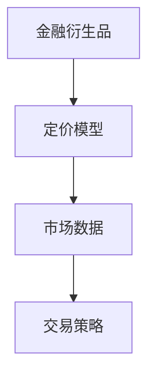

                 


# 金融衍生品定价中的机器学习应用

## 关键词
金融衍生品, 机器学习, 定价模型, 人工智能, 风险管理

## 摘要
金融衍生品的定价一直是金融领域的重要挑战，传统的定价方法面临数据复杂性和市场波动性的难题。机器学习作为一种新兴的技术，为金融衍生品定价提供了新的解决方案。本文详细探讨了机器学习在金融衍生品定价中的应用，从基本概念到算法原理，再到系统设计和项目实战，全面解析了机器学习如何提升定价的准确性和效率。通过实例分析和代码实现，本文展示了如何利用机器学习模型优化金融衍生品的定价策略，并提出了未来研究的方向。

---

# 第1章: 金融衍生品与机器学习概述

## 1.1 金融衍生品的基本概念
### 1.1.1 金融衍生品的定义
金融衍生品是基于标的资产（如股票、债券、商品等）的金融工具，其价值依赖于标的资产的价格波动。常见的金融衍生品包括期权、期货、掉期和远期合约。

### 1.1.2 金融衍生品的分类
1. **期权**：买方有权在特定时间以特定价格买入或卖出标的资产。
2. **期货**：双方约定在未来特定时间以特定价格买卖标的资产。
3. **掉期**：双方交换现金流的协议，通常基于利率或汇率。
4. **远期合约**：非标准化的协议，与期货类似但没有在交易所交易。

### 1.1.3 金融衍生品的市场现状
金融衍生品市场是全球最大的金融市场之一，广泛应用于风险管理和投机交易。然而，定价复杂且受多种因素影响，如市场波动、利率变化和信用风险。

---

## 1.2 机器学习的基本概念
### 1.2.1 机器学习的定义
机器学习是一种人工智能技术，通过数据训练模型，使其能够从数据中学习并做出预测或决策。

### 1.2.2 机器学习的核心算法
1. **监督学习**：如线性回归、支持向量机（SVM）。
2. **无监督学习**：如聚类、随机森林。
3. **深度学习**：如神经网络。

### 1.2.3 机器学习的应用领域
机器学习在金融、医疗、交通等领域广泛应用，特别是在数据量大且复杂的场景中表现突出。

---

## 1.3 机器学习在金融衍生品定价中的应用
### 1.3.1 金融衍生品定价的挑战
- 数据复杂性：涉及多维度数据，如市场数据、新闻情绪等。
- 市场波动性：价格受多种因素影响，难以预测。

### 1.3.2 机器学习在定价中的优势
- 处理非线性关系：机器学习擅长处理复杂非线性关系，提高定价准确性。
- 自动特征工程：能自动提取有用的特征，减少人工干预。

### 1.3.3 机器学习与传统定价方法的结合
传统方法如Black-Scholes模型依赖假设，而机器学习可以补充这些假设，提供更灵活的定价模型。

---

## 1.4 本章小结
本章介绍了金融衍生品的基本概念和机器学习的原理，探讨了机器学习在定价中的应用及其优势，为后续章节奠定了基础。

---

# 第2章: 金融衍生品定价的核心概念与原理

## 2.1 金融衍生品定价的基本原理
### 2.1.1 无套利定价原理
无套利定价假设在有效市场中，资产的定价不会存在无风险套利机会。

### 2.1.2 随机过程与蒙特卡洛模拟
蒙特卡洛模拟用于模拟资产价格的随机波动，帮助评估衍生品的价值。

### 2.1.3 Black-Scholes模型
Black-Scholes模型用于定价欧式期权，假设标的资产价格服从几何布朗运动。

---

## 2.2 机器学习在金融衍生品定价中的应用
### 2.2.1 数据特征提取
从市场数据、新闻和宏观经济指标中提取特征，用于训练模型。

### 2.2.2 模型选择与优化
通过交叉验证选择最佳模型，并进行超参数优化。

### 2.2.3 结果解释与验证
验证模型的准确性和稳定性，确保其在实际应用中的可靠性。

---

## 2.3 核心概念与联系
### 2.3.1 ER实体关系图架构


### 2.3.2 金融衍生品定价与机器学习的对比表格
| 特征 | 传统定价方法 | 机器学习方法 |
|------|--------------|--------------|
| 数据需求 | 结构化数据 | 结构化+非结构化数据 |
| 模型复杂度 | 简单 | 复杂 |
| 解释性 | 高 | 低 |
| 灵活性 | 低 | 高 |

---

## 2.4 本章小结
本章深入分析了金融衍生品定价的基本原理和机器学习的应用，通过对比和图表展示了两者的联系和差异。

---

# 第3章: 常见机器学习算法及其在金融衍生品定价中的应用

## 3.1 线性回归
### 3.1.1 线性回归的原理
线性回归通过最小化预测值与实际值的平方差，建立线性关系模型。

$$ y = \beta_0 + \beta_1 x + \epsilon $$

### 3.1.2 线性回归在定价中的应用
用于简单场景下的价格预测，但难以处理复杂非线性关系。

### 3.1.3 线性回归的优缺点
优点：简单易懂，计算速度快；缺点：无法处理复杂关系。

---

## 3.2 支持向量机（SVM）
### 3.2.1 算法原理
通过构建超平面分割数据，适用于高维空间分类。

### 3.2.2 在定价中的应用
用于分类问题，如判断期权是否被低估。

### 3.2.3 优缺点
优点：适用于高维数据；缺点：计算复杂度高。

---

## 3.3 随机森林
### 3.3.1 算法原理
通过构建多个决策树，集成模型提高准确性和鲁棒性。

### 3.3.2 在定价中的应用
用于特征重要性分析和非线性关系建模。

### 3.3.3 优缺点
优点：抗过拟合，特征工程简单；缺点：计算资源消耗大。

---

## 3.4 神经网络
### 3.4.1 算法原理
通过多层神经元模拟人脑，学习复杂模式。

### 3.4.2 在定价中的应用
处理复杂非线性关系，适合深度学习场景。

### 3.4.3 优缺点
优点：灵活性高；缺点：计算复杂，难解释。

---

## 3.5 机器学习算法的比较与选择
根据数据特征和问题类型选择合适算法，如使用线性回归处理线性问题，随机森林处理非线性问题。

---

# 第4章: 系统设计与架构方案

## 4.1 项目背景
本项目旨在利用机器学习优化金融衍生品定价，提升准确性和效率。

## 4.2 系统功能设计
### 4.2.1 数据获取
从数据库获取市场数据和交易数据。

### 4.2.2 特征工程
提取并处理特征，如标的资产价格、波动率等。

### 4.2.3 模型训练
训练机器学习模型，进行参数优化。

### 4.2.4 定价与风险评估
基于模型输出定价，并评估风险。

## 4.3 系统架构设计


## 4.4 系统接口设计
API接口定义了数据获取、模型训练和定价请求的交互流程。

## 4.5 系统交互流程


---

# 第5章: 项目实战

## 5.1 环境安装
安装必要的Python库，如NumPy、Pandas、Scikit-learn和XGBoost。

## 5.2 核心实现
### 5.2.1 数据处理
```python
import pandas as pd
data = pd.read_csv('market_data.csv')
```

### 5.2.2 特征工程
```python
from sklearn.preprocessing import StandardScaler
scaler = StandardScaler()
X_scaled = scaler.fit_transform(X)
```

### 5.2.3 模型训练
```python
from sklearn.ensemble import RandomForestRegressor
model = RandomForestRegressor()
model.fit(X_scaled, y)
```

### 5.2.4 定价与评估
```python
importances = model.feature_importances_
```

## 5.3 实际案例分析
通过具体案例展示模型的定价能力，并分析结果。

---

# 第6章: 最佳实践与未来展望

## 6.1 总结与经验
机器学习为金融衍生品定价提供了新思路，但需结合传统方法和领域知识。

## 6.2 注意事项
数据质量、模型解释性和风险管理是应用中的关键问题。

## 6.3 未来展望
深度学习和强化学习在定价中的应用潜力巨大，值得进一步研究。

---

# 参考文献
（此处列出相关书籍和论文）

---

作者：AI天才研究院/Zen And The Art of Computer Programming

---

通过以上结构，本文系统地探讨了机器学习在金融衍生品定价中的应用，从理论到实践，为读者提供了全面的视角和实用的指导。

