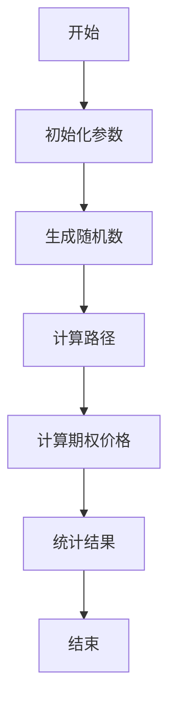

                 


# 金融衍生品定价模型优化

> **关键词**：金融衍生品定价，蒙特卡洛模拟，Black-Scholes模型，数值方法，风险管理

> **摘要**：本文深入探讨了金融衍生品定价模型的优化方法，从理论基础到算法实现，结合实际案例分析，全面解析了如何提升定价模型的准确性和效率。文章首先介绍了金融衍生品定价的基本概念和历史发展，然后详细分析了定价模型的核心理论与数学模型，接着重点讲解了蒙特卡洛模拟和数值方法在定价中的应用，最后通过具体案例展示了如何优化定价模型，并总结了优化过程中的关键点和注意事项。

---

# 第一部分: 金融衍生品定价模型优化背景与基础

## 第1章: 金融衍生品定价概述

### 1.1 金融衍生品的基本概念

#### 1.1.1 金融衍生品的定义
金融衍生品（Financial Derivatives）是指其价值依赖于其他基础资产（如股票、债券、商品等）或指数的金融工具。常见的衍生品包括期权、期货、掉期和互换等。

#### 1.1.2 金融衍生品的主要类型
- **期权**：买方有权在特定时间内以固定价格买入或卖出标的资产。
- **期货**：双方约定在未来以特定价格买卖标的资产。
- **掉期**：双方约定在未来交换资产或现金流。
- **互换**：双方约定在未来交换不同资产或现金流。

#### 1.1.3 金融衍生品的市场现状
衍生品市场是全球最大的金融市场之一，广泛应用于风险管理、投机和套利。然而，衍生品的价格波动性和复杂性也带来了巨大的挑战。

---

### 1.2 金融衍生品定价模型的发展历程

#### 1.2.1 早期定价模型的局限性
早期的定价模型（如简单的线性回归模型）无法捕捉标的资产的随机波动性和市场深度。

#### 1.2.2 Black-Scholes模型的提出
1973年，Black和Scholes提出了著名的Black-Scholes模型，为期权定价奠定了理论基础。该模型假设标的资产价格服从几何布朗运动。

#### 1.2.3 现代定价模型的演变
随着市场的复杂化，衍生品定价模型逐渐从单一资产模型扩展到多资产、多因素模型，并引入了跳跃过程和随机波动率等更复杂的假设。

---

### 1.3 金融衍生品定价模型优化的必要性

#### 1.3.1 现有模型的不足
- Black-Scholes模型假设标的资产价格服从几何布朗运动，但忽略了实际市场中的跳跃和 spikes。
- 参数估计的不准确性和市场环境的变化会影响模型的定价精度。

#### 1.3.2 市场环境的变化
金融危机和市场波动性增加对定价模型提出了更高的要求。

#### 1.3.3 技术进步对优化的推动
计算机技术的进步使得复杂的数值方法和蒙特卡洛模拟得以高效实现。

---

## 第2章: 金融衍生品定价的核心概念与理论基础

### 2.1 金融衍生品定价的基本原理

#### 2.1.1 随机过程与随机微分方程
- **随机过程**：描述资产价格随时间变化的随机性。
- **随机微分方程（SDE）**：用于建模资产价格的动态过程。

#### 2.1.2 马尔可夫过程与状态转移
马尔可夫过程假设未来的价格只依赖于当前的状态，而不考虑过去的轨迹。

#### 2.1.3 风险中性定价理论
在风险中性框架下，投资者对风险持中性态度，可以通过无风险利率调整标的资产的预期收益。

---

### 2.2 金融衍生品定价的关键因素

#### 2.2.1 标的资产价格波动
- 波动率是影响期权价格的重要因素。
- 高波动率通常意味着更高的期权价值。

#### 2.2.2 利率与时间价值
- 利率影响期权的时间价值。
- 时间价值是由于期权的持有期限而产生的价值。

#### 2.2.3 波动率与相关性
- 标的资产之间的相关性影响联合期权的定价。

---

### 2.3 金融衍生品定价的数学模型

#### 2.3.1 Black-Scholes模型的数学公式
$$ C = S_0 N(d_1) - K e^{-rT} N(d_2) $$
其中：
- \( C \) 是期权的现值
- \( S_0 \) 是标的资产当前价格
- \( K \) 是行权价
- \( r \) 是无风险利率
- \( T \) 是到期时间
- \( N(d) \) 是标准正态分布的累积分布函数
- \( d_1 = \frac{\ln(S_0/K) + (r + \sigma^2/2)T}{\sigma \sqrt{T}} \)
- \( d_2 = d_1 - \sigma \sqrt{T} \)

#### 2.3.2 布朗运动与随机波动模型
布朗运动描述了资产价格的随机游走：
$$ dS_t = \mu dt + \sigma dW_t $$
其中，\( W_t \) 是标准布朗运动。

#### 2.3.3 跳跃扩散过程与跳跃风险
跳跃扩散模型引入了跳跃过程以捕捉资产价格的突然变化。

---

## 第3章: 金融衍生品定价模型的优化方法

### 3.1 蒙特卡洛模拟在定价中的应用

#### 3.1.1 蒙特卡洛模拟的基本原理
蒙特卡洛模拟通过大量随机抽样来估计系统的期望值或其他统计量。

#### 3.1.2 蒙特卡洛模拟的实现步骤
1. 初始化参数（标的资产价格、波动率等）。
2. 生成随机数并模拟资产价格路径。
3. 计算每条路径对应的期权价格。
4. 统计所有路径的平均值作为期权的期望价格。

#### 3.1.3 蒙特卡洛模拟的优缺点
- **优点**：适用于高维问题，计算效率高。
- **缺点**：收敛速度慢，对参数敏感。

---

### 3.2 数值方法在定价模型中的应用

#### 3.2.1 有限差分法
有限差分法通过将连续的偏微分方程离散化来求解期权价格。
$$ \frac{\partial C}{\partial t} + \frac{1}{2} \sigma^2 S^2 \frac{\partial^2 C}{\partial S^2} - rC = 0 $$

#### 3.2.2 二叉树模型
二叉树模型通过构建树状结构来模拟资产价格的向上和向下波动。

#### 3.2.3 其他数值方法的比较
- **优点**：计算效率高。
- **缺点**：需要处理复杂的边界条件。

---

### 3.3 参数校准与模型选择

#### 3.3.1 参数校准的基本步骤
1. 收集市场数据。
2. 选择合适的模型。
3. 使用优化算法（如最小二乘法）校准模型参数。

#### 3.3.2 不同模型的适用场景
- **Black-Scholes模型**：适用于波动率恒定的市场。
- **蒙特卡洛模拟**：适用于高维问题和复杂市场条件。

#### 3.3.3 参数校准的优化技巧
- 使用历史数据进行校准。
- 结合市场实际情况调整模型假设。

---

## 第4章: 蒙特卡洛模拟的算法实现

### 4.1 蒙特卡洛模拟的流程图



### 4.2 蒙特卡洛模拟的Python实现

```python
import numpy as np
import scipy.stats as stats

def black_scholes(S, K, r, T, sigma):
    d1 = (np.log(S/K) + (r + sigma**2/2)*T) / (sigma*np.sqrt(T))
    d2 = d1 - sigma*np.sqrt(T)
    C = S * stats.norm.cdf(d1) - K * np.exp(-r*T) * stats.norm.cdf(d2)
    return C

# 参数设置
S = 100
K = 100
r = 0.05
T = 1
sigma = 0.2
n_paths = 100000

# 蒙特卡洛模拟
np.random.seed(42)
paths = np.exp(np.log(S) + np.random.randn(n_paths)*sigma*np.sqrt(T))
payoffs = np.maximum(black_scholes(S, K, r, T, sigma) - paths, 0)
option_price = np.mean(payoffs)

print(f"期权价格：{option_price:.4f}")
```

---

## 第5章: 系统分析与架构设计

### 5.1 系统功能设计


### 5.2 系统架构设计


### 5.3 系统交互设计


---

## 第6章: 项目实战

### 6.1 环境配置与代码实现

```python
import numpy as np
import matplotlib.pyplot as plt

# 环境配置
%matplotlib inline
np.random.seed(42)

# 核心实现
def generate_paths(S, T, N, sigma):
    dt = T / N
    paths = np.zeros((N+1, 1))
    paths[0] = S
    for i in range(1, N+1):
        paths[i] = paths[i-1] * np.exp((r - 0.5*sigma**2)*dt + sigma*np.sqrt(dt)*np.random.randn())
    return paths

# 可视化
S0 = 100
T = 1
N = 100
sigma = 0.2
r = 0.05

paths = generate_paths(S0, T, N, sigma)
plt.plot(paths)
plt.xlabel('时间')
plt.ylabel('资产价格')
plt.title('资产价格路径')
plt.show()
```

---

## 第7章: 最佳实践与总结

### 7.1 最佳实践

- **选择合适的模型**：根据市场条件和数据特点选择模型。
- **参数校准**：使用历史数据校准模型参数。
- **风险管理**：定期监控模型的准确性和稳定性。

### 7.2 小结

金融衍生品定价模型的优化是一个复杂而重要的任务。通过结合理论、算法和实际案例，我们可以显著提升模型的定价精度和计算效率。

### 7.3 注意事项

- 模型的准确性依赖于数据的完整性和参数的合理性。
- 定期更新模型以适应市场变化。

### 7.4 拓展阅读

- 建议深入学习随机过程和数值方法的相关知识。
- 关注最新的金融建模技术和发展趋势。

---

# 作者：AI天才研究院/AI Genius Institute & 禅与计算机程序设计艺术 /Zen And The Art of Computer Programming

