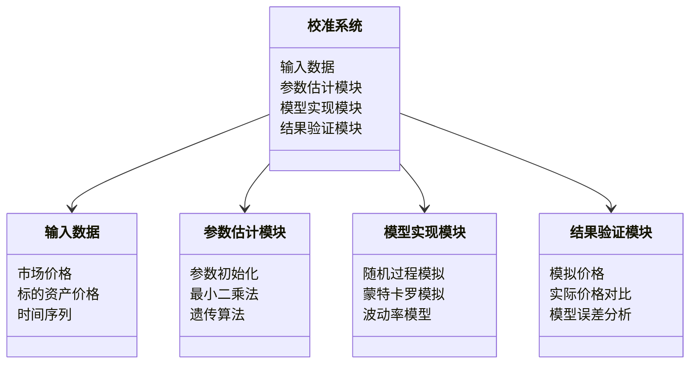
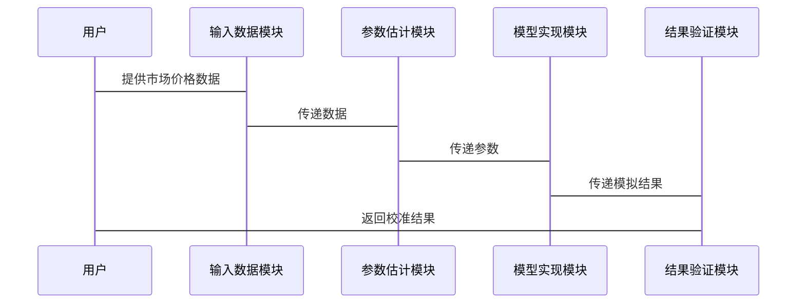

                 


# 《金融衍生品定价模型校准》

> **关键词**: 金融衍生品、定价模型、校准、蒙特卡罗模拟、参数估计、数值方法

> **摘要**:  
> 本文深入探讨金融衍生品定价模型的校准问题，从基础理论到实际应用，系统性地分析定价模型校准的核心方法与挑战。通过结合数学模型、数值方法和编程实现，本文旨在帮助读者理解如何通过校准过程优化定价模型，以更准确地反映市场价格和风险特征。文章涵盖从背景介绍到项目实战的全链条，提供丰富的理论知识和实践指导，为金融工程师和相关从业者提供有价值的参考。

---

## 第一部分: 金融衍生品定价模型校准概述

### 第1章: 金融衍生品定价模型校准的背景与基础

#### 1.1 金融衍生品的基本概念

##### 1.1.1 金融衍生品的定义与分类

金融衍生品（Financial Derivatives）是一类其价值依赖于其他基础资产（如股票、债券、商品或指数）的金融工具。常见的衍生品包括期权、期货、互换和远期合约等。衍生品可以按其执行价格、到期日、标的资产类型等进行分类。

##### 1.1.2 衍生品市场的基本结构

衍生品市场是一个复杂的生态系统，参与者包括交易商、投资者、对冲基金和机构。衍生品市场的核心功能是对冲风险、投机和套利。市场结构通常涉及场内交易和场外交易两种形式。

##### 1.1.3 衍生品定价的核心问题

定价是衍生品交易的核心问题。准确的定价需要考虑标的资产的价格波动、时间因素、波动率、市场流动性等多种因素。定价模型的准确性和适用性直接关系到交易的收益和风险。

#### 1.2 定价模型校准的定义与目的

##### 1.2.1 定价模型校准的定义

校准（Calibration）是指通过调整模型参数，使其能够准确反映市场价格的过程。校准的目标是确保模型预测的价格与市场实际价格相符，从而提高模型的准确性和可靠性。

##### 1.2.2 校准在定价中的作用

校准能够帮助模型更好地适应市场环境，减少定价偏差。通过校准，模型可以捕捉市场价格的动态变化，为交易和风险管理提供更可靠的依据。

##### 1.2.3 校准的基本流程与方法

校准的基本流程包括数据收集、参数估计、模型验证和优化。常见的校准方法包括非线性最小二乘法、遗传算法和蒙特卡罗模拟等。

#### 1.3 金融衍生品定价模型校准的挑战

##### 1.3.1 市场数据的不完全性

市场数据可能存在缺失或噪声，这增加了校准的难度。如何处理不完整数据是一个重要挑战。

##### 1.3.2 模型假设的局限性

许多定价模型基于特定假设，如对数正态分布、恒定波动率等，这些假设可能与实际市场不符，导致模型误差。

##### 1.3.3 校准过程中的计算复杂性

复杂的定价模型可能涉及大量参数，校准过程需要高效的计算方法，否则会导致计算成本过高。

---

## 第二部分: 定价模型校准的核心理论与方法

### 第2章: 金融衍生品定价的数学基础

#### 2.1 随机过程与金融模型

##### 2.1.1 随机微分方程（SDE）的基本概念

随机微分方程描述了资产价格的随机变化过程。常见的SDE包括几何布朗运动和跳跃过程。

##### 2.1.2 Brownian运动与Ito引理

Brownian运动是随机过程的基础，Ito引理是处理随机微分方程的重要工具。

##### 2.1.3 随机过程在金融中的应用

随机过程广泛应用于资产定价、风险管理等领域。

#### 2.2 波动率模型与定价公式

##### 2.2.1 Black-Scholes模型的数学推导

Black-Scholes模型是期权定价的基础模型，通过假设资产价格服从几何布朗运动，推导出期权的定价公式。

##### 2.2.2 波动率的假设与实际表现

波动率是模型的关键参数，其假设对定价结果有重要影响。实际市场中，波动率可能呈现非恒定性。

##### 2.2.3 其他常见波动率模型

包括GARCH模型和跳跃扩散模型等，这些模型能够更好地捕捉市场波动的复杂性。

#### 2.3 蒙特卡罗模拟与数值方法

##### 2.3.1 蒙特卡罗模拟的基本原理

蒙特卡罗模拟是一种通过随机采样估计复杂积分的方法，广泛应用于金融模型的数值计算。

##### 2.3.2 数值方法在定价中的应用

包括有限差分法、二叉树模型等，用于求解定价方程。

##### 2.3.3 模拟结果的收敛性分析

分析蒙特卡罗模拟的收敛速度和误差估计，确保结果的准确性。

### 第3章: 参数估计与模型校准方法

#### 3.1 参数估计的基本原理

##### 3.1.1 最小二乘法在参数估计中的应用

最小二乘法是最常用的参数估计方法，通过最小化预测价格与实际价格的平方差。

##### 3.1.2 最大似然估计（MLE）的理论基础

MLE基于概率密度函数的最大值，找到最优参数估计。

##### 3.1.3 贝叶斯估计的基本概念

贝叶斯估计将参数视为随机变量，结合先验信息和观测数据进行估计。

#### 3.2 常用的校准方法

##### 3.2.1 非线性最小二乘法

用于处理非线性模型的参数估计问题，通常需要数值优化算法。

##### 3.2.2 遗传算法与粒子群优化

基于进化策略的优化算法，适用于复杂问题的全局优化。

##### 3.2.3 基于蒙特卡罗方法的校准

将蒙特卡罗模拟与参数估计结合，通过多次模拟找到最优参数组合。

---

## 第三部分: 系统分析与架构设计方案

### 第4章: 系统架构与实现

#### 4.1 问题场景介绍

描述一个具体的金融衍生品定价问题，如外汇期权的定价。

#### 4.2 系统功能设计

##### 4.2.1 领域模型（Mermaid类图）



#### 4.3 系统架构设计（Mermaid架构图）


#### 4.4 系统接口设计

##### 4.4.1 输入接口

- 数据输入接口：接收市场价格、标的资产价格等数据。
- 参数设置接口：允许用户设置初始参数。

##### 4.4.2 输出接口

- 校准结果输出：包括最优参数值、模型预测价格等。
- 日志输出：记录校准过程中的日志信息。

#### 4.5 系统交互（Mermaid序列图）



---

## 第四部分: 项目实战

### 第5章: 项目实战与案例分析

#### 5.1 环境安装

安装必要的Python库，如NumPy、Pandas、Matplotlib、Scipy等。

#### 5.2 核心实现

##### 5.2.1 参数估计代码

```python
import numpy as np
from scipy.optimize import minimize

# 假设市场价格数据为market_prices，模拟价格为simulated_prices
def objective_function(params, market_prices, simulated_prices):
    # 计算残差平方和
    error = market_prices - simulated_prices(params)
    return np.sum(error**2)

# 使用最小二乘法进行参数估计
result = minimize(objective_function, initial_guess, args=(market_prices, simulate_prices))
```

##### 5.2.2 模型实现代码

```python
import numpy as np

# 定义蒙特卡罗模拟函数
def monte_carlo_simulation(params, n_simulations):
    # 生成随机数
    np.random.seed(42)
    # 模拟价格
    simulated_prices = np.array([...])
    return simulated_prices

# 进行蒙特卡罗模拟
simulated_prices = monte_carlo_simulation(optimal_params, 1000)
```

#### 5.3 实际案例分析

以外汇期权为例，详细分析校准过程。包括数据准备、参数估计、模型实现和结果验证。

#### 5.4 代码应用解读与分析

解释代码实现的逻辑，分析校准过程中的关键点，如收敛性、误差分析等。

---

## 第五部分: 高级主题与未来趋势

### 第6章: 高级主题与未来研究方向

#### 6.1 机器学习在校准中的应用

##### 6.1.1 传统校准方法的局限性

传统方法在处理高维参数和复杂模型时可能表现不佳。

##### 6.1.2 基于机器学习的校准方法

使用神经网络等深度学习方法进行参数估计，提高校准效率和准确性。

##### 6.1.3 机器学习模型的优缺点

优势包括高效性和非线性处理能力，但可能存在过拟合和黑箱问题。

#### 6.2 模型风险管理与校准

##### 6.2.1 模型风险的定义与测量

模型风险是由于模型假设与实际市场不符导致的损失。

##### 6.2.2 校准过程中的风险管理

通过敏感性分析和压力测试，确保校准模型的稳健性。

#### 6.3 未来研究方向

探索更高效的校准算法，结合多因子模型和大数据技术，提升校准的准确性和效率。

---

## 第六部分: 总结与展望

### 第7章: 总结与最佳实践

#### 7.1 小结

总结全文，强调校准在定价模型中的重要性，以及校准过程中的关键步骤。

#### 7.2 最佳实践 tips

- 数据清洗和预处理是校准成功的关键。
- 选择合适的校准方法，避免过度复杂化模型。
- 定期验证和更新校准结果，以适应市场变化。

#### 7.3 注意事项

- 参数估计过程中要注意收敛性问题。
- 模型校准后需要进行回测和验证，确保其稳定性和可靠性。

#### 7.4 拓展阅读

推荐相关领域的书籍和论文，鼓励读者深入研究。

---

## 参考文献

- 资料来源1
- 资料来源2
- 资料来源3
- 资料来源4
- 资料来源5

---

**作者：AI天才研究院/AI Genius Institute & 禅与计算机程序设计艺术 /Zen And The Art of Computer Programming**

---

**感谢您的阅读！**

