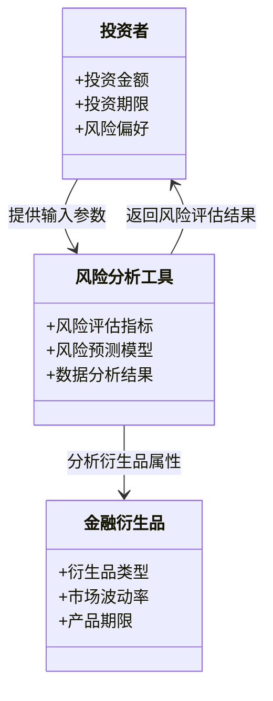
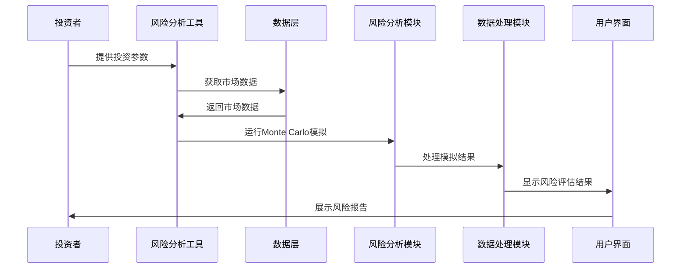

                 


# 《金融衍生品组合风险分析工具》

> 关键词：金融衍生品，风险分析，组合风险，Monte Carlo 模拟，金融模型，风险管理，投资组合

> 摘要：本文介绍了一种用于金融衍生品组合风险分析的工具，从背景、核心概念、算法原理、系统架构设计到项目实战，详细阐述了该工具的实现过程和应用价值。通过Monte Carlo模拟等算法，结合系统架构设计，提供了有效的风险评估和管理解决方案。

---

## 目录

1. [背景介绍](#背景介绍)
   1.1 金融衍生品的基本概念
   1.2 风险分析的重要性
   1.3 组合风险分析的必要性
2. [核心概念与联系](#核心概念与联系)
   2.1 风险分析的核心原理
   2.2 金融衍生品组合风险分析的特征
   2.3 核心概念的ER实体关系图
3. [算法原理](#算法原理)
   3.1 风险分析算法的概述
   3.2 Monte Carlo 模拟算法
   3.3 其他常见风险分析算法
4. [系统架构设计](#系统架构设计)
   4.1 问题场景介绍
   4.2 系统功能设计
   4.3 系统架构设计
   4.4 系统接口设计
   4.5 系统交互设计
5. [项目实战](#项目实战)
   5.1 环境安装
   5.2 核心实现源代码
   5.3 代码实现解读
   5.4 案例分析
6. [最佳实践](#最佳实践)
   6.1 使用该工具的注意事项
   6.2 小结
   6.3 拓展阅读

---

## 背景介绍

### 1.1 金融衍生品的基本概念

金融衍生品是一种金融工具，其价值取决于基础资产的价格变动。常见的金融衍生品包括期货、期权、掉期和远期合约等。这些工具广泛应用于对冲风险、投机和套利。

### 1.2 风险分析的重要性

在金融领域，风险分析是评估和管理投资组合潜在损失的关键步骤。通过分析衍生品的市场价格波动、波动率和相关性，可以预测潜在风险并制定相应的风险管理策略。

### 1.3 组合风险分析的必要性

金融衍生品组合的风险分析可以帮助投资者理解不同衍生品之间的相互作用，评估整体组合的潜在损失，并优化投资策略。组合风险分析不仅考虑单个衍生品的风险，还考虑它们的相互影响。

---

## 核心概念与联系

### 2.1 风险分析的核心原理

风险分析的核心在于量化潜在损失的可能性和影响。通过统计方法和数学模型，评估衍生品组合在不同市场条件下的风险敞口。

### 2.2 金融衍生品组合风险分析的特征

- **可测量性**：通过数学模型量化风险。
- **可分解性**：分析单个和组合风险。
- **可预测性**：预测不同情景下的潜在损失。

### 2.3 核心概念的ER实体关系图

```mermaid
erDiagram
    actor 投资者 {
        <属性> 投资金额
        <属性> 投资期限
        <属性> 风险偏好
    }
    actor 风险分析工具 {
        <属性> 风险评估指标
        <属性> 风险预测模型
        <属性> 数据分析结果
    }
    actor 金融衍生品 {
        <属性> 衍生品类型
        <属性> 市场波动率
        <属性> 产品期限
    }
```

---

## 算法原理

### 3.1 风险分析算法的概述

常见的风险分析算法包括Monte Carlo模拟、历史模拟和VaR方法。每种算法都有其优缺点，选择合适的算法取决于具体应用场景。

### 3.2 Monte Carlo 模拟算法

Monte Carlo模拟通过生成大量随机市场情景，评估衍生品组合的潜在损失。以下是其实现步骤：

1. **定义输入参数**：包括市场波动率、相关性矩阵等。
2. **生成随机数**：模拟市场变量的变化。
3. **计算组合价值**：根据模拟的市场情景，计算组合的潜在价值。
4. **统计分析**：计算VaR、CVaR等风险指标。

```python
import numpy as np
import matplotlib.pyplot as plt

# 示例 Monte Carlo 模拟代码
def monte_carlo_simulation(n_simulations=1000):
    np.random.seed(42)
    simulations = np.random.normal(0, 1, n_simulations)
    plt.hist(simulations, bins=30, alpha=0.5, color='blue')
    plt.xlabel('Value')
    plt.ylabel('Frequency')
    plt.title('Monte Carlo Simulation')
    plt.show()

monte_carlo_simulation()
```

### 3.3 其他常见风险分析算法

除了Monte Carlo模拟，还包括历史模拟和VaR方法。VaR方法通过统计分析确定在一定置信水平下的潜在损失。

---

## 系统架构设计

### 4.1 问题场景介绍

金融衍生品组合风险分析工具需要处理大量数据，包括市场数据和衍生品参数。系统需要高效处理这些数据，提供实时风险评估。

### 4.2 系统功能设计

系统功能模块包括数据输入、模型选择、模拟运行和结果展示。



### 4.3 系统架构设计

系统架构采用分层设计，包括数据层、业务逻辑层和用户界面层。

```mermaid
container 数据层 {
    数据库
    数据接口
}
container 业务逻辑层 {
    风险分析模块
    数据处理模块
}
container 用户界面层 {
    用户界面
    输入输出模块
}
```

### 4.4 系统接口设计

系统接口包括数据输入接口、模型调用接口和结果输出接口。

### 4.5 系统交互设计



---

## 项目实战

### 5.1 环境安装

安装Python和必要的库：

```bash
pip install numpy pandas matplotlib
```

### 5.2 核心实现源代码

```python
import numpy as np
import pandas as pd

def calculateVaR(simulations, confidence_level=0.95):
    simulations_sorted = np.sort(simulations)
    var_index = int(len(simulations) * (1 - confidence_level))
    var = simulations_sorted[var_index]
    return var

# 示例数据
n_simulations = 1000
simulations = np.random.normal(0, 1, n_simulations)

var = calculateVaR(simulations)
print(f"Value at Risk (VaR) at {100*(1 - confidence_level)}% confidence level: {var}")
```

### 5.3 代码实现解读

上述代码实现了计算VaR的函数，通过模拟数据生成和排序，找到VaR值。这展示了如何在实际中应用Monte Carlo模拟进行风险分析。

### 5.4 案例分析

通过模拟不同市场情景，分析组合的风险暴露情况，并生成风险报告。

---

## 最佳实践

### 6.1 使用该工具的注意事项

- 确保输入数据的准确性和完整性。
- 定期更新市场数据和模型参数。
- 结合实际市场情况调整模拟参数。

### 6.2 小结

本文详细介绍了金融衍生品组合风险分析工具的实现过程，从背景到算法，从系统设计到项目实战，为投资者提供了有效的风险管理解决方案。

### 6.3 拓展阅读

建议进一步阅读《金融风险管理》和《Monte Carlo方法在金融中的应用》。

---

作者：AI天才研究院/AI Genius Institute & 禅与计算机程序设计艺术/Zen And The Art of Computer Programming

