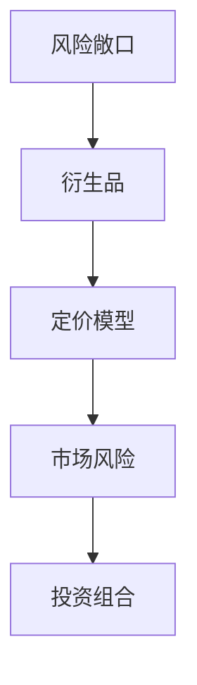
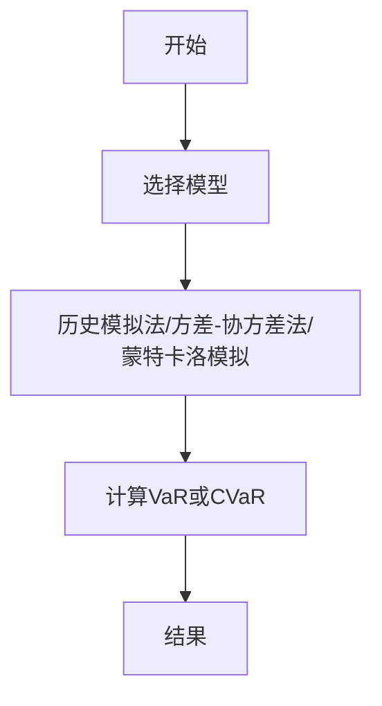
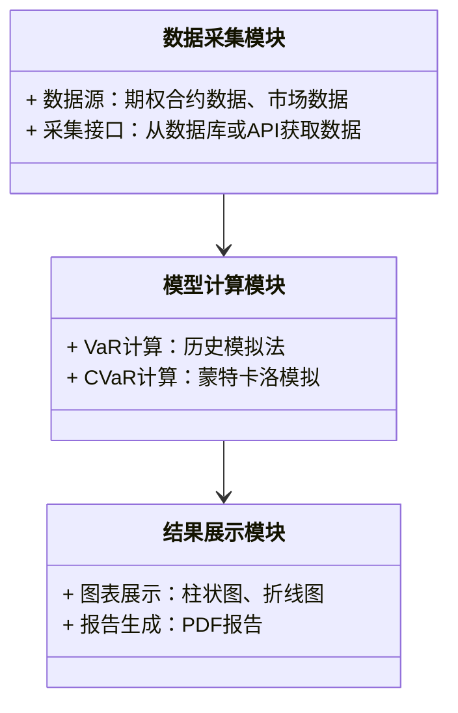
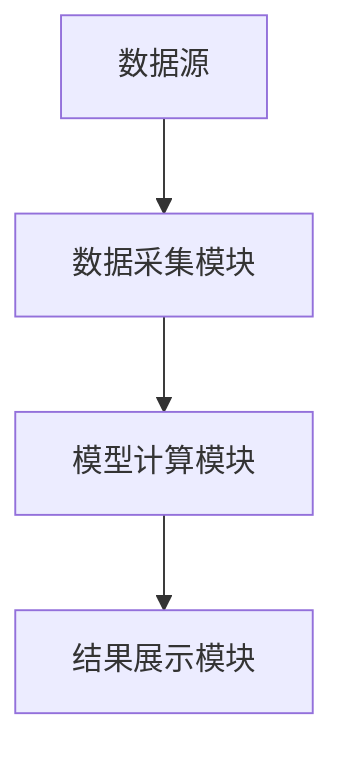
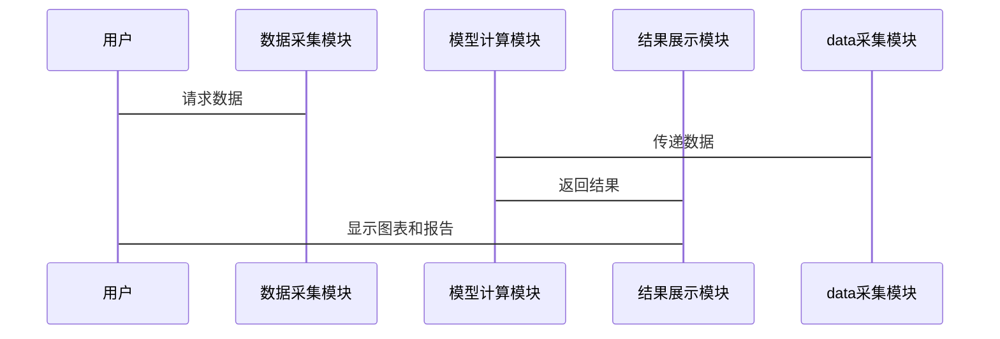

                 


# 金融衍生品风险敞口分析

## 关键词：金融衍生品，风险敞口，VaR，Black-Scholes，系统架构

## 摘要：本文详细探讨了金融衍生品的风险敞口分析，从基本概念到数学模型，再到系统设计和实战应用，全面解析如何有效管理和评估金融衍生品带来的风险。

---

# 第1章: 金融衍生品与风险敞口概述

## 1.1 金融衍生品的基本概念

### 1.1.1 金融衍生品的定义

金融衍生品是从基础金融资产或指数派生出来的金融工具，包括期权、期货、掉期等。它们的价值依赖于基础资产的价格波动。

### 1.1.2 金融衍生品的分类

1. 期权：买方有权在特定时间以特定价格购买或出售资产。
2. 期货：在未来特定时间按约定价格买卖资产的合同。
3. 掉期：约定在未来交换资产或现金流的协议。

### 1.1.3 金融衍生品的市场特点

- 杠杆效应：用较少的资金控制较大的头寸。
- 风险放大：潜在收益和损失都可能很大。
- 复杂性：涉及复杂的数学模型和市场因素。

## 1.2 风险敞口的定义与重要性

### 1.2.1 风险敞口的定义

风险敞口是投资者在某一资产或市场上的暴露程度，衡量可能的损失程度。

### 1.2.2 风险敞口的类型

1. 市场风险：因市场价格波动带来的损失。
2. 信用风险：交易对手违约的风险。
3. 流动性风险：难以快速变现的风险。

### 1.2.3 风险敞口在金融衍生品中的重要性

- 帮助机构评估和管理潜在损失。
- 有效配置资本，控制风险。
- 为投资决策提供数据支持。

## 1.3 金融衍生品风险敞口分析的目的与方法

### 1.3.1 风险敞口分析的目的

- 评估潜在损失。
- 优化投资组合。
- 辅助决策制定。

### 1.3.2 风险敞口分析的主要方法

1. 历史模拟法：基于历史数据估计损失。
2. 方差-协方差法：基于资产的波动性和相关性。
3. 蒙特卡洛模拟：通过随机抽样模拟市场情况。

### 1.3.3 风险敞口分析的步骤

1. 确定分析目标。
2. 选择适当的模型。
3. 收集和处理数据。
4. 计算风险敞口。
5. 验证和调整模型。

## 1.4 本章小结

本章介绍了金融衍生品的基本概念和风险敞口的重要性，为后续分析奠定了基础。

---

# 第2章: 金融衍生品的数学模型与定价方法

## 2.1 金融衍生品定价的基本原理

### 2.1.1 随机过程与金融市场的建模

- Brown运动：描述资产价格的随机波动。
- 随机微分方程：如$dS = \mu S dt + \sigma S dW$，用于建模资产价格。

### 2.1.2 马科维茨投资组合理论

通过优化投资组合，降低风险。

### 2.1.3 马尔可夫过程

用于描述资产价格的变化，假设未来价格仅依赖当前价格。

## 2.2 Black-Scholes期权定价模型

### 2.2.1 Black-Scholes模型的假设条件

- 股价服从几何布朗运动。
- 无交易成本和税收。
- 市场无套利机会。

### 2.2.2 Black-Scholes公式的推导

$$ C = S_0 \Phi(d_1) - K e^{-rT} \Phi(d_2) $$

其中，$$d_1 = \frac{\ln(S_0/K) + (r + \sigma^2/2)T}{\sigma \sqrt{T}}$$

$$d_2 = d_1 - \sigma \sqrt{T}$$

### 2.2.3 Black-Scholes公式的应用

案例：某股票价格为100，执行价105，时间到期1年，无风险利率5%，波动率20%。

计算得：d1≈0.19，d2≈-0.09，$\Phi(0.19)≈0.5753$，$\Phi(-0.09)≈0.4641$，则期权价格≈100*0.5753 - 105*exp(-0.05)*0.4641≈57.53 - 48.23≈9.30。

## 2.3 其他衍生品定价模型

### 2.3.1 外汇期权定价模型

与普通期权类似，需考虑汇率波动。

### 2.3.2 利率期权定价模型

基于利率模型，如Vasicek模型。

### 2.3.3 信用衍生品定价模型

考虑信用风险，如Merton模型。

## 2.4 数学模型与公式

### 2.4.1 Black-Scholes公式

$$ C = S_0 \Phi(d_1) - K e^{-rT} \Phi(d_2) $$

### 2.4.2 随机微分方程

$$ dS = \mu S dt + \sigma S dW $$

## 2.5 本章小结

本章介绍了Black-Scholes模型和其他衍生品定价方法，为风险分析提供数学基础。

---

# 第3章: 风险敞口分析的核心概念与联系

## 3.1 风险敞口的核心概念

### 3.1.1 风险敞口的构成要素

1. 资产价格波动。
2. 交易对手信用。
3. 市场流动性。

### 3.1.2 风险敞口的度量指标

1. VaR：在特定置信水平下的最大损失。
2. CVaR：超过VaR情况下的平均损失。

### 3.1.3 风险敞口与市场风险的关系

风险敞口是市场风险的核心指标，反映资产价格波动带来的损失。

## 3.2 核心概念的联系

### 3.2.1 风险敞口与衍生品定价的关系

风险敞口分析依赖于定价模型，准确的定价有助于准确评估风险。

### 3.2.2 风险敞口与市场波动性的关系

市场波动性越大，风险敞口越大。

### 3.2.3 风险敞口与投资组合管理的关系

通过调整投资组合，可以降低总体风险敞口。

## 3.3 实体关系图



## 3.4 本章小结

本章解释了风险敞口的核心概念及其与其他金融概念的联系。

---

# 第4章: 风险敞口分析的算法原理

## 4.1 基于VaR的风险敞口分析算法

### 4.1.1 VaR的定义与计算方法

- VaR：在给定置信水平下，可能的最大损失。
- 计算方法：历史模拟法、方差-协方差法、蒙特卡洛模拟。

### 4.1.2 历史模拟法

步骤：
1. 收集历史资产价格数据。
2. 计算资产收益的历史分布。
3. 确定VaR值，如第5%的分位数。

### 4.1.3 方差-协方差法

步骤：
1. 计算资产收益的均值和方差。
2. 假设收益服从正态分布。
3. 计算VaR值，如均值 - z * 标准差，其中z是对应置信水平的z值。

### 4.1.4 蒙特卡洛模拟法

步骤：
1. 生成大量资产价格的随机样本。
2. 计算每种情况下的收益。
3. 确定VaR值，如第5%的分位数。

## 4.2 基于CVaR的风险敞口分析算法

### 4.2.1 CVaR的定义与计算方法

CVaR是在VaR的基础上，考虑超过VaR情况下的平均损失。

计算方法：
1. 计算VaR。
2. 计算VaR以上的平均损失。

### 4.2.2 CVaR的优势

更关注尾部风险，提供更全面的风险度量。

## 4.3 算法流程图



## 4.4 本章小结

本章详细介绍了VaR和CVaR的计算方法及其应用。

---

# 第5章: 系统分析与架构设计方案

## 5.1 问题场景介绍

假设某银行需要分析其期权投资的风险敞口，使用VaR和CVaR模型。

## 5.2 系统功能设计

### 5.2.1 领域模型



### 5.2.2 系统架构设计



## 5.3 系统接口设计

1. 数据接口：API接口获取市场数据。
2. 计算接口：调用VaR和CVaR计算函数。
3. 展示接口：图表展示和报告生成。

## 5.4 系统交互流程



## 5.5 本章小结

本章设计了一个完整的系统架构，实现风险敞口分析的自动化。

---

# 第6章: 项目实战

## 6.1 环境安装

安装Python、numpy、pandas、scipy。

```bash
pip install numpy pandas scipy
```

## 6.2 核心实现

### 6.2.1 VaR计算

```python
import numpy as np

def calculate_var(historical_returns, confidence_level=0.05):
    sorted_returns = np.sort(historical_returns)
    var_index = int(len(sorted_returns) * (1 - confidence_level))
    var = sorted_returns[var_index]
    return var
```

### 6.2.2 CVaR计算

```python
def calculate_cvar(historical_returns, confidence_level=0.05):
    sorted_returns = np.sort(historical_returns)
    var_index = int(len(sorted_returns) * (1 - confidence_level))
    cvar = np.mean(sorted_returns[var_index:])
    return cvar
```

### 6.2.3 示例

```python
import pandas as pd
import numpy as np

# 假设历史收益数据
returns = np.array([0.02, -0.01, 0.03, -0.02, 0.01])
var = calculate_var(returns)
cvar = calculate_cvar(returns)
print(f"VaR: {var}, CVaR: {cvar}")
```

## 6.3 应用解读

- VaR给出在95%置信水平下的最大损失。
- CVaR给出超过VaR情况下的平均损失。

## 6.4 案例分析

案例：某期权组合的历史收益数据，计算VaR和CVaR，评估风险敞口。

## 6.5 本章小结

本章通过实际案例展示了风险敞口分析的实现过程。

---

# 第7章: 总结与展望

## 7.1 最佳实践 tips

- 数据质量至关重要。
- 选择合适的模型。
- 定期更新模型参数。
- 结合市场动态调整风险敞口。

## 7.2 注意事项

- 模型假设的限制。
- 数据偏差的风险。
- 市场环境变化的影响。

## 7.3 未来展望

- 引入机器学习模型，如神经网络，提高预测精度。
- 开发实时风险监控系统，及时预警。

## 7.4 本章小结

总结了风险敞口分析的关键点，并展望了未来的发展方向。

---

# 作者：AI天才研究院/AI Genius Institute & 禅与计算机程序设计艺术 /Zen And The Art of Computer Programming

---

通过以上结构，您可以根据需要扩展每个章节的内容，添加更多详细的技术细节、代码示例和实际案例分析。

