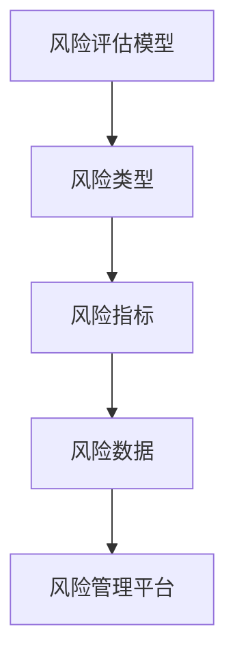
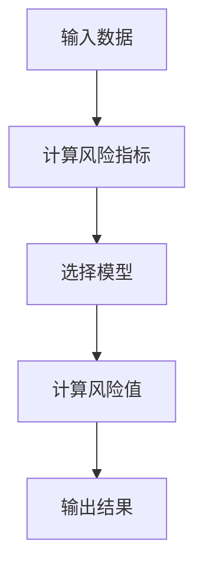
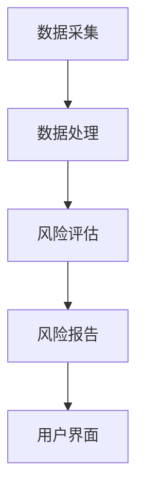
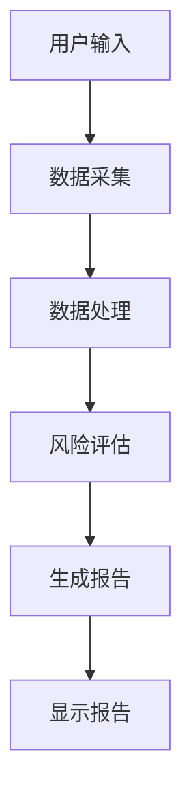

                 


# 金融衍生品风险管理平台

> 关键词：金融衍生品、风险管理、数学模型、算法原理、系统架构

> 摘要：本文详细探讨了金融衍生品风险管理平台的构建过程，从核心概念、数学模型到系统架构，再到项目实战，层层解析。通过理论与实践相结合，为读者提供一个全面了解和构建金融衍生品风险管理平台的指南。

---

## 第1章: 金融衍生品风险管理平台的背景与意义

### 1.1 金融衍生品的基本概念

#### 1.1.1 金融衍生品的定义与分类
金融衍生品（Financial Derivatives）是基于基础金融资产（如股票、债券、商品等）或指数的衍生工具，其价值取决于基础资产的价格变动。常见的金融衍生品包括期权、期货、掉期和互换等。金融衍生品可以分为以下几类：
- **场内衍生品**：在交易所内交易，如期货和期权。
- **场外衍生品**：在场外市场交易，如定制互换合约。

#### 1.1.2 金融衍生品的市场现状与发展
近年来，金融衍生品市场迅速发展，成为现代金融市场的重要组成部分。根据国际清算银行（BIS）的数据，全球场外衍生品市场的规模已超过数万亿美元。金融衍生品的广泛应用使得市场更加复杂，但也提高了风险管理的难度。

#### 1.1.3 金融衍生品风险管理的重要性
金融衍生品的高杠杆性和复杂性使其成为金融市场的主要风险来源。有效的风险管理可以降低市场波动，保护投资者利益，并确保金融系统的稳定。

### 1.2 金融衍生品风险管理平台的定义与目标

#### 1.2.1 平台的定义
金融衍生品风险管理平台是一个集成化的系统，用于监控、评估和控制与金融衍生品相关的风险。它结合了数学模型、算法和实时数据处理技术，为金融机构提供决策支持。

#### 1.2.2 平台的目标与功能
- **目标**：通过实时数据处理和风险评估模型，帮助金融机构识别、量化和控制金融衍生品相关风险。
- **功能**：包括数据采集、风险评估、风险报告生成、风险预警和决策支持。

#### 1.2.3 平台的边界与外延
金融衍生品风险管理平台的边界包括数据源（如市场数据、交易数据）、风险模型和用户界面。其外延涉及与外部系统的集成，如交易系统和数据库。

### 1.3 本章小结
本章介绍了金融衍生品的基本概念、市场现状及风险管理的重要性，并详细阐述了风险管理平台的定义、目标和边界。

---

## 第2章: 金融衍生品风险管理的核心概念

### 2.1 金融衍生品的风险类型

#### 2.1.1 市场风险
市场风险是指由于市场价格波动导致的投资损失。例如，股票价格的波动可能会影响期权的价值。

#### 2.1.2 信用风险
信用风险是指交易对手违约的风险。在金融衍生品中，信用风险尤为重要，因为许多衍生品是场外交易，依赖于交易对手的信用。

#### 2.1.3 流动性风险
流动性风险是指无法在合理时间内以合理价格买卖资产的风险。在金融衍生品市场中，某些复杂工具可能难以快速变现。

### 2.2 风险管理的核心要素

#### 2.2.1 风险评估模型
风险评估模型用于量化不同类型的风险。常见的模型包括VaR（Value at Risk）和CVaR（Conditional Value at Risk）。

#### 2.2.2 风险控制策略
风险控制策略包括头寸限制、止损指令和对冲策略。这些策略可以帮助机构降低风险敞口。

#### 2.2.3 风险报告机制
风险报告机制用于定期监控和报告风险状况，帮助管理层制定有效的风险管理策略。

### 2.3 核心概念的ER实体关系图



### 2.4 本章小结
本章分析了金融衍生品的主要风险类型，并讨论了风险管理的核心要素，包括风险评估模型、控制策略和报告机制。

---

## 第3章: 金融衍生品风险管理的数学模型

### 3.1 随机过程与概率论基础

#### 3.1.1 布朗运动与随机微分方程
布朗运动是一种随机过程，常用于描述金融市场的价格波动。随机微分方程（SDE）用于描述包含随机因素的动态系统。

#### 3.1.2 马尔可夫过程
马尔可夫过程是一种记忆无关的随机过程，常用于金融模型中，如马尔可夫链蒙特卡洛方法。

#### 3.1.3 伊藤引理
伊藤引理是随机微分方程的重要工具，用于计算随机过程的积分。

### 3.2 金融衍生品定价的数学模型

#### 3.2.1 Black-Scholes模型
Black-Scholes模型用于定价欧式期权，公式如下：

$$ C = S_0 \Phi(d_1) - K e^{-rT} \Phi(d_2) $$

其中，$d_1 = \frac{\ln(S_0/K) + (r + \sigma^2/2)T}{\sigma \sqrt{T}}$，$d_2 = d_1 - \sigma \sqrt{T}$。

#### 3.2.2 二叉树模型
二叉树模型通过构建价格树来模拟期权价格的变化，适用于美式期权定价。

#### 3.2.3蒙特卡洛模拟
蒙特卡洛模拟通过生成大量随机数来模拟市场价格，适用于高维问题。

### 3.3 风险度量的数学公式

#### 3.3.1 方差与标准差
方差衡量数据的离散程度，标准差是方差的平方根。

$$ \text{方差} = \frac{1}{n}\sum_{i=1}^{n}(x_i - \bar{x})^2 $$

$$ \text{标准差} = \sqrt{\text{方差}} $$

#### 3.3.2 VaR（Value at Risk）
VaR在给定置信水平下，是资产组合可能的损失值。

$$ VaR = \alpha \text{分位数} $$

#### 3.3.3 CVaR（Conditional Value at Risk）
CVaR是VaR的条件期望，用于衡量尾部风险。

### 3.4 算法流程图



### 3.5 本章小结
本章介绍了金融衍生品风险管理中常用的数学模型和算法，包括随机过程、定价模型和风险度量方法。

---

## 第4章: 金融衍生品风险管理平台的系统架构

### 4.1 系统功能设计

#### 4.1.1 数据采集模块
数据采集模块负责收集市场数据、交易数据和风险数据。

#### 4.1.2 风险评估模块
风险评估模块基于数学模型计算风险指标，如VaR和CVaR。

#### 4.1.3 风险报告模块
风险报告模块生成风险报告，并提供可视化界面。

### 4.2 系统架构设计



### 4.3 系统接口设计

#### 4.3.1 数据接口
数据接口用于与外部数据源（如市场数据提供商）连接。

#### 4.3.2 用户接口
用户接口提供直观的操作界面，供用户输入参数和查看报告。

### 4.4 系统交互设计



### 4.5 本章小结
本章详细设计了金融衍生品风险管理平台的系统架构，包括功能模块、架构图和接口设计。

---

## 第5章: 金融衍生品风险管理平台的项目实战

### 5.1 环境安装

#### 5.1.1 安装Python
安装Python 3.8及以上版本，并安装必要的库，如NumPy、Pandas和Matplotlib。

#### 5.1.2 安装其他依赖
安装其他依赖库，如SciPy和Plotly。

### 5.2 核心实现

#### 5.2.1 数据采集代码
```python
import pandas as pd
import requests

# 获取市场数据
url = "https://api.example.com/market_data"
data = requests.get(url).json()
df = pd.DataFrame(data)
```

#### 5.2.2 风险评估代码
```python
import numpy as np

# 计算VaR
def calculate_var(data, confidence_level):
    sorted_data = np.sort(data)
    p = confidence_level / 100
    var = sorted_data[int(p * len(sorted_data))]
    return var

var = calculate_var(data, 95)
print(f"VaR at 95% confidence level: {var}")
```

#### 5.2.3 风险报告代码
```python
import matplotlib.pyplot as plt

# 绘制风险分布图
data.plot.hist(bins=20, title="Risk Distribution")
plt.show()
```

### 5.3 案例分析
通过实际案例分析，展示平台在风险管理中的应用，如计算VaR并生成风险报告。

### 5.4 本章小结
本章通过实际项目展示了风险管理平台的实现过程，包括环境配置、核心代码和案例分析。

---

## 第6章: 总结与展望

### 6.1 总结
本文详细探讨了金融衍生品风险管理平台的构建过程，从核心概念到系统架构，再到项目实战，提供了全面的指导。

### 6.2 展望
未来，随着人工智能和大数据技术的发展，金融衍生品风险管理平台将更加智能化和自动化。

### 6.3 最佳实践 Tips
- 使用高质量的数据源。
- 定期更新风险模型。
- 结合实际业务需求进行定制化开发。

### 6.4 本章小结
本章总结了全文，并展望了未来的发展方向。

---

## 作者

作者：AI天才研究院/AI Genius Institute & 禅与计算机程序设计艺术 /Zen And The Art of Computer Programming

