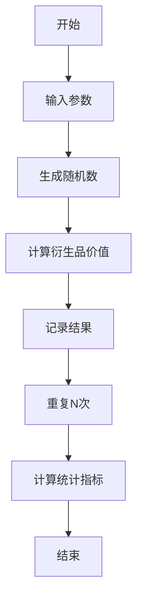

                 


# 金融衍生品风险评估模型

**关键词**：金融衍生品、风险评估、VaR、CVaR、蒙特卡洛模拟

**摘要**：  
本文详细探讨了金融衍生品风险评估模型的构建与应用。从基础概念到算法实现，结合实际案例，深入分析了风险评估的核心原理与方法。文章涵盖了金融衍生品的基本概念、风险评估的核心概念、主要算法原理、系统架构设计以及项目实战等内容，旨在为读者提供全面的理论指导和实践参考。

---

## 第1章: 金融衍生品与风险评估概述

### 1.1 金融衍生品的基本概念  
金融衍生品是一种金融工具，其价值依赖于其他资产的价格。常见的类型包括期货、期权、掉期和远期合约。这些工具常用于对冲风险或投机。  

**1.1.1 金融衍生品的定义**  
金融衍生品是基于标的资产的衍生金融工具，其价值由标的资产的价格波动决定。  

**1.1.2 金融衍生品的分类**  
- **期货**：在将来某一特定时间以预定价格买卖资产的合约。  
- **期权**：买方有权在特定时间以预定价格买入或卖出资产的权利。  
- **掉期**：双方约定在未来某一时间交换资产或现金流的合约。  
- **远期合约**：定制化合约，双方约定在未来特定时间以特定价格买卖资产。  

**1.1.3 金融衍生品的市场现状**  
衍生品市场是全球最大的金融市场之一，广泛应用于风险管理、投机和套利。  

### 1.2 风险评估的基本概念  
风险评估是对可能损失的量化。在金融衍生品中，主要风险包括市场风险、信用风险和操作风险。  

**1.2.1 风险的定义与分类**  
- **市场风险**：资产价格波动导致的损失。  
- **信用风险**：交易对手违约的风险。  
- **操作风险**：因操作失误或系统故障导致的损失。  

**1.2.2 金融衍生品中的主要风险类型**  
- **市场风险**：由于市场价格波动导致的衍生品价值损失。  
- **信用风险**：交易对手无法履行合约的风险。  
- **流动性风险**：难以在合理价格买卖衍生品的风险。  

**1.2.3 风险评估的重要性**  
准确评估风险有助于机构制定合理的风险管理策略，避免重大损失。  

### 1.3 金融衍生品风险评估模型的背景与意义  
随着金融市场的复杂化，风险评估模型变得至关重要。模型帮助机构量化和管理风险，避免重大损失。  

**1.3.1 金融衍生品风险的复杂性**  
衍生品的价值依赖于多种因素，如市场波动、利率变化和信用状况，导致风险评估的复杂性。  

**1.3.2 风险评估模型的发展历程**  
从简单的波动率模型到复杂的非线性模型，风险评估模型不断发展，以适应市场变化。  

**1.3.3 建立模型的必要性与目标**  
建立模型的目的是量化风险，帮助机构制定有效的风险管理策略。  

---

## 第2章: 金融衍生品风险评估的核心概念  

### 2.1 金融衍生品风险的属性特征对比  
通过对比分析，明确不同风险属性的特点。  

**2.1.1 风险的线性与非线性**  
- **线性风险**：风险与收益呈线性关系，易于量化。  
- **非线性风险**：风险与收益呈非线性关系，复杂性较高。  

**2.1.2 风险的可测性与不可测性**  
- **可测性风险**：风险可以通过历史数据和统计方法进行预测。  
- **不可测性风险**：风险难以预测，如黑天鹅事件。  

**2.1.3 风险的独立性与相关性**  
- **独立风险**：不同风险变量之间相互独立。  
- **相关风险**：不同风险变量之间相互关联，可能加剧整体风险。  

**对比表格**：  
| 特性      | 线性风险 | 非线性风险 | 可测性风险 | 不可测性风险 | 独立风险 | 相关风险 |
|-----------|----------|------------|------------|--------------|----------|----------|
| 定义      | 风险与收益呈线性关系 | 风险与收益呈非线性关系 | 风险可以被准确测量 | 风险难以预测或测量 | 风险变量之间相互独立 | 风险变量之间相互关联 |

### 2.2 ER实体关系图架构  
使用ER图展示金融衍生品风险评估模型的实体及其关系。  

```mermaid
erDiagram
    actor 投资者
    actor 交易员
    actor 监管机构
    actor 市场数据提供者
    class 金融衍生品 {
        id : int
        名称 : string
        类型 : string
        期限 : int
    }
    class 风险评估结果 {
        id : int
        风险等级 : string
        评估日期 : date
    }
    class 市场数据 {
        id : int
        时间戳 : datetime
        价格 : float
    }
    投资者 --> 金融衍生品 : 持有
    交易员 --> 金融衍生品 : 交易
    监管机构 --> 风险评估结果 : 监测
    市场数据 --> 金融衍生品 : 影响
```

---

## 第3章: 金融衍生品风险评估模型的算法原理  

### 3.1 算法原理概述  
常用的算法包括蒙特卡洛模拟、VaR（Value at Risk）和CVaR（Conditional Value at Risk）。  

**3.1.1 风险评估的基本算法**  
- **VaR模型**：计算在给定置信水平下的潜在损失。  
- **CVaR模型**：计算VaR水平上的平均损失。  
- **蒙特卡洛模拟**：通过模拟市场情景，评估衍生品的潜在损失。  

**3.1.2 常见的金融风险评估算法**  
- **VaR**：广泛应用于衡量市场风险。  
- **CVaR**：在VaR的基础上，考虑了尾部风险。  
- **蒙特卡洛模拟**：适用于复杂衍生品的风险评估。  

**3.1.3 算法的优缺点分析**  
- **VaR**：简单易懂，但无法反映尾部风险。  
- **CVaR**：能够反映尾部风险，但计算复杂。  
- **蒙特卡洛模拟**：能够处理非线性问题，但计算量大。  

### 3.2 算法流程图  
使用Mermaid绘制蒙特卡洛模拟的流程图。  



### 3.3 算法实现的Python代码  
实现蒙特卡洛模拟计算VaR。  

```python
import numpy as np
import matplotlib.pyplot as plt

# 假设资产波动率和预期收益
mu = 0.05
sigma = 0.2
initial_price = 100
n_simulations = 10000
n_days = 252

# 生成随机数并计算资产价格
random_walk = np.random.normal(mu, sigma, (n_simulations, n_days))
prices = initial_price * np.exp(np.cumsum(random_walk, axis=1))

# 计算每日收益
daily_returns = np.diff(prices) / prices[:, :-1]

# 计算VaR
VaR_level = 0.05
sorted_returns = np.sort(daily_returns[:, -1])
VaR = -sorted_returns[int(n_simulations * VaR_level)]

print(f"VaR at 5% confidence level: {VaR}")
```

### 3.4 数学公式  
VaR在置信水平α下的定义为：  

$$ VaR_\alpha = \text{最小损失，使得在α的置信水平下，损失不超过VaR}_\alpha $$  

---

## 第4章: 系统分析与架构设计方案  

### 4.1 系统功能设计  
系统需要处理数据采集、风险计算和结果展示。功能模块包括数据输入、模型计算和结果输出。  

### 4.2 系统架构设计  
使用分层架构，包括数据层、业务逻辑层和表现层。  


### 4.3 接口设计  
API接口用于数据输入和输出，如RESTful API。  

---

## 第5章: 项目实战  

### 5.1 环境安装  
需要安装Python、NumPy、Pandas和Matplotlib。  

### 5.2 核心实现代码  
实现一个简单的VaR模型，包括数据加载、模拟和结果展示。  

```python
import pandas as pd
import matplotlib.pyplot as plt

# 加载数据
data = pd.read_csv('market_data.csv')

# 计算每日收益
data['daily_return'] = data['price'].pct_change()

# 排序并计算VaR
sorted_returns = data['daily_return'].sort_values()
VaR = sorted_returns.iloc[int(len(sorted_returns) * 0.05)]

print(f"VaR at 5% confidence level: {VaR}")
```

### 5.3 项目小结  
通过项目实战，读者可以理解如何将理论应用于实际，掌握模型的构建与实现。

---

## 第6章: 总结与展望  

### 6.1 本章小结  
总结本文的主要内容，强调模型的重要性。  

### 6.2 最佳实践  
建议定期更新模型参数，结合实时数据进行监控。  

### 6.3 小结  
模型的构建和应用需要结合实际，持续优化。  

---

## 作者  
作者：AI天才研究院  
联系邮箱：contact@ailab.com  

--- 

本文通过详细分析金融衍生品风险评估模型的构建与应用，为读者提供了全面的理论指导和实践参考。

