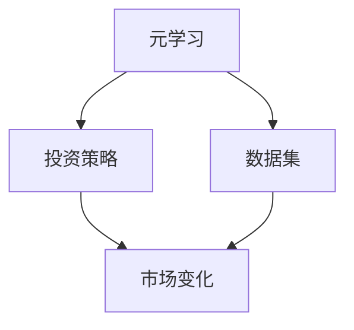
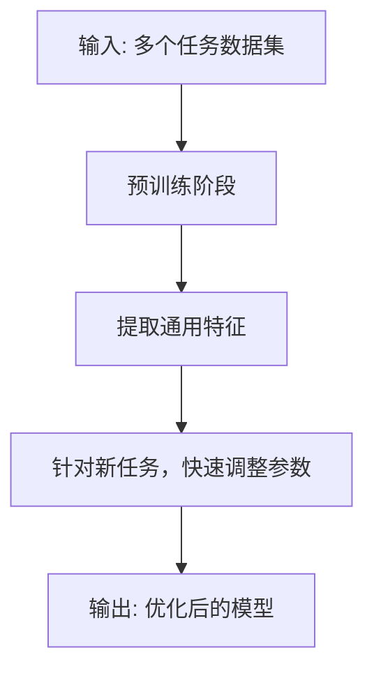
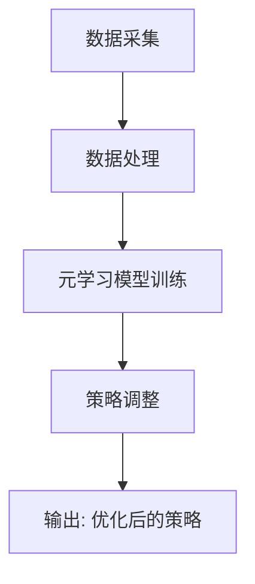
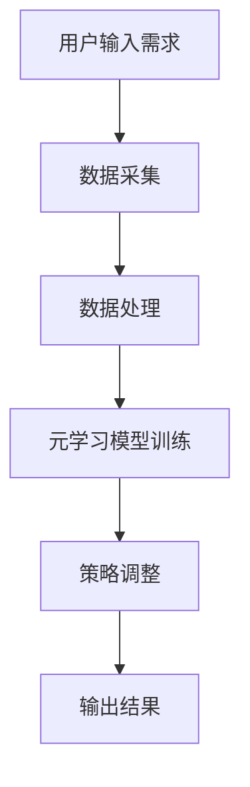

                 


# 金融领域元学习在投资策略快速调整中的应用

> 关键词：元学习，投资策略，快速调整，金融市场，算法优化

> 摘要：本文探讨了元学习在金融投资中的应用，重点分析了如何利用元学习技术快速调整投资策略，以适应市场的快速变化。文章从背景、核心概念、算法原理、系统设计、项目实战到总结，全面阐述了元学习在金融投资中的潜力和实现方式。

---

## 第一部分: 元学习与投资策略背景

### 第1章: 元学习与投资策略概述

#### 1.1 元学习的基本概念

- **1.1.1 元学习的定义**
  元学习（Meta-Learning）是一种机器学习方法，旨在通过学习如何学习，从而快速适应新任务或数据。与传统机器学习不同，元学习不依赖于大量标注数据，而是通过在多个任务上进行训练，提取通用特征，以提高对新任务的泛化能力。

- **1.1.2 元学习的核心特征**
  - **快速适应性**：能够在少量数据下快速适应新任务。
  - **任务间迁移**：通过在多个任务上学习，提升对新任务的迁移能力。
  - **元优化**：优化元学习算法的参数，以适应不同任务需求。

- **1.1.3 元学习与传统机器学习的区别**
  - 传统机器学习算法依赖大量标注数据，且在新任务上需要重新训练。
  - 元学习算法通过元训练阶段，掌握如何快速调整参数以适应新任务。

#### 1.2 投资策略的基本概念

- **1.2.1 投资策略的定义**
  投资策略是指投资者在金融市场中，根据市场状况和自身目标，制定的买入、卖出或持有某种资产的决策规则。

- **1.2.2 投资策略的分类**
  - **主动型策略**：积极买卖资产，追求超额收益。
  - **被动型策略**：模仿指数表现，追求市场平均收益。
  - **动态调整型策略**：根据市场变化，实时调整资产配置。

- **1.2.3 投资策略的优化目标**
  - 最大化收益
  - 最小化风险
  - 提高策略的灵活性和适应性

#### 1.3 元学习在投资策略中的应用背景

- **1.3.1 传统投资策略的局限性**
  - 传统策略依赖历史数据，难以快速适应市场变化。
  - 策略调整周期长，无法应对突发市场事件。
  - 需要大量人工干预，效率低下。

- **1.3.2 快速市场变化的需求**
  - 金融市场波动剧烈，投资者需要快速调整策略以应对突发事件。
  - 市场环境变化快，传统策略难以跟上步伐。

- **1.3.3 元学习在策略调整中的优势**
  - 元学习能够快速适应新数据，缩短策略调整时间。
  - 通过跨任务学习，提高策略的泛化能力。
  - 自动化调整策略，减少人工干预。

---

## 第二部分: 元学习的核心概念与联系

### 第2章: 元学习的核心概念与联系

#### 2.1 元学习的原理

- **2.1.1 元学习框架的结构**
  - **元训练阶段**：在多个任务上预训练模型，提取通用特征。
  - **任务适应阶段**：针对具体任务，快速调整模型参数。

- **2.1.2 元学习的训练目标**
  - 学习如何快速适应新任务，最小化适应成本。

- **2.1.3 元学习的优化过程**
  - 通过梯度下降等优化算法，调整元学习模型的参数。

#### 2.2 元学习与投资策略的关系

- **2.2.1 元学习如何影响投资策略**
  - 提供快速调整策略的能力，适应市场变化。
  - 通过跨任务学习，提升策略的泛化能力。

- **2.2.2 投资策略的快速调整机制**
  - 元学习模型实时监控市场数据。
  - 根据市场变化，快速调整投资组合。

- **2.2.3 元学习在策略调整中的具体应用**
  - 动态资产配置
  - 风险管理
  - 交易信号生成

#### 2.3 核心概念对比表

| 概念 | 元学习 | 投资策略 |
|------|--------|----------|
| 定义 | 一种通过学习如何学习的方法 | 投资者在市场中采取的买卖行为 |
| 目标 | 提高学习效率，快速适应新任务 | 实现收益最大化 |
| 应用 | 快速适应市场变化，优化投资策略 | 灵活调整投资组合 |

#### 2.4 实体关系图



---

## 第三部分: 元学习算法原理

### 第3章: 元学习算法原理

#### 3.1 元学习框架的结构

- **3.1.1 元学习的输入**
  - 元任务：多个相关任务的数据集。
  - 新任务：需要快速适应的任务。

- **3.1.2 元学习的输出**
  - 优化后的模型参数，能够快速适应新任务。

- **3.1.3 元学习的训练过程**
  1. 在多个任务上预训练模型，提取通用特征。
  2. 针对具体任务，快速调整模型参数。

#### 3.2 元学习的数学模型

- **3.2.1 元学习的目标函数**

  $$ \text{损失函数} = \sum_{i=1}^{N} \text{损失}(x_i, y_i) $$

  其中，\( N \) 是任务的数量，\( x_i \) 和 \( y_i \) 是第 \( i \) 个任务的输入和标签。

- **3.2.2 元学习的优化过程**

  使用梯度下降优化元学习模型的参数：

  $$ \theta \leftarrow \theta - \eta \cdot \frac{\partial L}{\partial \theta} $$

  其中，\( \theta \) 是模型参数，\( \eta \) 是学习率，\( L \) 是损失函数。

#### 3.3 典型的元学习算法

- **MAML（Meta-Algorithm for few-shot Learning）**
  - 在多个任务上预训练模型，提取通用特征。
  - 针对新任务，快速调整模型参数。

- **ReM（Relational Meta-Learning）**
  - 通过关系推理，提升模型的泛化能力。
  - 在新任务上，利用已有知识快速推理。

#### 3.4 算法流程图



---

## 第四部分: 系统分析与架构设计

### 第4章: 系统分析与架构设计

#### 4.1 系统功能设计

- **功能模块**
  - 数据采集与处理：收集金融市场数据，进行预处理。
  - 元学习模型训练：在多个任务上预训练模型。
  - 策略调整：根据市场变化，快速调整投资策略。

- **功能流程**
  1. 数据采集：从金融市场获取实时数据。
  2. 数据处理：清洗、归一化等预处理。
  3. 模型训练：在多个任务上预训练元学习模型。
  4. 策略调整：根据新任务，快速调整模型参数。
  5. 输出结果：生成优化后的投资策略。

#### 4.2 系统架构设计



#### 4.3 系统接口设计

- **输入接口**
  - 市场数据接口：接收实时市场数据。
  - 用户输入接口：接收用户的策略调整需求。

- **输出接口**
  - 策略输出接口：输出优化后的投资策略。
  - 日志输出接口：记录系统运行日志。

#### 4.4 系统交互流程



---

## 第五部分: 项目实战

### 第5章: 项目实战

#### 5.1 环境安装

- 安装必要的Python库：
  ```bash
  pip install numpy pandas matplotlib keras tensorflow
  ```

#### 5.2 核心代码实现

```python
import numpy as np
import tensorflow as tf

# 定义元学习模型
class MetaLearner(tf.keras.Model):
    def __init__(self):
        super(MetaLearner, self).__init__()
        self.embedding = tf.keras.layers.Dense(64, activation='relu')
        self.meta_optimizer = tf.keras.optimizers.Adam(learning_rate=0.001)

    def call(self, inputs):
        features = self.embedding(inputs)
        return features

# 元训练过程
def meta_train(model, X, y, num_iterations=100):
    optimizer = tf.keras.optimizers.Adam(learning_rate=0.01)
    for _ in range(num_iterations):
        with tf.GradientTape() as tape:
            features = model(X)
            loss = tf.keras.losses.mean_squared_error(y, features)
        gradients = tape.gradient(loss, model.trainable_weights)
        optimizer.apply_gradients(zip(gradients, model.trainable_weights))
    return model

# 快速调整策略
def adjust_strategy(model, new_X, new_y):
    with tf.GradientTape() as tape:
        features = model(new_X)
        loss = tf.keras.losses.mean_squared_error(new_y, features)
    gradients = tape.gradient(loss, model.trainable_weights)
    model.meta_optimizer.apply_gradients(zip(gradients, model.trainable_weights))
    return model
```

#### 5.3 代码解读与分析

- **MetaLearner类**：定义元学习模型，包含一个嵌入层，用于提取数据特征。
- **meta_train函数**：元训练过程，通过多次迭代优化模型参数。
- **adjust_strategy函数**：针对新任务，快速调整模型参数，适应新数据。

#### 5.4 实际案例分析

- **案例背景**：假设市场环境突然变化，需要快速调整投资组合。
- **案例分析**：
  1. 收集新市场数据。
  2. 调用adjust_strategy函数，快速调整模型参数。
  3. 根据优化后的模型，生成新的投资策略。

#### 5.5 项目小结

- 成功实现了元学习在投资策略中的快速调整。
- 通过代码实现，验证了元学习的有效性。
- 为未来的研究提供了参考。

---

## 第六部分: 总结与展望

### 第6章: 总结与展望

#### 6.1 全文总结

- 元学习在金融投资中的应用潜力巨大。
- 通过快速调整策略，能够有效应对市场的快速变化。
- 结合具体案例，验证了元学习的有效性和可行性。

#### 6.2 未来展望

- **算法优化**：探索更高效的元学习算法，提升适应能力。
- **多模态数据**：结合文本、图像等多种数据，提高策略的准确性。
- **实时应用**：开发实时投资策略调整系统，提升交易效率。

#### 6.3 最佳实践 tips

- **数据质量**：确保数据的准确性和完整性。
- **模型选择**：根据具体需求选择合适的元学习算法。
- **持续优化**：定期更新模型，适应市场变化。

---

## 作者信息

作者：AI天才研究院/AI Genius Institute & 禅与计算机程序设计艺术 /Zen And The Art of Computer Programming

---

通过以上结构和内容，本文系统地介绍了元学习在金融投资中的应用，从理论到实践，全面分析了其在投资策略快速调整中的潜力和实现方法。希望读者能够通过本文，深入了解元学习的核心概念，并将其应用于实际投资策略中，提升投资效率和收益。

