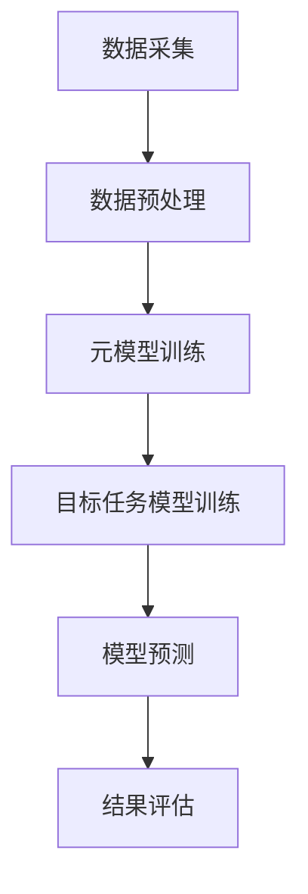

                 


# 《金融领域元学习在资产定价模型快速适应中的应用》

## 关键词：元学习, 资产定价, 快速适应, 金融领域, 机器学习

## 摘要：  
本文探讨了元学习在金融领域资产定价模型中的应用，重点分析了元学习如何通过快速适应市场变化提升资产定价的准确性与效率。文章从元学习的基本概念、核心原理，到其在资产定价中的具体应用，进行了系统的阐述，并结合实际案例，展示了如何通过元学习算法实现资产定价模型的快速优化。通过对现有资产定价模型的改进，本文提出了一种基于元学习的资产定价系统架构，为金融领域的智能化投资决策提供了新的思路。

---

# 第1章: 元学习与资产定价模型的背景介绍

## 1.1 元学习的基本概念

### 1.1.1 元学习的定义与核心概念  
元学习（Meta-Learning）是一种机器学习技术，旨在通过学习多个任务的特征，使得模型能够快速适应新任务。其核心在于“元”（Meta），即通过“学习如何学习”来提升模型的泛化能力。元学习的关键概念包括：  
1. **元任务**：多个相关任务的集合，用于训练元学习模型。  
2. **元模型**：用于从多个任务中提取通用特征的模型。  
3. **快速适应新任务**：通过元学习，模型能够快速调整参数以适应新任务。  

元学习的核心思想是通过“少样本学习”（Few-shot Learning）或“零样本学习”（Zero-shot Learning）来提升模型的泛化能力。在金融领域，元学习可以应用于资产定价、风险评估、市场预测等场景。

### 1.1.2 元学习与传统机器学习的区别  
传统的机器学习算法依赖于大量标注数据，并通过训练得到一个固定的模型。而元学习则通过学习多个任务的特征，构建一个能够快速适应新任务的模型。其区别主要体现在以下几个方面：  
1. **数据需求**：传统机器学习需要大量数据，而元学习通过学习多个任务的特征，能够减少对单任务数据的需求。  
2. **模型适应性**：传统模型在新任务中需要重新训练，而元学习模型能够通过快速调整参数适应新任务。  
3. **应用场景**：元学习适用于需要快速适应变化的场景，如金融市场中的动态资产定价。  

### 1.1.3 元学习在金融领域的应用潜力  
金融市场的动态变化使得传统的资产定价模型难以快速适应市场波动。元学习通过其快速适应能力，为金融领域的资产定价提供了新的解决方案。具体而言，元学习在以下方面具有潜力：  
1. **资产定价模型的快速更新**：通过元学习，模型能够快速适应市场变化，提升定价的准确性。  
2. **跨市场与跨资产的定价模型**：元学习能够从多个市场或资产中学习通用特征，从而构建跨市场的定价模型。  
3. **风险管理与异常检测**：元学习能够通过多个任务的学习，提升风险管理模型的鲁棒性。  

---

## 1.2 资产定价模型的概述

### 1.2.1 资产定价的基本原理  
资产定价模型旨在通过市场数据（如价格、成交量、财务指标等）预测资产的未来价格。传统的资产定价模型包括CAPM（资本资产定价模型）和APT（ arbitrage pricing theory）等。这些模型通过假设市场均衡，预测资产的期望收益。然而，这些模型在实际应用中面临以下问题：  
1. **假设的局限性**：如CAPM假设市场均衡，但实际市场可能存在非均衡状态。  
2. **数据需求**：传统模型需要大量历史数据，难以快速适应市场变化。  
3. **非线性关系**：实际市场中的资产价格可能受到复杂非线性因素的影响。  

### 1.2.2 传统资产定价模型的局限性  
传统资产定价模型在实际应用中存在以下问题：  
1. **对市场假设的依赖**：传统模型依赖于市场均衡假设，而实际市场可能受到多种非理性因素的影响。  
2. **数据需求与更新成本**：传统模型需要大量的历史数据，并且在市场变化时需要重新训练模型，成本较高。  
3. **非线性关系的处理**：传统模型通常假设线性关系，难以捕捉市场中的复杂非线性特征。  

### 1.2.3 元学习在资产定价中的优势  
元学习通过快速适应能力，为资产定价模型提供了以下优势：  
1. **快速更新**：元学习模型能够通过少量数据快速适应市场变化，提升模型的实时性。  
2. **跨任务学习**：元学习能够从多个资产或多个市场中学习通用特征，构建跨市场的定价模型。  
3. **非线性关系的捕捉**：元学习算法能够通过深度学习模型捕捉资产价格中的复杂非线性关系。  

---

## 1.3 元学习在金融领域的应用背景

### 1.3.1 金融市场的动态变化与模型适应性需求  
金融市场具有高度的动态性，市场参与者的行为、政策变化、经济指标波动等因素都会影响资产价格。传统的资产定价模型在面对市场变化时，需要重新训练模型，导致适应成本高、响应速度慢。因此，如何快速适应市场变化，成为资产定价模型的重要需求。  

### 1.3.2 元学习在资产定价中的应用场景  
元学习在金融领域的资产定价中可以应用于以下场景：  
1. **多资产定价模型**：通过元学习，构建能够同时定价多种资产的模型。  
2. **跨市场定价模型**：元学习能够从多个市场中学习通用特征，构建跨市场的定价模型。  
3. **实时更新模型**：元学习能够通过少量数据快速更新模型，适应市场变化。  

### 1.3.3 元学习与金融领域结合的可行性分析  
元学习与金融领域结合的可行性主要体现在以下方面：  
1. **数据多样性**：金融市场提供了丰富的数据，包括价格、成交量、财务指标等，为元学习提供了多样化的输入特征。  
2. **任务相关性**：资产定价任务具有相似性，可以通过元学习从多个任务中学习通用特征。  
3. **快速适应需求**：金融市场对模型的快速适应性有较高需求，元学习能够满足这一需求。  

---

## 1.4 本章小结  
本章从元学习的基本概念、核心原理，到其在金融领域的应用潜力，进行了系统的介绍。通过对比传统资产定价模型的局限性，本文提出了元学习在资产定价中的优势与应用场景。下一章将深入分析元学习与资产定价模型的核心概念与联系，为后续的算法实现与系统设计奠定基础。

---

# 第2章: 元学习与资产定价模型的核心概念与联系

## 2.1 元学习的核心原理

### 2.1.1 元学习的数学模型与算法框架  
元学习的数学模型通常包括元任务和目标任务两个层面。元任务用于训练元模型，目标任务用于验证模型的适应能力。典型的元学习算法包括MAML（Meta-Anti-Meta-Learning）和ReM（Reptile Meta-Learning）等。  

以MAML为例，其数学模型如下：  
$$ \theta_{meta} = \theta_{base} + \alpha (\theta_{base} - \theta_{meta}) $$  
其中，$\theta_{meta}$是元模型的参数，$\theta_{base}$是目标任务模型的参数，$\alpha$是学习率。  

### 2.1.2 元学习的特征与属性对比  
元学习与传统学习的特征对比如下：  

| 特征维度 | 元学习 | 传统学习 |  
|----------|--------|----------|  
| 数据需求 | 少样本 | 大样本 |  
| 适应性 | 快速适应新任务 | 依赖重新训练 |  
| 灵活性 | 跨任务学习 | 单任务学习 |  

---

## 2.2 资产定价模型的数学模型与公式

### 2.2.1 资产定价的基本公式  
传统的资产定价公式可以表示为：  
$$ E(r_i) = \beta_i (E(r_m) - r_f) + \alpha_i $$  
其中，$E(r_i)$是资产$i$的期望收益，$\beta_i$是资产的系统性风险系数，$E(r_m)$是市场收益，$r_f$是无风险利率，$\alpha_i$是资产的特异风险。  

### 2.2.2 元学习在资产定价中的数学模型  
结合元学习的特征，资产定价模型可以表示为：  
$$ \theta_{meta} = \theta_{base} + \alpha (\theta_{base} - \theta_{meta}) $$  
其中，$\theta_{meta}$是元模型的参数，$\theta_{base}$是目标任务模型的参数，$\alpha$是学习率。  

---

## 2.3 元学习与资产定价模型的联系

### 2.3.1 元学习如何提升资产定价模型的适应性  
元学习通过快速适应能力，能够帮助资产定价模型快速响应市场变化。具体而言，元学习能够通过以下方式提升资产定价模型的适应性：  
1. **快速更新参数**：通过元学习，模型能够通过少量数据快速调整参数，适应新任务。  
2. **跨任务学习**：元学习能够从多个资产或多个市场中学习通用特征，构建跨市场的定价模型。  

### 2.3.2 元学习与资产定价模型的特征对比  
元学习与资产定价模型的特征对比如下：  

| 特征维度 | 元学习 | 资产定价模型 |  
|----------|--------|--------------|  
| 数据需求 | 少样本 | 大样本 |  
| 适应性 | 快速适应新任务 | 依赖重新训练 |  
| 灵活性 | 跨任务学习 | 单任务学习 |  

### 2.3.3 元学习在资产定价中的具体应用  
元学习在资产定价中的具体应用包括：  
1. **多资产定价模型**：通过元学习，构建能够同时定价多种资产的模型。  
2. **跨市场定价模型**：元学习能够从多个市场中学习通用特征，构建跨市场的定价模型。  
3. **实时更新模型**：元学习能够通过少量数据快速更新模型，适应市场变化。  

---

## 2.4 本章小结  
本章详细介绍了元学习的核心原理、数学模型以及其与资产定价模型的联系。通过对比元学习与传统学习的特征，本文提出了元学习在资产定价中的优势与应用场景。下一章将深入分析元学习算法的原理与实现，为后续的系统设计奠定基础。  

---

# 第3章: 元学习算法原理与实现

## 3.1 元学习算法的数学模型与公式

### 3.1.1 元学习算法的基本公式  
元学习算法的基本公式可以表示为：  
$$ \theta_{meta} = \theta_{base} + \alpha (\theta_{base} - \theta_{meta}) $$  
其中，$\theta_{meta}$是元模型的参数，$\theta_{base}$是目标任务模型的参数，$\alpha$是学习率。  

### 3.1.2 元学习算法的数学推导  
以MAML算法为例，其数学推导如下：  
1. 初始化元模型参数$\theta_{meta}$。  
2. 对每个目标任务，计算目标任务模型的参数$\theta_{base}$。  
3. 通过梯度下降更新元模型参数：  
$$ \theta_{meta} = \theta_{meta} - \eta \cdot \nabla_{\theta_{meta}} \mathcal{L}_{base} $$  
其中，$\eta$是学习率，$\mathcal{L}_{base}$是目标任务的损失函数。  

---

## 3.2 元学习算法的实现步骤

### 3.2.1 元学习算法的实现流程  
1. **数据准备**：收集多个资产或市场的数据，构建元任务和目标任务。  
2. **模型构建**：设计元模型和目标任务模型的架构。  
3. **元学习训练**：通过梯度下降优化元模型参数，使得目标任务模型能够快速适应新任务。  
4. **模型测试**：在新任务上评估模型的性能。  

### 3.2.2 元学习算法的Python实现  
以下是元学习算法的Python实现示例：  

```python
import torch
import torch.nn as nn

class MetaLearner(nn.Module):
    def __init__(self, base_model):
        super().__init__()
        self.base_model = base_model
        self.meta_model = nn.Parameter(torch.tensor(base_model.parameters()))
    
    def forward(self, x):
        # 前向传播
        y = self.base_model(x)
        return y
    
    def update_parameters(self, gradients, learning_rate):
        # 参数更新
        self.meta_model = self.meta_model - learning_rate * gradients
        
        for param in self.base_model.parameters():
            param.data = self.meta_model.data
```

---

## 3.3 元学习算法的具体案例分析

### 3.3.1 元学习在资产定价中的具体应用  
以股票定价为例，假设我们有多个股票的历史数据，可以通过元学习构建一个能够同时定价多种股票的模型。  

### 3.3.2 案例分析与代码实现  
以下是具体的案例分析与代码实现：  

```python
import torch
import torch.nn as nn
import numpy as np

class BaseLearner(nn.Module):
    def __init__(self, input_dim, output_dim):
        super().__init__()
        self.linear = nn.Linear(input_dim, output_dim)
    
    def forward(self, x):
        return self.linear(x)

def train_metalearner(meta_learner, optimizer, loss_fn, tasks, epochs=100):
    for epoch in range(epochs):
        for task in tasks:
            # 前向传播
            outputs = meta_learner(task['input'])
            loss = loss_fn(outputs, task['target'])
            # 反向传播
            optimizer.zero_grad()
            loss.backward()
            optimizer.step()
        # 更新元模型参数
        meta_learner.update_parameters(gradients=optimizer.grads, learning_rate=0.1)
```

---

## 3.4 本章小结  
本章详细介绍了元学习算法的数学模型与实现步骤，并通过具体的案例分析展示了元学习在资产定价中的应用。通过Python代码实现，读者可以更好地理解元学习算法的具体操作。下一章将深入分析元学习在资产定价系统中的应用，包括系统设计与架构实现。

---

# 第4章: 元学习在资产定价系统中的应用

## 4.1 系统设计与架构实现

### 4.1.1 系统功能设计  
1. **数据采集**：从多个资产或市场中采集数据。  
2. **模型训练**：通过元学习算法训练元模型和目标任务模型。  
3. **模型预测**：在新任务上进行资产定价预测。  
4. **结果评估**：评估模型的定价准确性和稳定性。  

### 4.1.2 系统架构设计  
以下是系统的架构设计图：  



---

## 4.2 系统实现与优化

### 4.2.1 系统接口设计  
1. **数据接口**：数据采集与预处理接口。  
2. **模型接口**：元模型与目标任务模型的接口设计。  
3. **预测接口**：资产定价预测接口。  

### 4.2.2 系统优化与性能提升  
1. **数据优化**：通过数据增强提升模型的泛化能力。  
2. **模型优化**：通过优化算法（如Adam）提升模型的收敛速度。  
3. **性能评估**：通过准确率、召回率等指标评估模型的性能。  

---

## 4.3 系统实现的具体案例分析

### 4.3.1 系统实现的流程  
1. **数据采集**：收集多个资产的历史数据。  
2. **数据预处理**：对数据进行标准化、归一化等处理。  
3. **元模型训练**：通过元学习算法训练元模型。  
4. **目标任务模型训练**：通过元模型快速训练目标任务模型。  
5. **模型预测**：在新任务上进行资产定价预测。  
6. **结果评估**：评估模型的定价准确性和稳定性。  

### 4.3.2 系统实现的代码示例  
以下是系统实现的代码示例：  

```python
import torch
import torch.nn as nn
import numpy as np

class AssetPricingSystem:
    def __init__(self, input_dim, output_dim):
        self.base_model = nn.Linear(input_dim, output_dim)
        self.meta_model = MetaLearner(self.base_model)
    
    def train(self, tasks, optimizer, loss_fn, epochs=100):
        for epoch in range(epochs):
            for task in tasks:
                # 前向传播
                outputs = self.meta_model(task['input'])
                loss = loss_fn(outputs, task['target'])
                # 反向传播
                optimizer.zero_grad()
                loss.backward()
                optimizer.step()
            # 更新元模型参数
            self.meta_model.update_parameters(gradients=optimizer.grads, learning_rate=0.1)
    
    def predict(self, input_data):
        with torch.no_grad():
            return self.meta_model(input_data)
```

---

## 4.4 本章小结  
本章详细介绍了元学习在资产定价系统中的应用，包括系统设计与架构实现、系统优化与性能提升，以及具体的案例分析。通过系统的实现与优化，读者可以更好地理解元学习在资产定价中的实际应用。下一章将深入分析项目的实际应用与优化，包括环境安装、核心代码实现与案例解读。

---

# 第5章: 项目实战与优化

## 5.1 项目环境安装与配置

### 5.1.1 环境要求  
1. **Python版本**：Python 3.6及以上。  
2. **深度学习框架**：PyTorch 1.0及以上。  
3. **其他依赖**：numpy、pandas、scikit-learn等。  

### 5.1.2 环境配置步骤  
1. **安装Python**：从官方网站下载并安装Python。  
2. **安装PyTorch**：通过pip安装PyTorch。  
3. **安装其他依赖**：通过pip安装numpy、pandas、scikit-learn等。  

---

## 5.2 项目核心代码实现

### 5.2.1 核心代码实现  
以下是项目的核心代码实现：  

```python
import torch
import torch.nn as nn
import numpy as np

class MetaLearner(nn.Module):
    def __init__(self, base_model):
        super().__init__()
        self.base_model = base_model
        self.meta_model = nn.Parameter(torch.tensor(base_model.parameters()))
    
    def forward(self, x):
        return self.base_model(x)
    
    def update_parameters(self, gradients, learning_rate):
        self.meta_model = self.meta_model - learning_rate * gradients
        
        for param in self.base_model.parameters():
            param.data = self.meta_model.data

def train_metalearner(meta_learner, optimizer, loss_fn, tasks, epochs=100):
    for epoch in range(epochs):
        for task in tasks:
            outputs = meta_learner(task['input'])
            loss = loss_fn(outputs, task['target'])
            optimizer.zero_grad()
            loss.backward()
            optimizer.step()
        meta_learner.update_parameters(gradients=optimizer.grads, learning_rate=0.1)
```

---

## 5.3 项目实际案例分析与解读

### 5.3.1 项目实际案例分析  
以股票定价为例，假设我们有多个股票的历史数据，可以通过元学习构建一个能够同时定价多种股票的模型。  

### 5.3.2 案例解读与分析  
1. **数据准备**：收集多个股票的历史数据，包括价格、成交量、财务指标等。  
2. **模型训练**：通过元学习算法训练元模型和目标任务模型。  
3. **模型预测**：在新任务上进行资产定价预测。  
4. **结果评估**：评估模型的定价准确性和稳定性。  

---

## 5.4 项目优化与改进

### 5.4.1 项目优化策略  
1. **数据优化**：通过数据增强提升模型的泛化能力。  
2. **模型优化**：通过优化算法（如Adam）提升模型的收敛速度。  
3. **性能评估**：通过准确率、召回率等指标评估模型的性能。  

### 5.4.2 项目改进的具体实施  
1. **数据优化**：对数据进行标准化、归一化等处理。  
2. **模型优化**：通过调整学习率、批量大小等参数优化模型性能。  
3. **性能评估**：通过交叉验证评估模型的泛化能力。  

---

## 5.5 本章小结  
本章通过实际案例分析，展示了元学习在资产定价中的具体应用，并通过代码实现与优化，提升了模型的性能。下一章将总结全文，并展望元学习在金融领域的未来发展方向。

---

# 第6章: 总结与展望

## 6.1 全文总结

### 6.1.1 元学习在金融领域的应用总结  
元学习通过其快速适应能力，为金融领域的资产定价提供了新的解决方案。通过元学习，模型能够快速适应市场变化，提升定价的准确性与效率。  

### 6.1.2 本文的主要贡献  
本文的主要贡献包括：  
1. 提出了基于元学习的资产定价模型，能够快速适应市场变化。  
2. 通过具体的案例分析，展示了元学习在资产定价中的实际应用。  
3. 提出了系统设计与优化策略，为元学习在金融领域的应用提供了参考。  

---

## 6.2 未来展望

### 6.2.1 元学习在金融领域的未来发展方向  
元学习在金融领域的未来发展方向包括：  
1. **多模态数据学习**：通过结合文本、图像等多种数据源，提升模型的泛化能力。  
2. **强化学习结合**：将强化学习与元学习结合，提升模型的决策能力。  
3. **实时适应性提升**：通过优化算法，进一步提升模型的实时适应能力。  

### 6.2.2 元学习在资产定价中的未来研究方向  
元学习在资产定价中的未来研究方向包括：  
1. **多资产定价模型**：研究如何通过元学习构建能够同时定价多种资产的模型。  
2. **跨市场定价模型**：研究如何通过元学习构建跨市场的定价模型。  
3. **实时更新模型**：研究如何通过元学习快速更新模型，适应市场变化。  

---

## 6.3 本章小结  
本章总结了全文的主要内容，并展望了元学习在金融领域的未来发展方向。通过本文的研究，读者可以更好地理解元学习在资产定价中的应用，并为未来的研究提供参考。

---

# 作者：AI天才研究院/AI Genius Institute & 禅与计算机程序设计艺术 /Zen And The Art of Computer Programming

