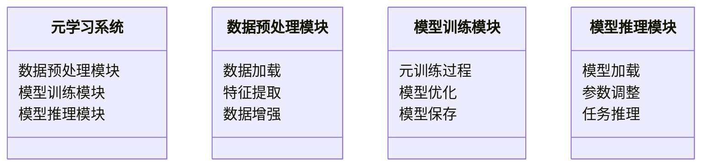
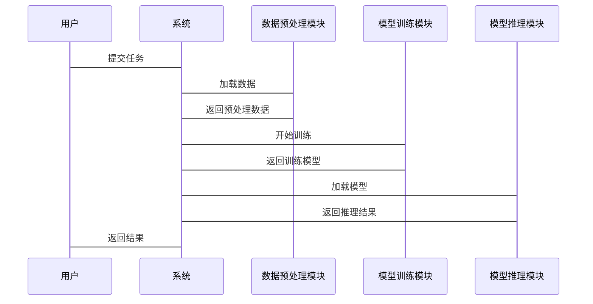

                 


# 《金融领域元学习技术的探索与应用》

## 关键词：元学习，金融领域，机器学习，深度学习，算法优化

## 摘要：  
本文探讨了元学习技术在金融领域的应用与探索，从元学习的基本概念、核心原理、算法模型到系统设计与项目实战，详细分析了元学习在金融时间序列预测、NLP任务等场景中的应用。通过理论与实践相结合的方式，本文深入剖析了元学习的优势、挑战及未来发展方向，为金融领域的技术从业者提供了有价值的参考。

---

## 第一章: 元学习技术概述

### 1.1 元学习的基本概念

#### 1.1.1 元学习的定义  
元学习（Meta-Learning）是一种机器学习技术，旨在通过训练模型在多个任务之间进行快速泛化，从而减少对每个新任务的训练数据需求。其核心思想是通过“学习如何学习”，使模型能够适应不同任务的特征和规律。

#### 1.1.2 元学习的核心思想  
元学习的核心在于通过元训练（meta-training）过程，构建一个能够在新任务上快速适应的模型。与传统机器学习不同，元学习强调模型的泛化能力和快速学习能力，特别适用于数据稀疏、任务多样化的场景。

#### 1.1.3 元学习与传统机器学习的区别  
- **传统机器学习**：针对单个任务进行优化，需要大量标注数据，模型在新任务上需要重新训练。  
- **元学习**：通过元训练过程，学习任务之间的共性特征，能够在新任务上快速调整模型参数，减少对新任务数据的依赖。  

### 1.2 元学习在金融领域的应用背景

#### 1.2.1 金融领域的复杂性与多样性  
金融领域涉及股票价格预测、风险管理、信用评估等多个场景，每个任务都有其独特的特征和数据分布。传统机器学习方法在面对新任务时，往往需要重新训练模型，效率较低。  

#### 1.2.2 传统机器学习的局限性  
- 数据稀疏性：金融数据往往分布不均衡，某些任务的数据量较少。  
- 任务多样性：金融领域的任务类型多样，传统模型难以快速适应。  

#### 1.2.3 元学习在金融领域的优势  
元学习能够通过元训练过程，捕获不同任务之间的共性特征，从而在新任务上快速调整模型，减少对新任务数据的依赖。这使得元学习在金融时间序列预测、NLP任务（如情感分析）等领域具有显著优势。  

### 1.3 元学习的边界与外延

#### 1.3.1 元学习的适用场景  
- **时间序列预测**：如股票价格预测、汇率波动预测。  
- **NLP任务**：如金融新闻情感分析、风险事件识别。  

#### 1.3.2 元学习的限制与不足  
- 对某些任务的适应能力有限，需要结合领域知识进行调整。  
- 计算资源需求较高，训练复杂模型需要大量计算资源。  

#### 1.3.3 元学习与其他技术的关系  
元学习可以与迁移学习、自监督学习等技术结合，形成更强大的模型。例如，结合迁移学习的元学习模型能够更好地适应不同领域和任务。  

---

## 第二章: 元学习的核心概念与联系

### 2.1 元学习的核心原理

#### 2.1.1 元学习的数学模型  
元学习模型通常通过优化目标函数来实现。以下是一个简化的元学习优化目标：  
$$ \min_{\theta} \sum_{i=1}^{N} \mathcal{L}_i(\theta) + \lambda \mathcal{L}_{\text{meta}}(\theta) $$  
其中，$\mathcal{L}_i$ 是第 $i$ 个任务的损失函数，$\mathcal{L}_{\text{meta}}$ 是元损失函数，$\lambda$ 是调节参数。  

#### 2.1.2 元学习的优化目标  
元学习的优化目标是在多个任务上同时优化模型参数，使得模型能够快速适应新任务。  

#### 2.1.3 元学习的训练过程  
元学习的训练过程通常包括以下步骤：  
1. 在元训练阶段，模型通过多个任务进行训练，捕获任务之间的共性特征。  
2. 在推理阶段，模型根据新任务的特征快速调整参数，完成任务目标。  

#### 2.1.4 元学习的核心思想：通过学习任务之间的共性特征，快速适应新任务。

### 2.2 元学习模型的属性特征对比

#### 2.2.1 模型的可解释性  
元学习模型通常具有较高的可解释性，可以通过分析模型参数的变化来理解模型在不同任务上的调整过程。  

#### 2.2.2 模型的泛化能力  
元学习模型在新任务上的泛化能力较强，尤其是在任务相似性较高的场景下。  

#### 2.2.3 模型的训练效率  
元学习模型的训练效率较高，通过元训练过程可以快速适应新任务，减少对新任务数据的依赖。  

### 2.3 元学习的ER实体关系图

```mermaid
er
  entity(任务) {
    任务ID
    任务类型
    任务特征
  }
  entity(模型) {
    模型ID
    模型结构
    模型参数
  }
  entity(数据) {
    数据ID
    数据特征
    标签
  }
  entity(训练过程) {
    训练ID
    训练数据
    训练模型
    训练结果
  }
  entity(推理过程) {
    推理ID
    输入数据
    推理模型
    推理结果
  }
```

### 2.4 本章小结

---

## 第三章: 元学习的算法原理讲解

### 3.1 元学习算法的基本流程

#### 3.1.1 算法输入与输出  
- **输入**：多个任务的数据集，每个任务包含训练数据和测试数据。  
- **输出**：一个能够在新任务上快速适应的模型。  

#### 3.1.2 算法的训练步骤  
1. 在元训练阶段，模型通过多个任务进行训练，优化模型参数以适应不同任务的特征。  
2. 在推理阶段，模型根据新任务的特征快速调整参数，完成任务目标。  

#### 3.1.3 算法的推理过程  
在新任务上，模型通过快速调整参数，完成任务目标。  

### 3.2 MAML算法的详细讲解

#### 3.2.1 MAML算法的数学模型  
MAML算法的目标函数如下：  
$$ \min_{\theta} \sum_{i=1}^{N} \mathcal{L}_i(\theta) + \lambda \mathcal{L}_{\text{meta}}(\theta) $$  

其中，$\mathcal{L}_i(\theta)$ 是第 $i$ 个任务的损失函数，$\mathcal{L}_{\text{meta}}(\theta)$ 是元损失函数，$\lambda$ 是调节参数。  

#### 3.2.2 MAML算法的优化目标  
通过优化目标函数，使得模型能够在多个任务上同时优化，捕获任务之间的共性特征。  

#### 3.2.3 MAML算法的实现步骤  
1. 初始化模型参数 $\theta$。  
2. 在元训练阶段，对每个任务进行训练，更新模型参数。  
3. 在推理阶段，根据新任务的特征快速调整参数，完成任务目标。  

#### 3.2.4 MAML算法的代码实现  
以下是一个简化的MAML算法实现代码示例：  

```python
import torch
import torch.nn as nn
import torch.optim as optim

class MetaLearner(nn.Module):
    def __init__(self, meta_params):
        super(MetaLearner, self).__init__()
        self.meta_params = meta_params

    def forward(self, x, y):
        # 元训练过程
        pass

    def meta_backward(self, loss):
        # 元反向传播
        pass

# 初始化模型
model = MetaLearner(meta_params)

# 定义优化器
optimizer = optim.Adam(model.parameters(), lr=1e-3)

# 元训练过程
for batch in meta_train_loader:
    optimizer.zero_grad()
    loss = model.loss(batch)
    loss.backward()
    optimizer.step()
```

### 3.3 其他元学习算法的简要介绍

#### 3.3.1 ReMAML算法  
ReMAML算法是一种基于关系嵌入的元学习算法，适用于多任务学习场景。  

#### 3.3.2 Meta-SGD算法  
Meta-SGD算法是一种基于参数初始化的元学习算法，适用于快速适应新任务。  

#### 3.3.3 元学习算法的对比分析  
以下是对几种元学习算法的对比分析：  

| 算法名称 | 优势 | 劣势 |
|----------|------|------|
| MAML     | 优化能力强，适用于多种任务 | 计算复杂度较高 |
| ReMAML   | 适用于多任务学习，关系嵌入能力强 | 实现较为复杂 |
| Meta-SGD | 参数初始化能力强，适用于快速适应 | 对任务间关系的建模能力较弱 |

### 3.4 本章小结

---

## 第四章: 元学习的数学模型与公式

### 4.1 MAML算法的数学推导

#### 4.1.1 元学习的损失函数  
MAML算法的损失函数如下：  
$$ \mathcal{L}(\theta) = \sum_{i=1}^{N} \mathcal{L}_i(\theta) + \lambda \mathcal{L}_{\text{meta}}(\theta) $$  

#### 4.1.2 元学习的优化目标  
优化目标函数为：  
$$ \min_{\theta} \mathcal{L}(\theta) $$  

#### 4.1.3 元学习的梯度计算  
通过链式法则计算梯度，优化模型参数。  

### 4.2 元学习算法的公式解析

#### 4.2.1 MAML算法的数学公式  
MAML算法的数学公式如下：  
$$ \theta_{t+1} = \theta_t - \eta \nabla_{\theta} \mathcal{L}_i(\theta_t) $$  

其中，$\eta$ 是学习率。  

#### 4.2.2 ReMAML算法的数学公式  
ReMAML算法的数学公式如下：  
$$ \theta_{t+1} = \theta_t - \eta \nabla_{\theta} \left( \mathcal{L}_i(\theta_t) + \lambda \mathcal{L}_{\text{meta}}(\theta_t) \right) $$  

### 4.3 本章小结

---

## 第五章: 元学习的系统分析与架构设计

### 5.1 系统功能设计

#### 5.1.1 问题场景介绍  
金融领域的元学习系统需要解决多个任务的快速适应问题，如股票价格预测、风险管理等。  

#### 5.1.2 系统功能需求  
- 数据预处理：对多个任务的数据进行预处理，提取特征。  
- 模型训练：在元训练阶段，训练元学习模型。  
- 模型推理：在新任务上，快速调整模型参数，完成任务目标。  

#### 5.1.3 系统功能模块设计  
以下是对系统功能模块的设计：  



### 5.2 系统架构设计

#### 5.2.1 系统架构设计  
以下是对系统架构的设计：  


### 5.3 系统接口设计

#### 5.3.1 系统接口设计  
以下是对系统接口的设计：  



### 5.4 本章小结

---

## 第六章: 元学习的项目实战

### 6.1 项目实战: 金融时间序列预测

#### 6.1.1 环境搭建

##### 6.1.1.1 环境需求  
- Python 3.6+
- PyTorch 1.0+
- numpy
- pandas
- matplotlib

##### 6.1.1.2 环境配置  
```bash
pip install torch numpy pandas matplotlib
```

#### 6.1.2 数据准备

##### 6.1.2.1 数据来源  
使用股票价格数据，如Yahoo Finance的股票数据。  

##### 6.1.2.2 数据预处理  
```python
import numpy as np
import pandas as pd
import matplotlib.pyplot as plt
import torch
from torch.utils.data import Dataset, DataLoader

class StockDataset(Dataset):
    def __init__(self, data, window_size=10):
        self.data = data
        self.window_size = window_size

    def __len__(self):
        return len(self.data) - self.window_size

    def __getitem__(self, idx):
        x = self.data[idx:idx+self.window_size]
        y = self.data[idx+self.window_size]
        return x, y

# 加载数据
data = pd.read_csv('stock_prices.csv')
dataset = StockDataset(data, window_size=10)
dataloader = DataLoader(dataset, batch_size=32, shuffle=True, num_workers=4)
```

#### 6.1.3 模型实现

##### 6.1.3.1 模型定义  
```python
class MetaLearner(nn.Module):
    def __init__(self, input_size, hidden_size, output_size):
        super(MetaLearner, self).__init__()
        self.l1 = nn.Linear(input_size, hidden_size)
        self.l2 = nn.Linear(hidden_size, output_size)

    def forward(self, x):
        x = torch.relu(self.l1(x))
        x = self.l2(x)
        return x
```

##### 6.1.3.2 模型训练  
```python
model = MetaLearner(input_size=10, hidden_size=32, output_size=1)
criterion = nn.MSELoss()
optimizer = optim.Adam(model.parameters(), lr=1e-3)

for epoch in range(100):
    for batch in dataloader:
        inputs, targets = batch
        optimizer.zero_grad()
        outputs = model(inputs)
        loss = criterion(outputs, targets)
        loss.backward()
        optimizer.step()
```

#### 6.1.4 模型推理

##### 6.1.4.1 模型加载  
```python
model.load_state_dict(torch.load('meta_learner.pth'))
```

##### 6.1.4.2 参数调整  
```python
new_task_data = ...  # 新任务数据
with torch.no_grad():
    outputs = model(new_task_data)
```

##### 6.1.4.3 结果分析  
分析模型在新任务上的表现，如预测准确率、误差等。

#### 6.1.5 本节小结

---

## 第七章: 总结与展望

### 7.1 总结  
本文详细探讨了元学习技术在金融领域的应用，从理论到实践，全面分析了元学习的优势、挑战及未来发展方向。通过实际案例分析，展示了元学习在金融时间序列预测中的潜力和价值。

### 7.2 未来展望  
未来，元学习技术在金融领域的应用将更加广泛，尤其是在多任务学习、强化学习等领域。同时，如何优化元学习算法的效率和可解释性，将是未来研究的重要方向。

### 7.3 最佳实践 tips  
- 在实际应用中，建议结合领域知识，对元学习模型进行优化和调整。  
- 元学习模型的训练需要大量计算资源，建议使用分布式训练技术。  

### 7.4 本章小结

---

## 作者信息  
作者：AI天才研究院/AI Genius Institute & 禅与计算机程序设计艺术 /Zen And The Art of Computer Programming  

---

通过以上内容，本文为读者提供了关于金融领域元学习技术的全面解析，从理论到实践，为金融领域的技术从业者提供了有价值的参考和指导。

