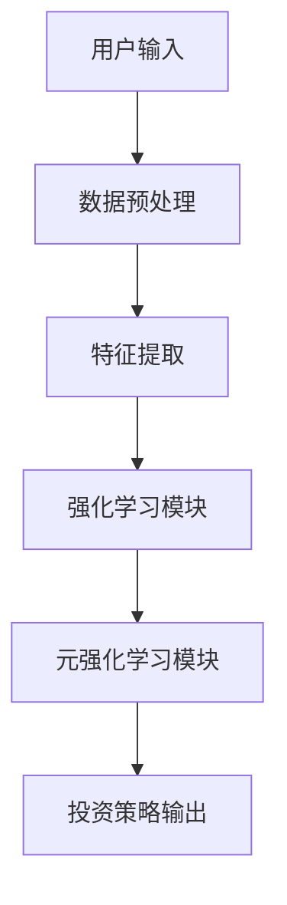
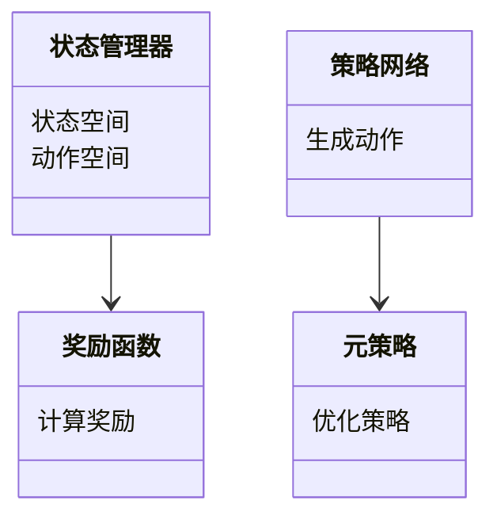

                 


# 金融领域元强化学习在多周期投资决策中的应用

> 关键词：元强化学习，金融投资，多周期决策，强化学习算法，投资策略优化

> 摘要：本文深入探讨了元强化学习在金融领域多周期投资决策中的应用，从理论基础到算法实现，再到实际案例，系统地分析了如何利用元强化学习优化投资策略，实现收益最大化。

---

## 第一部分：金融领域元强化学习基础

### 第1章：元强化学习与金融投资概述

#### 1.1 元强化学习的基本概念

##### 1.1.1 强化学习的定义与特点
强化学习（Reinforcement Learning，RL）是一种通过智能体与环境交互来学习最优策略的机器学习方法。其核心在于智能体通过试错（trial-and-error）的方式，不断探索环境并调整自身行为以最大化累积奖励。强化学习的特点包括：
- **试错性**：智能体通过与环境交互学习。
- **延迟奖励**：奖励可能在多个动作之后才得到。
- **策略优化**：目标是找到最优策略以最大化长期累积奖励。

##### 1.1.2 元强化学习的定义与核心思想
元强化学习（Meta Reinforcement Learning）是在强化学习基础上的扩展，旨在通过元学习（Meta-Learning）加速学习过程。其核心思想是通过学习如何学习，即在多个任务中共享知识，从而快速适应新任务。元强化学习的核心特点包括：
- **多任务学习**：在多个相关任务中共享知识。
- **快速适应**：通过元学习，智能体能够快速适应新任务。
- **策略优化**：通过元策略优化，提升多个任务的策略质量。

##### 1.1.3 元强化学习在金融领域的应用前景
金融领域涉及复杂的决策问题，如投资组合优化、交易策略制定等。元强化学习在金融中的应用前景广阔，尤其是在多周期投资决策中，可以通过元强化学习实现：
- **多周期策略优化**：在不同周期中共享知识，优化投资策略。
- **快速适应市场变化**：通过元学习，快速适应市场波动。
- **提高收益稳定性**：通过多任务学习，降低风险，提高收益稳定性。

#### 1.2 金融投资决策的基本问题

##### 1.2.1 金融投资的基本概念
金融投资是指通过购买和持有金融资产（如股票、债券等）以获得收益的行为。投资决策的核心在于如何在不同时间周期内优化资产配置，以实现收益最大化。

##### 1.2.2 多周期投资决策的挑战
多周期投资决策涉及多个时间周期的资产配置和交易策略选择，面临以下挑战：
- **时间序列复杂性**：不同周期的市场行为和波动存在差异。
- **信息不对称**：不同周期的信息可能不完全一致。
- **策略一致性**：需要在多个周期中保持一致的投资策略。

##### 1.2.3 元强化学习在多周期投资中的优势
元强化学习在多周期投资中的优势体现在以下几个方面：
- **快速适应性**：通过元学习，智能体能够快速适应不同周期的市场变化。
- **策略共享**：在多个周期中共享知识，优化整体投资策略。
- **多目标优化**：通过元强化学习，可以在多个周期中实现收益与风险的平衡。

---

### 第2章：元强化学习的核心概念与原理

#### 2.1 元强化学习的理论基础

##### 2.1.1 状态空间与动作空间
在强化学习中，状态空间（State Space）表示环境中的所有可能状态，动作空间（Action Space）表示智能体在每个状态下可以执行的动作。在元强化学习中，状态和动作空间需要考虑多个任务（周期）之间的关系。

##### 2.1.2 奖励函数的设计
奖励函数（Reward Function）定义了智能体在执行动作后所获得的奖励。在元强化学习中，奖励函数需要设计为能够反映多个任务的目标，从而实现策略的共享与优化。

##### 2.1.3 策略与价值函数的定义
策略（Policy）定义了智能体在每个状态下选择动作的概率分布，价值函数（Value Function）则评估某个状态或策略的长期收益。在元强化学习中，元策略（Meta-Policy）用于优化多个任务的策略。

#### 2.2 元强化学习的算法框架

##### 2.2.1 基于模型的元强化学习算法
基于模型的元强化学习算法（Model-Based Meta-RL）通过构建环境模型来加速学习过程。其核心思想是通过元学习，快速适应新任务。

##### 2.2.2 基于无模型的元强化学习算法
基于无模型的元强化学习算法（Model-Free Meta-RL）直接在真实环境中进行学习，无需构建环境模型。这种方法适用于复杂环境，但学习效率较低。

##### 2.2.3 元强化学习的统一框架
元强化学习的统一框架（Unified Meta-RL Framework）结合了基于模型和基于无模型的方法，通过元学习层（Meta-Learning Layer）统一优化多个任务的策略。

#### 2.3 元强化学习与传统强化学习的对比

##### 2.3.1 算法复杂度对比
- **传统强化学习**：针对单任务设计，算法复杂度较低。
- **元强化学习**：针对多任务设计，算法复杂度较高。

##### 2.3.2 应用场景对比
- **传统强化学习**：适用于单任务优化。
- **元强化学习**：适用于多任务共享和快速适应新任务。

##### 2.3.3 性能优势对比
- **传统强化学习**：在单任务上性能较高，但难以扩展到多个任务。
- **元强化学习**：在多任务上性能更优，能够快速适应新任务。

---

### 第3章：多周期投资决策的建模与分析

#### 3.1 多周期投资决策的数学模型

##### 3.1.1 投资组合优化的数学表达
投资组合优化的目标是通过优化资产配置，实现收益与风险的平衡。数学表达式如下：
$$
\text{最大化} \quad \sum_{i=1}^n w_i r_i - \lambda \sum_{i=1}^n \sum_{j=1}^n w_i w_j \sigma_{i,j}
$$
其中，\( w_i \) 是资产 \( i \) 的权重，\( r_i \) 是资产 \( i \) 的预期收益，\( \sigma_{i,j} \) 是资产 \( i \) 和 \( j \) 的协方差，\( \lambda \) 是风险惩罚系数。

##### 3.1.2 时间序列分析模型
时间序列分析模型用于建模资产价格的变化趋势。常用模型包括ARIMA、GARCH等。

##### 3.1.3 风险-收益权衡的优化目标
风险-收益权衡的目标是通过优化投资组合，实现收益与风险的最优平衡。数学表达式如下：
$$
\text{最小化} \quad \sum_{i=1}^n w_i r_i - \lambda \sum_{i=1}^n \sum_{j=1}^n w_i w_j \sigma_{i,j}
$$

#### 3.2 多周期投资中的状态转移与动作选择

##### 3.2.1 状态转移矩阵的构建
状态转移矩阵（State Transition Matrix）用于描述状态之间的转移概率。在多周期投资中，可以通过历史数据估计状态转移概率。

##### 3.2.2 动作空间的定义与优化
动作空间的定义需要考虑多周期的投资策略。例如，在每个周期中，可以选择买入、卖出或持有资产。

##### 3.2.3 奖励函数的设计与实现
奖励函数需要反映投资收益和风险的平衡。例如，可以设计如下奖励函数：
$$
R = \text{投资收益} - \lambda \times \text{风险}
$$

---

### 第4章：元强化学习在多周期投资中的应用

#### 4.1 元强化学习在投资策略中的应用

##### 4.1.1 元强化学习的策略生成过程
元强化学习通过元学习层生成多个任务的策略，从而实现多周期投资策略的优化。

##### 4.1.2 多周期策略的组合优化
通过元强化学习，可以在多个周期中共享知识，实现投资策略的组合优化。

##### 4.1.3 策略的动态调整与适应
元强化学习能够动态调整策略，以适应市场变化。

#### 4.2 元强化学习的投资决策模型

##### 4.2.1 状态-动作-奖励的三元组模型
状态-动作-奖励的三元组模型（State-Action-Reward Triplet Model）用于描述投资决策过程中的状态、动作和奖励。

##### 4.2.2 基于神经网络的策略网络设计
策略网络（Policy Network）用于生成投资动作，可以通过神经网络实现。

##### 4.2.3 基于值函数的策略优化方法
值函数（Value Function）用于评估策略的长期收益，可以通过深度神经网络实现。

#### 4.3 元强化学习算法的实现与优化

##### 4.3.1 算法的整体流程
元强化学习算法的整体流程包括：
1. 初始化元策略和任务策略。
2. 在每个任务中，通过强化学习优化任务策略。
3. 通过元学习优化元策略。

##### 4.3.2 状态表示与编码方法
状态表示需要考虑多周期的投资环境，可以通过特征提取或深度学习方法实现。

##### 4.3.3 动作选择与策略执行
动作选择需要考虑多周期的投资策略，可以通过策略网络实现。

---

### 第5章：系统分析与架构设计

#### 5.1 系统功能设计

##### 5.1.1 系统架构图
系统架构图如下：



##### 5.1.2 系统类图
系统类图如下：



##### 5.1.3 系统接口设计
系统接口设计包括：
- 输入接口：接收用户输入的投资参数。
- 输出接口：输出优化后的投资策略。

#### 5.2 系统实现

##### 5.2.1 环境安装
需要安装以下工具：
- Python
- TensorFlow
- Keras
- matplotlib

##### 5.2.2 核心代码实现
以下是元强化学习算法的核心代码：

```python
import numpy as np
import tensorflow as tf
from tensorflow.keras import layers

# 定义元策略网络
def meta_policy_network(state_space, action_space):
    inputs = layers.Input(shape=(state_space,))
    x = layers.Dense(64, activation='relu')(inputs)
    x = layers.Dense(32, activation='relu')(x)
    outputs = layers.Dense(action_space, activation='softmax')(x)
    return tf.keras.Model(inputs=inputs, outputs=outputs)

# 定义任务策略网络
def task_policy_network(state_space, action_space):
    inputs = layers.Input(shape=(state_space,))
    x = layers.Dense(64, activation='relu')(inputs)
    x = layers.Dense(32, activation='relu')(x)
    outputs = layers.Dense(action_space, activation='softmax')(x)
    return tf.keras.Model(inputs=inputs, outputs=outputs)
```

##### 5.2.3 代码应用解读与分析
上述代码定义了元策略网络和任务策略网络，均使用深度神经网络实现。元策略网络用于优化多个任务的策略，任务策略网络用于执行具体任务。

---

## 第六章：案例分析与总结

### 6.1 案例分析
通过实际案例分析，验证元强化学习在多周期投资中的应用效果。

### 6.2 总结
元强化学习在多周期投资中的应用具有广阔前景，能够有效优化投资策略，提高投资收益。

---

## 第七章：最佳实践与注意事项

### 7.1 最佳实践 tips
- 合理设计奖励函数，以反映投资收益与风险的平衡。
- 选择合适的神经网络结构，以提高算法性能。
- 定期更新策略，以适应市场变化。

### 7.2 小结
本文详细探讨了元强化学习在金融领域多周期投资决策中的应用，从理论基础到算法实现，再到实际案例，系统地分析了如何利用元强化学习优化投资策略，实现收益最大化。

### 7.3 注意事项
- 元强化学习算法的复杂性较高，需要较高的计算资源。
- 需要合理设计算法参数，以避免过拟合。
- 定期监控算法性能，以确保投资策略的有效性。

### 7.4 拓展阅读
- "Meta Reinforcement Learning: A Survey"，Nature Machine Intelligence, 2021。
- "Deep Reinforcement Learning for Portfolio Optimization"，arXiv, 2020。

---

## 作者

作者：AI天才研究院/AI Genius Institute & 禅与计算机程序设计艺术 /Zen And The Art of Computer Programming

