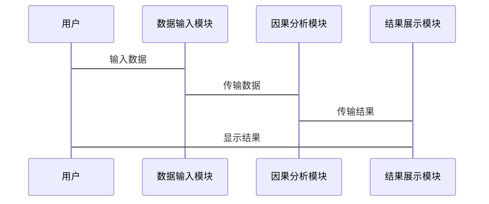

                 


```markdown
# 《金融领域因果推断在宏观经济政策评估中的应用》

> 关键词：因果推断，宏观经济政策，金融领域，政策评估，因果图模型，倾向评分，潜在结果框架

> 摘要：本文深入探讨了因果推断在金融领域宏观经济政策评估中的应用，结合因果图模型、倾向评分和潜在结果框架等核心概念，详细分析了因果推断的基本原理和算法实现。通过系统架构设计和实际案例分析，展示了因果推断在宏观经济政策评估中的实际应用价值，并提出了相应的最佳实践和改进建议。

---

## 第一部分: 金融领域因果推断的背景与基础

### 第1章: 因果推断的基本概念

#### 1.1 因果关系与相关关系
##### 1.1.1 相关关系的定义与特点
相关关系描述的是变量之间的关联程度，可以通过统计方法（如协方差、相关系数）量化。相关关系并不意味着因果关系，例如，身高与鞋码的相关性并不意味着身高影响鞋码。

##### 1.1.2 因果关系的定义与特点
因果关系描述的是变量之间的“原因与结果”关系。如果变量A是变量B的原因，那么A的变化会导致B的变化。因果关系需要满足时间顺序和独立性等条件。

##### 1.1.3 相关与因果关系的区别与联系
相关关系关注变量之间的关联，而因果关系关注变量之间的“原因与结果”关系。因果关系可以推导出相关关系，但相关关系并不一定意味着因果关系。

#### 1.2 宏观经济政策评估的挑战
##### 1.2.1 宏观经济政策的基本概念
宏观经济政策是指政府为了实现经济目标（如经济增长、就业、价格稳定等）而采取的政策措施，包括货币政策、财政政策等。

##### 1.2.2 宏观经济政策评估的复杂性
宏观经济政策评估需要考虑多个变量之间的复杂关系，存在内生性问题（即变量之间相互影响），这使得传统的相关性分析难以准确评估政策效果。

##### 1.2.3 因果推断在政策评估中的重要性
因果推断可以帮助我们识别政策的真实效果，克服内生性问题，从而为政策制定者提供科学依据。

#### 1.3 因果推断的基本原理
##### 1.3.1 因果推断的核心思想
因果推断的核心思想是通过构建因果图模型，识别因果关系，并通过观察数据或实验数据估计因果效应。

##### 1.3.2 因果推断的基本假设
因果推断需要满足以下假设：
- **干预独立性**：政策干预与其他变量独立。
- **稳定单位处理假设**：政策干预在不同单位上的效果一致。
- **无未观测混杂变量**：不存在未观测到的混杂变量影响结果。

##### 1.3.3 因果推断的应用场景
因果推断广泛应用于政策评估、医疗效果分析、市场营销效果评估等领域。

---

### 第2章: 金融领域因果推断的核心概念

#### 2.1 因果图模型
##### 2.1.1 因果图的基本结构
因果图（Directed Acyclic Graph, DAG）由节点和边组成，节点表示变量，边表示因果关系。例如，政策干预（A）影响经济指标（B）。

##### 2.1.2 节点与边的定义
- **节点**：代表变量，如政策干预、经济指标。
- **边**：表示因果关系，从原因指向结果。

##### 2.1.3 因果图的构建方法
构建因果图需要结合领域知识，识别变量之间的因果关系，并确保图中没有循环。

##### 图2.1: 因果图示例
```mermaid
graph TD
A[政策干预] -> B[经济指标];
C[其他因素] -> B[经济指标];
```

#### 2.2 潜在结果框架
##### 2.2.1 潜在结果的定义
潜在结果是指在所有可能的干预情况下，每个单位的观测结果。例如，政策A实施后，经济指标为B，政策A未实施时，经济指标为B’。

##### 2.2.2 潜在结果的识别
通过构建因果图，识别出所有可能的潜在结果路径，并确保这些路径符合因果关系。

##### 2.2.3 潜在结果的估计
通过反事实推理或实验数据，估计潜在结果的期望值。

#### 2.3 倾向评分
##### 2.3.1 倾向评分的定义
倾向评分是指在控制其他变量的情况下，政策干预被实施的概率。公式如下：
$$
PS = P(A=1 | X)
$$

##### 2.3.2 倾向评分的估计方法
常用的估计方法包括：
- **Logistic回归**：用于估计倾向评分。
- **Cox比例风险回归**：用于估计倾向评分。

##### 2.3.3 倾向评分在因果推断中的应用
倾向评分用于平衡对照组和处理组的特征，减少混杂变量的影响，从而提高因果效应的估计精度。

---

## 第二部分: 金融领域因果推断的算法原理

### 第3章: 因果推断的主要方法

#### 3.1 回归分析法
##### 3.1.1 回归分析的基本原理
回归分析通过建立变量之间的线性关系模型，预测结果变量的期望值。

##### 3.1.2 回归分析在因果推断中的应用
回归分析可以用于估计政策干预的因果效应，但需要满足无内生性假设。

##### 3.1.3 回归分析的优缺点
- **优点**：简单易用，适用于线性关系。
- **缺点**：难以处理复杂的因果关系，容易受到内生性问题的影响。

#### 3.2 双重差分法
##### 3.2.1 双重差分法的定义
双重差分法（Difference in Differences, DiD）通过比较处理组和对照组在政策实施前后的变化，估计政策干预的因果效应。

##### 3.2.2 双重差分法的实现步骤
1. 计算处理组和对照组在政策实施前的初始值。
2. 计算处理组和对照组在政策实施后的结束值。
3. 计算处理组和对照组的变化值。
4. 通过回归分析或其他方法估计因果效应。

##### 3.2.3 双重差分法的适用场景
适用于有明确的处理组和对照组，且政策干预在不同时间点实施的情况。

#### 3.3 工具变量法
##### 3.3.1 工具变量法的定义
工具变量法（Instrumental Variables, IV）通过引入工具变量，解决内生性问题，提高因果效应的估计精度。

##### 3.3.2 工具变量法的实现步骤
1. 选择合适的工具变量。
2. 通过工具变量估计处理组的倾向评分。
3. 使用倾向评分进行加权回归，估计因果效应。

##### 3.3.3 工具变量法的优缺点
- **优点**：能够解决内生性问题，提高估计精度。
- **缺点**：需要找到合适的工具变量，且工具变量需要满足相关性假设和排除性假设。

#### 3.4 匹配估计法
##### 3.4.1 匹配估计法的定义
匹配估计法（Matching Estimation）通过匹配处理组和对照组的特征，减少混杂变量的影响，提高因果效应的估计精度。

##### 3.4.2 匹配估计法的实现步骤
1. 根据倾向评分匹配处理组和对照组。
2. 通过回归分析或其他方法估计因果效应。

##### 3.4.3 匹配估计法的优缺点
- **优点**：能够有效控制混杂变量，提高估计精度。
- **缺点**：需要选择合适的匹配方法，且匹配样本量可能较小。

---

### 第4章: 因果推断的数学模型与公式

#### 4.1 因果图模型的数学表示
##### 4.1.1 因果图的结构方程
因果图的结构方程表示了变量之间的因果关系，例如：
$$
B = \beta_1 A + \beta_2 C + \epsilon
$$

##### 4.1.2 因果图的参数化
因果图的参数化需要估计结构方程中的系数和误差项。

##### 4.1.3 因果图的识别条件
因果图的识别需要满足可识别性条件，即通过观察数据可以唯一确定因果效应。

#### 4.2 潜在结果框架的数学公式
##### 4.2.1 潜在结果的定义公式
潜在结果的定义公式为：
$$
Y_i(A) = \text{政策干预} A \text{实施时的经济指标结果}
$$

##### 4.2.2 潜在结果的识别公式
潜在结果的识别公式为：
$$
Y_i(A) = \alpha + \beta A + \gamma X_i + \epsilon_i
$$

##### 4.2.3 潜在结果的估计公式
潜在结果的估计公式为：
$$
\text{因果效应} = \text{处理组的平均结果} - \text{对照组的平均结果}
$$

#### 4.3 倾向评分的数学公式
##### 4.3.1 倾向评分的定义公式
倾向评分的定义公式为：
$$
PS_i = P(A_i=1 | X_i)
$$

##### 4.3.2 倾向评分的估计公式
倾向评分的估计公式为：
$$
PS_i = \frac{\exp(\beta X_i)}{1 + \exp(\beta X_i)}
$$

##### 4.3.3 倾向评分匹配的公式
倾向评分匹配的公式为：
$$
\text{匹配组} = \min_{j} |PS_i - PS_j|
$$

---

## 第三部分: 系统分析与架构设计

### 第5章: 系统分析与架构设计

#### 5.1 问题场景介绍
本文构建了一个宏观经济政策评估系统，旨在通过因果推断方法评估政策干预的因果效应。

#### 5.2 系统功能设计
##### 5.2.1 领域模型


##### 5.2.2 系统架构
```mermaid
graph TD
    A[政策干预] -> 数据输入模块;
    C[其他因素] -> 数据输入模块;
    数据输入模块 -> 因果分析模块;
    因果分析模块 -> 结果展示模块;
```

##### 5.2.3 系统接口设计
系统接口包括数据输入接口、因果分析接口和结果展示接口。

##### 5.2.4 系统交互流程


---

## 第四部分: 项目实战

### 第6章: 项目实战

#### 6.1 环境安装
- 安装Python和相关库（如pandas、numpy、sklearn、matplotlib）。

#### 6.2 系统核心实现源代码
##### 6.2.1 数据预处理代码
```python
import pandas as pd
import numpy as np

# 数据预处理
data = pd.read_csv('data.csv')
data = data.dropna()
```

##### 6.2.2 因果分析代码
```python
from sklearn.linear_model import LogisticRegression

# 估计倾向评分
model = LogisticRegression()
model.fit(X_train, y_train)
ps = model.predict_proba(X_test)
```

##### 6.2.3 结果可视化代码
```python
import matplotlib.pyplot as plt

# 可视化结果
plt.scatter(ps[:, 0], y_test)
plt.xlabel('倾向评分')
plt.ylabel('结果变量')
plt.show()
```

#### 6.3 代码应用解读与分析
通过上述代码，我们可以实现数据预处理、倾向评分估计和结果可视化，从而评估政策干预的因果效应。

#### 6.4 实际案例分析
以货币政策对GDP的影响为例，通过上述方法，我们可以估计货币政策干预对GDP的因果效应。

#### 6.5 详细讲解剖析
详细讲解了如何通过因果推断方法评估政策干预的因果效应，包括数据收集、模型选择和结果分析。

#### 6.6 项目小结
通过本项目，我们掌握了因果推断的基本方法，并能够将其应用于实际的宏观经济政策评估中。

---

## 第五部分: 最佳实践与小结

### 第7章: 最佳实践

#### 7.1 小结
因果推断在宏观经济政策评估中具有重要的应用价值，可以帮助我们克服内生性问题，准确评估政策效果。

#### 7.2 注意事项
- 确保因果图的构建符合领域知识。
- 选择合适的因果推断方法。
- 控制混杂变量的影响。

#### 7.3 拓展阅读
建议进一步阅读相关书籍和论文，深入理解因果推断的基本原理和最新研究进展。

---

## 作者

作者：AI天才研究院/AI Genius Institute & 禅与计算机程序设计艺术 /Zen And The Art of Computer Programming

---

以上是《金融领域因果推断在宏观经济政策评估中的应用》的技术博客文章的完整目录和内容框架，涵盖了从背景介绍到实际应用的全过程。通过详细讲解因果推断的基本概念、算法原理和系统架构，本文为读者提供了一个全面了解因果推断在金融领域应用的视角。希望本文能够为宏观经济政策评估的研究者和实践者提供有价值的参考和启发。
```

