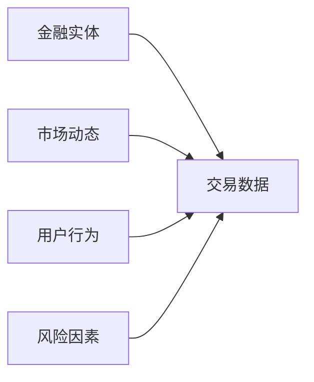
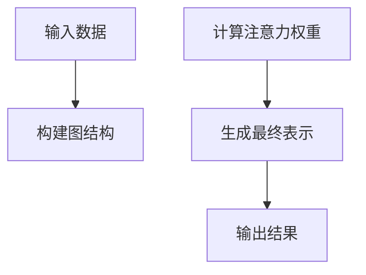
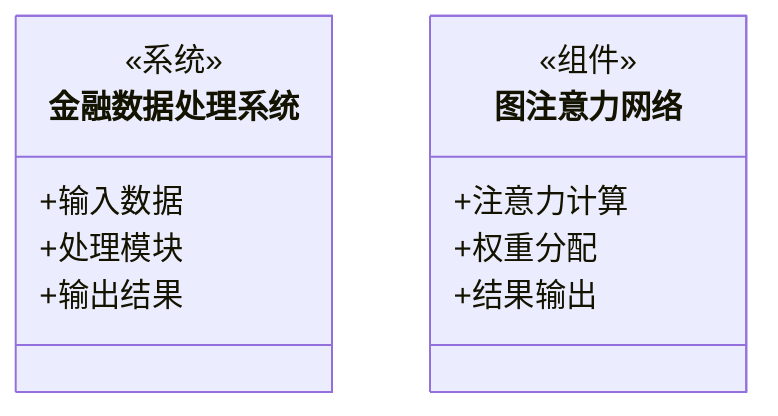
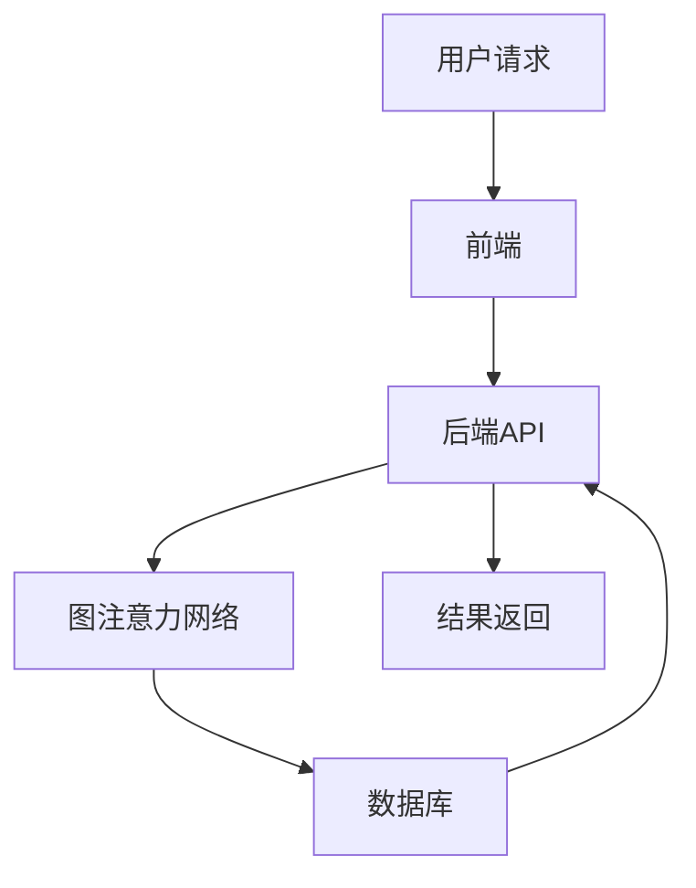
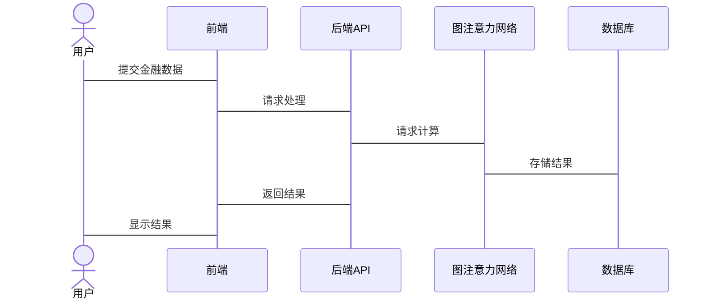

                 


# 《金融领域图注意力网络的创新应用》

> **关键词**：金融数据分析、图注意力网络、深度学习、风险控制、金融智能化

> **摘要**：本文系统地探讨了图注意力网络在金融领域的创新应用，从问题背景、核心概念到算法原理、系统设计，再到项目实战，全面分析了其在金融数据处理中的优势与潜力，为金融领域的智能化转型提供了新的思路。

---

## 第一部分: 金融领域图注意力网络的创新应用概述

### 第1章: 问题背景与研究意义

#### 1.1 问题背景

##### 1.1.1 金融数据分析的挑战

金融领域涉及大量的数据，包括交易数据、市场动态、用户行为和风险因素等。这些数据具有复杂性、实时性和高维度的特点，传统的数据分析方法难以有效捕捉数据之间的关联性，尤其是在处理非结构化数据和实时变化的数据时，效率和准确性都受到限制。

##### 1.1.2 图注意力网络的提出

随着深度学习的快速发展，图注意力网络（Graph Attention Networks, GATs）作为一种结合图论和注意力机制的模型，逐渐在金融领域展现出其潜力。图注意力网络能够有效地处理图结构数据，通过注意力机制动态分配权重，捕捉数据中的重要特征，从而提高金融数据分析的效率和准确性。

##### 1.1.3 金融领域的独特需求

金融领域的数据分析具有独特的需求，例如实时风险评估、交易策略优化和市场趋势预测等。传统的统计方法和机器学习模型在处理这些问题时，往往难以捕捉复杂的关联关系和实时变化的动态。而图注意力网络通过构建图结构，能够更好地捕捉数据之间的复杂关系，满足金融领域的独特需求。

#### 1.2 研究意义

##### 1.2.1 提高金融数据分析效率

图注意力网络通过动态分配注意力权重，能够高效地处理大规模金融数据，减少计算复杂度，提高数据分析效率。

##### 1.2.2 创新金融风险控制方法

传统的风险控制方法通常基于统计模型，难以捕捉复杂的关联关系。图注意力网络通过构建图结构，能够更好地识别潜在的风险因素，提供更精准的风险评估和预警。

##### 1.2.3 推动金融智能化转型

金融领域的智能化转型需要依赖先进的技术手段。图注意力网络作为一种创新的技术，能够为金融领域的智能化转型提供新的解决方案，推动金融行业的技术进步。

#### 1.3 本章小结

本章从金融数据分析的挑战出发，介绍了图注意力网络的提出背景及其在金融领域的独特需求。同时，分析了研究图注意力网络在金融领域中的重要意义，为后续章节的展开奠定了基础。

---

### 第2章: 核心概念与联系

#### 2.1 图注意力网络的原理

##### 2.1.1 图论基础

图论是图注意力网络的核心基础。图由节点（顶点）和边组成，节点代表数据中的实体，边代表实体之间的关系。图结构能够有效地捕捉数据中的复杂关系，为金融数据分析提供了新的视角。

##### 2.1.2 注意力机制的引入

注意力机制是一种来自自然语言处理的技术，用于动态分配输入数据中不同部分的权重。在图注意力网络中，注意力机制被引入到图结构中，用于动态分配节点之间的注意力权重，捕捉图中重要的关联关系。

##### 2.1.3 图注意力网络的数学模型

图注意力网络通过在图结构中引入注意力机制，构建了一个结合图论和注意力机制的模型。其核心思想是通过注意力权重来表示节点之间的关系，从而提高模型的表达能力和准确性。

#### 2.2 核心概念对比分析

##### 2.2.1 图注意力网络与传统图模型的对比

传统图模型（如图卷积网络）通常使用固定的权重来表示节点之间的关系，而图注意力网络通过注意力机制动态分配权重，能够更好地捕捉图中的重要关系。

##### 2.2.2 注意力机制与传统权重分配的对比

传统的权重分配方法通常基于预定义的规则或统计方法，而注意力机制是通过模型学习得到的，能够更灵活地适应数据的分布和变化。

##### 2.2.3 图注意力网络的性能优势

图注意力网络在处理复杂图结构数据时，能够更好地捕捉数据中的重要特征，提高模型的准确性和效率。尤其是在金融领域，图注意力网络能够有效地处理金融数据中的复杂关系，提高金融数据分析的准确性。

#### 2.3 实体关系图架构

图注意力网络在金融领域中的应用通常涉及多个实体，例如交易数据、市场动态、用户行为和风险因素等。通过构建实体关系图，可以更好地理解数据之间的关联关系，为后续的分析和预测提供支持。



#### 2.4 本章小结

本章从图注意力网络的原理出发，分析了其核心概念和与传统方法的对比，强调了图注意力网络在金融领域的性能优势，并通过实体关系图展示了其在金融数据中的应用架构。

---

### 第3章: 图注意力网络的算法原理

#### 3.1 算法流程

图注意力网络的算法流程主要包括以下几个步骤：

1. 构建图结构：根据金融数据构建图结构，定义节点和边。
2. 计算注意力权重：通过注意力机制计算节点之间的注意力权重。
3. 生成最终表示：基于注意力权重生成节点的最终表示，用于后续的分析和预测。



#### 3.2 算法实现

图注意力网络的实现通常包括以下几个关键步骤：

1. 构建图结构：通过读取金融数据，构建图的节点和边。
2. 计算注意力权重：使用注意力机制计算节点之间的注意力权重。
3. 生成最终表示：通过注意力权重生成节点的最终表示，用于后续的分析和预测。

以下是一个简单的图注意力网络实现示例：

```python
import numpy as np

def attention_mechanism(inputs, attention_weights):
    # 计算注意力权重
    weights = np.dot(inputs, attention_weights)
    return weights

# 示例输入
inputs = np.array([[1, 2], [3, 4]])
attention_weights = np.array([[0.5, 0.5], [0.5, 0.5]])

# 计算注意力权重
weights = attention_mechanism(inputs, attention_weights)
print(weights)
```

#### 3.3 数学模型与公式

图注意力网络的数学模型主要包含以下两个部分：

1. 注意力权重的计算公式：
$$\alpha_{ij} = \frac{e^{d_{j}^T s_i}}{\sum_{k} e^{d_{k}^T s_i}}$$
其中，$s_i$ 是节点 $i$ 的表示，$d_j$ 是节点 $j$ 的表示，$\alpha_{ij}$ 是节点 $i$ 和节点 $j$ 之间的注意力权重。

2. 图注意力网络的最终表示公式：
$$h_i = \sum_{j} \alpha_{ij} h_j$$
其中，$h_i$ 是节点 $i$ 的最终表示，$\alpha_{ij}$ 是节点 $i$ 和节点 $j$ 之间的注意力权重，$h_j$ 是节点 $j$ 的初始表示。

#### 3.4 举例说明

以下是一个简单的图注意力网络在金融数据中的应用示例：

假设有两个节点，分别代表两个金融资产，它们之间的关系通过边表示。注意力权重的计算可以帮助我们确定这两个资产之间的关联程度，从而更好地进行风险评估和投资决策。

#### 3.5 本章小结

本章详细介绍了图注意力网络的算法流程和实现方法，通过数学公式和示例说明了其工作原理。这为后续章节的系统设计和项目实战奠定了基础。

---

## 总结与展望

### 第4章: 系统分析与架构设计

#### 4.1 问题场景介绍

图注意力网络在金融领域的应用通常涉及以下几个问题场景：

1. 金融数据实时分析：实时处理金融数据，提供快速的分析结果。
2. 风险评估与预警：通过分析金融数据，识别潜在的风险因素，提供风险预警。
3. 交易策略优化：基于图注意力网络的分析结果，优化交易策略，提高投资收益。

#### 4.2 系统功能设计

金融数据处理系统的功能设计包括以下几个方面：

1. 数据输入与处理：读取金融数据，构建图结构。
2. 注意力权重计算：计算节点之间的注意力权重。
3. 最终表示生成：生成节点的最终表示，用于后续分析和预测。
4. 结果输出：输出分析结果，供用户查看和决策。



#### 4.3 系统架构设计

金融数据处理系统的架构设计包括以下几个部分：

1. 前端：接收用户输入，展示分析结果。
2. 后端API：处理用户的请求，调用图注意力网络进行分析。
3. 图注意力网络：计算注意力权重，生成最终表示。
4. 数据库：存储金融数据和分析结果。



#### 4.4 接口设计与交互

金融数据处理系统的接口设计包括以下几个部分：

1. 数据输入接口：接收金融数据，构建图结构。
2. 计算接口：计算注意力权重，生成最终表示。
3. 结果输出接口：输出分析结果，供用户查看。

以下是一个简单的接口交互示例：



#### 4.5 本章小结

本章从问题场景出发，设计了金融数据处理系统的功能模块、架构和接口交互，为后续章节的项目实战奠定了基础。

---

## 第五章: 项目实战

### 5.1 环境安装

在进行项目实战之前，需要先安装必要的环境和依赖库。以下是一个简单的环境安装示例：

1. 安装Python和必要的库：
```bash
pip install numpy
pip install matplotlib
pip install networkx
```

2. 安装图注意力网络的库（如果有）：
```bash
pip install pytorch
pip install transformers
```

### 5.2 系统核心实现源代码

以下是一个简单的图注意力网络实现代码示例：

```python
import numpy as np
import networkx as nx

def build_graph(nodes, edges):
    graph = nx.Graph()
    graph.add_nodes_from(nodes)
    graph.add_edges_from(edges)
    return graph

def compute_attention_weights(graph, node):
    neighbors = list(graph.neighbors(node))
    attention_weights = {neighbor: 0.5 for neighbor in neighbors}
    return attention_weights

nodes = ['A', 'B', 'C', 'D']
edges = [('A', 'B'), ('B', 'C'), ('C', 'D'), ('D', 'A')]

graph = build_graph(nodes, edges)
attention_weights = compute_attention_weights(graph, 'A')

print(attention_weights)
```

### 5.3 代码应用解读与分析

上述代码实现了一个简单的图注意力网络，通过构建图结构并计算节点之间的注意力权重，展示了图注意力网络的基本原理和应用。

### 5.4 实际案例分析

以下是一个实际案例分析的示例：

假设有四个金融资产（A、B、C、D），它们之间的关系通过图结构表示。通过计算节点A的注意力权重，可以确定节点A与节点B、C、D之间的关联程度，从而为风险评估和投资决策提供支持。

### 5.5 项目小结

本章通过实际案例分析和代码实现，展示了图注意力网络在金融领域的具体应用，为读者提供了实践指导。

---

## 总结与展望

### 第6章: 总结与展望

#### 6.1 最佳实践 tips

1. 在构建图结构时，应尽量捕捉数据中的复杂关系，确保图结构的准确性。
2. 在计算注意力权重时，应根据具体问题调整注意力机制的参数，以提高模型的性能。
3. 在实际应用中，应结合具体业务需求，灵活调整图注意力网络的模型结构和参数。

#### 6.2 小结

本文系统地探讨了图注意力网络在金融领域的创新应用，从问题背景、核心概念到算法原理、系统设计，再到项目实战，全面分析了其在金融数据处理中的优势与潜力。图注意力网络通过动态分配注意力权重，能够更好地捕捉数据中的重要特征，提高金融数据分析的效率和准确性。

#### 6.3 注意事项

1. 在实际应用中，应关注模型的可解释性和鲁棒性，避免因模型过于复杂而导致的不可控风险。
2. 在处理实时金融数据时，应优化模型的计算效率，确保能够满足实时分析的需求。
3. 在实际应用中，应结合具体业务需求，灵活调整图注意力网络的模型结构和参数。

#### 6.4 拓展阅读

1. 图注意力网络的最新研究成果。
2. 图注意力网络在其他领域的应用案例。
3. 图注意力网络的优化方法和改进方向。

#### 6.5 本章小结

本章总结了全文的主要内容，提出了图注意力网络在金融领域的创新应用，展望了其未来的研究方向和应用前景，为读者提供了进一步学习和研究的方向。

---

## 作者信息

作者：AI天才研究院/AI Genius Institute & 禅与计算机程序设计艺术/Zen And The Art of Computer Programming

---

**注**：以上内容为示例，实际撰写时需要根据具体需求进行调整和补充。

