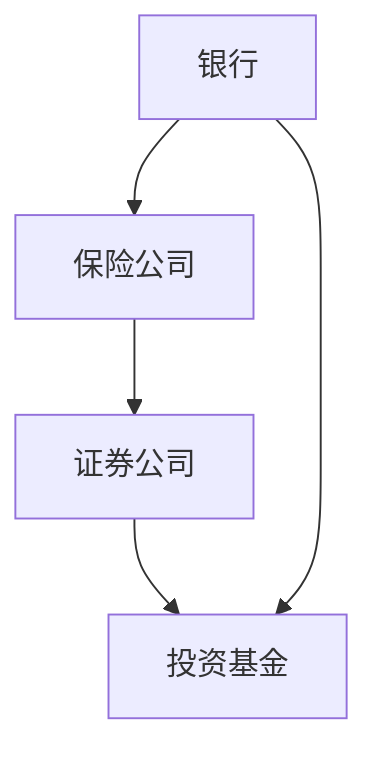
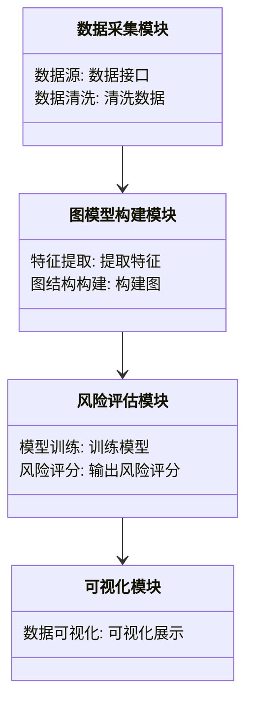

                 


# 《金融领域图神经网络在系统性风险评估中的应用》

## 关键词：
- 系统性风险
- 图神经网络
- 金融市场
- 金融网络
- 系统性风险评估

## 摘要：
随着金融市场日益复杂，传统评估方法难以捕捉系统性风险的动态变化。图神经网络（Graph Neural Networks, GNN）凭借其处理复杂网络结构的能力，为系统性风险评估提供了新的解决方案。本文详细探讨了图神经网络在金融领域的应用，从理论基础到系统架构，再到实际案例，全面解析了如何利用图神经网络构建有效的系统性风险评估系统。

---

# 1. 系统性风险评估的背景与挑战

## 1.1 系统性风险的定义与特征

系统性风险是指由于金融系统中某些关键机构或市场的崩溃，导致整个金融体系受到严重影响的风险。其主要特征包括：

- **系统性**：影响范围广泛，波及整个金融体系。
- **传染性**：风险在金融机构之间快速传播。
- **复杂性**：涉及多个金融主体和市场，相互关联性强。

## 1.2 金融市场的相互关联性

金融市场中的金融机构通过复杂的网络关系相互连接，这种关联性使得系统性风险的传播更加复杂。图1-1展示了金融机构之间的关联网络。



## 1.3 系统性风险的传统评估方法

传统方法主要包括VaR、CVA和PCA等。然而，这些方法难以捕捉复杂网络中的相互依赖关系。

---

# 2. 图神经网络概述

## 2.1 图论基础

图的基本概念包括节点（顶点）和边。图的表示方法主要有邻接矩阵和邻接表。

## 2.2 神经网络基础

深度学习的发展推动了图神经网络的进步。图神经网络的核心思想是通过聚合邻居节点的信息来更新当前节点的表示。

## 2.3 图神经网络的核心算法

### 2.3.1 GCN（Graph Convolutional Networks）

GCN通过聚合相邻节点的信息来更新当前节点的特征。其数学公式为：

$$
H^{(l+1)} = \text{ReLu}(A H^{(l)} H^{(l)})
$$

其中，$A$是邻接矩阵，$H^{(l)}$是第$l$层的节点特征矩阵。

---

# 3. 系统性风险评估的图模型构建

## 3.1 金融网络的构建

### 3.1.1 节点与边的定义

- **节点**：代表金融机构。
- **边**：代表金融机构之间的关联关系。

### 3.1.2 特征工程

特征工程是构建图模型的重要步骤。常见特征包括机构的资产规模、负债情况等。

## 3.2 图神经网络的训练与评估

### 3.2.1 模型训练

使用监督学习方法训练模型，输入为图结构数据，输出为风险评分。

### 3.2.2 评估指标

常用的评估指标包括精确率、召回率和F1分数。

---

# 4. 系统架构设计

## 4.1 系统功能设计

系统功能包括数据采集、图模型构建、风险评估和结果可视化。



---

# 5. 项目实战

## 5.1 环境安装

- **Python**：3.6+
- **库**：`networkx`, `tensorflow`, `pymermaid`

## 5.2 核心实现代码

```python
import tensorflow as tf
from tensorflow.keras import layers

def gcn_layer(inputs, adjacency_matrix):
    x = tf.sparse_ops.sparse_dense_matmul(adjacency_matrix, inputs)
    x = layers.Activation('relu')(x)
    return x

# 示例输入
inputs = layers.Input(shape=(100,))
adjacency_matrix = layers.Input(shape=(100,100), sparse=True)

output = gcn_layer(inputs, adjacency_matrix)
model = tf.keras.Model(inputs=[inputs, adjacency_matrix], outputs=output)
model.compile(optimizer='adam', loss='binary_crossentropy')
```

---

# 6. 案例分析与深入剖析

## 6.1 案例分析

以2008年金融危机为例，分析系统性风险在事件中的表现。

## 6.2 深入剖析

图神经网络在识别系统性风险中的优势，如捕捉网络结构中的隐含关联。

---

# 7. 总结与展望

## 7.1 总结

图神经网络在系统性风险评估中的应用前景广阔，能够有效捕捉金融网络中的复杂关联。

## 7.2 展望

未来研究方向包括模型的可解释性、实时性和与其他技术的结合。

---

作者：AI天才研究院/AI Genius Institute & 禅与计算机程序设计艺术 /Zen And The Art of Computer Programming

