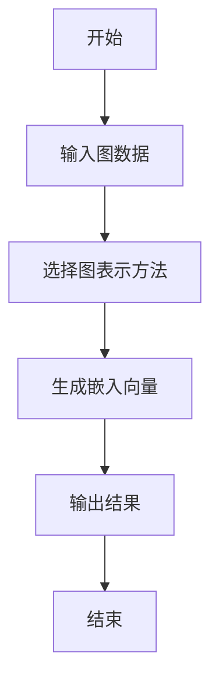
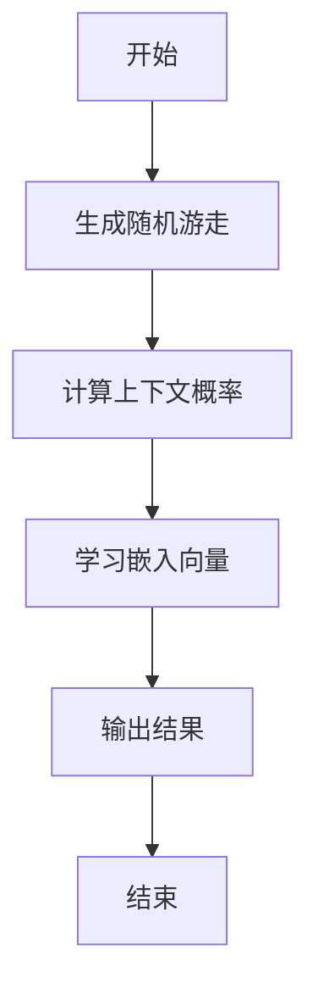

                 


# 金融领域图表示学习的应用与挑战

> 关键词：图表示学习，金融应用，算法原理，风险评估，欺诈检测

> 摘要：本文系统地探讨了图表示学习在金融领域的应用与挑战。首先，我们介绍了图表示学习的基本概念和核心原理，分析了其在金融领域的独特优势。接着，我们详细讲解了图表示学习的主要算法及其数学模型，通过实际案例展示了其在风险评估、欺诈检测和推荐系统中的应用。最后，我们讨论了当前技术的局限性，并展望了未来的发展方向。

---

# 第一部分: 金融领域图表示学习的背景与概念

## 第1章: 图表示学习的基本概念与背景

### 1.1 图表示学习的定义与核心概念

#### 1.1.1 图结构与节点关系的定义

图表示学习是一种通过将图结构数据转化为低维向量表示的方法。图中的节点代表实体（如客户、交易、资产等），边代表实体之间的关系（如交易关系、持有关系）。图表示学习的目标是将这些复杂的图结构转化为易于处理的向量形式，以便后续的机器学习任务。

图的定义可以用集合论表示为：$G = (V, E)$，其中$V$是节点集合，$E$是边集合。边可以是有向边或无向边，也可以带有权重。

#### 1.1.2 图表示学习的核心目标

图表示学习的核心目标是通过保留图的结构信息和语义信息，将图中的每个节点或子图表示为低维向量。这些向量可以用于多种任务，如节点分类、链路预测、图分类等。

#### 1.1.3 图表示学习与传统机器学习的对比

传统机器学习方法（如随机森林、SVM）通常处理的是结构化的数据（如表格数据），而图表示学习能够处理复杂的图结构数据，捕捉数据之间的复杂关系。

| 对比维度 | 传统机器学习 | 图表示学习 |
|----------|--------------|------------|
| 数据类型 | 表格数据       | 图结构数据 |
| 关系建模 | 线性关系       | 非线性关系 |
| 应用场景 | 分类、回归     | 风险评估、欺诈检测 |

### 1.2 金融领域的图数据特点

#### 1.2.1 金融数据的复杂性与关联性

金融数据通常具有高度的复杂性和关联性。例如，客户之间的交易关系、资产之间的依赖关系等都可以表示为图结构。

#### 1.2.2 金融图数据的典型场景

金融领域的图数据可以分为以下几种典型场景：

- **客户关系图**：节点为客户，边为交易关系。
- **资产关系图**：节点为资产，边为持有关系。
- **欺诈网络图**：节点为交易，边为关联的交易关系。

#### 1.2.3 图表示学习在金融领域的应用价值

图表示学习能够捕捉金融数据中的复杂关系，提高金融模型的准确性和鲁棒性。例如，在欺诈检测中，图表示学习可以识别异常交易模式。

### 1.3 图表示学习的技术优势与挑战

#### 1.3.1 图表示学习的技术优势

- **捕捉复杂关系**：能够处理复杂的非线性关系。
- **节点嵌入**：可以将节点表示为低维向量，便于后续任务。
- **图结构信息**：保留图的全局结构信息。

#### 1.3.2 图表示学习在金融领域的挑战

- **计算复杂度**：图表示学习通常需要处理大规模图数据，计算复杂度较高。
- **模型解释性**：图表示学习的黑箱特性可能影响模型的解释性。
- **数据稀疏性**：金融数据可能存在稀疏性，影响模型的泛化能力。

#### 1.3.3 图表示学习的未来发展方向

- **轻量化模型**：开发更高效的图表示学习算法。
- **可解释性增强**：提高模型的可解释性。
- **多模态融合**：结合文本、图像等多种数据源。

---

## 第2章: 图表示学习的核心概念与联系

### 2.1 图表示学习的核心概念

#### 2.1.1 图的表示与嵌入

图表示学习通过嵌入技术将图中的节点或子图表示为低维向量。嵌入向量保留了图的结构信息和语义信息。

图嵌入的表示可以分为以下几种形式：

- **节点嵌入**：每个节点对应一个向量。
- **边嵌入**：每条边对应一个向量。
- **图嵌入**：整个图对应一个向量。

#### 2.1.2 节点、边与图的嵌入方法

节点嵌入的方法包括：

- **Node2vec**：通过随机游走生成节点表示。
- **GraphSAGE**：通过归纳式学习生成节点表示。
- **GAT**：通过注意力机制生成节点表示。

边嵌入的方法包括：

- **边嵌入的加法模型**：将边嵌入与节点嵌入相加。
- **边嵌入的乘法模型**：将边嵌入与节点嵌入相乘。

图嵌入的方法包括：

- **图级聚合**：将节点嵌入聚合为图嵌入。
- **图级注意力**：通过注意力机制生成图嵌入。

#### 2.1.3 图表示学习的数学模型

图表示学习的数学模型可以用以下公式表示：

$$
\text{嵌入向量} = f(G)
$$

其中，$f$ 是图表示学习模型，$G$ 是图结构数据。

### 2.2 核心概念的对比与分析

#### 2.2.1 不同图表示方法的对比表格

| 方法     | 节点嵌入 | 边嵌入 | 图嵌入 | 优势                     |
|----------|----------|--------|-------|--------------------------|
| Node2vec | ✔        |        |       | 适用于无向图和有向图     |
| GraphSAGE | ✔        |        | ✔     | 适用于大规模图           |
| GAT      | ✔        |        | ✔     | 具有注意力机制           |

#### 2.2.2 图表示学习的ER实体关系图

```mermaid
er
actor:
    - id: string
    - name: string
    - role: string
    - address: string
    - phone: string
```

#### 2.2.3 图表示学习的流程图



---

## 第3章: 图表示学习的算法原理与实现

### 3.1 图表示学习的主流算法

#### 3.1.1 Node2vec算法原理与流程图

Node2vec是一种基于随机游走的图表示学习方法。其核心思想是通过生成节点的上下文表示来学习节点嵌入。

Node2vec的流程图如下：



#### 3.1.2 GraphSAGE算法的实现原理

GraphSAGE是一种基于归纳式学习的图表示学习方法。其核心思想是通过聚合邻居节点的嵌入来生成节点嵌入。

GraphSAGE的数学模型如下：

$$
h_i^{(l+1)} = \sigma(\sum_{j \in N(i)} W h_j^{(l)})
$$

其中，$h_i^{(l)}$ 是节点$i$在第$l$层的嵌入向量，$N(i)$是节点$i$的邻居节点集合，$W$是权重矩阵，$\sigma$是非线性激活函数。

#### 3.1.3 GAT（Graph Attention Networks）算法的注意力机制

GAT是一种基于注意力机制的图表示学习方法。其核心思想是通过注意力机制来聚合邻居节点的嵌入。

GAT的注意力机制公式如下：

$$
\alpha_{ij} = \frac{\exp(a^\top [h_i^{(l)}, h_j^{(l)}])}{\sum_{k \in N(i)} \exp(a^\top [h_i^{(l)}, h_k^{(l)}])}
$$

其中，$\alpha_{ij}$是节点$j$对节点$i$的注意力权重，$a$是可学习的参数。

### 3.2 图表示学习的数学模型与公式

#### 3.2.1 Node2vec的数学模型

Node2vec通过随机游走生成节点的上下文表示。其概率函数如下：

$$
P(w_i, w_j) = \frac{\exp(\theta \cdot \cos(\mathbf{v}_i, \mathbf{v}_j))}{\sum_{k} \exp(\theta \cdot \cos(\mathbf{v}_i, \mathbf{v}_k))}
$$

其中，$\theta$是一个超参数，$\mathbf{v}_i$和$\mathbf{v}_j$是节点$i$和$j$的嵌入向量。

#### 3.2.2 GAT的注意力机制公式

GAT的注意力机制公式如下：

$$
\alpha_{ij} = \frac{\exp(a^\top [h_i^{(l)}, h_j^{(l)}])}{\sum_{k \in N(i)} \exp(a^\top [h_i^{(l)}, h_k^{(l)}])}
$$

其中，$a$是可学习的参数。

#### 3.2.3 图嵌入的损失函数与优化方法

图嵌入的损失函数通常采用交叉熵损失函数：

$$
\mathcal{L} = -\sum_{i} y_i \log p(y_i)
$$

其中，$y_i$是真实标签，$p(y_i)$是预测概率。

### 3.3 算法实现与代码示例

#### 3.3.1 Node2vec算法的Python实现

```python
import numpy as np
from sklearn.decomposition import PCA

def node2vec(embedding_matrix, walk_length=10, num_walks=20):
    X = []
    for _ in range(num_walks):
        for i in range(embedding_matrix.shape[0]):
            walk = []
            node = i
            for _ in range(walk_length):
                walk.append(node)
                node = np.random.choice(embedding_matrix[node])
            X.append(walk)
    return X
```

#### 3.3.2 GAT算法的代码实现

```python
import torch
import torch.nn as nn
import torch.nn.functional as F

class GATLayer(nn.Module):
    def __init__(self, in_dim, out_dim):
        super(GATLayer, self).__init__()
        self.W = nn.Parameter(torch.randn(in_dim, out_dim))
        self.a = nn.Parameter(torch.randn(1, out_dim))

    def forward(self, x, adj):
        h = torch.mm(x, self.W)
        attention = F.softmax(torch.mm(h, self.a.transpose(1,0)), dim=1)
        output = torch.bmm(attention.unsqueeze(1), h.unsqueeze(2)).squeeze()
        return output
```

#### 3.3.3 图表示学习的数学公式推导

假设我们有一个图$G = (V, E)$，其中$V$是节点集合，$E$是边集合。我们希望通过图表示学习将节点表示为低维向量。

节点$i$的嵌入向量为$h_i$，其邻居节点为$N(i)$。图表示学习的目标是最小化以下损失函数：

$$
\mathcal{L} = \sum_{i} \sum_{j \in N(i)} (h_i - h_j)^2
$$

通过梯度下降优化嵌入向量：

$$
h_i = h_i - \eta \frac{\partial \mathcal{L}}{\partial h_i}
$$

其中，$\eta$是学习率。

---

## 第4章: 金融领域图表示学习的应用场景

### 4.1 金融风险评估与信用评分

#### 4.1.1 图表示学习在信用评分中的应用

图表示学习可以将客户的交易关系表示为图结构，通过节点嵌入捕捉客户的信用风险。

#### 4.1.2 图表示学习在金融风险预测中的作用

图表示学习可以捕捉金融市场的复杂关系，提高风险预测的准确性。

#### 4.1.3 实际案例分析

假设我们有一个客户交易图，节点为客户，边为交易关系。我们可以通过图表示学习将客户表示为低维向量，然后使用这些向量进行信用评分。

---

## 第5章: 金融领域的图表示学习挑战与未来方向

### 5.1 图表示学习的挑战

#### 5.1.1 计算复杂度

图表示学习通常需要处理大规模图数据，计算复杂度较高。

#### 5.1.2 模型解释性

图表示学习的黑箱特性可能影响模型的解释性。

#### 5.1.3 数据稀疏性

金融数据可能存在稀疏性，影响模型的泛化能力。

### 5.2 未来发展方向

#### 5.2.1 轻量化模型

开发更高效的图表示学习算法，降低计算复杂度。

#### 5.2.2 可解释性增强

提高模型的可解释性，增强用户对模型的信任。

#### 5.2.3 多模态融合

结合文本、图像等多种数据源，提高模型的泛化能力。

---

## 附录

### 附录A: 参考文献

1. Node2vec: Distributed representations of nodes and their neighborhoods. 2017.
2. GraphSAGE: Inductive deep learning on large graphs. 2019.
3. Graph Attention Networks. 2018.

### 附录B: 工具与资源

- **Gensim**：图表示学习的Python库。
- **NetworkX**：图数据处理的Python库。
- **PyTorch**：深度学习框架。

---

作者：AI天才研究院/AI Genius Institute & 禅与计算机程序设计艺术 /Zen And The Art of Computer Programming

