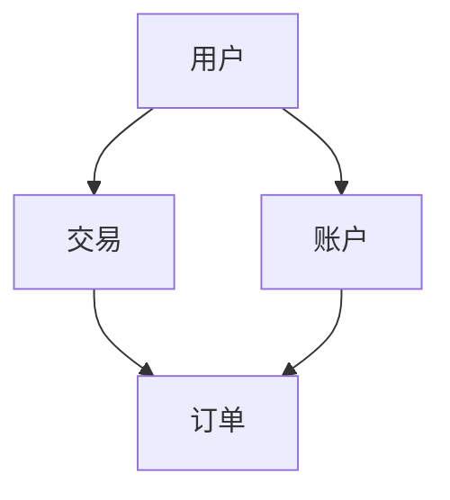
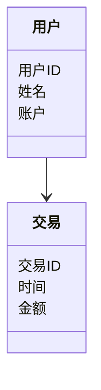
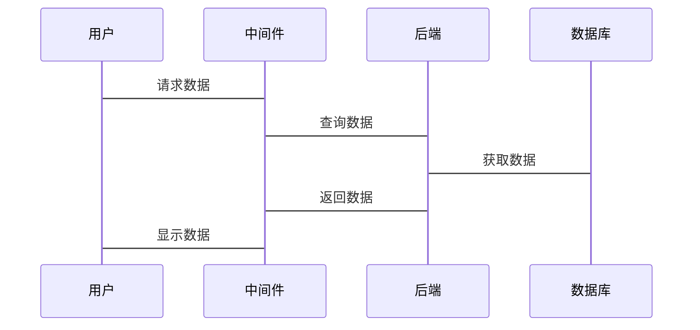

                 


---

# 《金融领域图计算技术的创新应用》

## 关键词：图计算，金融分析，算法，系统架构，项目实战

## 摘要：  
本文深入探讨图计算技术在金融领域的创新应用，从背景、核心概念、算法原理、数学模型、系统架构到项目实战，系统性地分析图计算在金融风险控制、欺诈检测、社交网络分析等场景中的价值。通过具体案例和代码实现，帮助读者理解并掌握图计算技术在金融领域的落地方法。

---

# 第一部分: 金融领域图计算技术的背景与概念

## 第1章: 图计算技术的背景与应用

### 1.1 图计算技术的背景
#### 1.1.1 传统金融数据分析的局限性
传统的金融数据分析依赖于关系型数据库和统计模型，难以处理复杂的非结构化数据和动态关系。例如，传统的CSV数据难以捕捉交易网络中的多层关联。

#### 1.1.2 图计算技术的兴起与优势
随着大数据技术的发展，图计算技术凭借其在处理复杂关联关系方面的优势，逐渐在金融领域崭露头角。图计算能够高效处理节点之间的复杂关系，发现隐藏的模式。

#### 1.1.3 金融领域对图计算技术的需求
金融领域的欺诈检测、风险管理、社交网络分析等场景都需要处理复杂的关联数据。图计算技术能够帮助金融机构更好地识别风险、优化决策。

### 1.2 金融领域中的图数据
#### 1.2.1 图数据的定义与特点
图数据由节点和边组成，节点代表实体（如用户、账户），边代表关系（如交易、转账）。图数据具有动态性、复杂性和关联性。

#### 1.2.2 金融领域的典型图数据类型
- 用户-账户图：表示用户与其账户的关系。
- 交易-订单图：表示交易与订单之间的关系。
- 社交网络图：表示用户之间的社交关系。

#### 1.2.3 图数据在金融分析中的应用
图数据广泛应用于金融领域的欺诈检测、信用评估、社交网络分析等场景。

### 1.3 图计算的核心概念与联系
#### 1.3.1 图的表示与存储
图可以通过邻接矩阵或邻接列表表示。邻接矩阵适用于稠密图，邻接列表适用于稀疏图。

#### 1.3.2 节点与边的属性
节点可以具有标签（如用户类型）和属性（如年龄），边可以具有权重（如交易金额）和方向（如转账方向）。

#### 1.3.3 图的遍历算法
图的遍历算法包括广度优先搜索（BFS）和深度优先搜索（DFS）。BFS适用于发现最短路径，DFS适用于探索树结构。

### 1.4 图计算的核心概念对比
#### 1.4.1 节点与边的属性对比
| 属性 | 节点 | 边 |
|------|------|----|
| 标签 | 用户类型 | 交易类型 |
| 属性 | 年龄 | 金额 |

#### 1.4.2 图的类型与应用场景对比
| 类型 | 无向图 | 有向图 | 加权图 |
|------|--------|---------|--------|
| 场景 | 社交网络分析 | 欺诈检测 | 风险评估 |

### 1.5 图计算的ER实体关系图


---

## 第2章: 图计算技术的核心概念与联系

### 2.1 图计算的基本原理
#### 2.1.1 图的表示与存储
图数据可以使用邻接矩阵或邻接列表存储。邻接矩阵适用于稠密图，邻接列表适用于稀疏图。

#### 2.1.2 节点与边的属性
节点具有标签和属性，边具有权重和方向。例如，用户节点可以具有标签“客户”和属性“年龄”，边可以具有权重“交易金额”和方向“转账方向”。

#### 2.1.3 图的遍历算法
图的遍历算法包括广度优先搜索（BFS）和深度优先搜索（DFS）。BFS适用于发现最短路径，DFS适用于探索树结构。

### 2.2 图计算的核心概念对比
#### 2.2.1 节点与边的属性对比
节点和边的属性对比可以通过表格清晰展示：

| 属性 | 节点 | 边 |
|------|------|----|
| 标签 | 用户类型 | 交易类型 |
| 属性 | 年龄 | 金额 |
| 方向 | 无 | 单向或双向 |

#### 2.2.2 图的类型与应用场景对比
图的类型与应用场景可以通过对比表格展示：

| 类型 | 无向图 | 有向图 | 加权图 |
|------|--------|---------|--------|
| 场景 | 社交网络分析 | 欺诈检测 | 风险评估 |

#### 2.2.3 图计算与其他数据结构的对比
图计算与其他数据结构（如树、链表）可以通过对比表格展示：

| 数据结构 | 图 | 树 | 链表 |
|----------|----|----|------|
| 关系复杂度 | 高 | 中 | 低 |
| 应用场景 | 关联分析 | 层次结构 | 单向关系 |

### 2.3 图计算的ER实体关系图


---

## 第3章: 图计算算法原理

### 3.1 图遍历算法
#### 3.1.1 广度优先搜索（BFS）
BFS从起点开始，逐层遍历所有节点。例如，从用户节点开始，遍历所有直接相连的交易节点，再遍历每个交易节点相连的订单节点。

#### 3.1.2 深度优先搜索（DFS）
DFS从起点开始，尽可能深入遍历，直到遇到叶子节点。例如，从用户节点开始，深入遍历账户节点，再遍历订单节点。

#### 3.1.3 BFS与DFS的对比与应用
| 算法 | BFS | DFS |
|------|------|------|
| 特性 | 逐层遍历 | 深入遍历 |
| 应用 | 最短路径 | 树结构遍历 |

### 3.2 图计算中的经典算法
#### 3.2.1 最短路径算法（Dijkstra）
Dijkstra算法用于找到从起点到目标的最短路径。例如，从用户A到用户B的最短路径。

#### 3.2.2 最大流量算法（Ford-Fulkerson）
Ford-Fulkerson算法用于计算网络中的最大流量。例如，计算交易网络中的最大资金流动。

#### 3.2.3 社会网络分析算法（社区发现）
社区发现算法用于识别图中的社区结构。例如，识别社交网络中的紧密联系群体。

### 3.3 图计算算法的实现
#### 3.3.1 BFS实现代码
```python
def bfs(graph, start, end):
    queue = deque([start])
    visited = {start}
    while queue:
        node = queue.popleft()
        if node == end:
            return True
        for neighbor in graph[node]:
            if neighbor not in visited:
                visited.add(neighbor)
                queue.append(neighbor)
    return False
```

#### 3.3.2 Dijkstra算法实现代码
```python
import heapq

def dijkstra(graph, start, end):
    distances = {node: float('infinity') for node in graph}
    distances[start] = 0
    heap = [(0, start)]
    while heap:
        current_distance, current_node = heapq.heappop(heap)
        if current_node == end:
            return current_distance
        if current_distance > distances[current_node]:
            continue
        for neighbor, weight in graph[current_node].items():
            if distances[neighbor] > current_distance + weight:
                distances[neighbor] = current_distance + weight
                heapq.heappush(heap, (distances[neighbor], neighbor))
    return distances[end]
```

---

## 第4章: 系统分析与架构设计

### 4.1 问题场景介绍
金融领域的图计算系统用于处理复杂的关联数据，如欺诈检测、风险管理等。

### 4.2 项目介绍
本项目旨在构建一个金融领域的图计算系统，用于欺诈检测和风险管理。

### 4.3 系统功能设计
#### 4.3.1 领域模型


#### 4.3.2 系统架构设计


#### 4.3.3 系统接口设计
接口包括用户认证、数据查询、结果返回等。

#### 4.3.4 系统交互设计


---

## 第5章: 项目实战

### 5.1 环境安装
安装必要的依赖，如Python、Pandas、NetworkX、Matplotlib。

### 5.2 系统核心实现
#### 5.2.1 核心功能代码
实现图数据的读取、存储、遍历和算法实现。

#### 5.2.2 案例分析
通过具体案例分析图计算在欺诈检测中的应用。

### 5.3 项目小结
总结项目实现过程中的经验和教训，提出改进建议。

---

## 第6章: 最佳实践与总结

### 6.1 小结
总结图计算技术在金融领域的应用价值和未来发展方向。

### 6.2 注意事项
在实际应用中，需要注意数据隐私、计算效率和算法选择。

### 6.3 拓展阅读
推荐相关书籍和论文，供读者进一步学习。

---

# 作者：AI天才研究院/AI Genius Institute & 禅与计算机程序设计艺术 /Zen And The Art of Computer Programming

---

**说明**：  
以上为《金融领域图计算技术的创新应用》的部分内容，完整文章将根据上述目录详细撰写，涵盖更多具体案例、代码实现和图表展示，确保文章内容的完整性和深度。

