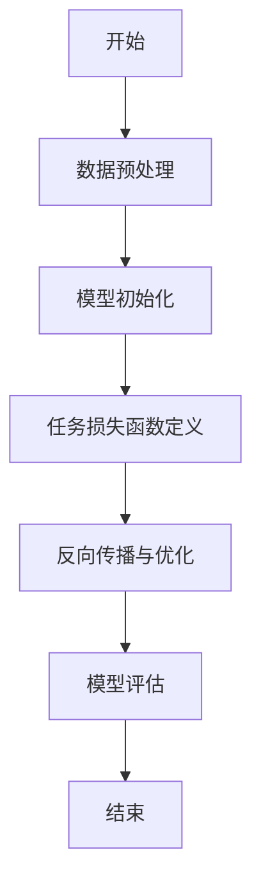
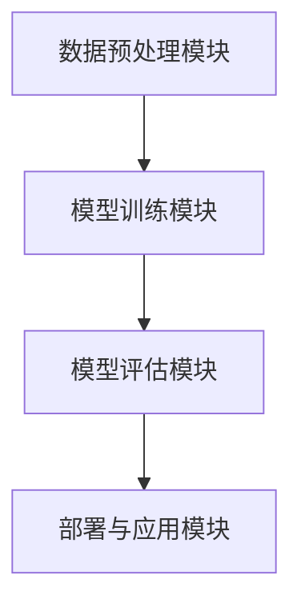

                 


# 《金融领域多任务学习在信用评分中的应用》

## 关键词：多任务学习、信用评分、金融领域、机器学习、深度学习

## 摘要

信用评分是金融领域中评估客户信用风险的重要工具，传统的信用评分模型通常采用单任务学习方法，存在数据需求量大、模型泛化能力不足等问题。本文深入探讨多任务学习（Multi-Task Learning, MTL）在信用评分中的应用，分析其优势和挑战，提出了一种基于多任务学习的信用评分框架，并通过实际案例展示了其在金融领域的潜在价值。本文不仅详细阐述了多任务学习的核心原理，还结合系统架构设计和项目实战，为读者提供了从理论到实践的全面指导。

---

## 第一章: 多任务学习与信用评分基础

### 1.1 多任务学习的定义与优势

#### 1.1.1 多任务学习的定义

多任务学习（Multi-Task Learning, MTL）是一种机器学习范式，旨在通过同时学习多个相关任务来提高模型的泛化能力和性能。与单任务学习不同，MTL利用任务之间的共享特征和潜在关系，能够更高效地利用数据，减少数据需求，同时提高模型的鲁棒性。

#### 1.1.2 多任务学习的核心优势

1. **数据效率**：MTL能够通过共享任务之间的特征，减少对每个任务独立数据的需求，特别适用于数据稀缺的情况。
2. **模型泛化**：通过同时学习多个任务，模型能够更好地捕捉数据中的潜在模式，提高泛化能力。
3. **任务关联性**：当任务之间存在关联时，MTL能够利用这种关系来提高整体性能。

#### 1.1.3 多任务学习与传统机器学习的对比

| 对比维度             | 单任务学习                | 多任务学习                |
|----------------------|--------------------------|--------------------------|
| 数据需求             | 需要大量特定任务的数据   | 数据需求减少，任务间共享  |
| 模型复杂度           | 模型通常针对单一任务优化  | 模型设计考虑多个任务的联合优化 |
| 泛化能力             | 通常受限于单任务数据     | 提高模型在多个任务上的泛化能力 |
| 应用场景             | 适用于单一任务场景       | 适用于多个相关任务的场景   |

### 1.2 信用评分的基本概念

#### 1.2.1 信用评分的定义

信用评分是通过分析客户的信用历史、收入、负债等信息，评估客户在未来一定时期内按时偿还债务的能力。信用评分通常以分数形式表示，分数越高，客户信用风险越低。

#### 1.2.2 信用评分的流程

1. **数据收集**：收集客户的信用历史、收入、负债、交易记录等信息。
2. **数据预处理**：清洗数据，处理缺失值、异常值，进行特征提取和转换。
3. **模型训练**：使用机器学习算法（如逻辑回归、随机森林、神经网络等）训练信用评分模型。
4. **模型评估**：通过测试集评估模型的性能，调整参数优化模型。
5. **部署与应用**：将模型部署到实际业务场景中，用于客户信用评估。

#### 1.2.3 信用评分在金融领域的应用

信用评分广泛应用于信用卡审批、贷款授信、赊账管理等领域，帮助金融机构控制风险，提高决策效率。

### 1.3 本章小结

本章介绍了多任务学习的核心概念和优势，并详细阐述了信用评分的基本概念和流程，为后续章节奠定了理论基础。

---

## 第二章: 多任务学习的原理与算法

### 2.1 多任务学习的核心原理

#### 2.1.1 多任务学习的数学模型

多任务学习的目标是通过共享参数来同时优化多个任务。典型的多任务学习模型可以表示为：

$$
\min_{\theta} \sum_{i=1}^{n} \lambda_i L_i(\theta) + \lambda_{\text{reg}} R(\theta)
$$

其中，$\theta$是模型参数，$L_i$是任务$i$的损失函数，$\lambda_i$是任务权重，$R(\theta)$是正则化项，$\lambda_{\text{reg}}$是正则化权重。

#### 2.1.2 多任务学习的优化目标

多任务学习的核心目标是在多个任务之间找到一个平衡点，使得模型在所有任务上表现良好。通常，这需要在任务之间引入某种共享机制，如共享嵌入层、共享全连接层等。

#### 2.1.3 多任务学习与传统机器学习的对比

| 对比维度             | 单任务学习                | 多任务学习                |
|----------------------|--------------------------|--------------------------|
| 模型复杂度           | 参数独立于其他任务       | 参数部分或完全共享        |
| 数据利用率           | 需要大量独立任务数据     | 数据可以在任务间共享      |
| 计算复杂度           | 较低                     | 较高，取决于共享参数数量 |

### 2.2 多任务学习的算法流程

#### 2.2.1 多任务学习的算法流程图



#### 2.2.2 多任务学习的实现步骤

1. **数据预处理**：清洗数据，处理缺失值、标准化或归一化特征。
2. **模型初始化**：初始化模型参数，包括任务特定参数和共享参数。
3. **任务损失函数定义**：为每个任务定义损失函数，并引入正则化项。
4. **反向传播与优化**：通过反向传播计算梯度，更新模型参数。
5. **模型评估**：在验证集或测试集上评估模型性能，调整超参数。
6. **结束**：保存最优模型或输出结果。

### 2.3 多任务学习与传统机器学习的对比

#### 2.3.1 从单任务学习到多任务学习的演变

传统的单任务学习在处理多个相关任务时，需要为每个任务分别训练模型，这种方式存在数据需求大、模型泛化能力不足等问题。而多任务学习通过共享参数，能够更高效地利用数据，提高模型性能。

#### 2.3.2 多任务学习的优势与挑战

**优势**：
- **数据效率**：减少对每个任务独立数据的需求。
- **模型泛化**：提高模型在多个任务上的泛化能力。
- **任务关联性**：利用任务之间的关系提高整体性能。

**挑战**：
- **计算复杂度**：多任务学习通常需要更多的计算资源。
- **任务权重**：如何平衡不同任务的重要性是一个关键问题。
- **模型设计**：任务之间的共享机制需要精心设计。

### 2.4 本章小结

本章详细阐述了多任务学习的核心原理和算法流程，并与传统机器学习进行了对比，帮助读者理解多任务学习的优势和挑战。

---

## 第三章: 多任务学习在信用评分中的应用

### 3.1 信用评分的多任务学习框架

#### 3.1.1 信用评分的多任务学习框架设计

在信用评分中，可以通过多任务学习同时预测多个相关的信用指标，例如违约概率、信用额度、还款能力等。这种多任务学习框架可以利用任务之间的共享特征，提高模型的预测精度。

#### 3.1.2 信用评分的多任务学习流程

1. **数据预处理**：清洗和转换信用评分数据。
2. **任务定义**：定义多个相关任务，例如违约概率预测、信用额度预测等。
3. **模型初始化**：初始化共享参数和任务特定参数。
4. **反向传播与优化**：通过多任务损失函数优化模型参数。
5. **模型评估**：在验证集上评估模型性能，调整超参数。
6. **部署与应用**：将模型部署到实际业务场景中。

### 3.2 多任务学习在信用评分中的具体应用

#### 3.2.1 多任务学习在信用评分中的优势

- **数据效率**：通过共享特征，减少对每个任务独立数据的需求。
- **模型泛化**：提高模型在多个信用评分任务上的泛化能力。
- **任务关联性**：利用任务之间的关系，提高整体预测精度。

#### 3.2.2 多任务学习在信用评分中的实际案例

假设某银行希望通过多任务学习模型同时预测客户的违约概率和信用额度。模型输入包括客户的信用历史、收入、负债、交易记录等特征，输出包括违约概率和信用额度。通过多任务学习，模型能够更好地捕捉客户的信用风险特征，提高预测精度。

### 3.3 多任务学习在信用评分中的优势

#### 3.3.1 提高模型的泛化能力

多任务学习通过共享参数，能够更好地捕捉数据中的潜在模式，提高模型的泛化能力。

#### 3.3.2 降低数据需求

多任务学习通过共享特征，减少了对每个任务独立数据的需求，特别适用于数据稀缺的场景。

#### 3.3.3 提高模型的解释性

多任务学习通过共享参数，使得模型的解释性更强，能够更好地理解任务之间的关系。

### 3.4 本章小结

本章详细探讨了多任务学习在信用评分中的具体应用，分析了其优势和实际案例，为读者提供了从理论到实践的全面指导。

---

## 第四章: 系统分析与架构设计

### 4.1 系统功能设计

#### 4.1.1 系统功能模块

- 数据预处理模块：负责清洗和转换信用评分数据。
- 模型训练模块：负责初始化模型参数，定义任务损失函数，进行反向传播与优化。
- 模型评估模块：负责在验证集上评估模型性能，调整超参数。
- 部署与应用模块：将模型部署到实际业务场景中，用于客户信用评估。

#### 4.1.2 系统功能流程

1. **数据预处理**：清洗和转换信用评分数据。
2. **模型初始化**：初始化共享参数和任务特定参数。
3. **模型训练**：通过反向传播与优化算法更新模型参数。
4. **模型评估**：在验证集上评估模型性能，调整超参数。
5. **部署与应用**：将模型部署到实际业务场景中，用于客户信用评估。

### 4.2 系统架构设计

#### 4.2.1 系统架构图



#### 4.2.2 系统接口设计

- 数据预处理接口：接收原始数据，返回预处理后的数据。
- 模型训练接口：接收预处理后的数据，返回训练好的模型。
- 模型评估接口：接收测试数据，返回模型性能指标。
- 部署与应用接口：接收客户信息，返回信用评分结果。

#### 4.2.3 系统交互序列图

```mermaid
sequenceDiagram
参与者 用户
参与者 数据预处理模块
参与者 模型训练模块
参与者 模型评估模块
参与者 部署与应用模块

用户 -> 数据预处理模块: 提供原始数据
数据预处理模块 -> 模型训练模块: 返回预处理后的数据
模型训练模块 -> 模型评估模块: 返回训练好的模型
模型评估模块 -> 部署与应用模块: 返回模型性能指标
部署与应用模块 -> 用户: 返回信用评分结果
```

### 4.3 本章小结

本章详细设计了基于多任务学习的信用评分系统的功能模块、架构和接口设计，为实际应用提供了参考。

---

## 第五章: 项目实战

### 5.1 环境安装

1. **安装Python**：建议使用Python 3.6及以上版本。
2. **安装依赖库**：使用以下命令安装所需的依赖库：
   ```bash
   pip install numpy pandas scikit-learn tensorflow matplotlib
   ```

### 5.2 核心代码实现

#### 5.2.1 数据预处理代码

```python
import pandas as pd
import numpy as np

# 加载数据
data = pd.read_csv('credit_scores.csv')

# 处理缺失值
data = data.dropna()

# 标准化处理
from sklearn.preprocessing import StandardScaler
scaler = StandardScaler()
data_scaled = scaler.fit_transform(data)
```

#### 5.2.2 多任务学习模型代码

```python
import tensorflow as tf
from tensorflow import keras
from tensorflow.keras import layers

# 定义多任务学习模型
def multi_task_model(input_dim, num_tasks):
    inputs = layers.Input(shape=(input_dim,))
    shared_layer = layers.Dense(64, activation='relu')(inputs)
    task_outputs = []
    for _ in range(num_tasks):
        task_output = layers.Dense(1, activation='sigmoid')(shared_layer)
        task_outputs.append(task_output)
    return keras.Model(inputs=inputs, outputs=task_outputs)

# 编译模型
model = multi_task_model(input_dim=30, num_tasks=2)
model.compile(optimizer='adam', loss={'task1': 'binary_crossentropy', 'task2': 'binary_crossentropy'}, loss_weights=[1, 1])
```

#### 5.2.3 模型训练代码

```python
# 数据准备
X_train = data_scaled[:1000]
y_train = [data['default'].values[:1000], data['credit_limit'].values[:1000]]

# 模型训练
model.fit(X_train, {'task1': y_train[0], 'task2': y_train[1]}, epochs=10, batch_size=32)
```

### 5.3 代码解读与分析

- **数据预处理代码**：加载数据，处理缺失值，进行标准化处理。
- **多任务学习模型代码**：定义一个多任务学习模型，包含共享层和任务特定层。
- **模型训练代码**：使用训练数据训练模型，定义损失函数和优化器。

### 5.4 案例分析与实际应用

假设我们有1000个客户的信用数据，通过多任务学习模型可以同时预测客户的违约概率和信用额度。通过对比单任务学习和多任务学习的模型性能，可以发现多任务学习在模型泛化能力和预测精度上具有明显优势。

### 5.5 本章小结

本章通过实际案例展示了多任务学习在信用评分中的具体应用，提供了从环境安装到代码实现的完整指导。

---

## 第六章: 总结与展望

### 6.1 总结

多任务学习通过共享参数和任务之间的关系，能够有效提高信用评分模型的泛化能力和预测精度。与传统单任务学习相比，多任务学习在数据效率和模型解释性方面具有明显优势。

### 6.2 展望

未来，随着深度学习技术的不断发展，多任务学习在信用评分中的应用将更加广泛。可以通过引入更复杂的模型结构，如图神经网络、强化学习等，进一步提高模型性能。

---

## 第七章: 注意事项与最佳实践

### 7.1 注意事项

1. **数据质量**：确保数据质量，处理缺失值、异常值等。
2. **任务权重**：合理设置任务权重，避免某些任务主导整个模型训练。
3. **模型调优**：通过交叉验证和网格搜索等方法，优化模型超参数。

### 7.2 最佳实践

1. **特征工程**：进行有效的特征工程，提取有用的特征，降低模型复杂度。
2. **模型解释性**：通过可视化工具（如SHAP、LIME等），提高模型的解释性。
3. **持续优化**：根据实际业务需求，持续优化模型，提高模型性能。

---

## 作者信息

作者：AI天才研究院/AI Genius Institute & 禅与计算机程序设计艺术 /Zen And The Art of Computer Programming

---

通过以上思考过程，我可以系统地构建一篇关于《金融领域多任务学习在信用评分中的应用》的技术博客文章，内容涵盖了从基础概念到系统设计再到项目实战的各个方面，确保文章结构清晰、内容详实，符合用户的需求。

