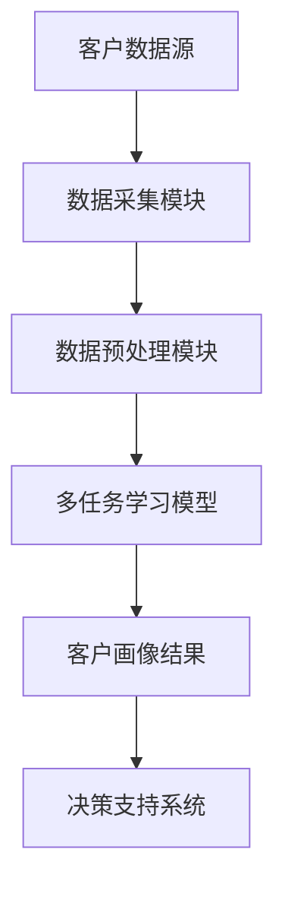

                 


# 《金融领域多任务学习在客户全方位画像中的应用》

---

## 关键词：
- 多任务学习
- 客户画像
- 金融领域
- 人工智能
- 数据挖掘

---

## 摘要：
本文深入探讨了多任务学习在金融领域客户全方位画像中的应用。通过分析客户画像的核心要素、多任务学习的算法原理及其在金融领域的实际应用场景，本文揭示了如何利用多任务学习技术实现客户画像的精准构建与优化。文章从理论到实践，结合具体案例，详细阐述了多任务学习在金融领域的优势与挑战，为金融领域的技术从业者提供了有益的参考。

---

## 正文：

---

### 第1章: 多任务学习与客户画像的背景介绍

#### 1.1 多任务学习的基本概念
多任务学习（Multi-Task Learning, MTL）是一种机器学习范式，旨在通过同时学习多个相关任务来提高模型的泛化能力和性能。与单任务学习相比，MTL能够更好地捕捉任务之间的关联性，从而在数据和模型参数上实现资源共享，提升模型的效率和效果。

#### 1.2 客户全方位画像的定义与重要性
客户画像是一种通过收集和分析客户数据，构建客户特征描述的过程。全方位客户画像是指从多个维度（如基本信息、行为特征、风险评估等）对客户进行综合描述，以提供更精准的客户洞察和决策支持。在金融领域，客户画像广泛应用于信用评估、风险控制、投资建议等领域。

#### 1.3 多任务学习在客户画像中的应用背景
金融领域的客户画像通常涉及多个相关任务，例如信用评分、欺诈检测、投资建议等。这些任务之间存在较强的关联性，因此单任务学习的局限性逐渐显现，而多任务学习的优势逐渐凸显。通过多任务学习，可以同时优化多个相关任务的性能，提升客户画像的准确性和全面性。

---

### 第2章: 多任务学习的核心概念与联系

#### 2.1 多任务学习的原理
多任务学习的核心思想是通过共享模型参数来同时优化多个任务。这种共享机制可以有效减少模型的参数数量，降低过拟合风险，同时提升模型的泛化能力。多任务学习的模型结构通常包括任务嵌入层、共享表示层和任务特定层。

#### 2.2 客户画像的核心要素
客户画像的核心要素包括：
1. **基本信息**：如年龄、性别、职业等。
2. **行为特征**：如消费习惯、投资偏好等。
3. **风险评估指标**：如信用评分、违约概率等。

#### 2.3 多任务学习与客户画像的关系
多任务学习通过同时优化多个相关任务，能够更好地捕捉客户画像中的多维度特征。例如，多任务学习可以同时优化信用评分和欺诈检测任务，从而在构建客户画像时实现更全面的特征覆盖。

#### 2.4 概念结构与核心要素
通过ER图展示客户画像的核心要素及其关联关系，如下：

```mermaid
erDiagram
    customer [客户] {
        +id : int
        +name : string
        +age : int
        +gender : string
        +occupation : string
        +credit_score : int
        +risk_level : string
    }
    transaction [交易记录] {
        +id : int
        +customer_id : int
        +amount : float
        +time : datetime
        +status : string
    }
    account [账户信息] {
        +id : int
        +customer_id : int
        +balance : float
        +type : string
    }
    customer --> transaction : "进行"
    customer --> account : "拥有"
```

---

### 第3章: 多任务学习算法原理

#### 3.1 多任务学习的算法分类
多任务学习的算法可以根据模型结构分为以下几类：
1. **基于共享表示的多任务学习**：通过共享部分网络层，同时优化多个任务。
2. **基于任务特定的多任务学习**：在共享表示的基础上，增加任务特定的网络层。
3. **层次化多任务学习**：通过构建层次化的任务关系，逐步优化多个任务。

#### 3.2 多任务学习的数学模型
多任务学习的损失函数通常表示为多个任务损失的加权和：

$$ L = \sum_{i=1}^{n} \lambda_i L_i $$

其中，$L_i$ 表示第 $i$ 个任务的损失，$\lambda_i$ 表示对应的权重系数。

例如，对于信用评分和欺诈检测两个任务，损失函数可以表示为：

$$ L = \lambda_1 L_{\text{credit}} + \lambda_2 L_{\text{fraud}} $$

其中，$L_{\text{credit}}$ 和 $L_{\text{fraud}}$ 分别表示信用评分任务和欺诈检测任务的损失。

---

### 第4章: 系统分析与架构设计方案

#### 4.1 问题场景介绍
在金融领域，客户画像的构建通常涉及多个数据源和多个任务。例如，银行需要通过客户的交易记录、账户信息、基本信息等数据，构建客户的信用评分、风险评估和投资建议等多个任务。

#### 4.2 系统功能设计
系统功能设计包括以下几个方面：
1. **数据采集**：从多个数据源获取客户数据。
2. **数据预处理**：清洗和标准化数据。
3. **模型训练**：基于多任务学习算法构建客户画像模型。
4. **结果输出**：生成客户画像并提供决策支持。

#### 4.3 系统架构设计
系统架构设计如下：



---

### 第5章: 项目实战

#### 5.1 环境安装
项目实战需要以下环境：
1. Python 3.8+
2. PyTorch 1.9+
3. Scikit-learn 0.24+

#### 5.2 核心功能实现
以下是基于PyTorch实现的多任务学习模型代码：

```python
import torch
import torch.nn as nn
import torch.optim as optim

class MultiTaskModel(nn.Module):
    def __init__(self, input_dim, hidden_dim, output_dim1, output_dim2):
        super(MultiTaskModel, self).__init__()
        self.shared_layer = nn.Linear(input_dim, hidden_dim)
        self.task1_layer = nn.Linear(hidden_dim, output_dim1)
        self.task2_layer = nn.Linear(hidden_dim, output_dim2)
    
    def forward(self, x):
        x = self.shared_layer(x)
        output1 = self.task1_layer(x)
        output2 = self.task2_layer(x)
        return output1, output2

# 初始化模型
input_dim = 10
hidden_dim = 5
output_dim1 = 1
output_dim2 = 1
model = MultiTaskModel(input_dim, hidden_dim, output_dim1, output_dim2)

# 定义损失函数和优化器
criterion1 = nn.MSELoss()
criterion2 = nn.BCELoss()
optimizer = optim.Adam(model.parameters(), lr=0.001)

# 训练模型
for epoch in range(100):
    for inputs, target1, target2 in dataloaders:
        optimizer.zero_grad()
        output1, output2 = model(inputs)
        loss1 = criterion1(output1, target1)
        loss2 = criterion2(output2, target2)
        total_loss = loss1 + loss2
        total_loss.backward()
        optimizer.step()
```

#### 5.3 代码解读与分析
上述代码实现了基于PyTorch的多任务学习模型。模型包含共享层和任务特定层，能够同时优化两个任务的损失函数。在实际应用中，可以根据具体任务需求调整模型结构和损失函数。

#### 5.4 实际案例分析
以信用评分和欺诈检测为例，假设我们有一个包含客户交易记录和账户信息的数据集。通过多任务学习模型，我们可以同时优化信用评分任务和欺诈检测任务，从而构建更全面的客户画像。

---

### 第6章: 最佳实践与总结

#### 6.1 小结
多任务学习在金融领域客户全方位画像中的应用具有显著的优势。通过同时优化多个相关任务，可以提升客户画像的准确性和全面性。

#### 6.2 注意事项
1. 数据质量和多样性对模型性能至关重要。
2. 任务之间的关联性需要充分考虑。
3. 模型的可解释性和鲁棒性需要重点关注。

#### 6.3 未来展望
未来，随着人工智能技术的不断发展，多任务学习在金融领域客户画像中的应用将更加广泛和深入。例如，结合图神经网络和强化学习，可以进一步提升客户画像的精度和智能化水平。

---

## 作者：
AI天才研究院/AI Genius Institute & 禅与计算机程序设计艺术 /Zen And The Art of Computer Programming

---

**注**：由于篇幅限制，上述内容是一个简要的目录和部分章节的示例，完整文章将包含更详细的内容和具体的案例分析。

