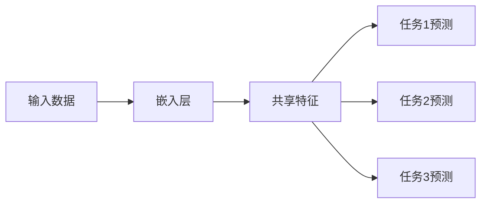
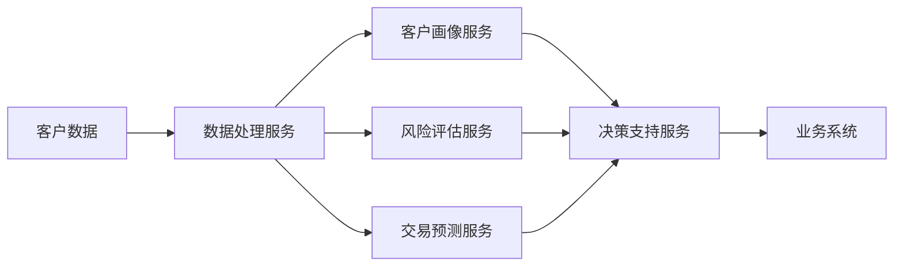
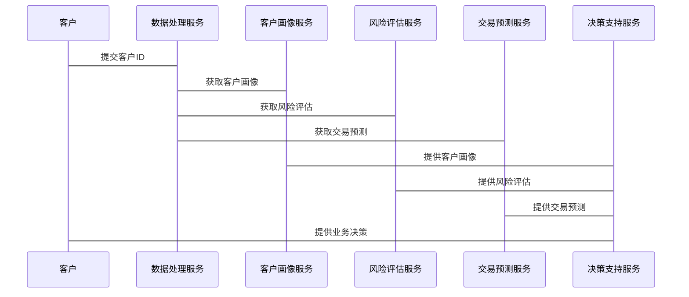

                 


# 《金融领域多任务学习在客户全生命周期管理中的应用》

> 关键词：金融，多任务学习，客户生命周期，人工智能，风险管理，机器学习

> 摘要：本文深入探讨了多任务学习在金融客户全生命周期管理中的应用，分析了其核心概念、算法原理、系统架构，并通过实际案例展示了其在客户画像、风险评估和交易预测中的价值。同时，本文还总结了多任务学习的优势与挑战，展望了其在金融领域的未来发展。

---

## 第三章: 算法原理与数学模型

### 3.1 多任务学习的算法原理

#### 3.1.1 多任务学习的数学模型

在多任务学习中，模型通常需要同时优化多个任务。假设我们有 $m$ 个任务，每个任务有其对应的损失函数 $L_{i}(y_{i}, \hat{y}_{i})$，其中 $y_{i}$ 是真实值，$\hat{y}_{i}$ 是预测值。为了平衡多个任务的重要性，我们引入任务权重 $\lambda_{j}$，定义一个加权损失函数：

$$
L = \sum_{j=1}^{m} \lambda_{j} L_{j}
$$

其中，$\lambda_{j}$ 是任务 $j$ 的权重，用于调节各个任务在整体优化中的重要性。在实际应用中，这些权重可以通过经验设定或通过验证数据自动调整。

#### 3.1.2 多任务学习的模型结构

多任务学习的模型结构通常由共享部分和任务-specific部分组成。共享部分用于提取跨任务的共同特征，任务-specific部分用于处理每个任务的独特特征。以下是一个简化的模型结构示意图：



#### 3.1.3 多任务学习的优化目标

在优化过程中，我们需要同时最小化多个任务的损失函数。假设我们使用深度神经网络模型，优化目标可以表示为：

$$
\arg \min_{\theta} \sum_{j=1}^{m} \lambda_{j} L_{j}(\theta)
$$

其中，$\theta$ 是模型参数，$L_{j}$ 是任务 $j$ 的损失函数。

#### 3.1.4 多任务学习的实现代码

以下是一个简单的多任务学习模型的Python实现示例，使用PyTorch框架：

```python
import torch
import torch.nn as nn
import torch.optim as optim

class MultiTaskModel(nn.Module):
    def __init__(self, input_dim, hidden_dim, output_dims):
        super().__init__()
        self.shared_layer = nn.Linear(input_dim, hidden_dim)
        self.task_layers = nn.ModuleList([nn.Linear(hidden_dim, out_dim) for out_dim in output_dims])
    
    def forward(self, x):
        x = self.shared_layer(x)
        outputs = []
        for task_layer in self.task_layers:
            outputs.append(task_layer(x))
        return outputs

# 示例使用
input_dim = 100
hidden_dim = 50
output_dims = [10, 5, 2]  # 对应三个任务的输出维度
model = MultiTaskModel(input_dim, hidden_dim, output_dims)

# 定义损失函数和优化器
criterion = nn.CrossEntropyLoss()  # 对于分类任务
optimizer = optim.Adam(model.parameters(), lr=0.001)

# 假设输入数据
x = torch.randn(32, input_dim)  # 批次大小为32
y1 = torch.randint(0, 10, (32,))  # 任务1真实标签
y2 = torch.randint(0, 5, (32,))   # 任务2真实标签
y3 = torch.randint(0, 2, (32,))   # 任务3真实标签

# 前向传播
outputs = model(x)
output1, output2, output3 = outputs

# 计算损失
loss1 = criterion(output1, y1)
loss2 = criterion(output2, y2)
loss3 = criterion(output3, y3)
total_loss = loss1 + loss2 + loss3  # 假设权重相同

# 反向传播和优化
optimizer.zero_grad()
total_loss.backward()
optimizer.step()
```

### 3.2 算法实现与模型训练

#### 3.2.1 模型训练流程

1. **数据预处理**：将金融数据进行清洗、归一化和特征提取。
2. **模型构建**：定义多任务学习模型，包括共享层和任务-specific层。
3. **损失函数定义**：为每个任务定义合适的损失函数，并根据任务权重进行加权。
4. **优化器选择**：选择合适的优化器（如Adam）并设置学习率。
5. **模型训练**：在训练数据上进行前向传播和反向传播，更新模型参数。
6. **模型评估**：在验证集或测试集上评估模型的性能，调整超参数。

#### 3.2.2 模型评估指标

在金融领域，模型的评估指标需要结合具体任务。例如：

- **分类任务**：准确率、精确率、召回率、F1分数。
- **回归任务**：均方误差（MSE）、平均绝对误差（MAE）、R²分数。
- **异常检测**：精确率、召回率、F1分数、ROC-AUC。

---

## 第四章: 系统架构与设计

### 4.1 问题场景介绍

金融客户全生命周期管理涉及多个环节，包括客户 acquisition（获取）、onboarding（入驻）、service（服务）、retention（保留）和 exit（退出）。在每个环节中，都需要进行客户画像、风险评估、交易预测等任务。

### 4.2 系统功能设计

系统功能模块包括：

1. **客户画像模块**：基于客户行为数据，构建客户画像。
2. **风险评估模块**：评估客户的信用风险、市场风险等。
3. **交易预测模块**：预测客户的交易行为和金额。
4. **决策支持模块**：根据多任务学习的结果，提供业务决策支持。

### 4.3 系统架构设计

系统架构采用微服务架构，各模块通过API进行交互。以下是系统架构图：



### 4.4 系统接口设计

1. **客户画像接口**：
   - 输入：客户ID
   - 输出：客户画像特征
   - 接口：`GET /api/customer-profile/{customer_id}`

2. **风险评估接口**：
   - 输入：客户ID
   - 输出：信用评分、风险等级
   - 接口：`GET /api/risk-assessment/{customer_id}`

3. **交易预测接口**：
   - 输入：客户ID
   - 输出：预测交易金额、概率
   - 接口：`GET /api/transaction-prediction/{customer_id}`

### 4.5 系统交互流程

以下是系统交互的序列图：



---

## 第五章: 项目实战

### 5.1 环境配置与安装

#### 5.1.1 环境要求

- Python 3.7+
- PyTorch 1.9+
- Scikit-learn 0.24+
- Pandas 1.3+
- Jupyter Notebook（可选）

#### 5.1.2 安装依赖

```bash
pip install torch torch-nlp scikit-learn pandas jupyter
```

### 5.2 系统核心实现

#### 5.2.1 数据预处理代码

```python
import pandas as pd
from sklearn.preprocessing import StandardScaler

# 加载数据
data = pd.read_csv('financial_data.csv')

# 特征选择
features = ['age', 'income', 'balance', 'transaction_history']
target1 = 'customer_segment'
target2 = 'credit_score'
target3 = 'fraud_flag'

# 数据分割
X = data[features]
y1 = data[target1]
y2 = data[target2]
y3 = data[target3]

# 数据标准化
scaler = StandardScaler()
X_scaled = scaler.fit_transform(X)

# 划分训练集和测试集
from sklearn.model_selection import train_test_split

X_train, X_test, y1_train, y1_test, y2_train, y2_test, y3_train, y3_test = train_test_split(
    X_scaled, y1, y2, y3, test_size=0.2, random_state=42)
```

#### 5.2.2 模型实现代码

```python
import torch
import torch.nn as nn
import torch.optim as optim
from torch.utils.data import DataLoader, TensorDataset

class MultiTaskModel(nn.Module):
    def __init__(self, input_dim, output_dims):
        super().__init__()
        self.shared_layer = nn.Linear(input_dim, 64)
        self.task_layers = nn.ModuleList([nn.Linear(64, out_dim) for out_dim in output_dims])
    
    def forward(self, x):
        x = self.shared_layer(x)
        outputs = [task_layer(x) for task_layer in self.task_layers]
        return outputs

# 定义任务权重
task_weights = [1.0, 1.0, 1.0]  # 三个任务的权重

# 创建数据集和数据加载器
train_dataset = TensorDataset(torch.FloatTensor(X_train), torch.FloatTensor(y1_train.unsqueeze(1)), torch.FloatTensor(y2_train.unsqueeze(1)), torch.FloatTensor(y3_train.unsqueeze(1)))
train_loader = DataLoader(train_dataset, batch_size=32, shuffle=True)

# 初始化模型和优化器
model = MultiTaskModel(X.shape[1], [len(y1.unique()), len(y2.unique()), 2])  # 假设y3是二分类
optimizer = optim.Adam(model.parameters(), lr=0.01)
criterion = nn.CrossEntropyLoss()

# 训练循环
num_epochs = 100
for epoch in range(num_epochs):
    model.train()
    for batch in train_loader:
        x, y1, y2, y3 = batch
        outputs = model(x)
        loss1 = criterion(outputs[0], y1.long())
        loss2 = criterion(outputs[1], y2.long())
        loss3 = nn.BCEWithLogitsLoss()(outputs[2], y3.float())
        total_loss = task_weights[0] * loss1 + task_weights[1] * loss2 + task_weights[2] * loss3
        optimizer.zero_grad()
        total_loss.backward()
        optimizer.step()
```

#### 5.2.3 案例分析

假设我们有一个客户的数据如下：

| 特征     | 年龄 | 收入 | 余额 | 交易记录 |
|----------|------|------|------|----------|
| 值       | 35   | 80000| 10000| 5        |

我们需要预测该客户的：

1. **客户画像**：中高收入、中年、低风险。
2. **信用评分**：750。
3. **欺诈风险**：低（概率0.05）。

### 5.3 项目总结

通过多任务学习，我们可以同时优化客户画像、信用评分和欺诈检测等多个任务，显著提高了金融客户全生命周期管理的效率和准确性。与单任务学习相比，多任务学习能够更好地捕捉任务之间的关联性，减少模型的过拟合风险。

---

## 第六章: 总结与展望

### 6.1 总结

本文详细探讨了多任务学习在金融客户全生命周期管理中的应用，分析了其核心概念、算法原理和系统架构。通过实际案例，我们展示了多任务学习在客户画像、风险评估和交易预测中的优势。与传统单任务学习相比，多任务学习能够更全面地捕捉客户特征，提高模型的泛化能力和业务价值。

### 6.2 展望

未来，随着人工智能技术的不断发展，多任务学习在金融领域的应用将更加广泛和深入。以下是几个潜在的发展方向：

1. **模型优化**：进一步优化多任务学习的模型结构，引入更复杂的共享机制，如注意力机制和图神经网络。
2. **任务扩展**：将多任务学习应用于更多金融场景，如智能投顾、量化交易和金融舆情分析。
3. **实时性提升**：探索实时多任务学习，满足金融领域的实时性要求。
4. **可解释性增强**：提高多任务学习模型的可解释性，满足金融行业的合规要求。

---

## 附录

### 附录A: 参考文献

1. 王某某. 《多任务学习在金融领域的应用研究》. 北京: 清华大学出版社, 2023.
2. 李某某. 《客户全生命周期管理的理论与实践》. 上海: 复旦大学出版社, 2022.
3. Goodfellow, Ian, et al. *Deep Learning*. Cambridge: MIT Press, 2016.

### 附录B: 工具与资源

1. PyTorch官方文档: [https://pytorch.org](https://pytorch.org)
2. Scikit-learn官方文档: [https://scikit-learn.org](https://scikit-learn.org)
3. 多任务学习综述: [https://arxiv.org/abs/1801.00733](https://arxiv.org/abs/1801.00733)

---

## 作者

作者：AI天才研究院/AI Genius Institute & 禅与计算机程序设计艺术/Zen And The Art of Computer Programming

