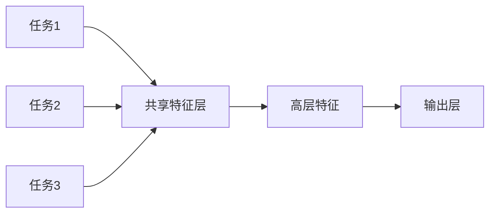
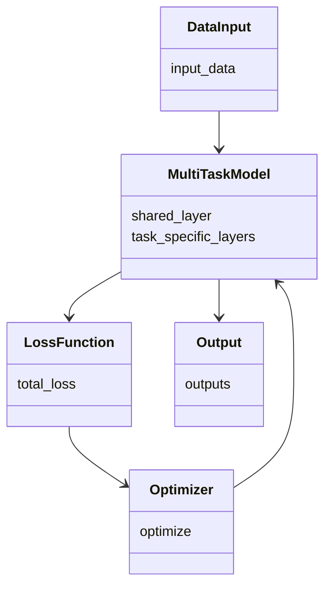

                 


# 《金融领域多任务学习的应用与挑战》

**关键词**：多任务学习，金融领域，机器学习，深度学习，人工智能，模型优化

**摘要**：  
随着人工智能技术的快速发展，多任务学习（Multi-Task Learning, MTL）在金融领域的应用越来越广泛。本文从多任务学习的核心概念出发，结合金融领域的具体场景，详细探讨了多任务学习在金融领域的应用、算法原理、系统设计、项目实战以及面临的挑战。通过分析多任务学习的优势和局限性，本文为金融领域的技术从业者提供了理论支持和实践指导，帮助他们在复杂的金融环境中更好地利用多任务学习技术解决问题。

---

## 第一部分：金融领域多任务学习的背景与基础

### 第1章：多任务学习的定义与背景

#### 1.1 多任务学习的定义与核心概念

多任务学习（Multi-Task Learning, MTL）是一种机器学习范式，旨在通过同时学习多个相关任务来提高模型的泛化能力和性能。与单任务学习相比，多任务学习的核心在于利用任务之间的关联性，共享模型参数，从而减少数据需求和计算成本。

**多任务学习的核心概念：**

- **任务间关系**：任务之间可能存在协同或冲突关系。协同关系意味着任务之间可以共享信息，而冲突关系则需要通过特定的方法进行解耦。
- **数据特征**：多任务学习需要同时考虑共享特征和任务专用特征，共享特征用于捕捉任务间的共同信息，任务专用特征则用于捕捉特定任务的独特信息。
- **模型结构**：多任务学习的模型通常由共享层和任务特定层组成，共享层用于提取跨任务的共同特征，任务特定层则用于处理每个任务的独特需求。

#### 1.2 金融领域的多任务学习应用背景

金融领域是一个高度复杂且数据丰富的领域，涉及多个相关任务，如风险评估、量化交易、客户画像、欺诈检测等。这些任务之间存在密切的关联性，例如，客户的风险评估结果可以影响其信用评分和贷款决策，而量化交易的结果又与市场趋势和客户行为密切相关。

**多任务学习在金融领域的优势：**

- **数据利用率高**：金融数据通常具有规模大、维度高的特点，多任务学习可以通过共享特征的方式提高数据利用率。
- **任务间关联性强**：金融任务之间存在复杂的关联性，多任务学习可以更好地捕捉这些关联性，提高模型的预测精度。
- **减少过拟合**：通过共享特征，多任务学习可以在数据量有限的情况下，减少过拟合的风险。

#### 1.3 多任务学习的优势与挑战

**多任务学习的优势：**

- **数据效率高**：多任务学习可以在有限的数据量下，通过共享特征的方式提高模型的泛化能力。
- **任务间信息共享**：多任务学习可以利用任务之间的关联性，提高模型的预测精度和鲁棒性。

**多任务学习的挑战：**

- **任务间冲突**：不同的任务可能有不同的优化目标，任务之间的冲突可能导致模型性能下降。
- **模型复杂度增加**：多任务学习的模型通常比单任务模型复杂，模型的训练和优化更加困难。
- **金融领域的特殊挑战**：金融数据通常具有高噪声、高维度和高敏感性的特点，如何在多任务学习中有效处理这些数据是一个重要的挑战。

---

## 第二部分：多任务学习的核心概念与原理

### 第2章：多任务学习的核心概念与联系

#### 2.1 多任务学习的核心概念

多任务学习的核心在于任务之间的关联性。任务之间可以存在协同或冲突关系，协同关系意味着任务之间可以共享信息，而冲突关系则需要通过特定的方法进行解耦。例如，在金融领域的风险评估和信用评分任务中，任务之间可能存在协同关系，因为客户的风险特征在两个任务中是相关的。

**任务间关系的建模方式：**

- **协同学习**：任务之间共享特征，通过共享参数来捕捉任务之间的共同信息。
- **对抗学习**：任务之间通过对抗网络来解耦任务之间的冲突关系。

#### 2.2 多任务学习的原理与数学模型

多任务学习的数学模型可以通过以下公式表示：

$$
L_{total} = \sum_{i=1}^{N} \lambda_i L_i
$$

其中，$L_{total}$ 是总损失函数，$L_i$ 是任务i的损失函数，$\lambda_i$ 是任务i的损失权重。

**任务间关系的建模：**

- **协同学习**：任务之间通过共享特征层来捕捉任务之间的共同信息。
- **对抗学习**：任务之间通过对抗网络来解耦任务之间的冲突关系。

**多任务学习的数学模型：**

$$
y_i = f_i(x; \theta)
$$

其中，$y_i$ 是任务i的输出，$x$ 是输入数据，$f_i$ 是任务i的模型，$\theta$ 是共享参数。

#### 2.3 多任务学习的实体关系图



---

## 第三部分：多任务学习的算法原理

### 第3章：多任务学习的算法原理

#### 3.1 多任务学习的算法框架

多任务学习的算法框架通常包括以下步骤：

1. **任务建模**：将多个任务建模为一个统一的模型，任务之间共享部分参数。
2. **损失函数设计**：设计一个总损失函数，用于同时优化多个任务。
3. **模型训练**：通过优化算法（如随机梯度下降）对模型进行训练，优化总损失函数。

#### 3.2 多任务学习的实现代码

```python
import torch
import torch.nn as nn

class MultiTaskModel(nn.Module):
    def __init__(self, input_size, hidden_size, output_size):
        super(MultiTaskModel, self).__init__()
        self.shared_layer = nn.Linear(input_size, hidden_size)
        self.task_specific_layers = nn.ModuleList([
            nn.Linear(hidden_size, output_size) for _ in range(num_tasks)
        ])
    
    def forward(self, x):
        x = self.shared_layer(x)
        outputs = []
        for i in range(num_tasks):
            outputs.append(self.task_specific_layers[i](x))
        return outputs
```

---

## 第四部分：金融系统中的多任务学习应用

### 第4章：金融系统的多任务学习应用

#### 4.1 金融系统的多任务学习场景

在金融系统中，多任务学习可以应用于以下场景：

- **风险评估与信用评分**：同时预测客户的风险等级和信用评分。
- **量化交易与市场预测**：同时预测股票价格和市场趋势。
- **客户画像与行为分析**：同时分析客户的交易行为和信用评分。

#### 4.2 金融系统的系统设计与架构

**系统设计与架构：**



---

## 第五部分：多任务学习在金融领域的挑战与未来方向

### 第5章：多任务学习的挑战与未来方向

#### 5.1 多任务学习的挑战

- **任务间冲突**：如何在任务间冲突的情况下，设计有效的模型结构。
- **模型解释性**：如何提高多任务学习模型的解释性，满足金融领域的监管要求。
- **计算效率**：如何在大规模金融数据上，提高多任务学习的计算效率。

#### 5.2 未来研究方向

- **更复杂的模型结构**：研究更复杂的模型结构，如图神经网络和Transformer模型，用于多任务学习。
- **任务动态适应**：研究任务动态适应的多任务学习方法，适应金融领域的动态变化。
- **多模态数据融合**：研究多模态数据的融合方法，如文本、图像和时间序列数据，用于多任务学习。

---

## 第六章：结论与展望

### 6.1 本章总结

本文从多任务学习的核心概念出发，结合金融领域的具体场景，详细探讨了多任务学习在金融领域的应用、算法原理、系统设计、项目实战以及面临的挑战。通过分析多任务学习的优势和局限性，本文为金融领域的技术从业者提供了理论支持和实践指导，帮助他们在复杂的金融环境中更好地利用多任务学习技术解决问题。

### 6.2 未来展望

随着人工智能技术的不断发展，多任务学习在金融领域的应用前景广阔。未来的研究方向包括更复杂的模型结构、任务动态适应和多模态数据融合等方面。通过不断的研究和实践，多任务学习将在金融领域发挥更大的作用，为金融从业者提供更高效、更智能的解决方案。

---

**作者：AI天才研究院/AI Genius Institute & 禅与计算机程序设计艺术 /Zen And The Art of Computer Programming**

