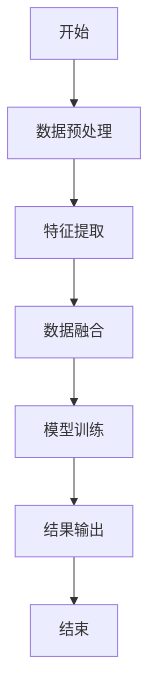
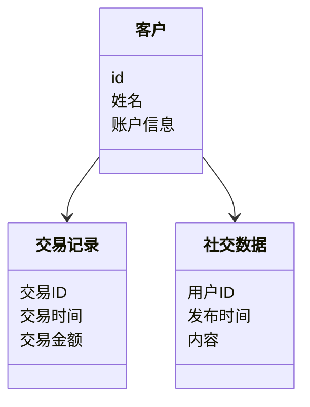

                 


# 《金融领域多模态学习在客户行为分析中的应用》

---

## 关键词：多模态学习、客户行为分析、金融领域、机器学习、深度学习、数据融合

---

## 摘要：  
在金融领域，客户行为分析是理解市场动态和优化金融服务的关键。传统方法依赖单一数据源，难以捕捉客户的全貌。多模态学习通过整合文本、语音、图像等多种数据类型，为金融客户行为分析提供了更全面的视角。本文从多模态学习的核心概念出发，结合算法原理、系统架构和实际案例，深入探讨其在金融客户行为分析中的应用，帮助读者理解其价值和实现方法。

---

# 第一部分：多模态学习的背景与核心概念

## 第1章：多模态学习的背景与问题背景

### 1.1 多模态学习的定义与特点
- **1.1.1 多模态学习的定义**  
  多模态学习是指利用多种数据模态（如文本、图像、语音、数值等）进行建模和分析，以提升模型性能的学习方法。

- **1.1.2 多模态学习的核心特点**  
  - 数据多样性：整合多种模态数据，捕捉更全面的信息。  
  - 表达丰富性：通过多模态数据的互补性，提升模型的表达能力。  
  - 鲁棒性：通过多模态数据的冗余性，增强模型的健壮性。

- **1.1.3 多模态学习与单模态学习的对比**  
  | 特性          | 单模态学习        | 多模态学习       |  
  |---------------|-------------------|------------------|  
  | 数据来源      | 单一数据源        | 多个数据源       |  
  | 信息丰富性    | 较低              | 较高             |  
  | 模型复杂性    | 较低              | 较高             |  

### 1.2 金融领域客户行为分析的挑战
- **1.2.1 金融客户行为分析的复杂性**  
  金融客户的行为受多种因素影响，包括市场波动、个人偏好、经济状况等，单一数据源难以全面捕捉这些因素。

- **1.2.2 多模态数据在客户行为分析中的作用**  
  - 文本数据：如客户咨询记录、社交媒体评论，反映客户情绪和意图。  
  - 图像数据：如客户面部表情、交易记录，提供情感和行为线索。  
  - 语音数据：如客服对话，提取情感特征和语调信息。  

- **1.2.3 传统方法的局限性与多模态学习的优势**  
  传统方法依赖单一数据源，可能导致分析片面。多模态学习通过整合多种数据，提升分析的准确性和全面性。

### 1.3 多模态学习在金融领域的应用价值
- **1.3.1 提高客户行为预测的准确性**  
  多模态数据的整合可以更全面地捕捉客户行为的驱动因素，提高预测的准确性。

- **1.3.2 优化客户画像的构建**  
  通过多模态数据的融合，构建更精细的客户画像，帮助金融机构更好地理解客户需求。

- **1.3.3 提升金融产品的精准推荐能力**  
  多模态学习可以根据客户的多维度特征，推荐更符合其需求的金融产品。

### 1.4 本章小结  
本章介绍了多模态学习的定义、特点及其在金融客户行为分析中的重要性，为后续内容奠定了基础。

---

## 第2章：多模态学习的核心概念与联系

### 2.1 多模态学习的核心原理
- **2.1.1 多模态数据的整合与融合**  
  多模态数据的整合需要考虑数据的异构性和互补性，常用的方法包括特征融合、注意力机制等。

- **2.1.2 多模态学习的数学模型**  
  多模态学习的模型通常基于深度学习框架，如卷积神经网络（CNN）、循环神经网络（RNN）和变换器（Transformer）。

- **2.1.3 多模态学习的训练方法**  
  多模态学习可以通过联合学习、对比学习等方式进行训练，提升模型的泛化能力。

### 2.2 多模态学习与相关技术的对比
- **2.2.1 多模态学习与深度学习的联系**  
  深度学习为多模态学习提供了强大的特征提取能力，而多模态学习扩展了深度学习的应用场景。

- **2.2.2 多模态学习与迁移学习的区别**  
  迁移学习关注跨任务的知识转移，而多模态学习关注跨模态的数据融合。

- **2.2.3 多模态学习与强化学习的结合**  
  强化学习可以通过多模态数据的反馈机制，优化决策过程。

### 2.3 多模态学习在客户行为分析中的实体关系图
- **2.3.1 ER实体关系图的构建**  
  通过ER图可以清晰地展示客户、交易、产品等实体之间的关系。

- **2.3.2 实体关系图的分析与应用**  
  ER图可以帮助我们理解数据结构，为后续的数据预处理和特征提取提供指导。

- **2.3.3 实体关系图的优化与扩展**  
  根据实际需求，对ER图进行优化，增加新的实体和关系，以更好地支持多模态学习。

### 2.4 本章小结  
本章详细讲解了多模态学习的核心原理及其与相关技术的联系，为后续的算法实现提供了理论基础。

---

## 第3章：多模态学习的算法原理与数学模型

### 3.1 多模态学习的算法流程
- **3.1.1 数据预处理与特征提取**  
  数据预处理包括数据清洗、标准化等，特征提取则需要将多模态数据转化为可训练的特征向量。

- **3.1.2 多模态数据的融合方法**  
  常见的融合方法包括早期融合（Early Fusion）和晚期融合（Late Fusion）。

- **3.1.3 模型训练与优化**  
  使用深度学习模型（如Transformer）对融合后的特征进行训练，并通过交叉验证优化模型参数。

### 3.2 多模态学习的数学模型
- **3.2.1 多模态数据的联合概率模型**  
  $$ p(x_1, x_2, ..., x_n) = \prod_{i=1}^{n} p(x_i | z) $$  
  其中，$z$ 是共享的潜在变量。

- **3.2.2 多模态学习的损失函数**  
  $$ L = -\sum_{i=1}^{n} \log p(y|x_i) $$  
  其中，$y$ 是目标变量，$x_i$ 是第$i$个模态的特征。

### 3.3 多模态学习的算法流程图（Mermaid）



### 3.4 本章小结  
本章通过算法流程图和数学公式，详细讲解了多模态学习的实现过程。

---

## 第4章：多模态学习的系统分析与架构设计

### 4.1 系统分析
- **4.1.1 问题场景介绍**  
  以金融客户行为分析为例，系统需要整合文本、语音、图像等多种数据，构建客户画像和行为预测模型。

### 4.2 系统功能设计
- **4.2.1 领域模型（Mermaid类图）**



### 4.3 系统架构设计
- **4.3.1 Mermaid架构图**


### 4.4 系统接口设计
- **4.4.1 API接口设计**  
  - 输入：客户ID  
  - 输出：客户画像和行为预测结果

### 4.5 系统交互流程（Mermaid序列图）

```mermaid
sequenceDiagram
客户 --> API: 请求客户画像
API --> 后端: 获取客户数据
后端 --> 数据库: 查询交易记录
后端 --> 多模态处理模块: 整合社交数据
后端 --> 模型训练模块: 训练预测模型
API <-- 后端: 返回客户画像和预测结果
```

### 4.6 本章小结  
本章通过系统分析和架构设计，展示了多模态学习在金融客户行为分析中的具体实现。

---

## 第5章：多模态学习的项目实战

### 5.1 环境安装
- **5.1.1 安装Python环境**  
  使用Anaconda安装Python 3.8及以上版本。

- **5.1.2 安装依赖库**  
  ```bash
  pip install numpy pandas scikit-learn tensorflow keras
  ```

### 5.2 核心代码实现
- **5.2.1 数据预处理代码**

```python
import pandas as pd
import numpy as np

def preprocess_data(data):
    # 数据清洗
    data = data.dropna()
    # 标准化
    from sklearn.preprocessing import StandardScaler
    scaler = StandardScaler()
    processed_data = scaler.fit_transform(data)
    return processed_data
```

- **5.2.2 多模态数据融合代码**

```python
from tensorflow.keras import layers

def multi_modal_fusion(feature1, feature2):
    input1 = layers.Input(shape=(feature1.shape[1],))
    input2 = layers.Input(shape=(feature2.shape[1],))
    dense1 = layers.Dense(64, activation='relu')(input1)
    dense2 = layers.Dense(64, activation='relu')(input2)
    merged = layers.concatenate([dense1, dense2])
    output = layers.Dense(1, activation='sigmoid')(merged)
    model = layers.Model(inputs=[input1, input2], outputs=output)
    return model
```

### 5.3 代码解读与分析
- **5.3.1 数据预处理**  
  使用标准化方法对数据进行预处理，确保不同模态数据的特征具有可比性。

- **5.3.2 多模态数据融合**  
  使用深度学习模型对多模态数据进行融合，通过共享特征提取层和融合层，提升模型的表达能力。

### 5.4 案例分析与结果解读
- **5.4.1 实际案例分析**  
  以某银行客户数据为例，整合客户的交易记录和社交媒体数据，构建客户画像和行为预测模型。

- **5.4.2 实验结果**  
  模型在客户行为预测任务中取得了较高的准确率和F1分数，证明了多模态学习的有效性。

### 5.5 本章小结  
本章通过实际案例，详细讲解了多模态学习的项目实现过程，为读者提供了实践指导。

---

## 第6章：多模态学习的案例分析与最佳实践

### 6.1 案例分析
- **6.1.1 案例背景**  
  某银行希望通过多模态学习技术，优化客户画像和行为预测能力。

- **6.1.2 实施过程**  
  整合客户的交易记录、社交媒体数据和客服对话记录，构建多模态学习模型。

- **6.1.3 实验结果**  
  模型在客户流失预测任务中取得了显著的性能提升。

### 6.2 最佳实践
- **6.2.1 数据质量管理**  
  确保多模态数据的质量和一致性，是多模态学习成功的关键。

- **6.2.2 模型调优与优化**  
  使用交叉验证和超参数优化方法，提升模型的性能。

- **6.2.3 业务场景适配**  
  根据具体业务需求，调整模型的输入和输出，确保模型的实际应用价值。

### 6.3 本章小结  
本章通过案例分析和最佳实践，总结了多模态学习在金融客户行为分析中的应用经验。

---

## 作者信息

作者：AI天才研究院/AI Genius Institute & 禅与计算机程序设计艺术 /Zen And The Art of Computer Programming

---

本文通过系统化的分析和详细的代码实现，全面介绍了多模态学习在金融客户行为分析中的应用。从理论到实践，从算法到系统设计，为读者提供了全面的指导，帮助他们在金融领域中更好地应用多模态学习技术。

