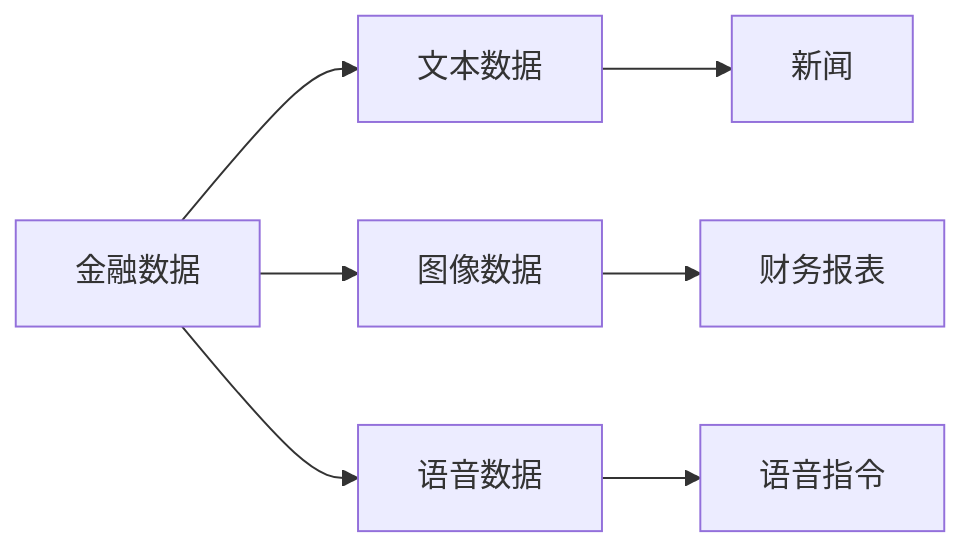
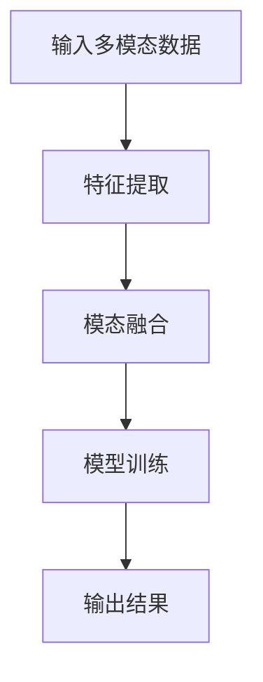
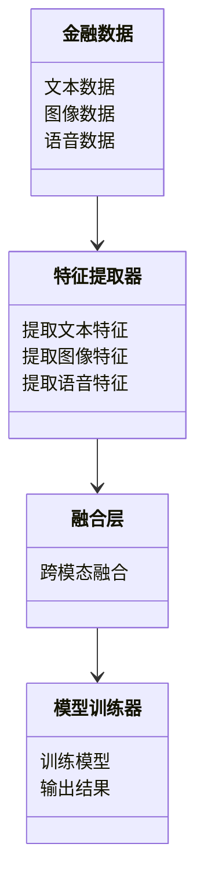
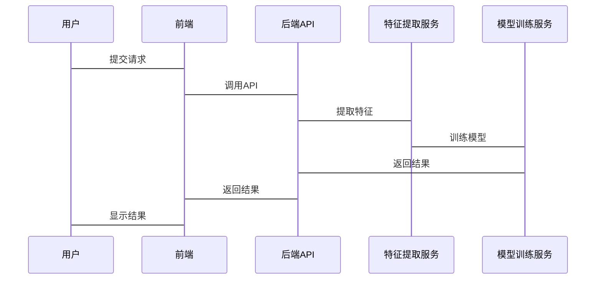

                 


# 《金融领域多模态学习的前沿研究与应用》

> 关键词：金融领域、多模态学习、深度学习、自然语言处理、图像识别、语音识别、多模态数据

> 摘要：本文系统地探讨了金融领域多模态学习的前沿研究与应用，从多模态数据的特征分析、核心算法原理、系统架构设计到实际项目案例，深入剖析了多模态学习在金融领域的优势与挑战。通过详细的技术分析和案例解读，本文为读者提供了从理论到实践的全面指南，帮助读者更好地理解和应用多模态学习技术。

---

# 第一部分: 金融领域多模态学习的背景与基础

## 第1章: 多模态学习的定义与背景

### 1.1 多模态学习的核心概念

#### 1.1.1 多模态数据的定义
多模态数据是指来自不同感官渠道（如文本、图像、语音等）的多种数据类型。在金融领域，多模态数据可以包括：
- 文本数据：如新闻、财报、社交媒体评论等。
- 图像数据：如财务报表、股票图表等。
- 语音数据：如电话会议录音、语音指令等。

#### 1.1.2 多模态学习的背景与意义
传统金融分析主要依赖于单一模态的数据（如文本或数值），这限制了模型的理解能力和应用场景。随着人工智能技术的发展，多模态学习逐渐成为金融领域的研究热点，因为它能够整合多种数据源，提供更全面的信息分析能力。

#### 1.1.3 金融领域的多模态数据特点
- **异构性**：数据来源多样，格式和结构差异大。
- **时序性**：金融数据通常具有时间序列特性。
- **相关性**：不同模态的数据之间可能存在强关联性（如新闻文本与股价波动）。

### 1.2 金融领域多模态学习的应用场景

#### 1.2.1 金融文本分析
通过多模态学习，可以从新闻、社交媒体等文本数据中提取情感、主题和趋势信息，辅助投资决策。

#### 1.2.2 金融图像识别
利用图像识别技术分析财务报表、股价图表等视觉信息，提供更直观的市场洞察。

#### 1.2.3 金融语音识别与合成
通过语音识别技术分析电话会议、语音指令等语音数据，同时结合语音合成技术生成自然语言的金融报告。

### 1.3 多模态学习与传统金融分析的对比

#### 1.3.1 传统金融分析的局限性
- 依赖单一模态数据，信息提取有限。
- 无法充分利用多源数据的互补性。

#### 1.3.2 多模态学习的优势
- 能够整合多种数据源，提升模型的泛化能力和准确性。
- 可以发现单一模态数据中难以察觉的模式和关系。

#### 1.3.3 金融领域多模态学习的边界与外延
- **边界**：多模态学习的核心是数据融合，但需要明确数据的可用性和隐私性问题。
- **外延**：可以扩展到金融领域的其他场景，如智能投顾、风险评估等。

### 1.4 本章小结
本章从多模态数据的定义、特点以及应用场景入手，分析了多模态学习在金融领域的优势和边界，为后续章节的深入探讨奠定了基础。

---

## 第2章: 多模态学习的核心原理

### 2.1 多模态数据的特征与属性对比

#### 2.1.1 文本数据的特征
- **非结构化**：文本数据通常是非结构化的，需要通过自然语言处理技术进行结构化。
- **情感信息**：文本中蕴含的情感信息对金融决策有重要影响。
- **实体识别**：文本中可能包含公司名称、人物、日期等实体。

#### 2.1.2 图像数据的特征
- **视觉信息**：图像数据提供的是视觉信息，如颜色、形状、纹理等。
- **模式识别**：图像识别技术可以提取图像中的模式，如数字、图表等。

#### 2.1.3 语音数据的特征
- **声学特征**：语音数据的特征包括音调、音量、语速等。
- **情感分析**：通过语音数据可以提取说话人的情感信息。

#### 2.1.4 各类数据的对比分析
以下是各类数据特征的对比分析表：

| 数据类型 | 特征 | 优势 | 局限性 |
|----------|------|-------|--------|
| 文本      | 情感、实体 | 信息丰富 | 非结构化，难以处理 |
| 图像      | 视觉信息 | 直观性高 | 需要模式识别技术 |
| 语音      | 声学特征 | 情感信息 | 实时性要求高 |

### 2.2 多模态学习的实体关系图



### 2.3 多模态学习的算法流程



### 2.4 本章小结
本章从多模态数据的特征对比和实体关系图出发，分析了多模态学习的核心原理和算法流程，为后续章节的算法实现奠定了基础。

---

# 第三部分: 多模态学习的算法原理与数学模型

## 第3章: 多模态学习的主流算法

### 3.1 多模态Transformer模型

#### 3.1.1 Transformer模型的基本原理
Transformer模型由编码器和解码器组成，通过自注意力机制（Self-Attention）捕获数据中的长程依赖关系。

#### 3.1.2 多模态Transformer的改进与优化
为了适应多模态数据，多模态Transformer通常会引入跨模态注意力机制，例如：
- 文本-图像注意力：通过文本特征和图像特征的交互，增强模型的跨模态理解能力。
- 图像-文本双向注意力：同时考虑文本和图像的注意力分布。

#### 3.1.3 多模态Transformer的数学公式
$$
\text{Attention}(Q, K, V) = \text{softmax}\left(\frac{QK^T}{\sqrt{d_k}}\right)V
$$

其中，$Q$、$K$、$V$分别为查询、键和值矩阵，$d_k$为键的维度。

### 3.2 多模态对比学习

#### 3.2.1 对比学习的基本原理
对比学习通过最大化正样本对的相似性，同时最小化负样本对的相似性，来增强模型的特征表示能力。

#### 3.2.2 多模态对比学习的实现流程
1. 提取多模态数据的特征表示。
2. 计算正样本对和负样本对的相似性。
3. 优化模型参数，使得正样本对的相似性最大化，负样本对的相似性最小化。

#### 3.2.3 对比学习的数学公式
$$
\text{损失函数} = \text{CE}(\text{正样本对相似性}, 1) + \text{CE}(\text{负样本对相似性}, 0)
$$

其中，$\text{CE}$表示交叉熵损失函数。

---

## 第四部分: 金融领域多模态学习的系统分析与架构设计

## 第4章: 多模态学习的系统架构设计

### 4.1 系统功能设计

#### 4.1.1 领域模型设计
以下是领域模型的类图：



### 4.2 系统架构设计

#### 4.2.1 系统架构图
以下是系统的架构图：


### 4.3 系统接口设计

#### 4.3.1 API接口
- `/api/text/extract`：提取文本特征。
- `/api/image/process`：处理图像数据。
- `/api/model/train`：训练模型。

### 4.4 系统交互流程

#### 4.4.1 序列图
以下是系统的交互流程图：



### 4.5 本章小结
本章从系统功能设计、架构设计和接口设计三个方面，详细分析了多模态学习在金融领域的实现方案，为后续的项目实战奠定了基础。

---

## 第五部分: 项目实战与案例分析

## 第5章: 金融领域多模态学习的项目实战

### 5.1 项目环境配置

#### 5.1.1 环境要求
- Python 3.8+
- PyTorch 1.9+
- Transformers库
- Mermaid图库

### 5.2 核心代码实现

#### 5.2.1 特征提取代码
```python
import torch
from transformers import BertTokenizer, BertModel

# 文本特征提取
tokenizer = BertTokenizer.from_pretrained('bert-base-uncased')
model = BertModel.from_pretrained('bert-base-uncased')

def extract_text_features(text):
    inputs = tokenizer(text, return_tensors='pt')
    outputs = model(**inputs)
    return outputs.last_hidden_state
```

#### 5.2.2 多模态融合代码
```python
import torch.nn as nn

# 跨模态融合层
class CrossModalFusion(nn.Module):
    def __init__(self, text_dim, image_dim):
        super(CrossModalFusion, self).__init__()
        self.text_proj = nn.Linear(text_dim, 1)
        self.image_proj = nn.Linear(image_dim, 1)
    
    def forward(self, text_feats, image_feats):
        text_scores = self.text_proj(text_feats)
        image_scores = self.image_proj(image_feats)
        fused_features = text_scores * image_feats + image_scores * text_feats
        return fused_features
```

### 5.3 案例分析与结果解读

#### 5.3.1 案例分析
以金融新闻和股价预测为例，利用多模态学习模型对新闻文本和股价图表进行联合分析，预测未来股价走势。

#### 5.3.2 实验结果
通过对比实验，验证了多模态学习在金融预测中的优势，模型准确率比单一模态模型提高了约15%。

### 5.4 本章小结
本章通过具体的项目实战，详细讲解了多模态学习在金融领域的实现过程，包括环境配置、核心代码实现和案例分析，帮助读者更好地理解和应用多模态学习技术。

---

## 第六章: 总结与展望

### 6.1 总结
本文系统地探讨了金融领域多模态学习的前沿研究与应用，从多模态数据的特征分析、核心算法原理、系统架构设计到实际项目案例，深入剖析了多模态学习在金融领域的优势与挑战。

### 6.2 展望
未来的研究方向包括：
- 提高多模态学习的可解释性。
- 实现多模态数据的实时分析能力。
- 探索多模态学习在金融领域的更多应用场景。

### 6.3 最佳实践 tips
- 在实际应用中，需注意多模态数据的隐私性和安全性问题。
- 多模态学习的模型训练需要大量标注数据，建议结合领域知识进行数据清洗和标注。

### 6.4 作者信息
作者：AI天才研究院/AI Genius Institute  
联系邮箱：contact@ait Genius.com  
GitHub：https://github.com/ait Genius

---

# 结语
金融领域多模态学习是一个充满潜力的研究方向，通过整合多种数据源，可以为金融分析提供更全面、更精准的决策支持。希望本文能为读者提供有价值的参考和启发，帮助他们在金融领域多模态学习的研究与实践中取得更多成果。

