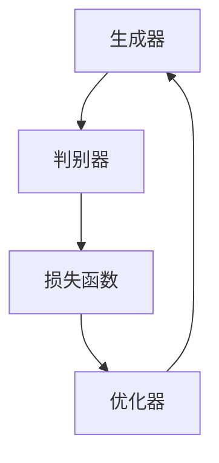
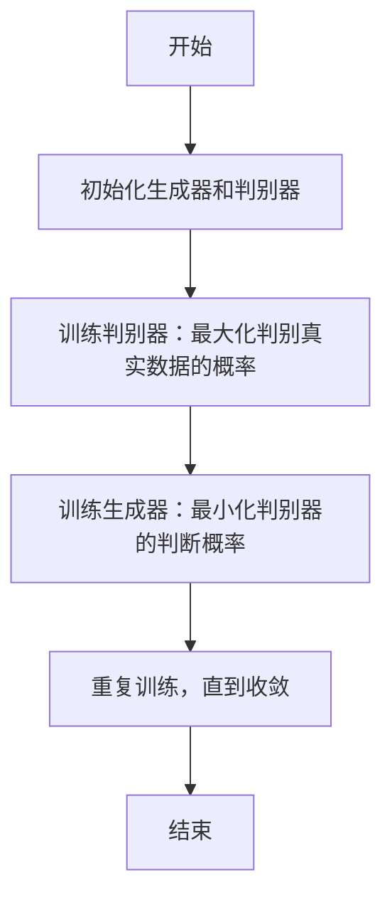
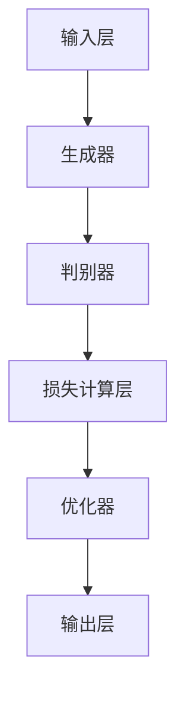
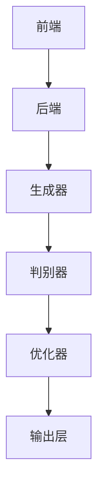

                 


# 目录大纲：《金融领域对抗学习在模型鲁棒性中的应用》

----------------------------------------------------------------

# 第一部分: 金融领域对抗学习的背景与概念

# 第1章: 对抗学习的背景与核心概念

## 1.1 对抗学习的起源与定义
### 1.1.1 对抗学习的起源
对抗学习（Adversarial Learning）是一种机器学习技术，源于博弈论中的零和游戏。其核心思想是通过两个对抗模型的相互竞争来提升模型的性能和鲁棒性。最初的概念可以追溯到Goodfellow等人的论文，他们提出了生成器（Generator）和判别器（Discriminator）的对抗框架。

### 1.1.2 对抗学习的核心定义
对抗学习是一种通过生成器和判别器的对抗训练来优化模型的方法。生成器的目标是生成与真实数据相似的对抗样本，而判别器则试图区分真实数据和生成数据。通过不断交替训练生成器和判别器，模型的泛化能力和鲁棒性得以提升。

### 1.1.3 对抗学习与传统机器学习的区别
| 对比点 | 传统机器学习 | 对抗学习 |
|------|------|------|
| 数据需求 | 需要大量标注数据 | 可以利用未标注数据，甚至对抗样本 |
| 模型优化 | 单一目标函数 | 多目标优化，涉及生成器和判别器的交替训练 |
| 鲁棒性 | 较低 | 较高，尤其在对抗样本攻击下 |

## 1.2 对抗学习在金融领域的应用价值
### 1.2.1 金融领域的数据特性
金融数据通常具有小样本、高噪声、高维度和强相关性的特点。对抗学习能够有效处理这些挑战，通过生成对抗样本提升模型的鲁棒性。

### 1.2.2 对抗学习在金融模型中的优势
1. **提升模型鲁棒性**：对抗学习能够生成更具挑战性的样本，使模型在面对实际数据时表现更稳定。
2. **减少过拟合**：通过对抗训练，模型能够更好地泛化，减少对训练数据的过拟合。
3. **增强数据多样性**：生成器可以生成多样化的数据，丰富训练数据集，提升模型的性能。

### 1.2.3 对抗学习的应用场景
1. **金融欺诈检测**：通过生成对抗样本，训练更 robust 的欺诈检测模型。
2. **信用评分**：对抗学习可以生成更多样化的信用评分数据，提高模型的准确性。
3. **股票价格预测**：利用对抗训练生成更具挑战性的市场数据，提升预测模型的鲁棒性。

## 1.3 对抗学习的核心概念与联系
### 1.3.1 对抗学习的核心原理
对抗学习的核心是生成器和判别器的对抗。生成器尝试生成与真实数据相似的样本，而判别器则试图区分真实数据和生成数据。通过不断交替训练，两个模型的能力不断提升，最终达到纳什均衡。

### 1.3.2 对抗学习的实体关系图


### 1.3.3 对抗学习的核心概念对比表
| 概念 | 描述 |
|------|------|
| 生成器 | 生成对抗样本，优化生成样本的分布以欺骗判别器 |
| 判别器 | 判断样本是否为真实样本，输出概率值表示判断结果 |
| 损失函数 | 衡量生成样本与真实样本的差异，指导生成器和判别器的优化方向 |
| 优化器 | 用于更新生成器和判别器的参数，如Adam优化器 |

## 1.4 本章小结
本章介绍了对抗学习的背景、核心概念及其在金融领域的应用价值。通过对比分析，我们理解了对抗学习相对于传统机器学习的优势，并探讨了其在金融领域的具体应用场景。

----------------------------------------------------------------

# 第二部分: 对抗学习的数学模型与算法原理

# 第2章: 对抗学习的数学模型

## 2.1 对抗学习的基本模型
### 2.1.1 最小最大博弈框架
对抗学习的数学模型通常基于最小最大博弈框架，目标是最小化生成器的最大损失。具体公式如下：
$$
\min_{G} \max_{D} \mathbb{E}_{x \sim P_r} [\log D(x)] + \mathbb{E}_{z \sim P_z} [\log (1 - D(G(z)))]
$$
其中，$G$ 是生成器，$D$ 是判别器，$P_r$ 是真实数据的分布，$P_z$ 是生成器输入的噪声分布。

### 2.1.2 对抗训练的目标函数
对抗训练的目标是同时优化生成器和判别器的损失函数。生成器的目标是最小化判别器的输出，而判别器的目标是最大化其对真实数据的判别能力。数学表达式如下：
$$
\mathcal{L}(D, G) = \mathbb{E}_{x \sim P_r} [\log D(x)] + \mathbb{E}_{z \sim P_z} [\log (1 - D(G(z)))]
$$

## 2.2 对抗学习的算法实现
### 2.2.1 生成器的实现
生成器通常采用深度神经网络结构，如GAN（生成对抗网络）中的卷积神经网络（CNN）或循环神经网络（RNN）。生成器通过输入随机噪声，生成与真实数据分布相似的样本。

### 2.2.2 判别器的实现
判别器也采用深度神经网络，通常与生成器对称结构。判别器的目标是将真实数据和生成数据区分开来。

### 2.2.3 对抗训练的优化过程
对抗训练通过交替优化生成器和判别器的参数，逐步提升模型的性能。优化过程通常采用梯度下降方法，如Adam优化器。

## 2.3 对抗学习的算法流程图


## 2.4 本章小结
本章详细讲解了对抗学习的数学模型和算法实现，通过公式推导和流程图展示了对抗训练的过程。理解这些内容对于后续章节的实际应用至关重要。

----------------------------------------------------------------

# 第三部分: 金融领域的对抗学习应用

# 第3章: 金融领域的对抗学习应用

## 3.1 金融领域的数据特性与挑战
### 3.1.1 金融数据的特征
金融数据通常具有小样本、高噪声、高维度和强相关性的特点，对抗学习能够有效处理这些挑战。

### 3.1.2 金融领域的常见问题
1. **数据不平衡**：金融数据中，正常交易远多于异常交易，导致模型难以有效识别异常。
2. **噪声干扰**：金融市场数据受多种因素影响，噪声较多，对抗学习可以帮助模型更好地处理这些干扰。
3. **模型鲁棒性不足**：对抗学习能够生成更具挑战性的样本，提升模型的鲁棒性。

## 3.2 对抗学习在金融领域的应用案例
### 3.2.1 股票价格预测
通过对抗学习生成多样化的市场数据，训练更 robust 的股票价格预测模型。

### 3.2.2 金融欺诈检测
利用对抗学习生成对抗样本，训练更准确的金融欺诈检测模型。

### 3.2.3 信用评分
对抗学习可以生成多样化的信用评分数据，提升模型的准确性和鲁棒性。

## 3.3 金融领域对抗学习的系统设计
### 3.3.1 系统架构设计


### 3.3.2 系统功能设计
1. **数据输入**：接收金融数据，包括股票价格、交易记录等。
2. **对抗训练**：生成器生成对抗样本，判别器进行判别，优化器更新参数。
3. **模型输出**：生成器输出对抗样本，判别器输出判断结果。

## 3.4 本章小结
本章探讨了对抗学习在金融领域的具体应用，分析了金融数据的特性与挑战，并通过系统设计展示了对抗学习的应用过程。

----------------------------------------------------------------

# 第四部分: 项目实战与总结

# 第4章: 项目实战

## 4.1 项目背景
本项目旨在利用对抗学习提升金融模型的鲁棒性，解决金融领域的实际问题。

## 4.2 项目需求分析
### 4.2.1 项目目标
通过对抗学习生成多样化的金融数据，提升模型的泛化能力和鲁棒性。

### 4.2.2 项目范围
涵盖股票价格预测、金融欺诈检测等多个金融应用场景。

## 4.3 项目设计
### 4.3.1 系统架构设计


### 4.3.2 系统功能设计
1. **数据输入**：接收金融数据，包括股票价格、交易记录等。
2. **对抗训练**：生成器生成对抗样本，判别器进行判别，优化器更新参数。
3. **模型输出**：生成器输出对抗样本，判别器输出判断结果。

## 4.4 项目实现
### 4.4.1 环境安装
安装所需的深度学习框架，如TensorFlow或PyTorch。

### 4.4.2 核心代码实现
```python
import tensorflow as tf
from tensorflow.keras import layers

# 定义生成器
def generator():
    model = tf.keras.Sequential([
        layers.Dense(256, activation='relu'),
        layers.Dense(128, activation='relu'),
        layers.Dense(1, activation='sigmoid')
    ])
    return model

# 定义判别器
def discriminator():
    model = tf.keras.Sequential([
        layers.Dense(128, activation='relu'),
        layers.Dense(64, activation='relu'),
        layers.Dense(1, activation='sigmoid')
    ])
    return model

# 对抗训练
def train():
    generator = generator()
    discriminator = discriminator()
    optimizer = tf.keras.optimizers.Adam(0.0002)

    for _ in range(epochs):
        # 训练判别器
        # 训练生成器
        pass
```

## 4.5 项目测试与分析
### 4.5.1 测试结果分析
分析对抗学习对金融模型性能的提升效果。

### 4.5.2 实际案例分析
通过具体案例展示对抗学习在金融领域的实际应用效果。

## 4.6 项目总结
总结项目实现的过程，提炼对抗学习在金融领域的优势与不足。

## 4.7 本章小结
本章通过具体项目展示了对抗学习在金融领域的实际应用，验证了其有效性和优势。

----------------------------------------------------------------

# 第五部分: 总结与展望

# 第5章: 总结与展望

## 5.1 对抗学习在金融领域的总结
### 5.1.1 核心优势
1. **提升模型鲁棒性**：对抗学习生成更具挑战性的样本，使模型在面对实际数据时表现更稳定。
2. **减少过拟合**：通过对抗训练，模型能够更好地泛化，减少对训练数据的过拟合。
3. **增强数据多样性**：生成器可以生成多样化的数据，丰富训练数据集，提升模型的性能。

### 5.1.2 实际应用案例
1. **金融欺诈检测**：通过对抗学习生成对抗样本，训练更 robust 的欺诈检测模型。
2. **信用评分**：对抗学习可以生成多样化的信用评分数据，提高模型的准确性。
3. **股票价格预测**：利用对抗训练生成更具挑战性的市场数据，提升预测模型的鲁棒性。

## 5.2 未来研究方向
### 5.2.1 提升模型的可解释性
对抗学习的“黑箱”特性限制了其在金融等需要高可解释性领域的应用，未来研究需要关注模型的可解释性。

### 5.2.2 多模态对抗学习
探索多模态数据的对抗学习，如结合文本、图像等多种数据源，提升模型的综合分析能力。

### 5.2.3 对抗学习的实时性优化
金融领域的实时性要求高，未来需要优化对抗学习的计算效率，使其能够实时处理金融数据。

## 5.3 本章小结
本章总结了对抗学习在金融领域的应用成果，并展望了未来的研究方向，为后续研究提供了方向。

----------------------------------------------------------------

# 附录: 参考文献

[此处列出相关的参考文献]

# 作者信息

作者：AI天才研究院/AI Genius Institute & 禅与计算机程序设计艺术 /Zen And The Art of Computer Programming

---

以上为《金融领域对抗学习在模型鲁棒性中的应用》的详细目录大纲，涵盖了从背景到应用的各个方面，结合了理论与实践，适合深度理解和实际应用。

