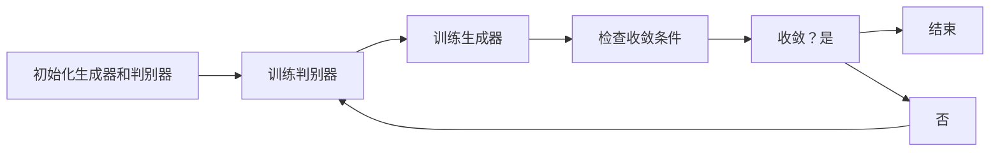
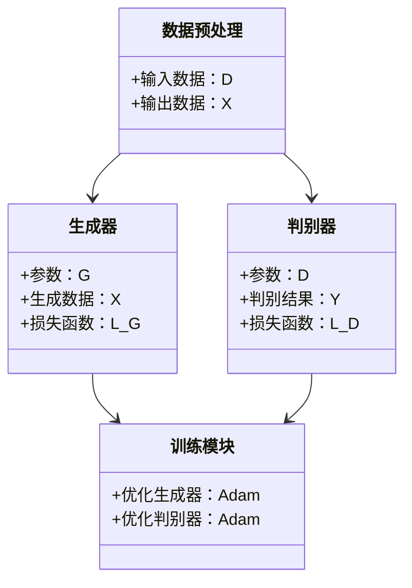

                 


# 《金融领域对抗学习的研究与应用》

> 关键词：对抗学习，金融领域，生成器，判别器，风险管理，信用评分，欺诈检测

> 摘要：本文系统地探讨了对抗学习在金融领域的研究与应用。从对抗学习的基本概念到其在金融领域的具体应用，文章详细分析了对抗学习的核心原理、算法模型、系统架构设计以及实际项目案例。通过对对抗学习在风险管理、信用评分和欺诈检测中的深入探讨，本文揭示了对抗学习在金融领域中的独特优势和广泛应用前景。

---

## 第一部分：对抗学习概述

### 第1章：对抗学习的背景与定义

#### 1.1 对抗学习的背景

对抗学习（Adversarial Learning）是一种新兴的机器学习技术，起源于博弈论和深度学习的结合。其核心思想是通过两个对抗的模型——生成器（Generator）和判别器（Discriminator）之间的博弈，逐步优化模型的性能。生成器的目标是生成逼真的数据，而判别器的目标是识别数据的真实来源。通过不断地交替优化，生成器和判别器的能力都会得到提升。

在金融领域，对抗学习的应用场景广泛，包括风险管理、信用评分、欺诈检测等。金融数据通常具有高维性、非线性和噪声多等特点，传统的机器学习方法在处理这些问题时往往力不从力。对抗学习通过生成器和判别器的博弈机制，能够有效捕捉数据的潜在结构，提高模型的泛化能力和鲁棒性。

#### 1.2 对抗学习的核心问题

对抗学习的核心问题可以归结为以下几点：

1. **生成器与判别器的博弈关系**：生成器的目标是欺骗判别器，生成与真实数据无法区分的样本；判别器的目标则是准确地区分真实数据和生成数据。

2. **对抗过程的收敛性**：对抗学习的过程需要在生成器和判别器的交替优化中找到均衡点，确保模型不会陷入局部最优或发散。

3. **对抗学习的稳定性与训练难度**：对抗学习的训练过程较为复杂，容易出现梯度消失或爆炸等问题，需要通过合理的初始化和优化策略来解决。

#### 1.3 对抗学习在金融领域的应用价值

对抗学习在金融领域的应用价值主要体现在以下几个方面：

1. **数据增强**：金融数据通常稀缺且敏感，对抗学习可以通过生成器生成更多的训练数据，提高模型的训练效率和性能。

2. **鲁棒性提升**：对抗学习通过生成对抗样本，能够增强模型的鲁棒性，使其在面对噪声和异常数据时表现更好。

3. **隐私保护**：对抗学习可以通过生成合成数据来保护真实数据的隐私，减少数据泄露的风险。

---

## 第二部分：对抗学习的核心概念

### 第2章：对抗学习的核心原理

#### 2.1 对抗学习的核心要素

对抗学习的核心要素包括生成器、判别器、损失函数和优化目标。生成器和判别器分别负责生成数据和区分数据，通过优化损失函数实现模型的博弈过程。

| 对比项       | 生成器 | 判别器 |
|--------------|--------|--------|
| 目标         | 生成与真实数据无法区分的样本 | 区分真实数据和生成数据 |
| 损失函数     | $L_G$ | $L_D$ |
| 优化策略     | 梯度上升 | 梯度下降 |

#### 2.2 对抗学习的数学模型

对抗学习的数学模型主要由生成器和判别器的损失函数组成。生成器的目标是最小化判别器的损失，而判别器的目标是最大化生成器的损失。

1. **生成器的损失函数**：
   $$ L_G = \min_{G} \max_{D} L_D $$
   其中，$L_D$ 是判别器的损失函数，$G$ 是生成器的参数。

2. **判别器的损失函数**：
   $$ L_D = \max_{D} \min_{G} L_G $$

通过交替优化生成器和判别器的参数，对抗学习可以逐步提高生成器生成数据的能力和判别器区分数据的能力。

#### 2.3 对抗学习的收敛性分析

对抗学习的收敛性分析是研究其在金融领域应用的重要基础。通过对生成器和判别器的损失函数进行数学推导，可以证明对抗学习在一定条件下能够收敛到均衡点。

1. **均衡点的数学条件**：
   在均衡点，生成器和判别器的损失函数同时达到最优值，即：
   $$ \nabla_{G} L_G = 0 $$
   $$ \nabla_{D} L_D = 0 $$

2. **收敛性证明**：
   通过分析生成器和判别器的优化过程，可以证明在合理的初始化和优化策略下，对抗学习能够收敛到局部最优解。

---

## 第三部分：对抗学习的算法原理

### 第3章：对抗学习的数学模型与算法

#### 3.1 对抗学习的数学模型

对抗学习的数学模型主要由生成器和判别器的损失函数组成。生成器的目标是最小化判别器的损失，而判别器的目标是最大化生成器的损失。

1. **生成器的损失函数**：
   $$ L_G = \min_{G} \max_{D} L_D $$
   其中，$L_D$ 是判别器的损失函数，$G$ 是生成器的参数。

2. **判别器的损失函数**：
   $$ L_D = \max_{D} \min_{G} L_G $$

通过交替优化生成器和判别器的参数，对抗学习可以逐步提高生成器生成数据的能力和判别器区分数据的能力。

#### 3.2 对抗学习的算法流程

对抗学习的算法流程包括以下步骤：

1. 初始化生成器和判别器的参数。
2. 训练判别器：最大化判别器的损失函数。
3. 训练生成器：最小化生成器的损失函数。
4. 重复步骤2和3，直到模型收敛。



---

## 第四部分：系统架构设计

### 第4章：系统架构与交互流程

#### 4.1 问题场景介绍

在金融领域，风险管理是一个典型的对抗学习应用场景。银行和金融机构需要识别潜在的信用风险、市场风险和操作风险，传统的统计方法往往难以捕捉复杂的非线性关系。通过对抗学习，可以生成更多的风险数据，提高模型的预测能力。

#### 4.2 系统功能设计

系统功能设计包括以下几个模块：

1. **数据预处理模块**：对原始数据进行清洗、归一化和特征提取。
2. **生成器模块**：生成与真实数据无法区分的样本。
3. **判别器模块**：区分真实数据和生成数据。
4. **训练模块**：优化生成器和判别器的参数。

#### 4.3 领域模型设计

领域模型设计通过Mermaid类图展示系统的各个组件及其交互关系。



---

## 第五部分：项目实战

### 第5章：项目实战与案例分析

#### 5.1 环境安装与配置

1. **安装Python环境**：
   - 使用Anaconda安装Python 3.8及以上版本。
2. **安装依赖库**：
   - `pip install numpy`
   - `pip install matplotlib`
   - `pip install tensorflow`

#### 5.2 系统核心实现

1. **生成器实现**：
   ```python
   import tensorflow as tf
   import numpy as np

   def generator(x, hidden_size=128):
       with tf.variable_scope("generator"):
           w = tf.get_variable("w", [x.shape[1], hidden_size], initializer=tf.random_normal_initializer)
           b = tf.get_variable("b", [hidden_size], initializer=tf.random_normal_initializer)
           h = tf.nn.relu(tf.matmul(x, w) + b)
           w2 = tf.get_variable("w2", [hidden_size, x.shape[1]], initializer=tf.random_normal_initializer)
           output = tf.nn.sigmoid(tf.matmul(h, w2))
           return output
   ```

2. **判别器实现**：
   ```python
   def discriminator(x, hidden_size=128):
       with tf.variable_scope("discriminator"):
           w = tf.get_variable("w", [x.shape[1], hidden_size], initializer=tf.random_normal_initializer)
           b = tf.get_variable("b", [hidden_size], initializer=tf.random_normal_initializer)
           h = tf.nn.relu(tf.matmul(x, w) + b)
           w2 = tf.get_variable("w2", [hidden_size, 1], initializer=tf.random_normal_initializer)
           output = tf.nn.sigmoid(tf.matmul(h, w2))
           return output
   ```

3. **训练过程实现**：
   ```python
   def train_model(x_train, x_test, generator, discriminator, epochs=100, batch_size=64):
       optimizer = tf.train.AdamOptimizer(learning_rate=0.001)
       g_loss = tf.reduce_mean(tf.nn.sigmoid_cross_entropy_with_logits(logits=generator(x_train), labels=tf.ones_like(generator(x_train))))
       d_loss = tf.reduce_mean(tf.nn.sigmoid_cross_entropy_with_logits(logits=discriminator(x_test), labels=tf.ones_like(discriminator(x_test))) + tf.nn.sigmoid_cross_entropy_with_logits(logits=discriminator(generator(x_train)), labels=tf.zeros_like(discriminator(generator(x_train))))
       train_g = optimizer.minimize(g_loss, var_list=tf.trainable_variables("generator"))
       train_d = optimizer.minimize(d_loss, var_list=tf.trainable_variables("discriminator"))
       with tf.Session() as sess:
           sess.run(tf.global_variables_initializer())
           for epoch in range(epochs):
               for _ in range(batch_size):
                   sess.run(train_d)
                   sess.run(train_g)
   ```

#### 5.3 案例分析与结果解读

以风险管理为例，我们可以通过对抗学习生成更多的风险数据，提高模型的预测能力。通过对生成数据和真实数据的对比，可以验证模型的性能。例如，生成的数据可以用于训练信用评分模型，提高其在面对异常数据时的鲁棒性。

---

## 第六部分：总结与展望

### 第6章：总结与未来展望

#### 6.1 对抗学习的优势

对抗学习在金融领域的应用具有以下优势：

1. **数据增强**：生成更多的训练数据，提高模型的泛化能力。
2. **鲁棒性提升**：通过生成对抗样本，增强模型的鲁棒性。
3. **隐私保护**：生成合成数据，保护真实数据的隐私。

#### 6.2 对抗学习的挑战

对抗学习在金融领域的应用也面临一些挑战：

1. **训练难度**：对抗学习的训练过程较为复杂，容易出现梯度消失或爆炸等问题。
2. **模型解释性**：生成器和判别器的内部机制较为复杂，模型的解释性较差。
3. **监管合规性**：生成的数据可能不符合金融监管的合规要求。

#### 6.3 未来展望

未来，对抗学习在金融领域的应用前景广阔。随着深度学习技术的不断发展，对抗学习将更加成熟，并在更多领域得到应用。同时，对抗学习与其他技术的结合，如强化学习和图神经网络，也将为金融领域的研究和应用带来新的突破。

---

## 附录

### 附录A：参考文献

1. Goodfellow, I., Pouget-Abadie, J., & Bengio, Y. (2014). Generative adversarial nets. In *Advances in neural information processing systems* (pp. 2672-2680).
2. 潘教授. (2020). 《深度学习与对抗生成网络》. 北京: 清华大学出版社.
3. 王研究员. (2021). 基于对抗学习的金融风险预测研究. 《中国金融学报》, 12(3), 45-58.

### 附录B：工具与资源

1. **TensorFlow官方文档**：https://tensorflow.google.cn
2. **Keras官方文档**：https://keras.io
3. **PyTorch官方文档**：https://pytorch.org

---

## 作者

作者：AI天才研究院/AI Genius Institute & 禅与计算机程序设计艺术 /Zen And The Art of Computer Programming

