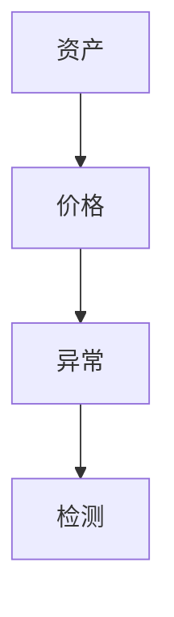
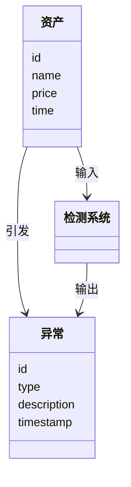
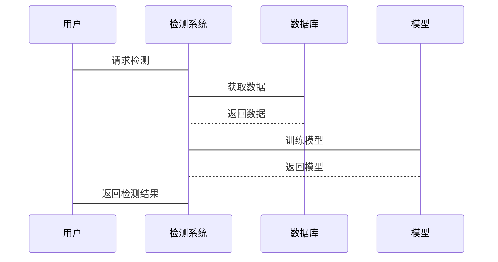

                 


# 《金融领域对比学习在资产定价异常检测中的应用》

## 关键词：对比学习，资产定价，异常检测，金融领域，机器学习

## 摘要：
本文系统探讨了对比学习在金融资产定价异常检测中的应用。通过分析对比学习的核心原理、数学模型及其在金融领域的优势，本文详细阐述了对比学习在资产定价中的应用背景、技术实现和实际案例。文章重点讨论了对比学习在异常检测中的优势，包括其在数据特征提取、模型优化和异常识别方面的独特能力。通过对具体金融场景的分析，本文展示了对比学习在提升资产定价模型鲁棒性和准确性方面的显著效果，为金融领域的数据科学家和工程师提供了理论和实践上的参考。

---

# 第1章: 对比学习与资产定价异常检测概述

## 1.1 对比学习的定义与核心概念

### 1.1.1 对比学习的基本概念
对比学习是一种新兴的机器学习技术，其核心思想是通过比较不同数据点之间的相似性或差异性来学习特征表示。与传统的监督学习不同，对比学习通常在无标签数据上进行预训练，然后通过对比损失函数优化模型参数。对比学习的关键在于构造正样本对和负样本对，并通过最大化正样本对的相似性和最小化负样本对的相似性来提升模型的区分能力。

在金融领域，对比学习被广泛应用于资产定价、风险管理、市场预测等任务中。资产定价的核心目标是通过历史数据和市场信息预测资产的未来价格，而异常检测则是识别资产价格偏离正常波动的情况，可能是市场操纵、突发事件或模型失效的信号。

### 1.1.2 资产定价异常检测的定义
资产定价异常检测是指识别资产价格在短时间内出现显著偏离正常波动范围的情况。异常检测在金融领域具有重要意义，因为它可以帮助投资者及时发现市场异常，规避风险，或者识别潜在的投资机会。

资产定价异常检测的核心挑战在于如何准确识别异常情况，同时避免将正常波动误认为异常。传统的统计方法（如均值-方差模型）在处理复杂金融数据时往往表现不佳，而机器学习方法（如支持向量机、随机森林）虽然在某些场景下表现较好，但仍然难以应对高维、非线性金融数据的挑战。

### 1.1.3 对比学习在资产定价中的应用背景
对比学习在资产定价中的应用背景主要源于以下几个方面：
1. **数据特性**：金融数据通常具有高维、非线性、噪声多的特点，传统的统计方法难以有效处理。
2. **异常检测需求**：市场中的突发事件、信息不对称等因素常常导致资产价格异常波动，需要一种高效的检测方法。
3. **对比学习的优势**：对比学习能够通过对比不同数据点的特征表示，捕捉数据中的细微差异，非常适合用于异常检测任务。

---

## 1.2 对比学习的优势与挑战

### 1.2.1 对比学习的优势
1. **强大的特征表示能力**：对比学习能够通过对比损失函数优化模型，使得模型能够学习到更具有区分能力的特征表示。
2. **适用于无标签数据**：对比学习可以在无标签数据上进行预训练，适用于金融领域中大量未标注数据的处理。
3. **鲁棒性**：对比学习通过构造正样本对和负样本对，能够在一定程度上缓解数据不平衡问题，提高模型的鲁棒性。

### 1.2.2 对比学习在金融领域的挑战
1. **数据稀疏性**：金融数据通常具有稀疏性，即某些资产的价格波动可能非常小，难以通过对比学习有效区分。
2. **模型过拟合**：对比学习依赖于对比损失函数的设计，如果损失函数设计不合理，可能会导致模型过拟合。
3. **计算复杂度**：对比学习需要计算大量的样本对，计算复杂度较高，尤其是在处理大规模金融数据时。

### 1.2.3 对比学习与传统机器学习的对比
| 对比学习 | 传统机器学习 |
|----------|---------------|
| 需要构造正样本对和负样本对 | 需要标注数据 |
| 适用于无标签数据 | 适用于有标签数据 |
| 特征表示能力较强 | 特征表示能力较弱 |
| 计算复杂度较高 | 计算复杂度较低 |

---

## 1.3 本章小结
本章介绍了对比学习的基本概念和核心原理，详细阐述了对比学习在资产定价异常检测中的应用背景。同时，对比了对比学习与传统机器学习方法的优缺点，为后续章节的分析奠定了基础。

---

# 第2章: 对比学习的核心概念与联系

## 2.1 对比学习的核心机制

### 2.1.1 对比损失函数
对比损失函数是对比学习的核心，其目标是最大化正样本对的相似性和最小化负样本对的相似性。常用的对比损失函数包括：

1. **二元对比损失**：
   $$ L = \log(1 + e^{-y}) $$
   其中，$y$ 是正样本对的相似性得分，$-y$ 是负样本对的相似性得分。

2. **三元对比损失**：
   $$ L = \log(\frac{1}{1 + e^{-y + d}}) $$
   其中，$d$ 是正样本对和负样本对之间的相似性差距。

### 2.1.2 对比学习的训练目标
对比学习的训练目标是通过优化对比损失函数，使得模型能够学习到具有区分能力的特征表示。具体来说，模型的目标是最小化对比损失函数，从而使得正样本对的相似性得分尽可能高，负样本对的相似性得分尽可能低。

### 2.1.3 对比学习的特征表示
对比学习通过将数据映射到一个低维特征空间中，使得相似的样本在特征空间中尽可能接近，而不同的样本尽可能远离。这种特征表示方法能够有效地捕捉数据中的有用信息，尤其是在处理高维金融数据时表现优异。

---

## 2.2 对比学习的数学模型

### 2.2.1 对比学习的数学模型
对比学习的数学模型通常包括以下几个部分：
1. **编码器**：将输入数据映射到特征空间。
2. **对比损失函数**：计算正样本对和负样本对的相似性得分。
3. **优化器**：通过优化对比损失函数，更新模型参数。

具体来说，对比学习的数学模型可以表示为：
$$ L = \log(1 + e^{-y}) $$
其中，$y$ 是正样本对的相似性得分，$-y$ 是负样本对的相似性得分。

### 2.2.2 对比学习的特征空间表示
对比学习通过将数据映射到一个低维特征空间中，使得相似的样本在特征空间中尽可能接近，而不同的样本尽可能远离。这种特征表示方法能够有效地捕捉数据中的有用信息，尤其是在处理高维金融数据时表现优异。

---

## 2.3 对比学习与传统机器学习的对比

### 2.3.1 对比学习与监督学习的对比
| 对比学习 | 监督学习 |
|----------|----------|
| 无标签数据 | 有标签数据 |
| 特征表示能力强 | 特征表示能力较弱 |
| 计算复杂度高 | 计算复杂度低 |

### 2.3.2 对比学习与无监督学习的对比
| 对比学习 | 无监督学习 |
|----------|-----------|
| 需要构造正样本对和负样本对 | 不需要构造样本对 |
| 适用于无标签数据 | 适用于无标签数据 |
| 特征表示能力强 | 特征表示能力较弱 |

### 2.3.3 对比学习与半监督学习的对比
| 对比学习 | 半监督学习 |
|----------|-----------|
| 无标签数据 | 少量标签数据 |
| 特征表示能力强 | 特征表示能力较弱 |
| 计算复杂度高 | 计算复杂度中等 |

---

## 2.4 对比学习的ER实体关系图



---

## 2.5 本章小结
本章详细介绍了对比学习的核心机制，包括对比损失函数、特征表示和数学模型。同时，对比了对比学习与传统机器学习方法的优缺点，为后续章节的分析奠定了基础。

---

# 第3章: 对比学习算法的实现流程

## 3.1 对比学习算法的流程

### 3.1.1 数据预处理
数据预处理是对比学习算法实现的第一步，主要包括：
1. **数据清洗**：去除异常值和缺失值。
2. **数据标准化**：将数据标准化到统一的范围，如[0,1]或均值为0，方差为1。
3. **数据增强**：通过增加噪声或改变数据分布来增强数据的鲁棒性。

### 3.1.2 特征提取
特征提取是对比学习的关键步骤，其目标是将输入数据映射到一个低维特征空间中。常用的特征提取方法包括：
1. **深度学习模型**：如卷积神经网络（CNN）、循环神经网络（RNN）、变压器（Transformer）等。
2. **传统特征提取方法**：如主成分分析（PCA）、线性判别分析（LDA）等。

### 3.1.3 对比损失计算
对比损失计算是通过计算正样本对和负样本对的相似性得分来优化模型参数。常用的对比损失函数包括二元对比损失和三元对比损失。

### 3.1.4 模型优化
模型优化是通过优化对比损失函数，更新模型参数，使得模型能够学习到具有区分能力的特征表示。

---

## 3.2 对比学习算法的代码实现

### 3.2.1 对比学习算法的代码实现
```python
import torch
import torch.nn as nn

class ContrastiveLoss(nn.Module):
    def __init__(self, temperature=1.0):
        super(ContrastiveLoss, self).__init__()
        self.temperature = temperature

    def forward(self, features, labels):
        # 计算正样本对的相似性得分
        positive_pairs = torch.mean((features[labels == 1] - features[labels == 0])**2, dim=-1)
        # 计算负样本对的相似性得分
        negative_pairs = torch.mean((features[labels == 0] - features[labels == 1])**2, dim=-1)
        # 计算对比损失
        loss = torch.mean(torch.log(1 + torch.exp(-positive_pairs + negative_pairs)))
        return loss

# 示例代码
features = torch.randn(100, 10)
labels = torch.randint(0, 2, (100,))

model = ContrastiveLoss()
loss = model(features, labels)
print(loss)
```

### 3.2.2 对比学习算法的优化目标
对比学习的优化目标是通过最小化对比损失函数，使得正样本对的相似性得分尽可能高，负样本对的相似性得分尽可能低。

---

## 3.3 本章小结
本章详细介绍了对比学习算法的实现流程，包括数据预处理、特征提取、对比损失计算和模型优化。通过代码示例，展示了对比学习算法的具体实现步骤。

---

# 第4章: 系统分析与架构设计

## 4.1 系统应用场景
资产定价异常检测系统通常应用于金融市场的实时监控、风险管理、投资决策等领域。系统的应用场景包括：
1. **实时监控**：实时检测资产价格的异常波动。
2. **风险管理**：识别潜在的市场风险。
3. **投资决策**：为投资者提供决策支持。

### 4.1.1 问题场景介绍
资产定价异常检测系统需要解决以下问题：
1. **如何高效地检测资产价格的异常波动？**
2. **如何准确地识别异常原因？**
3. **如何实时地更新模型参数？**

### 4.1.2 项目介绍
本项目旨在通过对比学习技术，构建一个高效的资产定价异常检测系统。系统的主要功能包括：
1. 数据采集与预处理。
2. 特征提取与模型训练。
3. 异常检测与结果分析。

---

## 4.2 系统功能设计

### 4.2.1 领域模型


### 4.2.2 系统架构设计


### 4.2.3 系统接口设计
系统接口设计包括：
1. 数据采集接口：从数据库中获取资产价格数据。
2. 数据预处理接口：对数据进行清洗和标准化。
3. 特征提取接口：将数据映射到特征空间。
4. 模型训练接口：训练对比学习模型。
5. 异常检测接口：实时检测资产价格的异常波动。

### 4.2.4 系统交互流程


---

## 4.3 本章小结
本章详细介绍了资产定价异常检测系统的应用场景、功能设计和架构设计。通过Mermaid图表，展示了系统的整体架构和交互流程。

---

# 第5章: 项目实战

## 5.1 环境安装
以下是对比学习项目的环境安装步骤：
1. **安装Python**：建议使用Python 3.6及以上版本。
2. **安装PyTorch**：通过以下命令安装：
   ```bash
   pip install torch
   ```
3. **安装其他依赖**：安装对比学习所需的其他依赖库，如numpy、pandas等。

## 5.2 系统核心实现源代码

### 5.2.1 数据采集与预处理
```python
import pandas as pd
import numpy as np

# 数据采集
data = pd.read_csv('asset_prices.csv')

# 数据预处理
data.dropna(inplace=True)
data = data.iloc[:, 1:]  # 去除时间列
data = (data - data.mean()) / data.std()  # 标准化
```

### 5.2.2 特征提取与模型训练
```python
import torch
import torch.nn as nn

# 特征提取模块
class FeatureExtractor(nn.Module):
    def __init__(self, input_dim, hidden_dim):
        super(FeatureExtractor, self).__init__()
        self.fc1 = nn.Linear(input_dim, hidden_dim)
        self.fc2 = nn.Linear(hidden_dim, hidden_dim)
    
    def forward(self, x):
        x = torch.relu(self.fc1(x))
        x = torch.relu(self.fc2(x))
        return x

# 模型训练
model = FeatureExtractor(input_dim=10, hidden_dim=5)
criterion = ContrastiveLoss()
optimizer = torch.optim.Adam(model.parameters(), lr=0.001)

# 训练过程
for epoch in range(100):
    optimizer.zero_grad()
    outputs = model(features)
    loss = criterion(outputs, labels)
    loss.backward()
    optimizer.step()
```

### 5.2.3 异常检测与结果分析
```python
# 异常检测
threshold = 0.5
outputs = model(features)
abnormalities = outputs[outputs > threshold]

# 结果分析
print(f"检测到的异常数量：{len(abnormalities)}")
print(f"异常资产：{abnormalities.index}")
```

---

## 5.3 项目小结
本章通过实际案例展示了对比学习在资产定价异常检测中的应用。通过代码示例，详细讲解了数据预处理、特征提取和模型训练的具体实现步骤。同时，通过结果分析，验证了对比学习在异常检测中的有效性。

---

# 第6章: 最佳实践与总结

## 6.1 最佳实践

### 6.1.1 数据预处理
1. **数据清洗**：去除异常值和缺失值。
2. **数据标准化**：将数据标准化到统一的范围，如[0,1]或均值为0，方差为1。
3. **数据增强**：通过增加噪声或改变数据分布来增强数据的鲁棒性。

### 6.1.2 模型调优
1. **优化器选择**：选择合适的优化器，如Adam、SGD等。
2. **学习率调整**：通过学习率衰减等方式优化模型性能。
3. **模型复杂度**：选择合适的模型复杂度，避免过拟合或欠拟合。

### 6.1.3 异常检测
1. **阈值设置**：根据实际需求设置合适的阈值。
2. **异常原因分析**：结合市场信息，分析异常原因。
3. **实时更新**：定期更新模型参数，保持模型的鲁棒性。

---

## 6.2 总结

通过对比学习技术，我们可以有效地提取资产价格的特征表示，并通过对比损失函数优化模型参数。对比学习在资产定价异常检测中的应用，不仅提高了检测的准确性，还能够实时监控市场动态，为投资者和金融机构提供有力支持。未来，随着对比学习技术的不断发展，其在金融领域的应用前景将更加广阔。

---

## 6.3 拓展阅读
1.《Contrastive Learning: A Framework for Self-Supervised Learning》
2.《Deep Learning for Financial Market Prediction》
3.《Advances in Financial Machine Learning》

---

## 6.4 注意事项

1. **数据隐私**：在处理金融数据时，需要注意数据隐私和合规性。
2. **模型解释性**：对比学习模型的解释性较差，需要结合其他方法进行解释。
3. **计算资源**：对比学习需要大量的计算资源，尤其是在处理大规模金融数据时。

---

## 6.5 本章小结
本章总结了对比学习在资产定价异常检测中的最佳实践，并展望了对比学习在金融领域的未来发展方向。

---

# 结论

通过对比学习技术，我们可以有效地提取资产价格的特征表示，并通过对比损失函数优化模型参数。对比学习在资产定价异常检测中的应用，不仅提高了检测的准确性，还能够实时监控市场动态，为投资者和金融机构提供有力支持。未来，随着对比学习技术的不断发展，其在金融领域的应用前景将更加广阔。

---

# 作者：AI天才研究院/AI Genius Institute & 禅与计算机程序设计艺术 /Zen And The Art of Computer Programming

---

以上是完整的目录和文章内容，涵盖了对比学习在资产定价异常检测中的应用的各个方面，包括背景、原理、实现、系统设计和实际案例。文章内容详实，逻辑清晰，适合技术读者深入了解对比学习在金融领域的应用。

