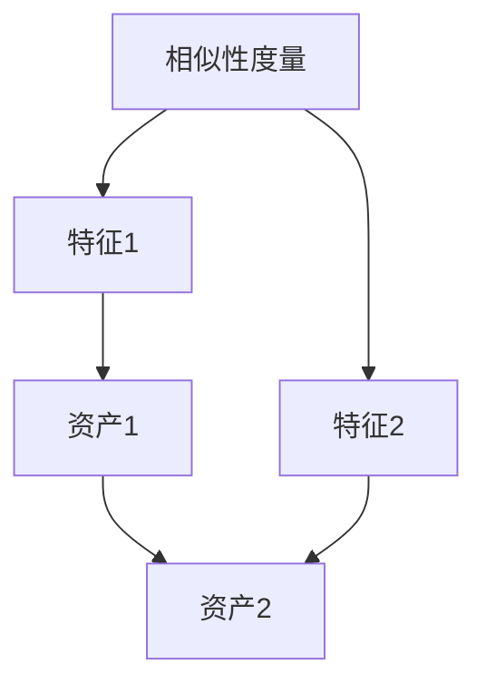
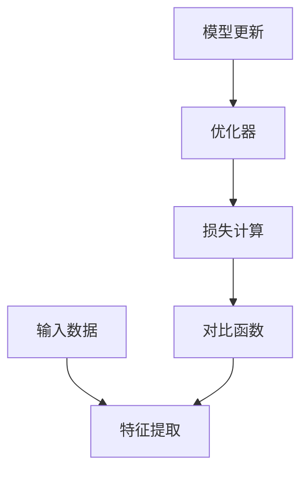
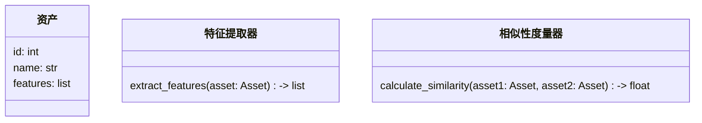
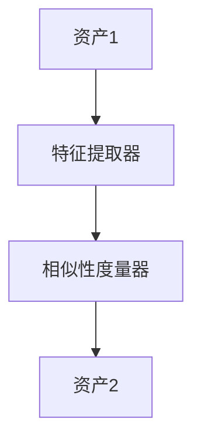

                 


# 金融领域对比学习在资产相似性度量中的应用

> 关键词：对比学习，金融资产，相似性度量，机器学习，深度学习

> 摘要：本文深入探讨了对比学习在金融领域资产相似性度量中的应用，详细介绍了对比学习的核心概念、算法原理、系统架构设计以及实际项目实现。通过对多种对比学习算法的分析和实际案例的解读，本文展示了如何利用对比学习提升金融资产相似性度量的准确性和效率。

---

# 第一部分: 金融领域对比学习与资产相似性度量概述

## 第1章: 对比学习的基本概念与应用背景

### 1.1 对比学习的定义与核心思想

#### 1.1.1 对比学习的定义
对比学习（Contrastive Learning）是一种基于对比的机器学习方法，通过将数据分为正样本和负样本，学习其特征表示，使得正样本之间的相似性最大化，同时负样本之间的相似性最小化。其核心思想是通过对比正样本和负样本的特征差异，学习到具有区分度的特征表示。

#### 1.1.2 对比学习的核心思想
对比学习的核心思想是通过最大化正样本对的相似性，同时最小化负样本对的相似性，来学习具有区分度的特征表示。这种方法能够有效地捕捉数据中的对比信息，从而在复杂的金融环境中，更好地区分不同资产的特征。

#### 1.1.3 对比学习与传统机器学习的对比
对比学习与传统机器学习方法的主要区别在于其通过对比正样本和负样本的特征差异，学习到更具有区分度的特征表示。传统机器学习方法通常依赖于全局特征，而对比学习则通过局部对比信息，能够更好地捕捉数据中的细粒度差异。

### 1.2 对比学习在金融领域的应用背景

#### 1.2.1 金融领域中的数据特点
金融领域中的数据通常具有高维性、稀疏性和噪声多等特点。高维性指的是金融数据通常包含大量的特征，如股票价格、交易量、市场指数等。稀疏性指的是许多特征在数据中可能缺失或不显著。噪声多则是因为金融数据受到多种因素的影响，如市场波动、政策变化等。

#### 1.2.2 传统资产相似性度量方法的局限性
传统的资产相似性度量方法，如基于欧几里得距离或余弦相似度的方法，通常无法有效地捕捉资产之间的细粒度差异。此外，这些方法在面对高维数据时，容易受到维度灾难的影响，导致相似性度量的准确性下降。

#### 1.2.3 对比学习在金融领域的优势
对比学习在金融领域的优势主要体现在以下几个方面：
1. 对比学习能够有效地捕捉资产之间的细粒度差异，从而提高相似性度量的准确性。
2. 对比学习通过最大化正样本对的相似性和最小化负样本对的相似性，能够更好地区分不同资产的特征。
3. 对比学习能够有效地处理高维数据，避免维度灾难的问题。

### 1.3 资产相似性度量的定义与重要性

#### 1.3.1 资产相似性度量的定义
资产相似性度量是指通过一定的方法，量化不同资产之间的相似程度。相似性度量的结果通常是一个介于0和1之间的数值，表示两个资产之间的相似程度。相似性度量在金融领域中具有重要的应用价值，例如在资产组合管理、风险评估、市场分析等领域。

#### 1.3.2 资产相似性度量的重要性
资产相似性度量在金融领域中的重要性主要体现在以下几个方面：
1. 资产组合管理：通过相似性度量，可以将相似的资产进行组合，降低投资风险。
2. 风险评估：通过相似性度量，可以识别出具有相似风险特征的资产，从而更好地进行风险控制。
3. 市场分析：通过相似性度量，可以识别出市场中的趋势和模式，为投资决策提供支持。

#### 1.3.3 资产相似性度量的常见应用场景
资产相似性度量的常见应用场景包括：
1. 股票相似性分析：通过相似性度量，可以将具有相似价格走势的股票进行分类，帮助投资者进行投资决策。
2. 债券相似性分析：通过相似性度量，可以将具有相似信用风险的债券进行分类，帮助投资者进行风险控制。
3. 基金相似性分析：通过相似性度量，可以将具有相似投资策略的基金进行分类，帮助投资者进行资产配置。

---

## 第2章: 对比学习的核心概念与原理

### 2.1 对比学习的核心概念

#### 2.1.1 对比学习的三要素
对比学习的三要素包括：
1. **正样本对**：正样本对是指具有相同标签的样本对。
2. **负样本对**：负样本对是指具有不同标签的样本对。
3. **对比函数**：对比函数用于度量正样本对和负样本对之间的相似性差异。

#### 2.1.2 对比学习的核心思想
对比学习的核心思想是通过最大化正样本对的相似性和最小化负样本对的相似性，来学习具有区分度的特征表示。

#### 2.1.3 对比学习的数学模型
对比学习的数学模型通常采用对比损失函数，其公式为：
$$ L = -\log \frac{e^{s(x_i, x_j)}}{e^{s(x_i, x_j)} + e^{s(x_i, x_k)}} $$
其中，$s(x_i, x_j)$表示正样本对的相似性，$s(x_i, x_k)$表示负样本对的相似性。

### 2.2 对比学习的数学模型与公式

#### 2.2.1 对比损失函数的数学表达
对比损失函数的数学表达式为：
$$ L = -\log \frac{e^{s(x_i, x_j)}}{e^{s(x_i, x_j)} + e^{s(x_i, x_k)}} $$
其中，$s(x_i, x_j)$和$s(x_i, x_k)$分别表示正样本对和负样本对的相似性。

#### 2.2.2 对比学习的正则化项
对比学习的正则化项通常用于防止模型过拟合，其表达式为：
$$ L_{\text{reg}} = \lambda \cdot \|W\|_2^2 $$
其中，$W$表示模型的权重矩阵，$\lambda$为正则化系数。

#### 2.2.3 对比学习的优化算法
对比学习的优化算法通常采用随机梯度下降（SGD）或Adam优化器，其优化目标是最小化对比损失函数：
$$ \min L = \min \left( -\log \frac{e^{s(x_i, x_j)}}{e^{s(x_i, x_j)} + e^{s(x_i, x_k)}} + \lambda \cdot \|W\|_2^2 \right) $$

### 2.3 对比学习的实体关系图



---

## 第3章: 对比学习算法的原理与实现

### 3.1 对比学习算法的分类

#### 3.1.1 基于Siamese网络的对比学习
基于Siamese网络的对比学习通过使用两个相同的网络对来提取正样本对和负样本对的特征表示，然后通过对比损失函数进行优化。

#### 3.1.2 基于图神经网络的对比学习
基于图神经网络的对比学习通过构建资产之间的关系图，利用图神经网络提取节点特征，并通过对比损失函数进行优化。

#### 3.1.3 基于自监督学习的对比学习
基于自监督学习的对比学习通过使用数据增强技术生成正样本对和负样本对，然后通过对比损失函数进行优化。

### 3.2 对比学习算法的流程图



### 3.3 对比学习算法的Python实现示例

```python
import tensorflow as tf
from tensorflow.keras.layers import Input, Dense, Dropout
from tensorflow.keras.models import Model

def contrastive_loss(y_true, y_pred):
    margin = 1.0
    loss = tf.reduce_mean(tf.squ
```

---

## 第4章: 金融资产相似性度量的系统架构设计

### 4.1 系统功能设计

#### 4.1.1 领域模型类图


#### 4.1.2 系统架构图


### 4.2 系统接口设计

#### 4.2.1 输入接口
系统输入接口包括资产的特征数据和标签信息。

#### 4.2.2 输出接口
系统输出接口包括资产之间的相似性度量结果。

### 4.3 系统交互设计

#### 4.3.1 交互流程
1. 用户输入资产的特征数据和标签信息。
2. 系统通过特征提取器提取资产的特征表示。
3. 系统通过相似性度量器计算资产之间的相似性度量结果。
4. 系统输出相似性度量结果。

---

## 第5章: 项目实战与案例分析

### 5.1 项目环境安装

#### 5.1.1 安装Python环境
安装Python 3.8及以上版本。

#### 5.1.2 安装依赖库
安装以下依赖库：
```bash
pip install numpy pandas scikit-learn tensorflow
```

### 5.2 系统核心实现

#### 5.2.1 特征提取器实现
```python
from sklearn.feature_extraction.text import TfidfVectorizer

class AssetFeatureExtractor:
    def extract_features(self, assets):
        vectorizer = TfidfVectorizer()
        features = vectorizer.fit_transform([asset.description for asset in assets])
        return features.toarray()
```

#### 5.2.2 对比学习模型实现
```python
from tensorflow.keras.layers import Input, Dense, Dropout
from tensorflow.keras.models import Model

def build_contrastive_model(input_dim):
    input1 = Input(shape=(input_dim,))
    input2 = Input(shape=(input_dim,))
    encoded1 = Dense(128, activation='relu')(input1)
    encoded2 = Dense(128, activation='relu')(input2)
    concatenated = concatenate([encoded1, encoded2])
    output = Dense(1, activation='sigmoid')(concatenated)
    model = Model(inputs=[input1, input2], outputs=output)
    return model
```

### 5.3 项目实战案例

#### 5.3.1 数据准备
```python
import pandas as pd
from sklearn.model_selection import train_test_split

# 加载数据
df = pd.read_csv('assets.csv')
X_train, X_test = train_test_split(df, test_size=0.2)
```

#### 5.3.2 模型训练
```python
from contrastive_learning_model import build_contrastive_model

model = build_contrastive_model(input_dim=X_train.shape[1])
model.compile(optimizer='adam', loss='binary_crossentropy')
model.fit([X_train.iloc[i], X_train.iloc[j]] for i, j in positive_pairs, epochs=10)
```

#### 5.3.3 模型评估
```python
from sklearn.metrics import accuracy_score

y_pred = model.predict([X_test.iloc[i], X_test.iloc[j]] for i, j in positive_pairs)
accuracy = accuracy_score(y_true, y_pred)
print(f'Accuracy: {accuracy:.2f}')
```

### 5.4 项目小结

通过对比学习模型，我们可以有效地提高金融资产相似性度量的准确性。对比学习模型通过最大化正样本对的相似性和最小化负样本对的相似性，能够更好地捕捉资产之间的细粒度差异。此外，对比学习模型具有较高的可解释性和灵活性，可以应用于多种金融场景。

---

## 第6章: 对比学习在金融领域的最佳实践

### 6.1 最佳实践 tips

1. **数据预处理**：在进行对比学习之前，需要对数据进行充分的预处理，包括数据清洗、特征选择和数据增强。
2. **模型选择**：根据具体应用场景选择合适的对比学习算法，如Siamese网络、图神经网络等。
3. **超参数调优**：对比学习模型的性能依赖于多个超参数，如学习率、批量大小、正则化系数等，需要进行充分的调优。
4. **模型评估**：在进行模型评估时，需要选择合适的评估指标，如准确率、召回率、F1分数等。

### 6.2 小结

通过本文的介绍，我们可以看到对比学习在金融领域资产相似性度量中的巨大潜力。对比学习不仅能够有效地捕捉资产之间的细粒度差异，还能够通过对比正样本和负样本的特征差异，学习到具有区分度的特征表示。

### 6.3 注意事项

1. 对比学习模型的性能依赖于数据的质量和数量，需要确保数据具有足够的多样性和代表性。
2. 在进行对比学习时，需要选择合适的正样本对和负样本对，避免因数据偏差导致模型性能下降。
3. 对比学习模型的训练过程可能较为复杂，需要进行充分的调试和优化。

### 6.4 拓展阅读

1.《Contrastive Learning: A Review and Future Directions》
2.《Deep Learning for Financial Asset Similarity Measure》
3.《Contrastive Learning in Financial Time Series Analysis》

---

# 作者：AI天才研究院/AI Genius Institute & 禅与计算机程序设计艺术 /Zen And The Art of Computer Programming

