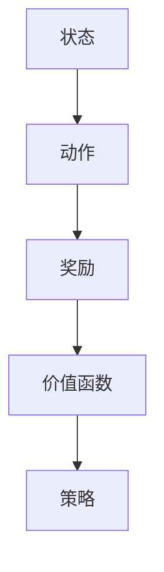
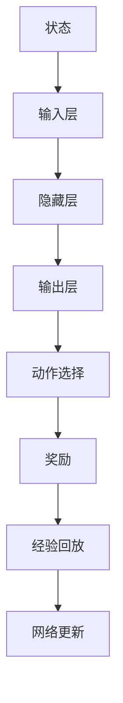
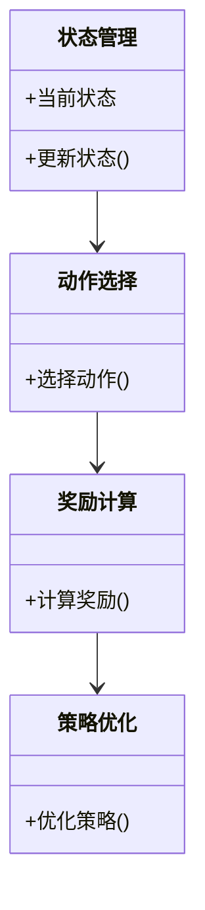

                 


# 《金融领域强化学习在交易执行中的应用》

---

## 关键词：金融、强化学习、交易执行、Q-learning、Deep Q-Network、量化交易

---

## 摘要：

本文深入探讨了强化学习在金融交易执行中的应用，详细分析了强化学习的基本概念、核心算法、系统架构设计及实际案例。通过结合数学模型和实际场景，本文展示了强化学习如何优化交易策略，降低交易成本，并在动态市场环境中实现高效的交易执行。

---

# 目录

---

## 第一章：强化学习概述

### 1.1 强化学习的基本概念

#### 1.1.1 什么是强化学习？
强化学习（Reinforcement Learning, RL）是一种机器学习方法，通过智能体与环境的交互，逐步优化策略以获得最大化的累计奖励。

#### 1.1.2 强化学习的核心要素
- 状态（State）：智能体所处的环境信息。
- 动作（Action）：智能体采取的行为。
- 奖励（Reward）：智能体行为的评价指标。

#### 1.1.3 强化学习与监督学习的区别
- 监督学习：基于已知的输入和输出进行学习。
- 强化学习：通过与环境交互获得奖励，逐步优化策略。

---

### 1.2 强化学习的基本原理

#### 1.2.1 状态、动作、奖励的定义
- 状态（State）：如市场价格、订单簿信息等。
- 动作（Action）：如买入、卖出或持有。
- 奖励（Reward）：如收益或损失。

#### 1.2.2 Q-learning算法简介
Q-learning是一种经典的强化学习算法，通过更新Q值表来学习最优策略。

#### 1.2.3 策略梯度方法概述
策略梯度方法直接优化策略，通过梯度下降更新参数。

---

### 1.3 强化学习在金融领域的应用

#### 1.3.1 金融领域的强化学习研究现状
- 研究集中在算法交易、风险控制等领域。

#### 1.3.2 强化学习在交易执行中的潜力
- 能够优化订单执行策略，降低交易成本。

#### 1.3.3 交易执行中的关键问题与挑战
- 动态市场环境、高频交易、市场微观结构等。

---

## 第二章：强化学习在交易执行中的应用

### 2.1 交易执行的基本概念

#### 2.1.1 交易执行的定义
交易执行是指将订单分解并优化执行策略的过程。

#### 2.1.2 交易执行的目标与挑战
- 目标：最小化交易成本，最大化收益。
- 挑战：市场深度、买卖价差、执行风险等。

#### 2.1.3 交易执行中的关键决策点
- 订单分解、交易时机、交易量分配等。

---

### 2.2 强化学习在交易执行中的核心问题

#### 2.2.1 市场微观结构对交易执行的影响
- 市场深度、订单簿信息等影响交易成本。

#### 2.2.2 交易成本与风险控制
- 通过优化策略降低交易成本，控制风险。

#### 2.2.3 动态市场环境下的策略调整
- 策略需要根据市场变化实时调整。

---

### 2.3 强化学习在交易执行中的优势

#### 2.3.1 非线性关系建模能力
- 能够捕捉复杂市场关系。

#### 2.3.2 动态环境适应性
- 策略能够实时调整以适应市场变化。

#### 2.3.3 高维状态空间处理能力
- 能够处理复杂的市场信息。

---

## 第三章：强化学习核心概念的数学模型

### 3.1 状态空间与动作空间

#### 3.1.1 状态空间的定义与表示
- 状态空间：所有可能的状态集合。

#### 3.1.2 动作空间的定义与表示
- 动作空间：所有可能的动作集合。

#### 3.1.3 状态与动作之间的关系
- 状态驱动动作选择。

---

### 3.2 奖励函数与价值函数

#### 3.2.1 奖励函数的定义与设计
- 奖励函数：定义智能体行为的奖励。

#### 3.2.2 价值函数的定义与计算
- 价值函数：衡量策略的优劣。

#### 3.2.3 奖励函数与价值函数的关系
- 价值函数基于奖励函数计算。

---

### 3.3 策略与值函数的关系

#### 3.3.1 策略的定义与分类
- 策略：决定动作选择的规则。

#### 3.3.2 值函数的定义与计算
- 值函数：衡量策略的价值。

#### 3.3.3 策略与值函数的优化关系
- 策略优化通过值函数评估。

---

## 第四章：强化学习核心概念的联系与对比

### 4.1 核心概念的对比分析

#### 4.1.1 状态与动作的对比
- 状态是环境的信息，动作是智能体的行为。

#### 4.1.2 奖励函数与价值函数的对比
- 奖励函数是即时反馈，价值函数是累积奖励。

#### 4.1.3 策略与值函数的对比
- 策略是动作选择规则，值函数是策略价值评估。

---

### 4.2 核心概念的联系

#### 4.2.1 状态与动作的关系
- 状态影响动作选择。

#### 4.2.2 奖励函数与价值函数的关系
- 价值函数基于奖励函数计算。

#### 4.2.3 策略与值函数的关系
- 策略优化通过值函数评估。

---

### 4.3 核心概念的ER实体关系图



---

## 第五章：强化学习核心算法的数学模型

### 5.1 Q-learning算法

#### 5.1.1 Q-learning算法简介
Q-learning是一种基于值函数的强化学习算法。

#### 5.1.2 Q-learning算法的数学模型
$$ Q(s, a) = Q(s, a) + \alpha (r + \gamma \max Q(s', a') - Q(s, a)) $$

#### 5.1.3 Q-learning算法的步骤
1. 初始化Q表。
2. 选择动作并执行。
3. 更新Q值。

---

### 5.2 Deep Q-Network（DQN）算法

#### 5.2.1 DQN算法简介
DQN结合了深度学习和强化学习，用于高维状态空间。

#### 5.2.2 DQN算法的数学模型
$$ Q(s, a) = \theta \cdot \phi(s, a) $$

#### 5.2.3 DQN算法的流程图



---

## 第六章：强化学习在交易执行中的系统架构设计

### 6.1 系统架构设计概述

#### 6.1.1 交易执行的场景介绍
- 高频交易、算法交易等。

#### 6.1.2 系统功能设计
- 数据获取、特征提取、策略选择等。

#### 6.1.3 系统架构设计
- 分层架构：数据层、算法层、策略层。

---

### 6.2 系统架构的类图



---

## 第七章：强化学习在交易执行中的项目实战

### 7.1 环境安装

#### 7.1.1 环境要求
- Python 3.8+
- TensorFlow、Keras、NumPy等库。

#### 7.1.2 安装步骤
1. 安装Python。
2. 安装依赖库。

---

### 7.2 系统核心实现

#### 7.2.1 数据获取与预处理
- 从数据源获取市场数据。
- 数据清洗和特征提取。

#### 7.2.2 策略选择与实现
- 使用强化学习算法选择动作。

#### 7.2.3 系统实现代码
```python
import numpy as np
import tensorflow as tf

class DQN:
    def __init__(self, state_space, action_space):
        self.state_space = state_space
        self.action_space = action_space
        self.model = self.build_model()
    
    def build_model(self):
        model = tf.keras.Sequential()
        model.add(tf.keras.layers.Dense(64, activation='relu'))
        model.add(tf.keras.layers.Dense(self.action_space, activation='linear'))
        model.compile(optimizer='adam', loss='mse')
        return model
```

---

### 7.3 案例分析与结果解读

#### 7.3.1 案例分析
- 使用DQN算法优化交易策略。

#### 7.3.2 结果解读
- 策略表现、交易成本、收益情况等。

---

## 第八章：强化学习在交易执行中的最佳实践

### 8.1 最佳实践 tips

#### 8.1.1 数据预处理的重要性
- 数据清洗和特征选择。

#### 8.1.2 算法选择的策略
- 根据问题选择合适算法。

#### 8.1.3 模型调优的技巧
- 参数调整、超参数优化。

---

### 8.2 小结

#### 8.2.1 强化学习在金融交易中的应用前景
- 更高效的交易策略。

#### 8.2.2 未来研究方向
- 多智能体协同、复杂市场建模。

---

### 8.3 注意事项

#### 8.3.1 风险提示
- 强化学习策略可能面临市场变化的风险。

#### 8.3.2 实践中的注意事项
- 数据质量、模型稳定性、交易成本控制。

---

### 8.4 拓展阅读

#### 8.4.1 推荐书籍
- 《强化学习：理论与算法》。
- 《机器学习实战》。

#### 8.4.2 推荐论文
- DeepMind的DQN论文。
- 相关金融领域的强化学习研究。

---

## 作者信息

作者：AI天才研究院/AI Genius Institute & 禅与计算机程序设计艺术/Zen And The Art of Computer Programming

---

感谢您的耐心阅读！希望本文能为您提供有价值的信息和启发。

