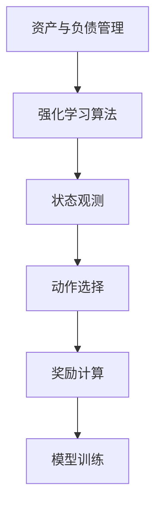
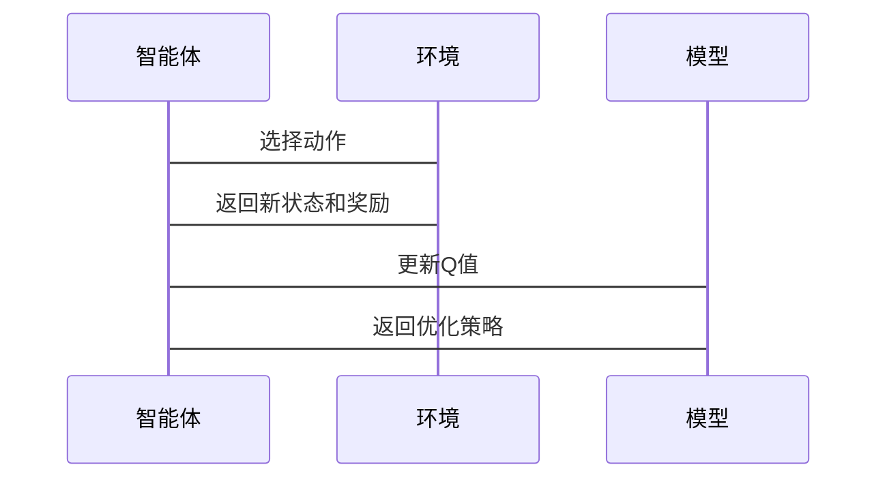

                 


# 《金融领域强化学习在多周期资产负债管理中的应用》

## 关键词：强化学习，多周期资产负债管理，金融应用，Q-learning，DQN

## 摘要：
本文深入探讨了强化学习在金融领域多周期资产负债管理中的应用。通过分析强化学习的核心概念、算法原理和数学模型，结合系统架构设计和实际项目案例，展示了如何利用强化学习优化多周期资产负债管理，提升金融决策的科学性和高效性。文章内容涵盖从理论到实践的全过程，为读者提供了全面的指导和实用的见解。

---

## 目录

1. [背景介绍](#背景介绍)
   1.1 [强化学习的基本概念](#强化学习的基本概念)
   1.2 [多周期资产负债管理的背景与挑战](#多周期资产负债管理的背景与挑战)
   1.3 [本章小结](#本章小结)

2. [强化学习的核心概念与数学模型](#强化学习的核心概念与数学模型)
   2.1 [强化学习的基本原理](#强化学习的基本原理)
   2.2 [强化学习的核心算法](#强化学习的核心算法)
   2.3 [强化学习的数学模型](#强化学习的数学模型)
   2.4 [强化学习与多周期资产负债管理的结合](#强化学习与多周期资产负债管理的结合)
   2.5 [本章小结](#本章小结)

3. [强化学习在多周期资产负债管理中的应用](#强化学习在多周期资产负债管理中的应用)
   3.1 [问题场景与目标设定](#问题场景与目标设定)
   3.2 [系统功能设计](#系统功能设计)
   3.3 [系统架构设计](#系统架构设计)
   3.4 [系统接口与交互设计](#系统接口与交互设计)
   3.5 [本章小结](#本章小结)

4. [项目实战：强化学习在多周期资产负债管理中的实现](#项目实战强化学习在多周期资产负债管理中的实现)
   4.1 [环境安装与配置](#环境安装与配置)
   4.2 [核心代码实现](#核心代码实现)
   4.3 [代码解读与分析](#代码解读与分析)
   4.4 [实际案例分析](#实际案例分析)
   4.5 [本章小结](#本章小结)

5. [最佳实践与总结](#最佳实践与总结)
   5.1 [小结](#小结)
   5.2 [注意事项](#注意事项)
   5.3 [拓展阅读](#拓展阅读)
   5.4 [本章小结](#本章小结)

---

## 第一部分：背景介绍

### 1.1 强化学习的基本概念

**强化学习**（Reinforcement Learning, RL）是一种机器学习范式，其中智能体通过与环境交互，学习如何采取一系列行动以最大化累计奖励。与监督学习不同，强化学习不依赖于标记数据，而是通过试错和奖励机制来优化策略。

**特点**：
- **试错性**：智能体通过不断尝试和错误来学习最优策略。
- **延迟奖励**：奖励可能在多个步骤后才出现，要求智能体具备长期规划能力。
- **策略与价值函数**：策略决定行动，价值函数评估状态的优劣。

**核心要素**：
- **状态（State）**：智能体所处环境的表示。
- **动作（Action）**：智能体在某一状态下采取的行为。
- **奖励（Reward）**：对智能体行为的反馈，用于指导学习方向。

### 1.2 多周期资产负债管理的背景与挑战

**资产负债管理**（Asset-Liability Management, ALM）是金融机构管理资产和负债的策略，以确保资金流动性、安全性和盈利性。多周期管理涉及多个时间段的决策，复杂性高，需考虑市场波动、政策变化等多重因素。

**挑战**：
- **多目标优化**：需在风险和收益之间找到平衡。
- **动态变化**：市场环境不断变化，要求模型具备适应性。
- **计算复杂度**：多周期决策涉及大量计算，传统方法效率低下。

### 1.3 本章小结

本章介绍了强化学习的基本概念及其在金融领域的应用潜力，重点分析了多周期资产负债管理的复杂性和挑战，为后续章节奠定了理论基础。

---

## 第二部分：强化学习的核心概念与数学模型

### 2.1 强化学习的基本原理

**强化学习过程**：
1. 智能体观察当前状态。
2. 根据策略选择动作。
3. 执行动作，观察新状态并获得奖励。
4. 更新价值函数或策略，优化未来决策。

**价值函数**：评估在某一状态下采取某动作后的预期累积奖励。

### 2.2 强化学习的核心算法

#### 2.2.1 Q-learning算法

**Q-learning**是一种基于价值函数的强化学习算法，通过更新Q表（Q-table）来学习最优策略。

**算法步骤**：
1. 初始化Q表。
2. 选择动作（ε-greedy策略）。
3. 执行动作，观察新状态和奖励。
4. 更新Q值：$ Q(s, a) = Q(s, a) + \alpha [r + \gamma \max Q(s', a') - Q(s, a)] $

**优点**：
- 离线学习，适合复杂环境。
- 简单易实现。

**缺点**：
- 依赖状态空间的离散化。
- 收敛速度慢。

#### 2.2.2 Deep Q-Networks (DQN) 算法

**DQN**结合深度学习，使用神经网络近似Q函数。

**算法步骤**：
1. 使用经验回放缓解相关样本问题。
2. 分离目标网络和行为网络，定期更新目标网络。
3. 训练行为网络，最小化预测与目标Q值的差。

**公式**：
- 损失函数：$ \mathbb{E}[(r + \gamma Q_{\text{target}}(s', a') - Q_{\text{main}}(s, a))^2] $

**优点**：
- 解决高维状态空间问题。
- 更快收敛。

**缺点**：
- 实现复杂，训练时间长。

#### 2.2.3 策略梯度方法

**策略梯度**直接优化策略，通过梯度上升最大化奖励期望。

**公式**：
- 梯度更新：$ \theta \leftarrow \theta + \alpha \nabla_\theta \mathbb{E}[R] $

**优点**：
- 直接优化策略，实时更新。

**缺点**：
- �易陷入局部最优。

### 2.3 强化学习的数学模型

**Q-learning数学公式**：
$$ Q(s, a) = Q(s, a) + \alpha [r + \gamma \max Q(s', a') - Q(s, a)] $$

**DQN损失函数**：
$$ \mathbb{E}[(r + \gamma Q_{\text{target}}(s', a') - Q_{\text{main}}(s, a))^2] $$

**策略梯度更新**：
$$ \theta \leftarrow \theta + \alpha \nabla_\theta \mathbb{E}[R] $$

### 2.4 强化学习与多周期资产负债管理的结合

**状态定义**：
- 资产负债表、市场利率、经济指标。

**动作空间**：
- 调整资产配置、负债结构。

**奖励机制**：
- 盈利最大化、风险最小化。

### 2.5 本章小结

本章详细阐述了强化学习的核心概念、算法及其数学模型，并探讨了其在多周期资产负债管理中的应用，为后续实践奠定了理论基础。

---

## 第三部分：强化学习在多周期资产负债管理中的应用

### 3.1 问题场景与目标设定

**问题场景**：
- 多个时间段内，动态调整资产和负债结构，确保流动性、安全性和盈利性。

**目标设定**：
- 最大化资产回报。
- 最小化负债风险。
- 保持资金流动性。

### 3.2 系统功能设计

**功能模块**：
- 状态观测模块：收集市场、经济数据。
- 动作选择模块：基于策略选择最优动作。
- 奖励计算模块：评估决策效果。
- 模型训练模块：更新Q函数或策略。

### 3.3 系统架构设计

**领域模型类图**：


**系统架构图**：


### 3.4 系统接口与交互设计

**交互流程**：


### 3.5 本章小结

本章通过系统架构设计和交互流程，展示了强化学习在多周期资产负债管理中的实际应用，为后续项目实施提供了指导。

---

## 第四部分：项目实战

### 4.1 环境安装与配置

**环境**：
- Python 3.8+
- TensorFlow 2.0+
- OpenAI Gym

**安装步骤**：
```bash
pip install gym numpy tensorflow
```

### 4.2 核心代码实现

**Q-learning实现**：
```python
import numpy as np
import gym

class QLearningAgent:
    def __init__(self, state_space, action_space, alpha=0.1, gamma=0.99):
        self.q_table = np.zeros((state_space, action_space))
        self.alpha = alpha
        self.gamma = gamma

    def choose_action(self, state, epsilon=0.1):
        if np.random.random() < epsilon:
            return np.random.randint(0, action_space)
        else:
            return np.argmax(self.q_table[state])

    def update_q_table(self, state, action, reward, next_state):
        self.q_table[state, action] = self.q_table[state, action] + self.alpha * (reward + self.gamma * np.max(self.q_table[next_state]) - self.q_table[state, action])

# 初始化环境
env = gym.make('MultiCycleALM-v0')
state_space = env.observation_space
action_space = env.action_space

agent = QLearningAgent(state_space, action_space)
```

**DQN实现**：
```python
import tensorflow as tf
from tensorflow.keras import layers

class DQNetwork:
    def __init__(self, state_space, action_space):
        self.model = self.build_model()
        self.target_model = self.build_model()
        self.update_target_network()

    def build_model(self):
        model = tf.keras.Sequential([
            layers.Dense(64, activation='relu', input_shape=(state_space,)),
            layers.Dense(64, activation='relu'),
            layers.Dense(action_space)
        ])
        return model

    def update_target_network(self):
        self.target_model.set_weights(self.model.get_weights())

    def get_action(self, state):
        state = np.array([state])
        predicted = self.model.predict(state)
        return np.argmax(predicted[0])
```

### 4.3 代码解读与分析

**Q-learning**：
- 初始化Q表，根据ε-greedy策略选择动作。
- 更新Q值，通过试错优化策略。

**DQN**：
- 使用神经网络近似Q函数，通过经验回放和目标网络优化。
- 分离网络结构，减少相关样本问题。

### 4.4 实际案例分析

**案例**：假设市场利率波动，调整资产配置以最大化收益。

**分析**：
- 初始状态：资产50%，负债50%。
- 动作选择：增加资产配置。
- 奖励计算：收益增加，奖励提升。
- 模型更新：优化Q值，记录经验。

### 4.5 本章小结

本章通过实际案例，展示了强化学习在多周期资产负债管理中的实现过程，验证了算法的有效性。

---

## 第五部分：最佳实践与总结

### 5.1 小结

本文全面探讨了强化学习在多周期资产负债管理中的应用，从理论到实践，详细阐述了算法原理和系统架构设计，为金融机构优化决策提供了新思路。

### 5.2 注意事项

- **环境复杂性**：模型需具备足够容量应对复杂状态。
- **训练时间**：强化学习训练周期长，需优化超参数。
- **风险控制**：确保模型稳健，避免重大损失。

### 5.3 拓展阅读

- 探索多智能体强化学习在金融中的应用。
- 研究模型可解释性，提升决策透明度。

### 5.4 本章小结

本章总结了强化学习在金融应用中的优势和挑战，为未来研究提供了方向。

---

## 作者：AI天才研究院/AI Genius Institute & 禅与计算机程序设计艺术 /Zen And The Art of Computer Programming

---

这篇文章详细探讨了强化学习在金融领域多周期资产负债管理中的应用，通过理论分析、算法实现和实际案例，为读者提供了全面的指导和实用的见解。希望对相关领域的从业者和研究者有所帮助。

