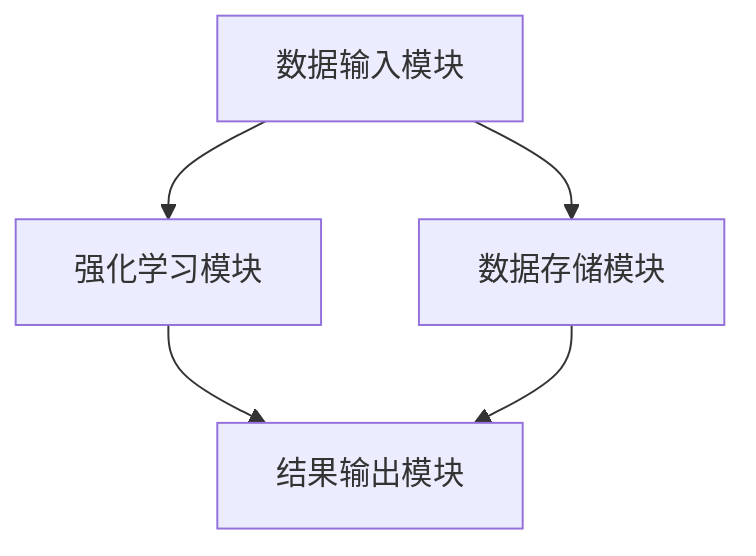

                 


# 《金融领域强化学习在多资产类别定价中的应用》

## 关键词：强化学习，多资产定价，金融模型，算法实现，数学推导

## 摘要：  
本文探讨了强化学习（Reinforcement Learning，RL）在金融领域多资产类别定价中的应用。通过分析强化学习的核心原理、算法实现和数学模型，本文详细介绍了如何利用强化学习优化投资组合，实现多资产定价的高效性和准确性。文章从强化学习的基本概念入手，逐步深入到算法原理、系统架构设计和实际案例分析，为读者提供了一个从理论到实践的完整指南。

---

# 第一部分：强化学习与金融定价概述

## 第1章：强化学习与金融定价概述

### 1.1 强化学习的基本概念

#### 1.1.1 强化学习的定义与特点
- **定义**：强化学习是一种机器学习范式，通过智能体与环境的交互，学习最优策略以最大化累积奖励。
- **特点**：
  - **在线学习**：智能体通过与环境实时交互获得反馈。
  - **目标导向**：通过最大化累积奖励来优化决策。
  - **复杂环境**：适用于高维状态和动作空间的问题。

#### 1.1.2 强化学习的核心要素：状态、动作、奖励
- **状态 (State)**：描述环境当前状况的特征，例如市场指数、资产价格等。
- **动作 (Action)**：智能体在给定状态下采取的决策，例如买入或卖出某种资产。
- **奖励 (Reward)**：环境对智能体行为的反馈，通常表现为收益或损失。

#### 1.1.3 金融领域中的强化学习应用场景
- **投资组合管理**：优化资产配置，最大化收益并最小化风险。
- **风险管理**：识别和规避市场风险。
- **算法交易**：基于强化学习的高频交易策略。

### 1.2 多资产类别定价的挑战

#### 1.2.1 多资产定价的基本概念
- 多资产定价涉及多种金融资产（股票、债券、期货等）的估值问题。
- 不同资产类别具有不同的风险和收益特征，增加了定价的复杂性。

#### 1.2.2 多资产定价中的主要问题
- **高维状态空间**：多资产定价需要考虑多个资产的价格、波动率等因素。
- **动态变化**：市场环境不断变化，定价模型需要实时更新。
- **非线性关系**：资产价格之间的相互影响往往是非线性的。

#### 1.2.3 强化学习在多资产定价中的优势
- **自适应性**：强化学习能够根据市场变化动态调整定价策略。
- **全局优化**：通过强化学习算法，可以找到最优的资产配置组合。
- **高效性**：强化学习能够在有限的计算资源下快速找到近似最优解。

### 1.3 本章小结
本章介绍了强化学习的基本概念及其在金融领域的应用，重点分析了多资产定价的挑战和强化学习的优势。接下来的章节将深入探讨强化学习的核心原理和数学模型。

---

## 第2章：强化学习的核心原理

### 2.1 强化学习的数学模型

#### 2.1.1 动态规划与贝尔曼方程
- **动态规划**：通过分解问题，将复杂问题转化为子问题求解。
- **贝尔曼方程**：描述状态值函数的数学方程。
$$ V(s) = \max_{a} [ r(s,a) + \gamma V(s') ] $$
  - $s$：当前状态
  - $a$：动作
  - $r(s,a)$：奖励函数
  - $\gamma$：折扣因子
  - $s'$：下一个状态

#### 2.1.2 动态规划的收敛性分析
- 动态规划算法通过迭代更新值函数，逐步逼近最优策略。
- 收敛性依赖于状态转移的概率分布和奖励函数的性质。

#### 2.1.3 Q-learning算法的数学推导
- Q-learning是一种基于值函数的强化学习算法。
$$ Q(s,a) = (1-\alpha) Q(s,a) + \alpha [ r(s,a) + \gamma \max Q(s',a') ] $$
  - $\alpha$：学习率
  - $\gamma$：折扣因子
  - $Q(s,a)$：状态-动作对的期望收益

### 2.2 强化学习算法的分类与选择

#### 2.2.1 基于值函数的方法
- **Q-learning**：通过更新Q值函数逼近最优策略。
- **SARSA**：基于策略的强化学习算法，更新策略本身。

#### 2.2.2 基于策略梯度的方法
- **策略梯度（Policy Gradient）**：直接优化策略参数，无需值函数。
$$ \theta_{t+1} = \theta_t + \alpha \nabla_\theta J(\theta) $$
  - $J(\theta)$：目标函数
  - $\nabla_\theta$：梯度

#### 2.2.3 基于Q-learning的方法
- Q-learning适用于离散动作空间，广泛应用于金融领域的策略优化。

### 2.3 强化学习在金融中的应用特点

#### 2.3.1 高维状态空间的处理
- 金融问题通常涉及高维状态空间，需要设计高效的特征提取方法。

#### 2.3.2 动作空间的复杂性
- 多资产定价需要考虑多种资产的组合，动作空间复杂。

#### 2.3.3 奖励函数的金融意义
- 奖励函数需要反映金融目标，例如最大化收益和最小化风险。

### 2.4 核心概念对比表

| 概念 | 描述 |
|------|------|
| 状态 | 当前市场环境的描述 |
| 动作 | 投资组合的调整策略 |
| 奖励 | 投资组合的收益与风险的综合评估 |

### 2.5 本章小结
本章深入分析了强化学习的核心原理，包括动态规划、贝尔曼方程和Q-learning算法。同时，探讨了强化学习在金融中的应用特点，为后续章节奠定了理论基础。

---

## 第3章：强化学习算法的数学模型

### 3.1 动态规划与贝尔曼方程

#### 3.1.1 动态规划的基本原理
- 动态规划通过分解问题，将复杂问题转化为子问题求解。
- 状态转移概率和奖励函数是动态规划的核心。

#### 3.1.2 贝尔曼方程的数学表达
$$ V(s) = \max_{a} [ r(s,a) + \gamma V(s') ] $$
- 该方程描述了状态值函数的递推关系。

#### 3.1.3 动态规划的收敛性分析
- 动态规划算法通过迭代更新值函数，逐步逼近最优策略。
- 收敛性依赖于状态转移的概率分布和奖励函数的性质。

### 3.2 Q-learning算法的数学推导

#### 3.2.1 Q-learning的基本原理
- Q-learning通过更新Q值函数逼近最优策略。
$$ Q(s,a) = (1-\alpha) Q(s,a) + \alpha [ r(s,a) + \gamma \max Q(s',a') ] $$

#### 3.2.2 Q-learning的收敛性分析
- Q-learning算法在离散状态下具有收敛性保证。

#### 3.2.3 Q-learning在金融中的应用
- Q-learning适用于离散动作空间，广泛应用于金融领域的策略优化。

### 3.3 强化学习算法的金融应用案例

#### 3.3.1 多资产定价中的强化学习应用
- 强化学习用于优化投资组合，最大化收益并最小化风险。

#### 3.3.2 算法交易中的强化学习策略
- 基于强化学习的高频交易策略，通过实时市场数据调整投资组合。

#### 3.3.3 风险管理中的强化学习应用
- 强化学习用于识别和规避市场风险，优化资产配置。

### 3.4 本章小结
本章详细推导了强化学习的核心算法，包括动态规划和Q-learning，并分析了它们在金融中的应用。通过具体案例，展示了强化学习在多资产定价中的实际应用价值。

---

## 第四部分：强化学习在金融中的系统架构设计

### 第4章：系统架构与项目实战

#### 4.1 系统设计与功能模块
- **数据输入模块**：接收市场数据和资产价格。
- **强化学习模块**：实现强化学习算法，优化投资组合。
- **结果输出模块**：输出最优投资组合和定价结果。

#### 4.2 系统架构设计


#### 4.3 接口设计
- 数据输入接口：接收市场数据和用户输入。
- 算法接口：定义强化学习算法的接口，便于扩展和维护。
- 输出接口：输出优化后的投资组合和定价结果。

#### 4.4 项目实战
##### 4.4.1 环境安装
- **Python环境**：安装Python 3.8以上版本。
- **库的安装**：安装TensorFlow、Keras、NumPy、Pandas等库。

##### 4.4.2 核心代码实现
```python
import numpy as np
import tensorflow as tf

class DQN:
    def __init__(self, state_space, action_space, gamma=0.99):
        self.state_space = state_space
        self.action_space = action_space
        self.gamma = gamma
        self.model = self.build_model()
        
    def build_model(self):
        model = tf.keras.Sequential([
            tf.keras.layers.Dense(64, activation='relu', input_dim=self.state_space),
            tf.keras.layers.Dense(32, activation='relu'),
            tf.keras.layers.Dense(self.action_space, activation='linear')
        ])
        model.compile(optimizer=tf.keras.optimizers.Adam(learning_rate=0.001), loss='mse')
        return model
    
    def get_action(self, state):
        if np.random.random() < 0.1:
            return np.random.randint(0, self.action_space)
        state = np.array([state])
        q_values = self.model.predict(state)[0]
        return np.argmax(q_values)
    
    def update_model(self, states, actions, rewards):
        states = np.array(states)
        actions = np.array(actions)
        rewards = np.array(rewards)
        targets = np.zeros((len(states), self.action_space))
        
        for i in range(len(states)):
            targets[i][actions[i]] = rewards[i] + self.gamma * np.max(self.model.predict(np.array([states[i]]))[0])
        self.model.fit(states, targets, epochs=1, verbose=0)
```

##### 4.4.3 案例分析与结果解读
- **数据准备**：使用历史资产价格数据训练模型。
- **模型训练**：通过强化学习算法优化投资组合。
- **结果分析**：比较强化学习定价与传统定价方法的差异。

### 4.5 本章小结
本章通过系统架构设计和项目实战，展示了强化学习在多资产定价中的具体应用。通过代码实现和案例分析，帮助读者更好地理解强化学习在金融中的实际应用。

---

## 第五部分：强化学习在金融中的高级主题

### 第5章：强化学习的高级主题与优化策略

#### 5.1 高维状态空间的处理方法
- **降维技术**：使用主成分分析（PCA）等方法减少状态空间维度。
- **注意力机制**：通过注意力网络捕捉关键特征。

#### 5.2 多智能体强化学习
- **多智能体系统**：多个智能体协同工作，优化投资组合。
- **通信与协作**：智能体之间通过通信协作，提高决策效率。

#### 5.3 稀疏奖励函数的设计
- **奖励函数的重要性**：设计有效的奖励函数，引导智能体学习正确的策略。
- **稀疏性优化**：通过稀疏化奖励函数，提高学习效率。

### 5.4 强化学习在金融中的最佳实践

#### 5.4.1 数据预处理与特征工程
- **数据清洗**：处理缺失值和异常值。
- **特征选择**：选择关键特征，减少维度。

#### 5.4.2 模型调参与优化
- **超参数优化**：通过网格搜索或随机搜索优化模型参数。
- **学习率调整**：动态调整学习率，加快收敛速度。

#### 5.4.3 模型部署与监控
- **实时监控**：监控模型运行状态，及时发现异常。
- **持续优化**：根据市场变化持续优化模型。

### 5.5 本章小结
本章探讨了强化学习在金融中的高级主题和优化策略，为读者提供了进一步研究的方向和实际应用的指导。

---

## 第六部分：总结与展望

### 6.1 总结
- 强化学习在多资产定价中的应用前景广阔。
- 通过优化算法和系统架构设计，强化学习能够有效提升金融定价的效率和准确性。

### 6.2 展望
- **算法优化**：探索更高效的强化学习算法，如基于Transformer的强化学习模型。
- **多智能体协同**：研究多智能体协同优化的策略，进一步提高投资组合的收益。
- **金融风险管理**：将强化学习应用于更复杂的金融风险管理问题。

### 6.3 本章小结
本文总结了强化学习在金融领域中的应用，展望了未来的研究方向，为读者提供了进一步探索的空间。

---

## 参考文献

（此处列出相关文献和参考资料，例如经典的强化学习教材、金融领域的研究成果等。）

---

## 作者：AI天才研究院/AI Genius Institute & 禅与计算机程序设计艺术 /Zen And The Art of Computer Programming

---

本文通过系统性地分析强化学习的核心原理和数学模型，结合金融领域的实际应用，详细介绍了强化学习在多资产类别定价中的应用。从基础概念到高级主题，文章为读者提供了一个从理论到实践的完整指南。通过具体案例和代码实现，帮助读者更好地理解强化学习在金融中的实际应用。

