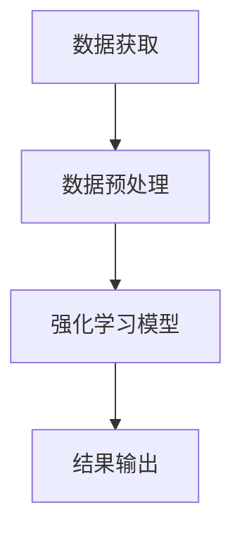

                 


# 《金融领域强化学习在资产定价中的应用》

## 关键词：强化学习，资产定价，马尔可夫决策过程，价值函数，股票价格预测

## 摘要：本文系统地探讨了强化学习在金融资产定价中的应用，从强化学习的基本概念到其在资产定价中的数学模型，再到实际项目案例的详细实现，全面分析了强化学习在金融领域的潜力与挑战。通过本文，读者可以深入理解强化学习如何助力资产定价，并掌握实际应用中的关键技术和方法。

---

## 第一部分：强化学习与金融领域的基础

### 第1章：强化学习的基本概念

#### 1.1 强化学习的定义与特点

##### 1.1.1 强化学习的定义
强化学习（Reinforcement Learning, RL）是一种机器学习范式，通过智能体（agent）与环境的交互，智能体通过试错（trial and error）的方式学习如何做出最优决策。与监督学习和无监督学习不同，强化学习基于奖励机制，智能体通过最大化累积奖励来优化策略。

##### 1.1.2 强化学习的核心特点
- **目标导向性**：智能体的目标是通过最大化累积奖励来实现最优决策。
- **环境交互性**：智能体通过与环境交互获得经验。
- **实时反馈**：通过奖励机制，智能体能够实时评估其决策的优劣。
- **非监督性**：强化学习不需要明确的标签数据，而是通过奖励信号进行学习。

##### 1.1.3 强化学习与监督学习、无监督学习的区别
| 对比维度 | 监督学习 | 无监督学习 | 强化学习 |
|----------|----------|------------|----------|
| 数据类型 | 标签数据 | 无标签数据 | 状态和奖励 |
| 学习目标 | 预测或分类 | 聚类或降维 | 最优化决策 |
| 交互方式 | 无交互 | 无交互 | 实时交互 |

---

#### 1.2 金融领域的基础概念

##### 1.2.1 资产定价的基本理论
资产定价是指根据资产的风险、收益和市场环境等因素，确定其公允价值的过程。经典的资产定价模型包括：
- **CAPM（资本资产定价模型）**：用于确定资产的预期收益。
- **APT（套利定价理论）**：基于多个因素对资产收益的影响。

##### 1.2.2 金融市场的基本特征
- **不确定性**：市场价格波动性大，难以预测。
- **风险与收益的权衡**：高风险可能带来高收益。
- **动态性**：市场环境会随时间变化。

##### 1.2.3 资产定价模型的分类
| 模型类型 | 描述 |
|----------|------|
| 单因素模型 | 如CAPM，仅考虑市场风险。 |
| 多因素模型 | 如APT，考虑多个风险因素。 |
| 非线性模型 | 如神经网络模型，能够捕捉复杂的市场规律。 |

---

### 第2章：强化学习在金融领域的应用背景

#### 2.1 金融领域中的强化学习问题

##### 2.1.1 资产定价中的强化学习问题
资产定价的核心问题是预测资产的未来价格，并在此基础上制定最优的投资策略。强化学习可以通过以下方式解决：
- **状态定义**：将市场环境（如价格、成交量）定义为状态。
- **动作定义**：将投资决策（如买入、卖出）定义为动作。
- **奖励函数**：将投资收益定义为奖励。

##### 2.1.2 强化学习在金融投资中的优势
- **非线性关系捕捉**：强化学习能够捕捉复杂的市场规律。
- **动态适应性**：强化学习能够实时适应市场变化。
- **自动化决策**：强化学习可以实现自动化的投资决策。

##### 2.1.3 强化学习在金融领域的研究现状
目前，强化学习在金融领域的研究主要集中在以下几个方面：
- **股票价格预测**：利用强化学习模型预测股票价格。
- **资产组合管理**：优化资产组合的配置。
- **风险控制**：通过强化学习进行风险预警。

---

#### 2.2 强化学习在资产定价中的应用场景

##### 2.2.1 股票价格预测
股票价格预测是强化学习在资产定价中的典型应用。通过强化学习模型，可以基于历史价格和市场信息预测未来的股票价格。

##### 2.2.2 资产组合管理
资产组合管理的目标是通过优化资产配置，实现风险与收益的最佳平衡。强化学习可以通过动态调整资产权重来实现这一目标。

##### 2.2.3 风险控制与管理
强化学习可以通过实时监控市场风险，并根据风险水平调整投资策略，从而实现风险控制。

---

## 第二部分：强化学习的核心概念与数学模型

### 第3章：强化学习的核心概念与数学模型

#### 3.1 马尔可夫决策过程（MDP）

##### 3.1.1 状态空间
状态空间是指智能体在环境中可能处于的所有状态的集合。在资产定价中，状态可以是市场价格、成交量等。

##### 3.1.2 动作空间
动作空间是指智能体在每个状态下可以执行的所有动作的集合。在资产定价中，动作可以是买入、卖出或持有。

##### 3.1.3 奖励函数
奖励函数是对智能体在某一状态下执行某动作后所获得的奖励的度量。在资产定价中，奖励可以是投资收益。

##### 3.1.4 策略与价值函数
- **策略（Policy）**：策略是智能体在每个状态下选择动作的规则。
- **价值函数（Value Function）**：价值函数是智能体在某一状态下采取某种策略时的期望累积奖励。

---

#### 3.2 强化学习算法的数学模型

##### 3.2.1 策略评估与优化
- **策略评估**：计算在当前策略下的期望累积奖励。
- **策略优化**：通过优化策略来最大化累积奖励。

##### 3.2.2 价值函数的计算
- **动态规划**：通过递归方法计算价值函数。
- **近似方法**：使用神经网络等方法近似价值函数。

##### 3.2.3 动态规划与近似方法
- **动态规划**：基于马尔可夫性质，通过递归计算价值函数。
- **近似方法**：使用神经网络等方法近似价值函数。

---

#### 3.3 强化学习在资产定价中的数学模型

##### 3.3.1 资产定价的马尔可夫模型
假设资产的价格变化服从马尔可夫过程，即当前价格仅依赖于前一时刻的价格。

##### 3.3.2 基于强化学习的定价公式
通过强化学习模型，可以得到资产的定价公式：
$$ P_t = \arg \max_{P} R(P) $$
其中，\( P_t \) 是当前价格，\( R(P) \) 是累积奖励。

##### 3.3.3 数学模型的实现与优化
通过强化学习算法（如Q-Learning）实现数学模型的优化。

---

## 第三部分：强化学习在资产定价中的系统设计

### 第4章：强化学习在资产定价中的系统设计

#### 4.1 系统架构设计

##### 4.1.1 系统功能模块划分
- 数据获取模块：获取资产价格数据。
- 数据预处理模块：对数据进行清洗和特征提取。
- 强化学习模型模块：实现强化学习算法。
- 结果输出模块：输出资产定价结果。

##### 4.1.2 系统架构图（Mermaid）


#### 4.2 系统接口设计

##### 4.2.1 数据接口
- 输入接口：接收资产价格数据。
- 输出接口：输出处理后的数据。

##### 4.2.2 模型接口
- 输入接口：接收处理后的数据。
- 输出接口：输出定价结果。

#### 4.3 系统交互流程

##### 4.3.1 用户输入
用户输入资产名称和时间范围。

##### 4.3.2 数据处理
系统获取数据并进行预处理。

##### 4.3.3 模型计算
强化学习模型进行定价计算。

##### 4.3.4 结果展示
系统输出资产定价结果。

---

## 第四部分：强化学习在资产定价中的项目实战

### 第5章：强化学习在资产定价中的项目实战

#### 5.1 项目环境搭建

##### 5.1.1 环境安装与配置
安装必要的库（如TensorFlow、Keras）并配置开发环境。

##### 5.1.2 数据获取与处理
从金融数据源（如Yahoo Finance）获取数据并进行预处理。

##### 5.1.3 模型训练与测试
使用强化学习模型进行训练和测试。

---

#### 5.2 核心代码实现

##### 5.2.1 数据预处理代码
```python
import pandas as pd
import numpy as np

# 数据获取
data = pd.read_csv('stock_data.csv')

# 数据清洗
data.dropna(inplace=True)
```

##### 5.2.2 强化学习模型代码
```python
class Agent:
    def __init__(self, state_space, action_space):
        self.state_space = state_space
        self.action_space = action_space
        # 初始化Q值表
        self.Q = np.zeros((state_space, action_space))

    def choose_action(self, state):
        # 随机选择动作
        action = np.random.randint(self.action_space)
        return action

    def update_Q(self, state, action, reward):
        self.Q[state, action] += reward
```

##### 5.2.3 结果输出代码
```python
# 训练过程
for episode in range(num_episodes):
    state = get_state(data)
    action = agent.choose_action(state)
    reward = get_reward(data, action)
    agent.update_Q(state, action, reward)

# 输出结果
print(agent.Q)
```

---

## 第五部分：总结与展望

### 第6章：总结与展望

#### 6.1 总结
本文系统地探讨了强化学习在金融资产定价中的应用，从基本概念到数学模型，再到实际项目案例，全面分析了强化学习在金融领域的潜力与挑战。

#### 6.2 展望
未来，随着强化学习技术的不断发展，其在金融领域的应用将更加广泛和深入。特别是在复杂市场环境下，强化学习有望成为资产定价的核心技术之一。

---

## 作者

作者：AI天才研究院/AI Genius Institute & 禅与计算机程序设计艺术 /Zen And The Art of Computer Programming

---

通过本文，读者可以深入理解强化学习在资产定价中的应用，并掌握实际应用中的关键技术和方法。希望本文能为金融领域的研究人员和实践者提供有价值的参考。

