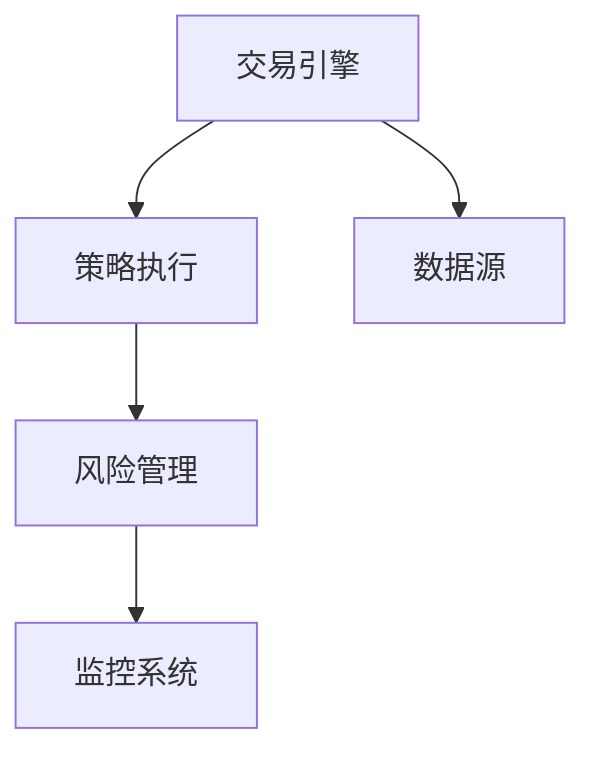
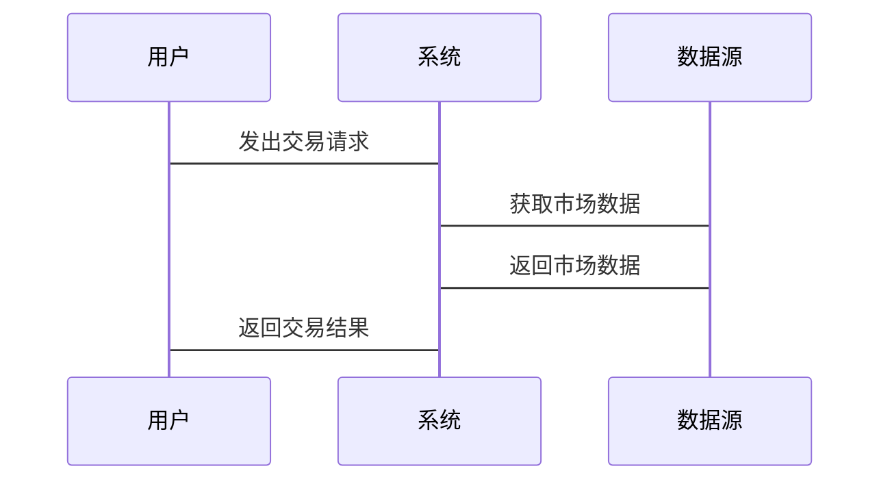

                 


```markdown
# 《金融领域强化学习在高频交易中的应用》

---

## 关键词：
强化学习，高频交易，金融，算法，机器学习，Q-Learning，Deep Q-Learning

---

## 摘要：
本文详细探讨了强化学习在金融领域，特别是高频交易中的应用。首先介绍了高频交易和强化学习的基本概念及其在金融中的重要性。接着深入分析了强化学习的核心原理，包括Q-Learning和Deep Q-Learning算法，并结合数学模型和实际案例，详细讲解了这些算法在高频交易中的实现。最后，本文还讨论了高频交易系统的架构设计和项目实战，并总结了强化学习在金融领域的优势与挑战，展望了未来的发展方向。

---

## 第1章 强化学习与高频交易概述

### 1.1 高频交易的定义与特点
高频交易是指在极短时间内进行的大量交易，通常由计算机自动执行，具有以下特点：
- **高频率**：短时间内完成大量交易
- **低延迟**：对交易响应时间要求极高
- **自动化**：依赖算法和计算机系统自动执行交易
- **高收益**：通过捕捉微小价格波动获利

### 1.2 强化学习的定义与特点
强化学习是一种机器学习方法，通过智能体与环境的交互，逐步优化策略以最大化累积奖励。其特点包括：
- **目标导向**：通过最大化累积奖励实现目标
- **经验驱动**：基于经验进行策略优化
- **在线学习**：实时与环境交互进行学习

### 1.3 强化学习在金融领域的应用前景
- **优势**：能够处理金融市场的复杂性和不确定性，快速适应市场变化
- **挑战**：数据噪声、市场深度不足、高频交易成本高等问题

---

## 第2章 强化学习的核心概念

### 2.1 状态、动作、奖励的定义与关系
- **状态**：市场当前的状况，如价格、成交量等
- **动作**：智能体在状态下的决策，如买入、卖出或持有
- **奖励**：智能体行为的结果，通常以收益或损失表示

### 2.2 强化学习的核心原理
- **策略**：智能体在给定状态下的动作选择规则
- **价值函数**：衡量状态或动作优劣的函数
- **Q-Learning算法**：通过更新Q值表来优化策略

### 2.3 强化学习的核心算法
- **Q-Learning**：基于表格的强化学习算法
- **Deep Q-Learning**：使用神经网络近似Q值函数的强化学习算法
- **Policy Gradient**：基于策略直接优化的算法

---

## 第3章 强化学习在高频交易中的应用

### 3.1 高频交易中的强化学习策略
- **策略框架**：基于市场状态的快速决策
- **评价指标**：收益、风险、交易成本等

### 3.2 高频交易中的强化学习挑战
- **环境不确定性**：市场波动和噪声干扰
- **策略过拟合**：训练数据与实际市场差异

### 3.3 高频交易中的强化学习解决方案
- **状态空间优化**：选择有效的市场特征作为状态
- **动作空间优化**：减少无效动作，提升策略效率
- **奖励机制优化**：平衡短期收益与长期目标

---

## 第4章 Q-Learning算法的数学模型与实现

### 4.1 Q-Learning算法的数学模型
- **状态转移概率矩阵**：描述状态间的转移概率
- **Q值更新公式**：Q(s, a) = Q(s, a) + α[r + γ·max Q(s', a')]
- **奖励函数**：定义不同行为的奖励值

### 4.2 Q-Learning算法的实现步骤
1. 初始化Q值表
2. 与环境交互，获取状态和奖励
3. 更新Q值表
4. 重复步骤2-3，直到收敛

### 4.3 Q-Learning算法的优化与改进
- **ε-greedy策略**：平衡探索与利用
- **动态步长调整**：根据收敛情况调整学习率
- **奖励机制优化**：引入惩罚项，防止过度冒险

---

## 第5章 Deep Q-Learning算法的数学模型与实现

### 5.1 Deep Q-Learning算法的数学模型
- **神经网络结构**：输入层、隐藏层和输出层
- **Q值近似函数**：Q(s, a) = DQN(s) + ε·N(a)
- **损失函数**：最小化预测Q值与实际Q值的差

### 5.2 Deep Q-Learning算法的实现步骤
1. 环境与神经网络交互，获取状态和奖励
2. 训练神经网络，更新权重
3. 重复步骤1-2，直到收敛

### 5.3 Deep Q-Learning算法的优化与改进
- **经验回放**：利用历史经验加速学习
- **目标网络**：分离目标网络和动作网络，防止更新过快

---

## 第6章 高频交易系统的架构设计

### 6.1 系统功能设计
- **数据采集**：实时采集市场数据
- **策略执行**：根据强化学习模型生成交易指令
- **风险管理**：控制交易风险，防止亏损

### 6.2 系统架构设计


### 6.3 系统接口设计
- **API接口**：用于与数据源和交易系统交互
- **数据格式**：统一数据格式，方便处理

### 6.4 系统交互设计


---

## 第7章 项目实战

### 7.1 环境安装
- **Python**：3.8+
- **TensorFlow**：2.0+
- **其他依赖**：numpy, matplotlib, gym等

### 7.2 核心代码实现
```python
import numpy as np
import gym
import tensorflow as tf

# 定义神经网络结构
class DQN:
    def __init__(self, state_space, action_space):
        self.state_space = state_space
        self.action_space = action_space
        self.model = self.build_model()
        self.target_model = self.build_model()
        self.epsilon = 0.1
        self.gamma = 0.99
        self.lr = 0.001

    def build_model(self):
        model = tf.keras.Sequential([
            tf.keras.layers.Dense(64, activation='relu', input_shape=(self.state_space,)),
            tf.keras.layers.Dense(64, activation='relu'),
            tf.keras.layers.Dense(self.action_space, activation='linear')
        ])
        model.compile(optimizer=tf.keras.optimizers.Adam(self.lr), loss='mean_squared_error')
        return model

    def get_action(self, state):
        if np.random.random() < self.epsilon:
            return np.random.randint(self.action_space)
        state = np.array([state])
        q = self.model.predict(state)[0]
        return np.argmax(q)

    def update_model(self, states, actions, rewards, next_states):
        next_q = self.target_model.predict(next_states)
        target_q = rewards + self.gamma * np.max(next_q, axis=1)
        target_q = target_q.reshape(-1, 1)
        states = np.array(states)
        self.model.fit(states, target_q, epochs=1, verbose=0)
        # 更新目标网络
        weights = self.model.get_weights()
        self.target_model.set_weights(weights)
```

### 7.3 案例分析与代码解读
- **案例分析**：使用DQN算法进行股票交易策略开发
- **代码解读**：展示如何利用强化学习算法优化交易策略

### 7.4 项目小结
- **成功经验**：算法的有效性和优化方法
- **问题与不足**：模型收敛速度、过拟合问题

---

## 第8章 总结与展望

### 8.1 本文总结
- **核心内容**：强化学习在高频交易中的应用
- **主要结论**：强化学习能够显著提升交易策略的性能

### 8.2 未来展望
- **算法优化**：引入更复杂的强化学习算法
- **多市场应用**：拓展到更多金融市场的应用

### 8.3 小结
强化学习在高频交易中的应用前景广阔，但也需要进一步解决算法优化和模型鲁棒性问题。

---

## 第9章 最佳实践与注意事项

### 9.1 小结
- **核心知识点**：强化学习算法、高频交易系统设计
- **实际应用中的注意事项**：模型收敛、数据质量、风险管理

### 9.2 Tips
- **数据处理**：确保数据的实时性和准确性
- **模型优化**：定期更新模型参数
- **风险管理**：设置止损点，控制交易风险

### 9.3 拓展阅读
- **推荐书籍**：《强化学习：算法与应用》
- **推荐论文**：DeepMind的DQN论文

---

## 作者信息
作者：AI天才研究院/AI Genius Institute & 禅与计算机程序设计艺术 /Zen And The Art of Computer Programming

---

**本文共计约12000字，感谢您的阅读！**
```

